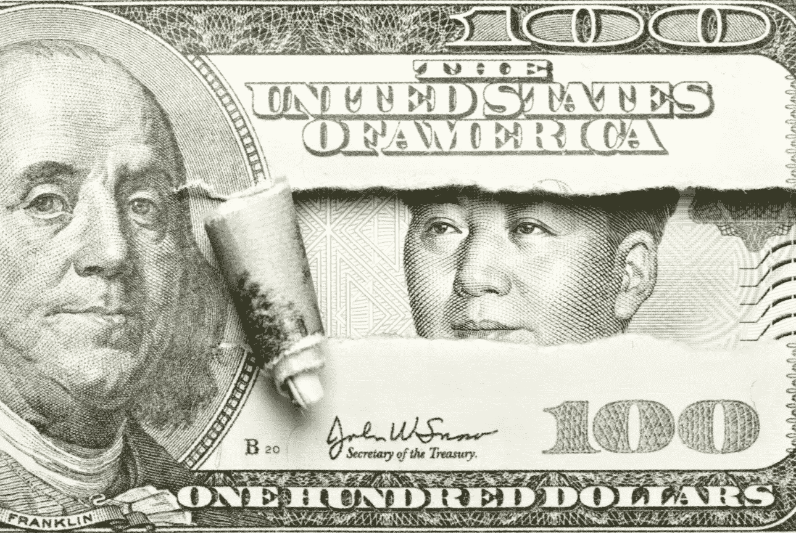
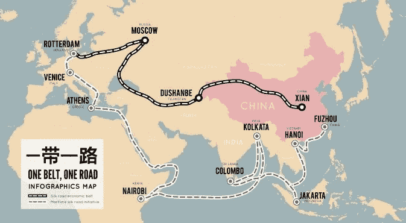
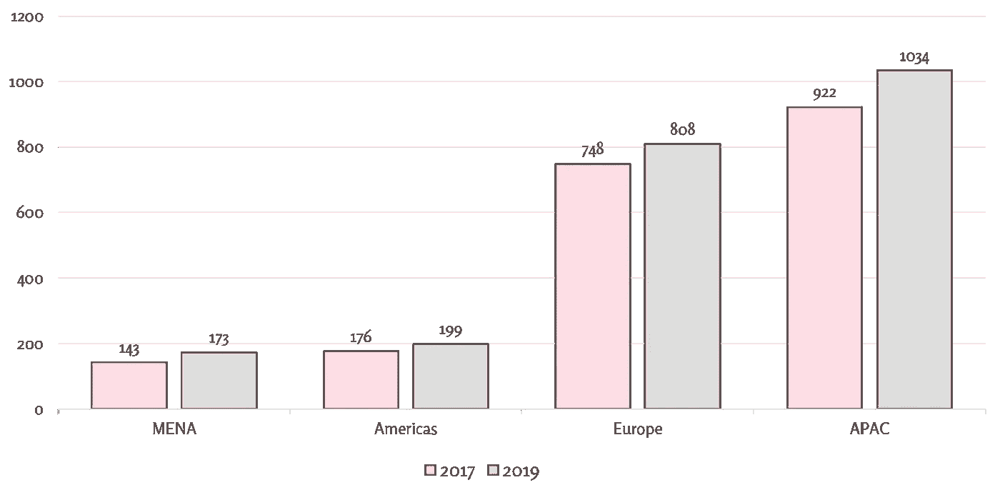

# 人民币的崛起:一带一路的作用

> 原文：<https://medium.datadriveninvestor.com/the-rise-of-the-renminbi-the-role-of-one-belt-one-road-the-china-guys-791dd982fe68?source=collection_archive---------12----------------------->

Image via: [Adobe Stock](https://stock.adobe.com/)

# 摘要

继“人民币的崛起”系列的第一篇文章之后，TCG 探讨了中国走向人民币国际化的战略途径。中国将其全球人民币雄心与大规模基础设施发展计划“一带一路”计划联系在一起。通过向经济欠发达国家提供资金，中国旨在领导一个强大的全球贸易集团，通过这个集团，新的贸易和投资可以以人民币进行。

***想呆在对一切都了如指掌的中国？订阅我们的时事通讯让真知灼见直接送达您的收件箱:【www.thechinaguys.com】*******。****

*………*

*TCG 在“人民币的崛起”系列中的第一篇文章，探讨了中国发展一种全球货币的成本和收益，可以点击这里阅读。*

*中国采取了一系列多边经济计划，为人民币进一步融入跨境支付和投资创造条件。其中最突出的是“一带一路”(OBOR)倡议，这是一个旨在为发展中国家扩大基础设施融资的大型合作社。*

*虽然 OBOR 扩展到国际贸易的许多方面，但其大规模贷款计划旨在通过基础设施项目和跨境贸易形成人民币使用国的早期网络。中国建设银行 2017 年的一份调查 398 家中外企业和金融机构的报告发现，72%的受访者和 80%的中国公司认为 OBOR 对人民币国际化的影响最大。然而，与中国资本账户管理、限制性市场惯例以及主要货币在全球金融体系中的稳定性相关的复杂因素，对北京方面实现完全国际化的人民币的雄心构成了重大障碍。*

# *“一带一路”是什么*

*OBOR is a large-scale economic initiative that aims to improve cooperation between China and participating nations through trade, investment, and infrastructure — also known as the “trinity of aid.” At the same time, China’s approach to provide assistance via economic development is closely aligned with its own economic ambitions. The program is touted as a “win-win” to member nations and attempts to “ [break the bottleneck of Asian connectivity](https://www.fmprc.gov.cn/ce/ceindo/eng/jrzg/t1211795.htm)” through the promotion of large-scale infrastructure projects.*

**

*OBOR was first [introduced by President Xi Jinping at a conference in Kazakhstan in 2013](https://www.fmprc.gov.cn/mfa_eng/topics_665678/xjpfwzysiesgjtfhshzzfh_665686/t1076334.shtml). He spoke of an infrastructural and economic revival of the Silk Road — the ancient trade route that extended from China across Eurasia to modern day Egypt and Europe. The project was one of the largest economic development initiatives ever conceived; then, a month later in Indonesia, President Xi proposed an additional maritime route that would loop through the Indian Ocean around to Eastern Africa. The “Road” was later officially titled the “The Silk Road Economic Belt” and the “Belt” was later named the “21st Century Maritime Silk Road.”*

*The Belt and Road spans Asia, Europe, the Middle East, and parts of Africa, and the nations that fall within its perimeter are eligible to participate in the initiative. To further regional economic collaboration, the program carves out “economic corridors” that are defined by critical infrastructure links such as railroads, energy pipelines, and ports. Since its announcement, OBOR has expanded into over 78 nations across the globe.*

*At the core of the initiative is lending. China provides significant levels of development funding to its partners for projects relating to infrastructure, energy, and industry. Similar to other forms of Chinese aid, the financing most often comes in forms of preferential loans, and terms typically stipulate that partner nations must use the capital to hire Chinese construction labor to build railways, bridges, and ports. As China distributes higher levels of development funding, more nations will join a strong global trade network — with China at the center. To date, the total sum provided to member countries has surpassed [US$200 billion](https://www.cfr.org/backgrounder/chinas-massive-belt-and-road-initiative), with some estimates as high as [US$1 trillion](https://thediplomat.com/2017/09/rise-of-the-redback-internationalizing-the-chinese-renminbi/).*

## *OBOR as a Driver of the RMB*

*OBOR 专注于“五通”:基础设施、投资、贸易、资本和人员。基础设施、投资和贸易构成了“援助的三位一体”，中国的目标是为基础设施项目提供发展融资。这反过来推动了更强大的全球经济联系，中国公司可以通过这种联系推动对外投资，而外国公司则可以获得更多的中国商品。*

*这三个原则也为人民币在“一带一路”沿线的使用量增加创造了条件。OBOR 贷款中使用的许多金融工具都是以人民币计价的，而中国的“跨境人民币贸易结算框架”允许沿线所有贸易以人民币结算。此外，随着中国继续通过人民币对外直接投资和人民币对外投资计划逐步开放资本账户，沿路投资也可以用人民币计价和结算。*

*敖包的规模和特定的地理位置进一步放大了经济增长的重大机遇，进而放大了人民币的崛起。OBOR [包含的国家约占全球国民生产总值的 55%和全球人口的 70%](https://www.ecfr.eu/page/-/China_analysis_belt_road.pdf),并且拥有许多世界上增长最快的经济体。虽然这些国家拥有大量劳动力和丰富的自然资源，但资金和投资不足阻碍了它们充分发挥发展潜力。世界银行 2019 年的一份报告表示，“[走廊经济体的贸易估计比潜力低 30%，外国直接投资估计比潜力低 70%。](https://www.worldbank.org/en/topic/regional-integration/publication/belt-and-road-economics-opportunities-and-risks-of-transport-corridors)“认识到许多 OBOR 贷款的接受国往往对地区和全球市场暴露不足，中国创造了一个机会，通过提供人民币计价的贷款并使用人民币从这些经济振兴努力中获得任何后续贸易增长来提升其货币的全球影响力。*

# *“一带一路”沿线的全球化*

## *人民币计价的基础设施融资*

*北京已经建立了庞大的发展基金，并在海外市场发行债券，以确保其发展项目有足够的流动性。最初成立于 2014 年的[丝路基金](http://www.silkroadfund.com.cn/enweb/23819/23770/index.html)的起始价值为 400 亿美元，是一家国有投资基金，其唯一目的是为 OBOR 项目提供融资，并在 2017 年获得了大约[1000 亿美元](http://www.silkroadfund.com.cn/enweb/23775/23767/index.html#homezd)，以鼓励以人民币计价的对外投资。虽然资金已经到位，但很大一部分至今仍未分配。*

*中巴贸易为人民币开启了一个重要的里程碑。作为中国在南亚最大的投资接受国，巴基斯坦在 [2019 协议](http://pakistanpolitico.com/creating-an-ecosystem-of-rmb-in-pakistan/)中宣布，所有中巴经济走廊(CPEC)开发贷款将以人民币发放。尽管这些计划尚未实现，但一旦实现，表面上看，这可能会为迅速增加的全球人民币使用量打开闸门。目前，由于人民币在巴基斯坦市场的流动性不足，人民币仅占中巴双边贸易总额的 5%。巴基斯坦对中国保持贸易逆差，这导致每年人民币流出量持续高于流入量，并导致以人民币为基础的额外贸易和投资机会减少。作为一个重要的全球出口国，中国与全球大多数国家都有贸易顺差。因此，北京打算让 OBOR 通过项目融资将人民币分散到全球各地，以解决与巴基斯坦类似的市场流动性问题，并为增加以人民币为基础的贸易铺平道路。*

*除了中央支持的投资基金，中国主要银行机构也开始提供“点心债券”，即在香港和伦敦等全球金融中心出售的人民币计价债券，为基础设施贷款融资。值得注意的是，[中国农业银行于 2015 年](https://www.reuters.com/article/china-bonds-offshore/china-agricultural-bank-sells-1-bln-debut-green-bond-in-london-idUSL3N12E1N620151014)在伦敦首次发行了 10 亿美元的双币债券，提供绿色债券，为可持续土地利用和可再生能源发展融资。用人民币为项目融资，特别是通过发行债券，有助于在海外创造人民币流动性池，并解除中国国内市场的严格资本管制——尽管“离岸人民币”总额不足以满足巴基斯坦等国与人民币相关的离岸贸易的假设需求。*

## *发行点心债券*

**

**Sources:* [*Federal Reserve Bank of San Francisco*](https://www.frbsf.org/banking/asia-program/pacific-exchange-blog/offshore-renminbi-bonds-dim-sum/)*,* [*The China Guys*](http://thechinaguys.com/)*

*然而，海外人民币计价债券发行已经开始放缓。随着越来越多的外国投资者通过改革进入中国市场，如[修订的人民币合格境外投资者计划(RQFII)](https://www.linkedin.com/feed/update/urn:li:activity:6664611760559009792) ，点心债券正在失去其长期吸引力。在岸(CNY)和离岸(CNH)人民币汇率的差异促使外国投资者通过“熊猫债券”直接进入国内市场，熊猫债券是面向 RQFII 参与者的人民币计价债券，熊猫债券的总量超过点心债券 50%。然而，在岸债券未能推动人民币在其他国家的采用；相反，[大部分是由西方跨国公司发行的，以支持运营和中国市场扩张的现金。](https://www.acra-ratings.com/research/1365)*

*尽管如此，人民币仍开始获得牵引力。2020 年 4 月 1 日，[第一笔人民币计价债券在哈萨克斯坦发行](http://www.china.org.cn/world/Off_the_Wire/2020-04/02/content_75888224.htm)，这标志着中亚地区首次发行人民币计价债券，以支持与 OBOR 相关的基础设施项目。为了进一步发展离岸人民币市场，中国“五大”银行之一中国建设银行于 2019 年 9 月在哈萨克斯坦首都努尔苏丹开设了一个中心位置。中国金融机构融入哈萨克斯坦市场，加上该国的“去美元化”战略和 2015 年本币贬值 30%，将进一步推动人民币成为该国市场的共同货币，并为人民币在海外市场的流动性提供一个模式。*

## *人民币计价的国际支付*

*随着中国推出其宏伟战略，北京方面一直专注于建立一个稳健的货币兑换和流动体系。中国已经开始在 9 个国家指定人民币清算和结算银行，以促进人民币在跨境支付结算中的使用，这反过来也旨在刺激双边贸易和投资往来。此外，在 64 个国家[设立离岸中资银行分支机构，如中国银行和中国农业银行](https://www-jstor-org.proxyiub.uits.iu.edu/stable/pdf/j.ctvzsmb9w.9.pdf?ab_segments=0%2Fbasic_search%2Fcontrol&refreqid=search%3A7ce0405293a7c610f089d505cf423425)有助于影响人民币在跨境贸易中的风险敞口，这些机构为进出口商提供了将当地货币兑换为人民币的便捷途径，前提是市场流动性充足。*

## *促进人民币支付的金融机构*

**

**Sources:* [*Swift RMB Tracker*](https://www.swift.com/our-solutions/compliance-and-shared-services/business-intelligence/renminbi/rmb-tracker/document-centre?tl=en#topic-tabs-menu)*,* [*The China Guys*](https://www.thechinaguys.com/)*

*OBOR 盛行的地区——包括非洲、中东和东盟成员国——在贸易和投资的人民币支付增长方面处于领先地位。2017 年至 2019 年间，中东和北非(MENA)国家使用人民币支付的金融机构增长了 21.0%。中国在该地区日益增强的贸易影响力一直在推动人民币升值。自 2018 年以来，中国一直是海湾合作委员会的最大经济伙伴，也是科威特、沙特和阿联酋的[最大贸易伙伴](https://ec.europa.eu/trade/policy/countries-and-regions/statistics/index_en.htm)，特别是阿联酋[促进了与 mainland China 和香港超过 80%的人民币支付](https://www.swift.com/node/40221)。为了避免该地区未来任何潜在的人民币流动性问题，中国正在努力将阿联酋发展成为离岸人民币中心，2017 年[中国农业银行在迪拜建立了清算中心](http://europe.chinadaily.com.cn/business/2017-05/11/content_29297722.htm)。*

*近年来，中国-东盟的贸易关系也显著扩大。2019 年，中国与东盟的贸易额增长了 14%，达到 4.43 万亿元人民币，超过美国成为中国第二大贸易伙伴。强劲的增长预计将继续，特别是在技术领域，因为百度和阿里巴巴[等中国互联网企业集团在 OBOR 的支持下增加了在东南亚的业务](https://news.cgtn.com/news/2020-03-19/The-rise-of-China-ASEAN-trade-amid-trans-Pacific-decoupling-OXZHjem1c4/index.html)。此外，2018 年签署了一项名为[东盟-中国战略伙伴关系愿景 2030](http://www.xinhuanet.com/english/2018-11/15/c_129994437.htm) 的倡议，承诺到 2020 年将双边贸易额提高到 1 万亿美元[。截至 2020 年 5 月，](http://www.xinhuanet.com/english/2018-11/15/c_129994437.htm)[新加坡一直是该集团中最活跃的人民币](https://www.swift.com/our-solutions/compliance-and-shared-services/business-intelligence/renminbi/rmb-tracker/document-centre?tl=en#topic-tabs-menu)用户，处理了全球近 4.5%的人民币支付，仅次于香港和英国。为了进一步将贸易增长转化为人民币的实际收益，东盟+3(中国、日本、韩国)最近一直在讨论将人民币加入他们目前的 2400 亿美元货币互换安全网。*

*然而，人民币的使用仍仅略高于非成员国。截至 2020 年 4 月底， [72%的人民币支付仍限于香港](https://www.swift.com/our-solutions/compliance-and-shared-services/business-intelligence/renminbi/rmb-tracker/document-centre?tl=en#topic-tabs-menu)，这表明世界其他地区的人民币结算总额相对较低。2017 年，中国人民银行副行长殷勇指出，“[有 50 多个一带一路经济体在跨境交易中使用人民币的比例低于 5%](http://english.www.gov.cn/news/top_news/2017/06/07/content_281475679189540.htm)。”OBOR 成员(不包括中国)之间的人民币使用量更低，2015 年东盟内部贸易(不包括新加坡)仅占亚洲所有人民币结算的 [0.32%。这意味着人民币在其他经济体的使用有很大的增长潜力，但迄今为止这种使用是有限的。](https://www.swift.com/sites/default/files/resources/swift_bi_paper_rmbpaymentsamongasianoffshorecenters.pdf)*

# *展望未来*

*OBOR 和国际人民币是两个独立的举措，它们结合在一起可以相互补充。随着人民币国际影响力的增长，中国将在塑造全球金融政策方面扮演更重要的角色，就像美国在现代全球金融体系中扮演的角色一样。尽管美元和人民币在全球经济中仍然扮演着明显不同的角色，但很明显，中国正在采取积极措施扩大人民币的影响力。如果西方继续通过孤立主义贸易政策削弱其全球经济领导地位，随着全球各国开始转向中国，通过 OBOR 和其他中国主导的国际贸易倡议进行的人民币跨境交易将会扩大规模。尽管人民币国际化的道路还很漫长，但我们已经迈出了第一步。*

**原载于 2020 年 6 月 2 日 https://www.thechinaguys.com**[*。*](https://www.thechinaguys.com/the-rise-of-the-renminbi-the-role-of-one-belt-one-road/)**