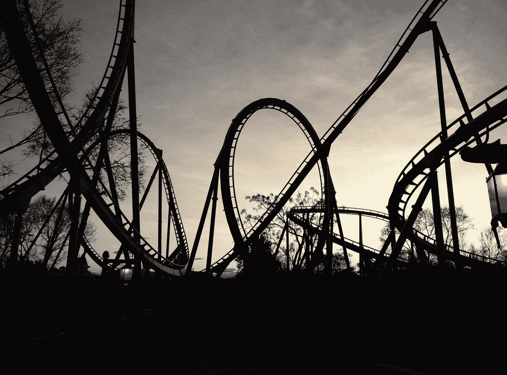

# 投资旅程的起起落落

> 原文：<https://medium.datadriveninvestor.com/the-rises-and-falls-of-an-investment-journey-456ee2a3d153?source=collection_archive---------26----------------------->

当你投资时，你会期待什么。

Photo by [Pedro Velasco](https://unsplash.com/@pedrojvelascoz?utm_source=medium&utm_medium=referral) on [Unsplash](https://unsplash.com?utm_source=medium&utm_medium=referral)

想象一下 5 年前你投资了 1 万。到今年 1 月，你的钱已经涨到 14000；40%的投资回报。你会感觉很好，对吗？

然后冠状病毒疫情来袭。在 3 个月的时间里，你的资金下降了 20%，至 11，200 英镑。你现在感觉如何？

不幸的是，投资从来都不是一帆风顺的。

# 起起落落

就像过山车一样，你的投资会起起伏伏。有时这种下降可能非常极端。

这是因为股票市场波动很大。波动性高意味着你的投资价格不稳定，会随着时间的推移而有规律地变化。

因此，将你的投资视为长期储蓄非常重要。将你的钱投资 5 年或更长时间，可以帮助你驾驭这种波动，并从通常非常积极的回报中受益。

同样重要的是，当你的钱贬值时，不要马上就把钱取出来。你可能刚刚经历的损失直到你把钱取出来才意识到。把你的钱留在那里会让它从市场复苏中受益。

 [## 利用股市相关性的最佳方式|数据驱动的投资者

### 当阿尔弗雷德·温斯洛·琼斯开创了世界上第一个“对冲”基金(后来“d”被去掉了)时，他让其他投资者大吃一惊…

www.datadriveninvestor.com](https://www.datadriveninvestor.com/2020/02/02/the-best-way-to-use-stock-market-correlations/) 

鉴于我们目前所处的环境，这一点尤为重要。市场大幅下跌(自 1987 年以来最糟糕的一个季度)，现在我们开始看到一些复苏。

3 月 23 日，富时 100 指数处于最低点。在这段时间里保持投资，可以让你在接下来的 3 天里从近 20%的市场恢复中获益。

# 如何乘坐过山车

闭上眼睛尖叫可能不是投资的最佳方式。关注业绩，但不要每天检查你的投资；这是一个不健康的习惯，会导致严重的压力。

尽你所能投资，坐下来，享受旅程。