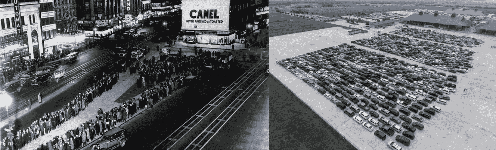
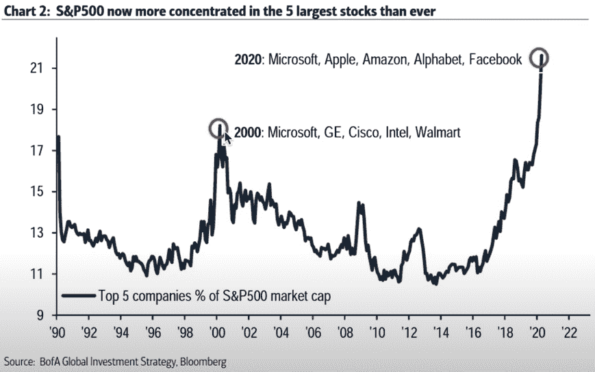
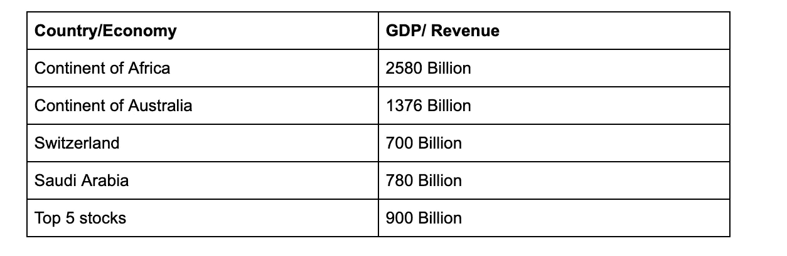
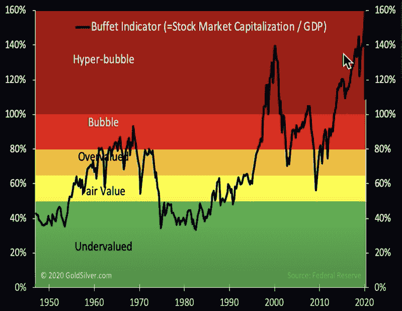
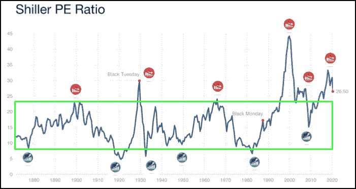
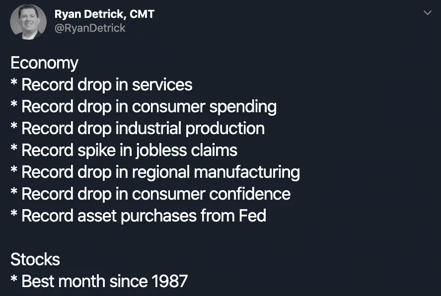

# 涨潮并不能提升所有的船

> 原文：<https://medium.datadriveninvestor.com/the-rising-tide-that-doesnt-lift-all-boats-3dc75177133?source=collection_archive---------19----------------------->

每天都有影响市场的重大事件。

贸易战、货币战、石油战、流行病、萧条、失业率、阴谋论；凡是你能想到的

还剩下什么惊喜吗？也许吧。

完全无视这些事件，市场继续走高。

是的，股票市场是更广泛经济的领先指标，但似乎上述事件的更广泛后果尚未被消化。

市场和经济之间存在巨大的脱节。

不管是好是坏，科技巨头们都处在一个完美的位置，可以在危机中攫取更多的市场份额并繁荣发展。大量的视频消息、Saas、云服务、内容创作和在线支付为这些巨头带来了创纪录的数据和经常性收入。在这个新时代，数据和注意力是比凭空印刷的法定货币更强大的货币形式，少数精英准备好了强大的资产负债表，以抓住机会。作为一个以创新推动发展的社会，这本身并不是一件坏事，但我们需要问一问这对经济以及最终对我们所生活的社会的更广泛的影响。

数千万人失业，排队等候购买食品的队伍长达数英里，企业倒闭，指南被撤销，然而美国股市却经历了自 1987 年以来最好的一个月。如果几年前，有人概述了所有当前事件，并说指数将相当平坦，没有人会相信，但我们在这里。

Food lines Great depression 1929 Vs. Covid crash of 2020.

# 熊市反弹

从历史上看，熊市有过让人们迷惑的重大逆势反弹，但最近的反弹有其独特的原因。一个主要原因是 S&P500 大量集中在 5 大股票上，这与 2000 年的网络泡沫相似。

一些支持大盘股近期反弹的理由，

*   锁定将通过更广泛和更深入地调整他们的服务来进一步增加他们的市场份额和盈利能力。
*   市场有可能低估了他们在疫情时期的成功，并在大多数企业陷入困境时给予他们更高的估值。
*   该指数的大部分集中在这些顶级公司，因此，来自散户投资者的新资金将通过 ETF、救助和美联储购买流入这些公司。
*   市场忽视了未来的连锁效应，甚至是通过广告收入下降、商店关闭、供应链问题和可支配收入下降对科技巨头的连锁效应。
*   系统性变化:在家工作、游戏、电子商务、教育、电子会议。
*   美联储认为。人们希望并乐观地认为，各国央行将不惜一切代价保持流动性，抵御冲击。
*   FOMO
*   创纪录的低利率和低债券收益率。
*   市场已经超越了恐惧的顶峰，通过接种疫苗、放松封锁和刺激措施，市场正在消化更加乐观的情况。

# 你应该投资一个大陆吗？

Narrowing of market depth as top companies occupy 21% of the whole index.

排名前五的公司占指数的 21%,这是最近上涨的主要原因。我们现在有一篮子比主要经济体大得多的公司。网络泡沫的浓度为 18%。当集中度增加时，市场的宽度减小，这对于未来的市场回报来说是一个糟糕的信号。

**FAAMG 股票今年迄今上涨 10%，而其余 495 只股票今年迄今下跌 13%**

Comparison of economies and their relative revenues.

> 我们没有公司，我们有大洲

# 泡沫领地。又来了。

“2020 Hyperbubble: Will it meltdown, or meltup” — Mike Maloney

如果在各国国内生产总值收缩的情况下，股市保持相对平稳，市值/国内生产总值比率将进一步扩大，并导致非理性估值。尽管这些估值可以用更高的未来收益来证明，但人们怀疑这对整体经济是否健康。从图表中可以看出，上一次我们的估值达到如此之高时，结果并不好。自助餐指标显示价格处于超泡沫区域，而这位传奇人物本人正舒舒服服地坐拥价值 1370 亿美元的现金。

Shiller P/E ratio by Dr Robert Shiller

席勒市盈率显示标准普尔 500 股票的平均价格与其相对收益的比率仍然被高估。席勒市盈率在历史上不断重复，其范围在 24 到 8 之间。全球金融危机后，股票回到了合理的估值范围内，再次得到了支持，我的经济政策对股票特别有利。要么这是一种新常态，要么估值将回归其公允价值。

我相信，在这段时间里，许多新的发明和想法将会涌现出来，这些发明和想法将会在未来几年受到人们的称赞。然而，经济增长最终是生产率增长的因素，而不是货币供应量和流动性过剩。很快，市场将通过均值回归反映这一点。

救助资金，“暂时的”UBI 能被归类为真正的财富吗？

这种脱节会持续多久？

证明股价上涨合理的[股票回购](https://medium.com/@ashainperera/stock-buybacks-and-why-we-all-pay-for-them-data-driven-investor-32b0e86aee84)会在疫情之后继续吗？

低利率能持续多久？

我们会看到融化或熔化吗？

时间会证明一切。

The great decoupling, 2020

# 管理你的屏幕时间

从更个人的角度来说，我们通过过度使用社交媒体和流媒体服务而养成的习惯将会嵌入我们的生活，即使封锁未经深思熟虑就被解除了。所以，请花些时间反思你在屏幕上花费的时间，并质疑它的重要性。为了简单起见，

*   将你的社交媒体屏幕时间乘以你所在国家的最低工资。
*   如果您使用社交媒体来推广您的业务、网络或创建内容，请使用慷慨的折扣系数。
*   将它相乘，得到一周和一个月的统计数据。
*   如果值得，那就去吧。如果不是，使用应用程序限制和限制手机使用。

机会在等待。

现在付款，以后再买。