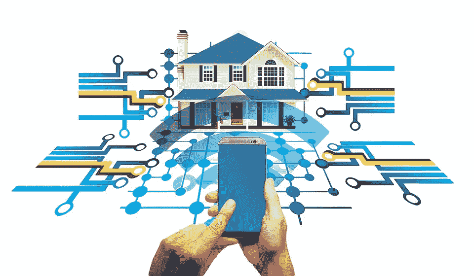
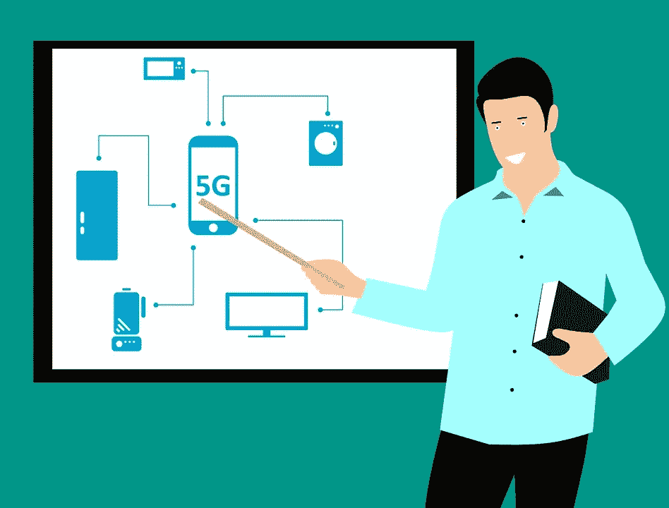

# 智能家居的风险

> 原文：<https://medium.datadriveninvestor.com/the-risk-of-a-smart-home-b9f9ff0a50f8?source=collection_archive---------1----------------------->

## 灯泡不是那么无辜的

[Pixabay](https://pixabay.com/illustrations/smart-home-house-technology-2769210/) — [Geralt](https://pixabay.com/users/geralt-9301/)

生活是复杂的，你遇到的任何人都会告诉你这一点。一个不复杂的是电子。尽管生活中有很多麻烦，但控制你周围的电子设备从未如此简单。智能手机让你可以无限制地控制家里和办公室的许多设备。

数据处理网站 [Statista](https://www.statista.com/outlook/279/109/smart-home/united-states) 估计，2020 年将有超过 30%的房屋被认为是智能住宅。他们预测，到 2024 年，这个数字将上升到略高于 50%。换句话说，一个人将能够在家或办公室外控制灯光、温度、安全、娱乐或电器。

但是，如果那些你可以用手机控制的无害的电子设备并不那么无害呢？如果像灯泡这样简单而不起眼的东西落入坏人之手，会有什么后果呢？此时你可能在笑。一些害怕灯泡的阴谋论者来了！摘下你的锡纸帽子，这不是阴谋。

 [## 创建折衷书架的程序员指南|数据驱动的投资者

### 每个开发者都应该有一个书架。他的内阁中可能的文本集合是无数的，但不是每一个集合…

www.datadriveninvestor.com](https://www.datadriveninvestor.com/2019/03/25/a-programmers-guide-to-creating-an-eclectic-bookshelf/) 

我们在家里和办公室使用的所有这些智能设备都可能带来巨大的安全风险。事实上，大量的设备最近已经被用来攻击网络上的主要实体，而且在未来可能会变得更糟。随着设备数量的增加，这种威胁会变得更大。

便利有很多好处，但它也隐藏着你可能没有意识到的危险。

# 灯泡的危险

[Pixabay](https://pixabay.com/photos/smart-home-mobile-phone-smartphone-3779361/) — [Cloudlynx](https://pixabay.com/users/cloudlynx-6340550/)

> “通过这种利用，威胁行为者可以通过无线方式渗透到家庭或办公室的计算机网络中，传播勒索软件或间谍软件，只需使用笔记本电脑和天线，距离超过 100 米。”
> 
> —来自 Check Point 的研究人员通过[黑客新闻](https://thehackernews.com/2020/02/philips-smart-light-bulb-hacking.html)

研究公司 Check Point 最近在飞利浦 Hue 智能灯泡中发现了一个[缺陷](https://www.youtube.com/watch?time_continue=6&v=4CWU0DA__bY&feature=emb_logo)，黑客可以在不知道你密码的情况下闯入你的 Wi-Fi 网络。该攻击利用了设备用于与其他网络设备通信的 ZigBee 协议。

这样做的主要问题是 ZigBee 通信协议被许多其他智能设备使用，包括 Amazon Echo。Check Point 的研究人员通知了灯泡制造商，他们很快推出了一个补丁。然而，这个小演示是一个例子，说明了智能设备会让你变得多么脆弱。随着这些设备数量的增加，很可能会发生更多类似的事件。

它们在过去也发生过，并产生了严重的影响。据 [Wired](https://www.wired.co.uk/article/internet-down-dyn-october-2016) 报道，2016 年 10 月 20 日发生了一件值得注意的事情。在这次攻击中，网飞、Spotify、Reddit 和英国政府网站都被击倒了。攻击本身主要针对这些网站的域名系统(DNS)管理服务。

这次攻击看起来像是通过网络连接的摄像头进行的。这些设备被黑客破解了密码，并被用来组成一个“僵尸网络”。这组被破坏的设备随后被用于对 DNS 管理公司 Dyn 执行拒绝服务攻击。这反过来又拖垮了一批你很容易认出的大型网络企业。

那么，这次袭击是由恐怖组织策划的吗？也许是一群憎恨人类的厌世者？实际上，这是一个试图诈骗电子游戏《我的世界》的组织。十几岁的黑客开发了名为“Mirai 未来组合”的僵尸网络，以摧毁主办《我的世界》世界的竞争对手的服务器。

> “最初开发 Mirai 未来组合是为了帮助他们垄断*《我的世界》*市场，但后来他们意识到他们构建了一个多么强大的工具。然后，让它尽可能大就成了他们的一个挑战。”
> 
> ——联邦调查局特工比尔·沃顿，接受[连线杂志](https://www.wired.com/story/mirai-botnet-minecraft-scam-brought-down-the-internet/)采访

现在，让我们更进一步。如果宿舍里的孩子们可以开发出一大群僵尸智能设备来执行他们的命令，并摧毁大部分互联网——一个恶毒的民族国家能做什么？这个问题可能是我们现在想问的，正如你将看到的，智能革命正在进行中。

# 5G 和物联网

你可能已经听到一些技术人员和组织滔滔不绝地谈论新的第五代(5G)无线技术。这项技术有什么特别之处？首先，它可能会影响我们与周围世界互动的方式。

在最近的一份报告中，[美国消费者新闻与商业频道](https://www.youtube.com/watch?v=2DG3pMcNNlw)解释了 5G 的威力。报道称，5G 的容量将是 4G 的几百倍。这对你有什么好处？首先是速度。

## 下载 2 小时电影的时间:

*   3G = 26 小时
*   4G = 6 分钟
*   5G = 3.6 秒

对命令的响应时间:

*   4G = .045 毫秒
*   5G = .001 毫秒(比眨眼快 400 倍)

[Pixabay](https://pixabay.com/illustrations/smartphone-technique-appliances-3329994/) — [mohamed_hassan](https://pixabay.com/users/mohamed_hassan-5229782/)

这种性质的速度和带宽将使科幻电影中的事情成为现实。驾驶汽车将完全成为可能。医生将能够实时操纵机器在地球的另一边做手术。这些事情将只是冰山一角。

另一个将变得普遍的是智能设备。一场名为[物联网(IoT)](https://www.wired.co.uk/article/internet-of-things-what-is-explained-iot) 的运动正在进行中。这场运动让你能想象到的一切都上网了。

> “今天，几乎任何东西都可以连接，包括网球拍、
> 、尿布、衣服、车辆，当然还有房子。虽然人们可能会觉得
> 这令人不安，但网络也开始包括生物事物:
> 今天，宠物、庄稼、牲畜和你身上的衣服都可以连接起来。
> 我们离一个可以像药丸一样吞下去的互联网链接不远了。”
> 
> —计算机历史博物馆首席信息官/技术贵宾大卫·埃文斯/采访[安全大道](https://securityboulevard.com/2019/09/20-surprising-iot-statistics-you-dont-already-know/)

据科技网站 Security Boulevard (SB)报道，物联网革命目前正在发生。该行业在 2018 年创造了近 840 亿美元的收入，此外，《福布斯》对 700 名金融高管的调查显示，58%的人已经制定了完善的物联网战略。他们还引用了国际数据公司(IDC)对 29 个国家的 5000 多名受访者的报告，该报告显示 85%的受访者拥有物联网预算。

物联网行业在不久的将来似乎也会蓬勃发展。据 Statista 称，预计到 2025 年将有*750 亿*物联网设备联网。现在，让我们记住我们的《我的世界》黑客朋友，看看一些可怕的统计数据。

首先，许多公司的安全专业人员无法识别自己公司的所有物联网设备。由 Ponemon Institute 和 Shared Assessments 所做的一项研究表明，只有 20%的人知道他们中的大多数在他们的网络上运行。56%的人表示没有保留任何类型的设备目录，大约 2/3 的人表示没有跟踪到处流动的物联网应用。

SB 的文章《这些数据都在哪里》令人大开眼界。这也是一个信号，表明我们周围世界的这种新的便利和控制带来了严重的后果。如果花钱保护公司的技术大师们都没有跟上这种趋势，那么普通人还有什么希望呢？

# 保护我们自己

> “你疯了吗，特洛伊人？你真的认为敌人已经逃走了吗？或者希腊人的礼物是免费的吗？你就这么了解尤利西斯吗？相信我，要么是希腊人躲在那些横梁里，要么是这匹马是一台战斗引擎，准备攻破我们的城墙，窥探我们的家园，降临我们的城市，压倒我们——要么是它内心深处潜伏着其他的欺骗。特洛伊人，永远不要相信那匹马。不管是什么，我害怕希腊人，特别是礼物。”
> 
> — [拉奥孔关于特洛伊木马的警告](https://www.youtube.com/watch?v=MV4MhzrAuXo)

在臭名昭著的特洛伊木马故事中，希腊人藏在木马里，从前门潜入特洛伊城。特洛伊只有一个门要防守，我们有无限的入口和各种大小的马匹要担心。想想那些即将上线的智能物联网设备。那么我们该怎么保护自己呢？

[Pixabay](https://pixabay.com/photos/trojan-horse-troy-turkey-horse-707804/) — [Hrohmann](https://pixabay.com/users/hrohmann-848687/)

根据[美国司法部](https://www.justice.gov/criminal-ccips/page/file/984001/download)的说法，保持警惕是我们自己的责任。

*   在您购买物联网设备之前，请确保制造商提供定期安全更新，并且密码可以更改。
*   立即将密码改为不涉及容易从社交媒体收集的信息的密码。
*   为每台设备使用不同的密码——他们建议使用密码管理工具来跟踪它们。
*   不断更新固件补丁。如果可能，将您的设备设置为自动更新。仅使用可信来源的固件。
*   偶尔关掉你的设备。当设备经过一个电源循环时，一些恶意软件可以被清除。
*   保护您的路由器和 Wi-Fi 网络。使用内置火线。他们还建议禁用通用即插即用功能。
*   一台不安全的设备会使整个网络变得脆弱。您的路由器使您能够“分段”您的网络。换句话说，您可以为您的电脑和打印机创建一个其他设备无法访问的独立网络。
*   如果你出门在外检查各种物联网设备，请避免使用公共 Wi-Fi 网络。为你的手机安装一个虚拟专用网也有助于解决这个问题。
*   许多反病毒公司现在都有保护物联网设备的功能。

那里有很多工作要做。然而，随着便利的增加，责任也增加了。也可以选择不使用这些设备，或者使用少量易于管理的设备。

现在这只是一个激发你兴趣的故事。然而，随着 5G 开始推出，物联网成为所谓的第四次工业革命，这将成为你生活的一部分——无论你是否希望如此。

我们最好留意拉奥孔的古老警告，并为我们带入家庭和生活的奇妙礼物中可能隐藏的东西做好准备。