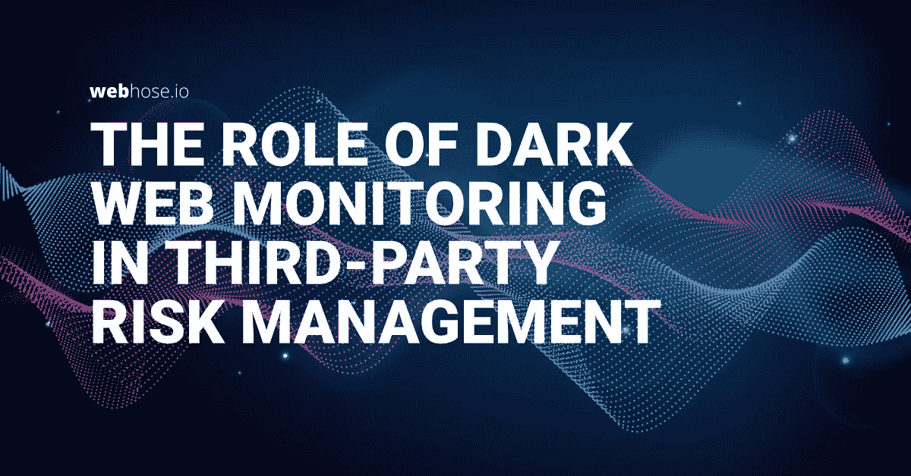
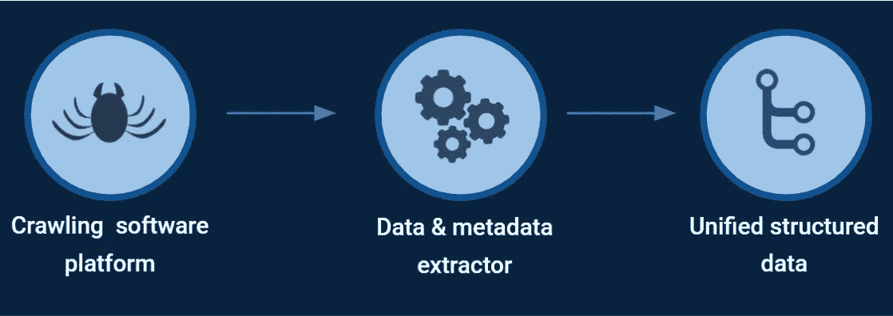
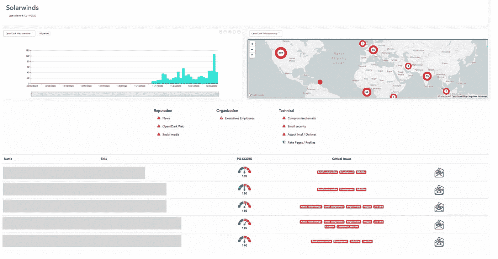
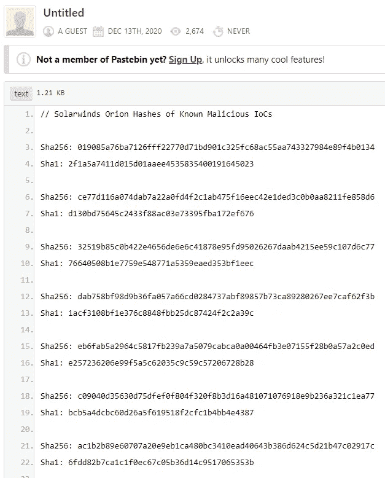
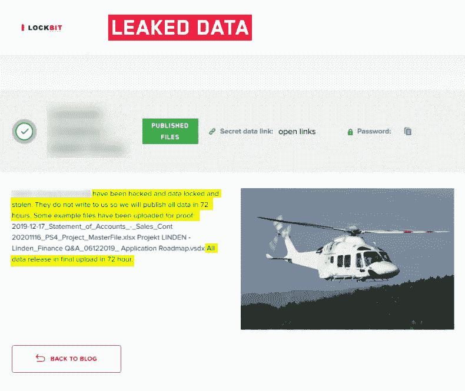

# 暗网监控在第三方风险管理中的作用

> 原文：<https://medium.datadriveninvestor.com/the-role-of-dark-web-monitoring-in-third-party-risk-management-f0255cb19ee5?source=collection_archive---------21----------------------->

作为一个与 85%的财富 500 强公司、数百所大学、五角大楼、美国国家航空航天局等合作的组织，太阳风数据泄露完美地说明了一次精心实施的供应链攻击的范围和规模。鉴于第三方风险目前是组织面临的最大威胁之一，人们会期望像网络安全管理软件产品这样的组织拥有成熟的风险管理解决方案。

不幸的是，这些组织在尝试检测第三方风险时面临巨大挑战。大多数用于检测第三方风险的数据集过于狭窄，随着时间的推移，类似的例子或样本非常少。这使得检测模式和风险变得非常困难。这就是为什么不仅要监控 it 系统安全和内部数据安全，还要监控与公司声誉、情绪、漏洞和员工受损 PII 相关的外部 web 数据，这一点至关重要。这种类型的数据表明组织及其数字资产面临的风险和威胁。

为组织提供实时警报的风险管理解决方案的好坏取决于为其提供动力的原始数据。

# 第三方风险管理的基础

如今，想要将监控范围扩大到第三方风险的风险管理解决方案必须依赖高质量的全面覆盖的暗网数据馈送。这包括监控 tor、I2P、Zeronet 等匿名网络以及 Telegram、IRC 和 deep and dark web 中的 Discord 等聊天应用的能力。

以下是向风险管理解决方案提供数据的流程的基本概述:

# 数据发现

风险管理流程依赖于从广泛来源收集数据的能力，首先从数据发现或来源映射开始。这包括通过人工和自动工作的结合，从公开网络、社交媒体、黑暗和深层网络数据中识别相关来源。

与来自公开网络的数据收集相比，暗网络数据发现呈现出独特的障碍。首先，[黑暗网络中的数据没有被谷歌](https://webhose.io/blog/dark-web/what-is-tor-search-engine/)的搜索引擎编入索引，所以定位起来要困难得多。当您考虑数据的绝对数量时，这尤其具有挑战性。例如，Telegram 这样的聊天应用程序每天产生*5 亿条聊天记录*。此外，暗网市场的域名经常改变名称，突然关闭，似乎消失了——只是以不同的域名重新打开。黑暗网络供应商也使用许多不同的语言，用这些语言识别相关信息所需的时间和资源会带来额外的挑战。

# 爬行

发现相关数据后，必须对其进行爬取。数据抓取一定要持续，否则会遗漏重要数据。这在黑暗网络中尤其具有挑战性，因为管理员会定期驱逐可疑用户、阻止 IP、关闭会话，并且可以识别僵尸行为并相应地禁止用户。此外，许多黑暗网站已经明白，复杂的验证码和不断变化的镜像链接是保护自己免受自动抓取的有效方法。

# 元数据的提取

爬取数据后，需要提取数据。这包括提取文章的作者、标题、文本和发表日期等实体。其他元数据，如公司名称、帖子中提到的外部 URL、比特币地址和其他实体也是相关的。

# 统一和结构化

为了使数据有效，需要对其进行结构化。一旦数据得到统一，无论其来源如何(例如，是来自聊天应用程序、暗网市场还是论坛)，数据的结构都类似，就可以插入相关的风险管理解决方案。

# 为什么暗网数据对风险管理解决方案至关重要

让我们举一个太阳风数据泄露的例子。当快速浏览仪表板时，用户能够快速看到不同的风险因素、新闻模式、跨地理的时间线以及跨这些不同模式的开放和黑暗网络模式。但重要的是理解提供这些见解所涉及的复杂性，这要从发现与每个风险相关的数据开始。

*Dashboard from* [*PiiQMedia’s RiskHQ Risk Management Solution*](https://www.piiqmedia.com/products/pq-risk-hq)

这里有一个来自 Webhose 的网络端点的关于 MSP-PME(托管服务提供商-补丁管理引擎)漏洞的帖子。该漏洞是太阳风核心解决方案的一部分，最近的违规事件影响了 30，000 多名客户。由于这些客户中有许多包括像美国陆军或五角大楼这样的大型组织，这种违规的第三方风险具有深远的影响。

*SolarWinds MSP-PME exploit found in Webhose Cyber Endpoint*

此漏洞允许恶意参与者在网络安全管理软件产品服务上执行代码。这意味着漏洞很容易传播到所有使用这种第三方软件的组织。这与关于网络安全管理软件产品出售给组织的猎户座 It 软件的[漏洞的报道惊人地相似。](https://www.solarwinds.com/securityadvisory)

这是在 Webhose 的网络端点中发现的另一个暗网数据示例，表明可能存在第三方风险:

*Malicious IOCs from the Orion attack found in Webhose’s Cyber Endpoint*

这些恶意的 IOC 是 Orion 攻击的危害散列的指示器。这些哈希可能会导致与恶意软件相关的行为者，或者只是在攻击执行后添加更多关于漏洞的技术信息。尽管这些信息是在数据泄露发生后获得的，但它仍然至关重要，因为它有助于检测更具体的攻击或方法的其他指标，从而阻止或最大限度地减少对最终用户的影响。

让我们举最后一个来自勒索软件的第三方风险影响的例子。

*Post from Webhose’s Cyber Endpoint about Lockbit ransomware attack in the aerospace industry*

# 为更全面地看待组织风险铺平了道路

每天都可以在黑暗网络中发现数千次与数据泄露相关的品牌提及。这包括 PII 和 NPI 数据、恶意软件形式的威胁以及各种犯罪集团的勒索软件。黑暗网络中有成千上万的信号，组织能够专注于最相关的数据至关重要。一个具有强大发现功能的工具可以识别相关关键词，将最相关的数据输入平台，收集信号并将其转换为事件。这种持续而广泛的覆盖在重大数据泄露之前和之后都是至关重要的，有助于缓解数据泄露并防止未来的攻击。