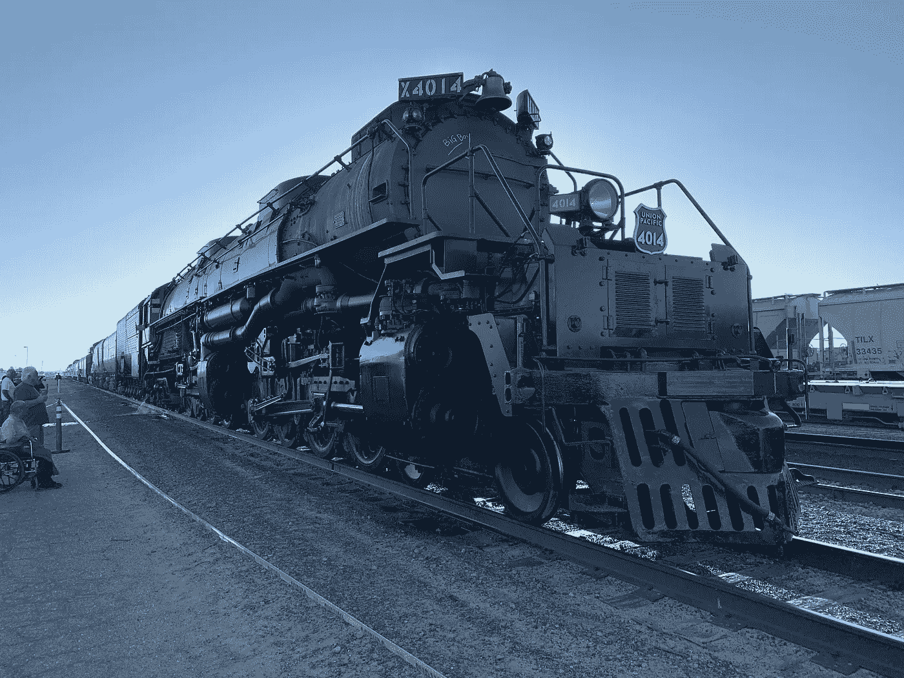
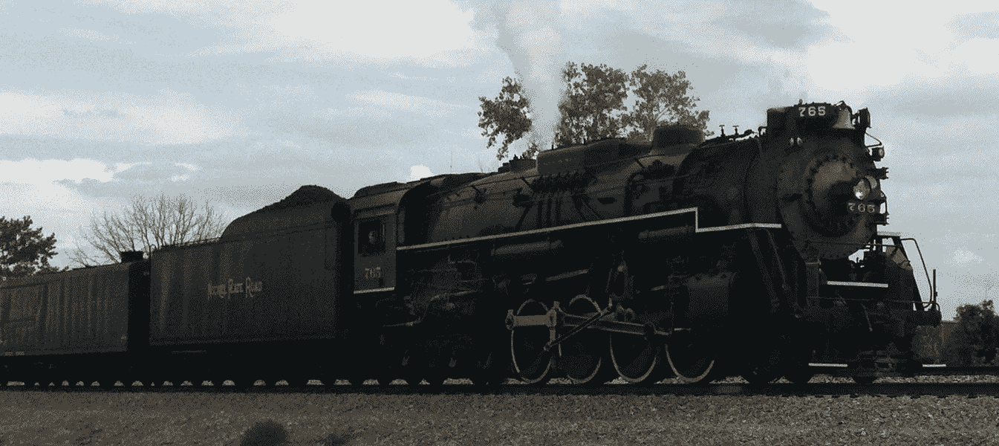

# 蒸汽机车的浪漫和魔力

> 原文：<https://medium.datadriveninvestor.com/the-romance-and-magic-of-steam-locomotives-fdde1b42609a?source=collection_archive---------5----------------------->

Restored Union Pacific 4014 Steam Locomotive at the Yermo UP yard

我觉得蒸汽机车有什么吸引人的？为什么每当听到它的哨声，我都会感受到如此深刻的情感？为什么这么多人觉得它如此诱人和迷人？2019 年 10 月 10 日星期三，我和儿子凌晨 5 点前起床，离开圣莫尼卡前往加州耶尔莫。新修复的联合太平洋 4014 号蒸汽机车在那里停留了一夜，然后继续前往洛杉矶，为计划中的周末远足做准备。

100 多名爱好者聚集在 Yermo UP 码拍照，凝视，与船员交谈，并观看龙在黎明前的黑暗中复活。与会者包括铁路迷、摄影师、不同年龄的儿童、老铁路工人和好奇者。

离开耶尔莫后，我们在加州的巴斯托停下来，观看可怕的#4014 过境。该机车采用 4–8–8–4 配置，长 132 英尺。在巴斯托之后，我们前往维克托维尔，4014 在那里停下来，对重要部件进行例行润滑，并休息 45 分钟。一大群人挤满了美国国家铁路客运公司站的区域，他们想看看这台神奇的机器。

那天剩下的时间还是老样子。无论我们走到哪里，都有成群的人聚集在一起，渴望看到这个近 80 岁的机械奇迹再次复活。

大约在我 4、5 岁的时候，在印第安纳州的福特维尔，我开始对蒸汽机车着迷，那是印第安纳波利斯东北部的一个小卧室社区。它位于当时纽约中央铁路的干线上。我被拖着货物以 60-70 英里/小时的速度穿过福特维尔市中心的大型机车吸引住了。

为什么我的反应如此情绪化？是纯粹的怀旧，还是源于我心灵的某处？也许我把这些机器从我童年早期就和我被父亲拒绝的感觉联系起来了。他不理我，对我哥哥明显偏心。

我在 4、5 岁的时候就明白了，父亲不关心我，不感兴趣，故意忽略我。只是在我母亲将近 104 岁生命的最后一年，她透露他曾试图让医生流产，因此我也流产了。

我想起了我们的小儿子为我和他的弟弟购买油门时间来控制另一辆蒸汽机车。765 号镍板由印第安纳州韦恩堡的韦恩堡铁路历史协会所有和经营。这一直是我最难忘的时刻之一。控制一台重量接近 100 万磅的机器是一次难忘的经历。

在我们的一生中，我和我的儿子们分享了许多这样的时刻。我们住在靠近诺福克南方铁路的地方，我们的大儿子被每一列经过的货运列车深深吸引。他的弟弟后来加入了他，但大的转折点来得晚了一点。

765 号机车镍板在韦恩堡公园的圣玛丽河畔停放了近 20 年后，于 1979 年重建。“伯克希尔”机车由利马机车厂于 1944 年制造。它主要用于运输货物。镍板 765 重达 800，000 磅，在一艘供应船上装载了 22，000 加仑的水和 22 吨煤。因为曾经用来补充蒸汽机车的水塔已经消失，765 有一个辅助供应船，有第二个 22，000 加仑的水。

Nickel Plate 765 Steam Locomotive returning to Fort Wayne, Indiana after an excursion

当我们的儿子分别为 8 岁和 10 岁时，我带他们坐在镍板 765 后面，从纽黑文附近的铁路调车场出发，去印第安纳州的秘鲁，然后再回来。这条远足路线给我带来了许多童年的回忆。它经过印第安纳州的沃巴什，在那里我看到了我玩耍过的树林和田野的遗迹。我从铁路上看到“我的”房子矗立在远处的小山上。这是我家三代人的家，我在这里住了 18 年。我感到一阵剧痛。

现代诺福克南部铁路的旧沃巴什线沿着宽阔平坦的莫米泄洪道，这条泄洪道是从曾经覆盖该地区的冰川湖中开凿出来的。这条铁路建在旧的沃巴什&伊利运河的牵引道上。你可以经常看到古老的运河河床。你还可以看到沿着这条路线的旧城际铁路的遗迹。

肥沃的农田，其中一些曾经是沼泽，现在看起来像一片被绿树覆盖的褐色玉米的海洋。有桦树，柳树，箱长老，枫树，灰烬，山核桃树，橡树，一些核桃，等等。

蒸汽机车总是有一些特别的地方，听着它们尖锐的汽笛声划破寂静。我记得当火车接近另一个十字路口时，我听到了两声长的、一声短的和一声长的汽笛声。在夜深人静的时候，看到蒸汽机车，尤其是听到躺在床上的汽笛声，类似于许多人去海洋的神秘体验。这是一次引人入胜的经历。

古老的沃巴什铁路线是我生活中的一个重要特征。我的祖父母住在印第安纳州秘鲁的沃巴什院子旁边的一所房子里。我祖父母的房子，也是我长大的地方，位于铁路附近。当我的儿子们被介绍给火车时，我们住的房子离铁路很近。我大半辈子都住在这条铁路附近。

当我坐在后座上，我的两个儿子讨论我们追捕联合太平洋 4014 的路线和策略时，这些想法充斥着我的脑海。我们定期在战略上确定的地点停下来，在那里我们可以下车并找到一个有利的位置来观察和拍摄无数的照片。在巴斯托和洛杉矶以东的加利福尼亚州布鲁明顿的联合太平洋西科尔顿场之间的每一站，我们都会遇到或加入成群结队的其他人，他们聚集在一起是为了同样的模糊不清的神秘目的。我们都被这个失落世界的宏伟遗迹的魔力和魅力所吸引。

日子一天天过去，我的思绪转到了我的家乡韦恩堡。韦恩堡铁路历史协会提议将铁路和运输历史中心纳入城市的滨河发展计划。一些在这个提议的发展中有影响力的人没有看到这样一个景点的价值。可悲的是，他们最近从滨河规划中删除了这个想法，并承诺帮助韦恩堡铁路历史协会在附近找到合适的地点。我希望他们是真诚的，但经验告诉我们，政府过于擅长使用这种策略。这是一个有用的工具，可以让他们的愿景之外的项目和想法脱离正轨，并“在地狱冻结时”投入进去。这类似于露西、查理·布朗和足球。

拟建的铁路历史景点名为“源头交汇处”,将会吸引成千上万的游客来到市中心。该计划包括一个装满其他 FWRHS 机车和车辆的圆形大厅、城市间展示、会议室、餐厅和其他设施。提议的位置是在一个曾经是铁路站场的地方。它还毗邻与该城市的城市间的过去有关的财产。它还将允许未来建立一条连接这些景点和该市广受好评的儿童动物园的捷径。这并没有发生。远见是最罕见的品质，通常不会与政治家和既得利益联系在一起。我们可以希望，下一次车轮的转动将带来具有不同视角的新领导层，并愿意利用它所代表的机会。在这一点上，它只是一个愿望和希望。

在这些远足的日子里，我惊奇地看着大批的人群。人们站在 100 多英里的路线两旁。他们开着车追 4014，聚集在最上镜的位置。作为一名目击者，我不禁问自己，这些令人敬畏的简单时代的机械机器到底有什么吸引人和不可抗拒的地方。大型车队堵塞了 15 号州际公路和辅路，无论 4014 号车去哪里，都尽力尾随、跟随和追逐它。我看着我们站在那里，敬畏、喜悦，甚至还有几滴眼泪。这些机器唤起了我们内心深处的某些东西。它们唤醒我们从未意识到的情感、无意识的感觉和渴望，等待适当的刺激被唤醒。

我站在西科尔顿联合太平洋调车场的桥上，周围有 200 多名不同年龄、性别、种族和民族的人。我们都是同一个部落的一部分，注意力集中在一个巨大的黑色喷烟和蒸汽的大嘴上，当它从我们下面经过时，空气中充满了它的节奏和音乐。

我无法解释这种吸引力。我试着去理解它。我已经尽力去理解和表达了，但我真的无法解释。更重要的是，这无关紧要。我只是喜欢活在当下，让这种经历冲刷我，消耗我的意识。明年，如果有机会，我会再做一遍。

像所有的事情一样，瓦比-萨比

也可在:[www.jerrymlawson.com](http://www.jerrymlawson.com)