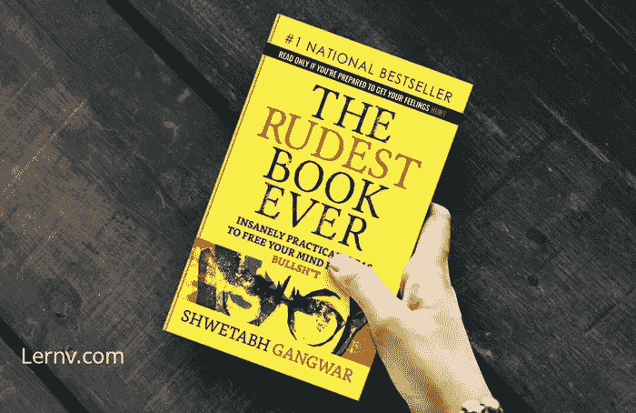
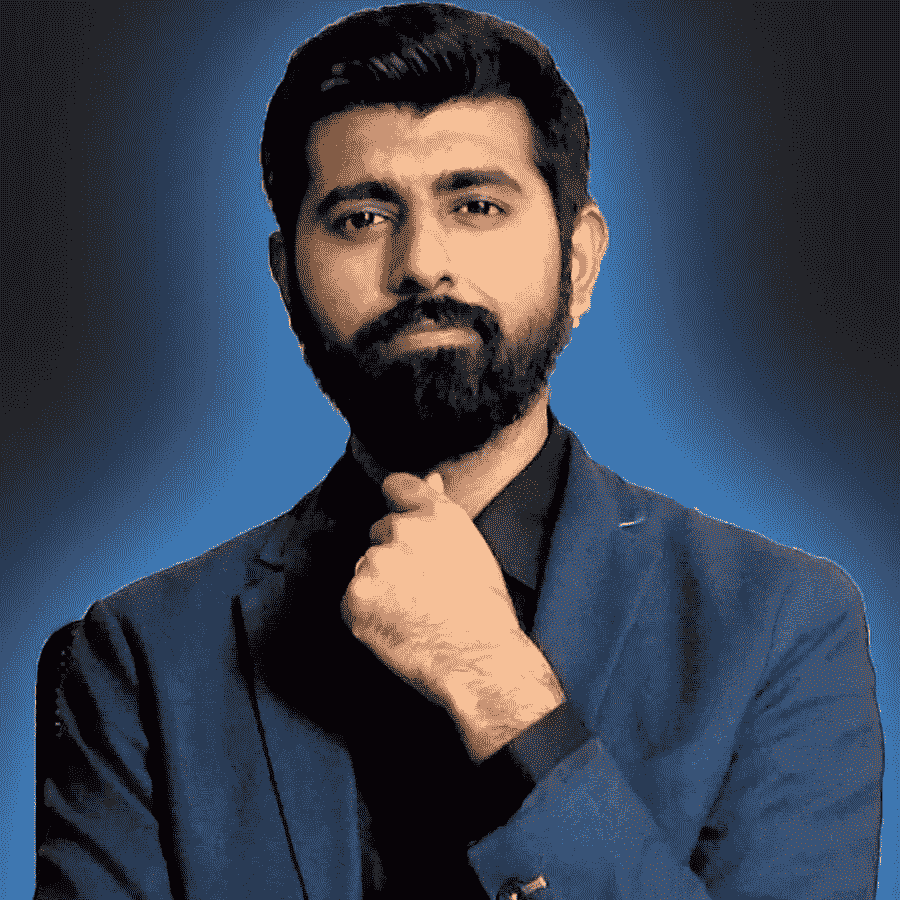

# 有史以来最粗鲁的书

> 原文：<https://medium.datadriveninvestor.com/the-rudest-book-ever-shwetabh-gangwar-4180a458efbf?source=collection_archive---------2----------------------->

book

在谈论这本书之前，我想告诉你作者'[***Shwetabh Gangwar***](https://www.youtube.com/channel/UC2gQaoCItAC-IbT8RNwWqLQ)'的一些事情，然后你就可以决定你是否应该读这本书了。

Shwetabh Gangwar

Shwetabh Gangwar 是一名 *YouTuber* 和一名专业的问题解决者，具有深刻分析问题的能力和中立的视角。相信我，如果你看看他的[***YouTube***](https://www.youtube.com/channel/UC2gQaoCItAC-IbT8RNwWqLQ)视频，你会了解更多。

你可以在最近的话题***“Youtube vs Tiktok”***上看他的视频:对话题非常理智和深刻的分析，以及我们是如何浪费了很多时间。

现在回到 T21 的书**【有史以来最粗鲁的书】**

Q1。这本书是关于什么的？
答。这本书将教我们如何利用越来越多的数据来研究你的观点。这本书涵盖了从生活中的拒绝到失败的非常普通的现实生活问题。这本书对你来说可能是也可能不是一个激励因素，但它会给你一个新的观点来看待你的感知、你的思维和你的情感支柱。

Q2。我为什么要读这本书？
一个。如果你在心态上很迷茫到底要不要这么做，
或者你在有限的人生中被拒绝过，并因此而感到沮丧，
或者你在这种平庸中失去了斗志，想要重新崛起，
或者你想给人生一个新鲜的原点但如何以及在哪里？这本书是你的一个很好的开始。现在，这本书不会让你成为一个坚强的人或百万富翁，但它会监督你，通过它你可以成为一个幸福的人，这在我们的生活中是非常宝贵的。

**Q3。你能告诉我这本书里一些最伟大的学问或思想吗？**
**一**。书一开始就宣称我们是 ***产品*** 。附有*希望*的产品。通过这样说，作者表明有一天我们都将成为能够按照我们自己的意愿选择工作、职业和关系的功能单位——这是希望。这个观察一开始就让我大吃一惊。是的，我同意我们是一种产品，我们都被赋予了一种功能，我们通过这种功能来赚钱。很粗鲁，但却是事实。

 [## 释放结果的简单哲学|数据驱动的投资者

### 这是我们播客中帕迪·布鲁斯南的一段话。帕迪是一个正念和冥想老师，一个…

www.datadriveninvestor.com](https://www.datadriveninvestor.com/2020/03/16/a-simple-philosophy-to-unlock-results/) 

我最喜欢这本书的一点，也是我在网上搜索这个因素的一点是: ***如何思考？***
真的，这本书在其中一个章节里讲过(我最喜欢的一章)，怎么想就像我们在 ***里被重重地栓住时该怎么想呢？***
这是作者试图在本书中传达的最精彩的观察之一。
本章作者引用:

> 怎么想基本就是不知道想什么。

仅从这一条线就能非常强烈地观察到。然后在这一章的后面，Shwetabh 展示了残酷的现实*我们如何给予价值以获得人类战争的知识，而不是重视获得智慧*。
其次，作者试图向我们展示 ***自我价值*** 的价值，我们总是认为它取决于他人。在其中一章中，作者引用了:

> “你是在从别人的欣赏中积累自我价值。这是你问题的根源。而不是比你优秀的人。”

然后在一章中，作者探索了*拒绝的维度，以及它对我们每个人来说是如何自然的。现在我已经读了一些文章或书籍，告诉我们关于拒绝和如何处理它，但这本书以一个新的视角拥抱这个话题。Shwetabh 在这本书中阐述拒绝时说:*

> *被拒绝激励并不是一个好主意。*

*这些是我觉得很棒的观察，在这本书里体现得很好。*

***Q4。谁应该读这本书？***

***答**。现在，我不会说一个人是气馁的或失败的，或认为他/她自己是一个消极的人，只有他们应该读它。我会建议每一个正在阅读这篇文章的人，试一试。这是完全值得的，尤其是在这个价格下。如果你能设法在影城买到劣质爆米花，那么你绝对可以订购这本书。你可以在这里 订购这本书 [***。(*没有赞助商，也没有我为这本书做广告赚到的钱。相信我！！！*)***](https://www.amazon.in/gp/product/9388754433/ref=ppx_yo_dt_b_asin_title_o02_s00?ie=UTF8&psc=1)*

*这本书也包括了我们消费最多的网络世界的垃圾，这也是我们日常生活的根源。这也是本书最精彩的章节之一。这一章中有一句话非常深刻，让我停下来想了想:*

> *一个人越诚实，你越钦佩他。越不诚实的人，你越追随他们。*

*最后，我会说这本书是关于*你，你和你，而不是其他的*。*你是国家，你是你思想的操作者，你是一切的基础，你是每个问题的解释*。
继续努力，给你更多的力量和爱。
不断学习，不断成长。
如果你已经达到了这一点，你可以访问我的 [***个人资料***](https://medium.com/@asishraz) 看看我的其他文章，让我知道，你觉得怎么样。*

*永远不要放弃，永远不要放弃！！！
-Gareeb 编码器*