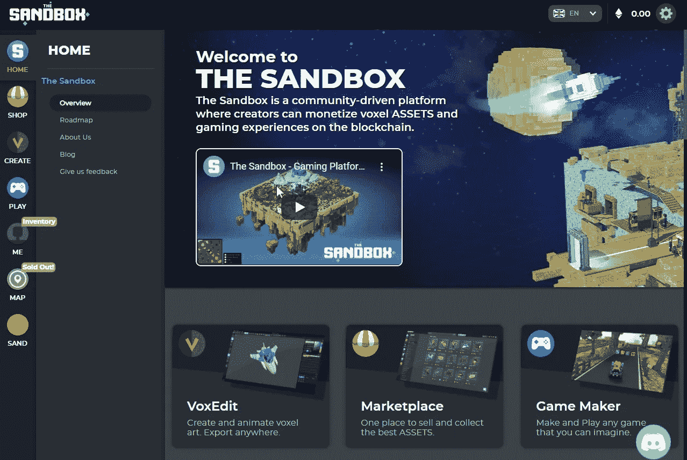

# 币安推出的沙盒(SAND)

> 原文：<https://medium.datadriveninvestor.com/the-sandbox-sand-launched-on-binance-c01f6d376bfa?source=collection_archive---------18----------------------->

可能会彻底改变行业的最新平台已经启动并运行。但它到底是什么，为什么和别人不一样？我在这里回答这些问题以及更多的问题。

[沙盒](https://www.sandbox.game/en/)是一个用户生成的、以社区为中心的内容平台，创作者可以在这里将区块链上的资产和游戏体验货币化。三个主要组件是用于构建游戏资产的 VOXEDIT 3D 体素艺术动画软件和构建器、用于买卖 NFT 资产的市场以及用于在沙盒元宇宙中创建游戏体验的 GAME MAKER 工具。

该平台旨在成为世界建筑游戏的新标准，拥有数百万用户创建的 3D 体素艺术资产和游戏，可作为区块链上的自有项目。

# 可用于交易的沙盒令牌

这个平台是建立在以太坊区块链上的，你可以做任何你想做的事情，从创作到赚钱。SAND token 是一种 ERC-20 实用令牌，用于价值转移，但也可用于赌注。它昨天才在币安公开上市交易。对于这个平台来说，这是朝着正确方向迈出的一大步，因为这可能会吸引更多的投资者。

 [## 人工智能、区块链和智能合约:为什么我们都需要拥抱创新|数据驱动的投资者

### 区块链是一个抓住了我的想象力的行业，有助于为更大的利益改造社会。我开始…

www.datadriveninvestor.com](https://www.datadriveninvestor.com/2020/08/03/ai-blockchain-and-smart-contracts-why-we-all-need-to-embrace-innovation/) 

目前的循环供应量为 7.05 亿砂，约为计划总量的 23%。它以 0.008333 美元/砂的价格推出，仅在 24 小时内就获得了近 700%的价值。加薪是意料之中的事，但不是那么多。这显示了对令牌和整个平台的巨大支持。

# 他们提供的产品

他们现在向用户提供的三个产品是体素编辑器、市场和游戏制作软件。我在上面简要介绍了这些产品，但让我们真正了解它们各自的功能。

[**VoxEdit**](https://www.sandbox.game/en/create/) 是一个 3D 体素建模包，允许用户创建 3D 对象并制作动画，如人、动物、植物和工具。体素相当于类似于构建块的方形 3D 像素，可以使用体素编辑来轻松创建资源。

**沙盒市场的**简单明了，它允许用户**上传** , **发布**,**出售**他们在 VoxEdit 中制作的资产。资产首先被上传到星际文件系统(IPFS)网络，然后在以太坊区块链注册以证明所有权。资产可以通过在市场上出售来出售。

沙盒的 [**游戏制作者**](https://www.sandbox.game/en/play/) 允许玩家免费构建 3D 游戏。借助可视化脚本工具，不需要任何编码知识。

# 项目路线图

该项目对未来有着清晰的认识，以及他们希望如何让平台变得更好。这是更新后的路线图，以及对他们未来的期望。

**2020 年第三季度**

*   游戏制作者测试版的公开发布。
*   推出土地令牌预售 4。
*   发布购买沙子、P2P 销售、用 GEM & CATALYST 铸造资产的市场升级。

**2020 年第四季度**

*   推出沙盒游戏的公测版。
*   推出游戏赚取机制。
*   多人游戏组件的发布。
*   启动定期土地代币销售。
*   VoxEdit 1.0 的发布。

**2021**

*   推出带沙堆的基础刀。
*   Game Maker 1.0 的发布。
*   沙盒游戏的发布。
*   在智能手机和平板电脑上发布游戏。
*   发布用户生成的多人模式游戏。

2022 年

*   在游戏机上玩游戏。
*   游戏厂商共建模式的发布。

# 结束语

这么长时间以来，我从未对一个新平台如此兴奋过，我希望我能看到这个平台成功。我知道有很多事情会朝着好的方向发展，我会尽自己的一份力量参与其中。我正在考虑我将投资多少赌注硬币，当我这样做的时候，我会在这里张贴我的赌注之路。完全透明，只是为了看看这个令牌会做什么。我也开始创造自己的资产，并将我的作品投放市场。这是两个世界的合作，我对此印象深刻。让我们看看这将随着时间的推移而走向何方。

**访问专家视图—** [**订阅 DDI 英特尔**](https://datadriveninvestor.com/ddi-intel)