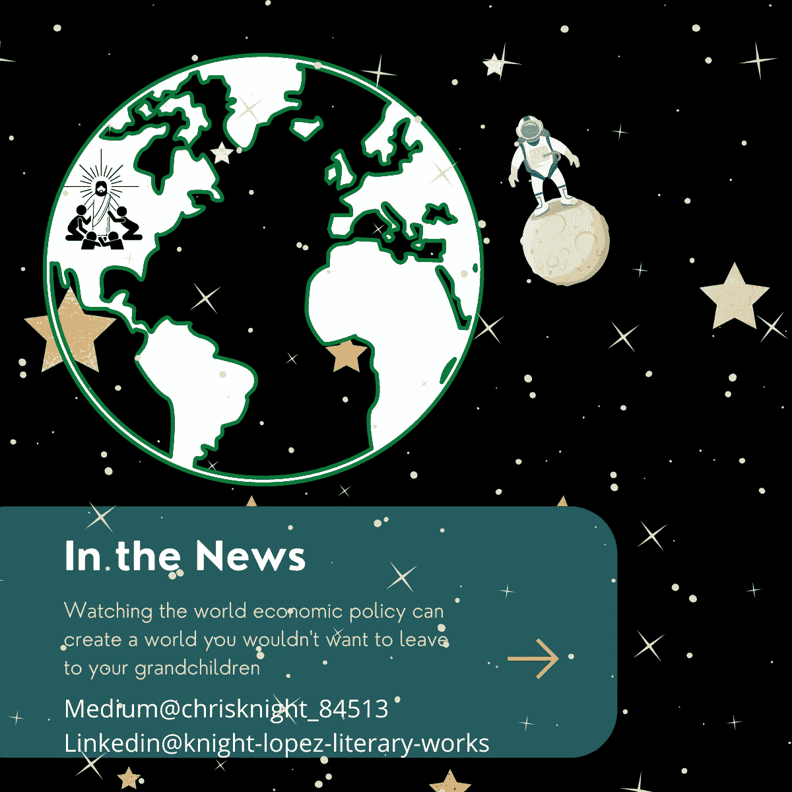

# 负债券利率、环境破坏和失业崇拜者的卫星观察者

> 原文：<https://medium.datadriveninvestor.com/the-satellite-watcher-of-negative-bond-rates-environmental-havoc-jobless-worshipers-2d7ce7d57ccd?source=collection_archive---------6----------------------->

## 我们的真实情况是暗淡的。我们支付的利率很低。世界的守望者坐在巨大的王座上思考着结果。

Source: Self Created Image with [Canva](http://www.canva.com).

**卫星**

风吹过一片废墟。废墟形成了引导风的裂缝。经过仔细观察，我们发现这些废墟中有人。看起来像废墟的建筑是美国最新的 T2 经济机会区。

[在 COVID 瘟疫之前，贫困率徘徊在 10%以上。现在，贫困延伸到了它的边界。吹过风景的空气有声音。空气的声音是给生活在地面上的人们的。](https://www.census.gov/library/publications/2020/demo/p60-270.html#:~:text=The%20official%20poverty%20rate%20in,and%20Table%20B%2D5).)

风谱写了它的曲调。

W--A--I--llll…

大地发出痛苦的长嚎。它让听者不寒而栗。

一道虚幻的光在地平线上移动。身体以异常的速度运动。

当明星太快了。

做流星太慢了。

它太永久了，不可能是天体。

它的路径每天都是一样的。它每周跟踪相同的轨道。每个月它都会从同一个位置观赏风景。季节不会改变它的轨道。地面上的脸总是向上看。废墟中闪烁着绝望的目光。

***美国人的眼睛。***

这些眼睛看起来像是在向上帝祈祷，但他们脸上的其他部分却知道一些事情。在这些脸上找不到上帝。这些面孔需要工作，而上面的虚假神不会满足他们的需要。

4 月份 15%的失业率在 11 月份降至 6.9%。

尽管如此，没有人认识到有 370 万人没有领到他们的旧工资。旧的生活方式被处死。以前的职位已不复存在。

这些贸易工作是在街区进行的。他们的身体被撕成碎片。人头穿上长矛。每个人都看到了他们的衰败。

恶臭挥之不去。

*Ewwhhh* 。

死亡笼罩大地。顶上的虚晃光让人看起来。以崇拜的形式举起双手。手指指向。他们知道谁在上面。

有人往下看。

**守望者**

“这些人看不到他们的生活将永远不会回来。”

一个老人站在环绕地球的卫星上。他四面八方都被银灰色的钢铁包围着。图表读取数字。全息图像在他用来俯视行星的玻璃上淡入淡出。

他站在一根拐杖上。这根手杖很结实，能承受他的重量。他的体重是忧虑重重而不是肥胖。他是一个瘦长的人。这个瘦长的男人压下去，仿佛是一克黑洞。他施加在手杖上的压力使钢铁地板嘎吱作响。

他把手移到下巴上。他揉了揉他的灰色胡茬。

临时裁员从 4 月份的近 80%下降到 9 月份的 40%左右。以前的工作被永久淘汰的失业人口比例已经从 10%上升到 40%左右。渐渐的以前所有的工作都会失去。”

那人的脸上显示出忧虑。他把目光从行星上移开，盯着房间的中央。房间中央有一个高架平台。一盏脉冲灯柔和地照亮了房间。

这个人一边说话一边盯着灯光。

 [## 对有商业头脑的投资者有用的行为经济学概念|数据驱动的投资者

### 在美国企业界，高斯统计，对我们周围世界的确定性解释，以及理性…

www.datadriveninvestor.com](https://www.datadriveninvestor.com/2020/07/09/helpful-behavioral-economics-concepts-for-the-business-minded/) 

"**他们制定的政策不利于地球**。他们将工业化来解决这个问题。这会有问题。”

光明召唤着他。这个人开始走向它的召唤。

这个人走到平台的中央。他的手移向脉冲灯。他抓住了一个旋转球。他的手顺时针旋转它。

“让我看看这些人的未来。[告诉我，当通货膨胀率高于国债利率时，储蓄如何保值](https://www.reuters.com/article/usa-bonds/treasuries-yields-dip-as-fourth-quarter-looks-weak-tips-auction-sees-strong-demand-idUSL1N2I52DK)以及放弃它们的生态系统优势。”

这个人看了一会儿旋转球。旋转球开始旋转一个新的现实。在他周围，新的形象开始形成。他可以看到星球的地面。他能感受到城市的热度。

在城市中，他站在熙熙攘攘的人群中。这种喧嚣开始加速。汽车从行驶到光速。图像变得模糊不清。

*停止*。

**五十年后**

地球上大多数人口稠密的地区太热，无法居住。30 亿人发现干旱，不稳定的电力和大规模的沙尘暴咆哮着穿过他们的街道。

[现在有 7 亿人生活在贫困中，这是因为经济政策的改变，金钱比气候更重要。](https://www.pnas.org/content/117/21/11350)

孩子们饿得肚子鼓鼓的。寄生在它们体内的寄生虫导致它们肿胀。劣质水是可以得到的。这些是白色、棕色和黄色的孩子。2000 年代的非洲广告现在已经成为美洲的现实。人们在街上乞讨水喝。士兵们在曾经被认为是财富堡垒的地区巡逻寻找抢劫者。

好莱坞已经崩溃了。在这些土地上已经没有娱乐了。只有对前富人自满的鄙视。

图像被切断。

“我再也看不下去了。”

这个人把目光从房间的中央移开。他的眼睛注视着这个星球。

“我明天会再起来。但愿不会出现失败的经济政策。”

祝你知识成功！

***

关于 Christopher:Christopher Knight Lopez 是一名职业骗子，在他的职业生涯中，他与职业企业家进行了广泛的合作。在他 14 年的职业生涯中，Christopher 已经开了超过 7 家公司。克里斯托弗的目的是利用各种市场驱动的机会。Christopher 是注册项目经理(MPM)和认证财务分析师(AFA)。Christopher 之前通过了 65 系列证券执照考试。克里斯托弗也有他的总路线——人寿、意外、健康和健康维护组织。Christopher 已经管理了总计 2 . 86 亿美元的报告管理资产和建议资产。Christopher 在 29 个国家有工作经验，为各种业务筹集了超过 5000 万美元，在他的个人职业生涯中总收入超过 1300 万美元。Christopher 曾在高科技行业工作:生物技术、金融、证券、制造、房地产和住房抵押贷款。克里斯托弗是一名美国空军老兵。克里斯托弗热爱家庭、竞技体育、钓鱼、武术，并倡导企业家精神。克里斯托弗为崭露头角的企业家提供自助课程。克里斯托弗对导师的热情来自于企业家和骗子需要指导的信念。这个世界充满了关于企业家身份的相互矛盾的信息。在 www.christopherklopez.com[看更多。](http://www.christopherklopez.com.)

免责声明:这些信息并不意味着是一种投资建议或财务建议。不要把这种情况应用到你自己的个人环境中。各种风险包括:商业风险、投资风险、政治风险和其他风险。此信息仅用于信息和教育目的。请不要向作者寻求任何投资策略或哲学。针对自己的情况，请咨询自己的理财顾问或法律顾问。不是任何形式的推荐或认可。

## 访问专家视图— [订阅 DDI 英特尔](https://datadriveninvestor.com/ddi-intel)