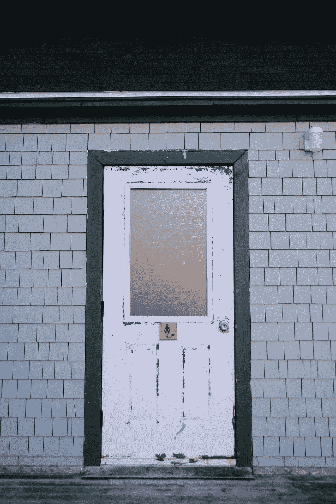

# 我一生中最恐怖的一天

> 原文：<https://medium.datadriveninvestor.com/the-scariest-day-of-my-life-4d8fa65cd086?source=collection_archive---------8----------------------->

## 我所有的感官都是警觉的；实际上，我必须为生存而战

80 年代末，我 18 岁的时候，我被一个同龄的朋友邀请去巴西圣保罗海岸的 Guarujá度假。我们和他的姐姐以及他的父母去了他家的公寓，一个靠近海滩的顶层公寓。然而，这家人并没有呆很久。不到一个星期，父母和妹妹回到了圣保罗，留下了我和我的朋友。离开时，母亲也在公寓墙上贴了一张我们离开前应该做的事情的清单。

我们在我朋友的房间安顿下来，那实际上是女仆的房间。我解释说:在巴西这里，直到那个时候，有一个房间让女仆睡觉是很普遍的。这个房间通常与厨房后的服务区直接相连。这套公寓还有两间卧室，一间大点的是他父母住的，另一间小点的是他姐姐住的。我的朋友得到了最差的房间，这一间，女仆的房间，就在服务区的后面(了解它的位置对这个故事的发展很重要)。

假期持续了一个多月。我们疯狂了几个小时，很晚才醒，中午吃早饭，去海边，一路走，回房子，晚上七点吃午饭，休息，出去夜店。然后我们会在黎明回来，吃晚饭(做些三明治，喝点可口可乐)，然后在凌晨三四点左右睡觉。

我们每天都虔诚地执行这个程序。我们玩得很开心；我们都很年轻，第一次独自呆在一个满是女人的城市，有一辆漂亮的车和一个屋顶供我们使用。这将是一个完美的季节，如果有一天，当我们从街上回来时，没有遇到房子的门半开着。

Photo by [Dima Pechurin](https://unsplash.com/@pechka?utm_source=medium&utm_medium=referral) on [Unsplash](https://unsplash.com?utm_source=medium&utm_medium=referral)

我和我的朋友瘫痪了。我们看着对方的脸，不知道该说什么……直到我们的邻居打开他的门，告诉我们，门从一天开始就这样了。很明显，我们去海滩的时候没有关门。

稍微平静了一点，我们决定进入。即便如此，我们认为最好还是搜查一下公寓，以防有小偷藏在那里——瓜鲁贾当时是个危险的地方。

不，公寓是空的。

我们淋浴，休息，吃午饭——晚上七点——然后又出去了，现在是为了开心。

我们在街上一直呆到凌晨三点左右，这时天气开始下雨。趁着下雨前刮起的风，我们去了公寓。我们到了，做了一些三明治——把放在塑料袋里的面包放在桌子上——吃完后去了女仆的房间，那里有一扇带半透明窗户的门，类似于这样:

Photo by [Damien DUFOUR Photographie](https://unsplash.com/@ddufourphotographie?utm_source=medium&utm_medium=referral) on [Unsplash](https://unsplash.com?utm_source=medium&utm_medium=referral)

房间很小。里面只有一张单人床——我的朋友睡在那里——地板上有一个“床抽屉”,我睡在那里。睡觉前，我们在那里聊了一会儿…

直到我们听到一声巨响，从房间里传来“砰”的一声。就像有人被迫打开一扇门。

我们吓呆了。

毕竟，在同一天，早些时候，我们发现门是开着的！肯定是之前试图偷公寓的小偷…他回来是为了完成他的工作！

我很想去看看发生了什么，但是我的朋友比我更害怕。他告诉我们安静等待。如果我们再也听不到噪音，我们就可以离开房间了。否则…让强盗偷房子，但不要杀我们俩。

我们等了一会儿，希望客厅里不会再有声音了…

但是我们听到了另一个声音，这次是从厨房传来的！

这是面包的塑料！小偷在捣乱我们的晚餐！

更糟糕的是，女仆的房门没有钥匙。我们甚至不能把自己锁在里面！

我从床上爬起来，举起门把手。这是唯一阻止别人的方法。我的朋友吓坏了，坐在床上…等待着。

我们很安静，听着有人触摸面包塑料的声音。

“我想他们饿了……”我说。

“安静……如果他们听到我们，他们会过来的！”——他说。

如果有人来，我们肯定会看到。我说过，门是半透明的。我们可以看到挂在外面晾衣绳上的衣服的形状；如果有人去女仆的房间，我们也会在那里看到他们的形状。

并且，在那一刻…

我们开始看到晾衣绳在动！

> 很明显！有人在那里，检查该地区！

我握着门把手等着，想着当他们强行进入时我该怎么办…

但是衣服还在动……也没有人来开门。

然后，我的大脑开始忘记一点点恐惧…我开始理解这种情况:我们已经离开了海滩，因为风太大了，要下雨了。那个区域的窗户是开着的，让衣服晾干…哪个小偷不会强行打开他抢劫的公寓房间的门？

所以很明显，是谁让衣服动起来的…

“是风！”我告诉了我的朋友。

“闭嘴，他们会听见我们的！”他说。

“不，是风！我确定！窗户是开着的；所以衣服才会动！”

“那面包呢？”

“我们把包裹放在桌子上……风让塑料在移动！我确定…我们没有被抢劫！是风！”

在朋友打断我之前，我起身小心翼翼地打开了门。衣服真的在风中飘动。我去了厨房，看到那块面包的塑料也在风中摇摆。当我的朋友走到我身后时，我已经松了一口气:

“那我们一开始听到的‘砰’呢？就像有人打破了门？”

他是对的！我对此没有任何解释！但是，正如我目前所猜测的那样，我决定冒一次险。我从厨房抓起一把砍刀，走进客厅。没有什么不寻常的；前门关着，锁着……是什么发出了那种声音？

然后我看到了在我离开之前我们应该做的事情的清单，它被我朋友的妈妈固定在墙上。它在地板上。它是“弯曲的”我已经注意到了这一点；随着太阳，它已经扭曲…

然后我解开了这个谜。

风把单子吹了下来，由于纸是弯曲的，当它“站着”掉在地板上时，发出了很大的声音。

一声“砰”

即使谜团解开了，我们还是搜查了整个公寓，两个人都拿着大砍刀…

像我们这样勇敢的人，谁会需要帮助？

## 访问专家视图— [订阅 DDI 英特尔](https://datadriveninvestor.com/ddi-intel)