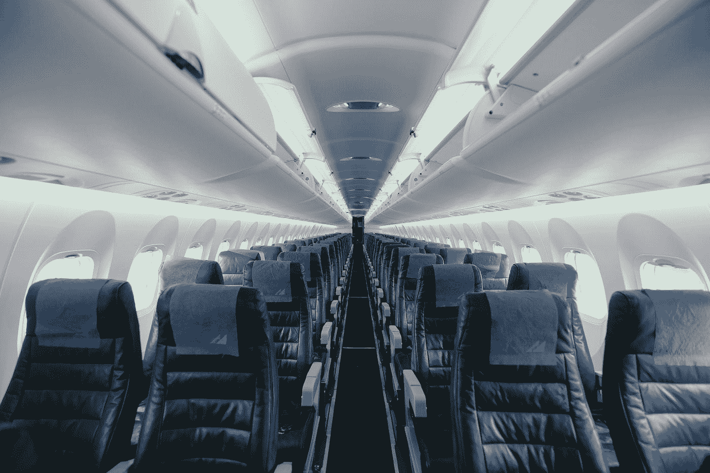

# 旅游业将迎来第二波冲击

> 原文：<https://medium.datadriveninvestor.com/the-second-hit-coming-for-tourism-1624c1ecb70c?source=collection_archive---------8----------------------->

Photo by [Dion Tavenier](https://unsplash.com/@diotav?utm_source=medium&utm_medium=referral) on [Unsplash](https://unsplash.com?utm_source=medium&utm_medium=referral)

## 虽然旅游业目前遭受重创，但大多数人预测一旦新冠肺炎的局势得到控制，旅游业将会强劲复苏。以下是大家都忽略的五点。

T2 的旅游业现在正遭受巨大的创伤。从航空公司到酒店，从预订提供商到旅游运营商。我甚至不需要提到邮轮运营商。**最大的名字都是出血数百万和数十亿。**Booking.com、Expedia、汉莎航空、新航、Airbnb、万豪、希尔顿——[整个行业都遭受了巨大的打击](https://skift.com/coronavirus-and-travel/)。许多小公司已经倒闭或即将倒闭。

与此同时，根据 Statista**最近的市场展望，该行业预计 2020 年收入为 5680 亿美元**。2019 年的收入估计为 6850 亿美元，而在危机爆发前，年初对 2020 年的原始预测为 7110 亿美元。这让我觉得非常乐观。

 [## 如果资本主义失败了，那么还有什么选择呢？数据驱动的投资者

### 在当前政治领域的修辞之旅中，我们都可以面对面地接触到流行词汇，如…

www.datadriveninvestor.com](https://www.datadriveninvestor.com/2020/03/16/if-capitalism-is-a-failure-then-what-is-the-alternative/) 

许多人以中国为参照。在汉莎航空创新中心最近发布的一篇文章中，他们展示了在最糟糕的措施停止后，中国的航班需求是如何出现爆炸性反弹的。这些当然是国家航班。由于显而易见的原因，国际旅游业在中国还没有复苏。

> 与此同时，许多消费者调查显示，一旦新冠肺炎局势在全球范围内得到控制，中国人就会渴望再次旅行。

> **根据非常初步的证据，假设与 2019 年相比，2020 年旅游业年收入同比下降不到 20%是否合理？**

当然，这将取决于全球从疫情复苏的速度。**预防措施的持续时间将是反弹时间的一个重要因素**。然而，除此之外，我确实认为，这次反弹将远不如预期的那么显著。**有一些关键的潜在动力似乎没有人在**中定价，但这将对全球旅游业产生巨大影响。

# **可休假天数**

每个对危机后前景持积极态度的雇主首先会考虑的措施之一是**要求员工现在就带薪休假**。在没有太多工作要做的时候，雇主们更喜欢让他们的员工休假，这样当工作回来时他们就完全有空了。对危机后复苏前景非常乐观的公司尤其如此，因为他们现在不会裁员。

> 这意味着现在带薪休假对旅游业没有好处，因为没有人去旅游。

他们只是在家休假，花更多的时间和家人在一起。所以，**一旦整体情况恢复，他们会忙于工作而没有时间休闲旅游**。这将对全球旅游业收入产生重大负面影响。

Photo by [JC Gellidon](https://unsplash.com/@jcgellidon?utm_source=medium&utm_medium=referral) on [Unsplash](https://unsplash.com?utm_source=medium&utm_medium=referral)

# **降薪和裁员**

受到更严重打击的公司采取的更激烈的措施是大幅减薪、无薪休假或大规模裁员。**本周我们已经看到了美国历史上最重要的一波新失业救济申请****，一周内超过 300 万。而这仅仅是开始。许多行业和发达经济体都受到影响，工人也深受其害。**

**休大量无薪假或发现自己失业的人会很快遇到现金问题。支出将只流向必需品，而大多数人会动用他们的储蓄(如果有的话)。这对可支配收入有直接的负面影响。**

> **如果旅游禁令取消，人们花在旅游上的钱将会明显减少。**

# ****消费者信心****

**任何对经济大幅反弹的预测都将假设人们的态度基本不变。这个假设感觉很牵强。我们现在正经历着前所未有的大规模创伤。这与金融危机不可同日而语，金融危机结束时，一旦人们有能力再次消费，消费就会回到旧水平。**

> ****我们正在经历一场信任危机——不受控制的全球化的负面影响正在显现。****

**我认为，总体而言，**消费者信心需要数年时间才能恢复到过去十年人们感到全球旅行安全的水平。当然,“中国病毒”这样的标签也于事无补。**我们将看到的旅游反弹在国内旅游中更可靠，在全球旅游中更弱。许多消费者会避开全球目的地，因为这种担忧会持续很长时间。**

****

**Photo by [Bence Kiss-Dobronyi](https://unsplash.com/@iecs?utm_source=medium&utm_medium=referral) on [Unsplash](https://unsplash.com?utm_source=medium&utm_medium=referral)**

# ****商务旅行****

**几乎所有的企业现在都转向了远程工作。人们正以前所未有的规模在家工作。对于许多传统企业来说，这在短期内会带来巨大的痛苦，但它们正在适应。每个人都在学习，我们认为不能远程完成的事情实际上可以远程完成。商务旅行暂时不在考虑范围内——但是这种反弹会是什么样的呢？**

**尽管商务旅行将会反弹，但很大程度上人们怀疑它会回到过去的水平。**人们总会有一些** [**的场合想要面对面的**](https://www.ft.com/content/21356508-5f96-11ea-b0ab-339c2307bcd4) **，但那些会比较少。****

> **更多的工作将通过虚拟协作远程完成，这将大幅降低商务旅行的支出。**

# ****对可持续性的担忧仍然很大****

**除了所有的危机言论和影响，另一个趋势仍然完好无损——可持续性。**[**在病毒出现**之前，旅游业一直是环保人士关注的焦点](https://www.weforum.org/agenda/2017/08/the-growth-paradox-can-tourism-ever-be-sustainable/) **，在过去的几年里，越来越多的人开始倾听。******

> ****这并没有神奇地消失。对可持续发展的推动仍然存在，并将继续对旅游业产生长期影响。****

****随着旅游业的有效暂停，人们会发现更容易调整他们的态度，这是已经存在的大趋势的催化剂。我们现在有时间反思，人们正在考虑他们在许多问题上的立场。这是一个大的。这对全球旅游业有着巨大的影响。****

# ******总之******

****任何认为 2020 年旅游收入接近 2019 年的预测都过于乐观。我们正在经历的不仅仅是短期的需求下降。在这种情况下，指出中国的发展是一个亮点是没有价值的。这些发展是中国特有的，主要集中在全国旅游复苏上。全球旅游是一个完全不同的话题。****

****员工正在带薪休假，或者被要求不带薪休假。更糟糕的是，数百万人被解雇。在 2020 年的后期，旅行的时间和金钱都将变得稀缺。此外，我们正在经历一场巨大的信心和信任危机，这让许多人不得不重新考虑未来几年的全球旅行。**商务旅行将比以前更少，因为我们都发现远程协作确实有效。******

> ****最后但并非最不重要的一点是，整体可持续性的推动仍然存在，并将在危机后继续抑制全球旅游业。****

****我认为，上述几点目前尚未反映在预测和股票中，在最初的新冠肺炎创伤消退后，旅游业将面临第二次冲击。**经济复苏将远远弱于今天所有人的预期**，并将导致收入和公司下滑，超出我们今天看到的任何预期。****

****如果你有任何想法、回应或问题要补充，我很乐意在下面的评论中听到你的意见，或者随时通过[*LinkedIn*](https://www.linkedin.com/in/smueller1512/)*直接联系我。感谢您的阅读！*****