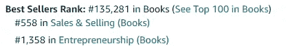
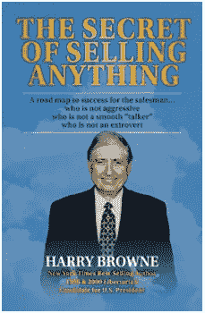

# 销售任何东西的秘密

> 原文：<https://medium.datadriveninvestor.com/the-secret-of-selling-anything-f71b7341c933?source=collection_archive---------13----------------------->

Photo by [Cytonn Photography](https://unsplash.com/@cytonn_photography?utm_source=unsplash&utm_medium=referral&utm_content=creditCopyText) on [Unsplash](https://unsplash.com/s/photos/sales?utm_source=unsplash&utm_medium=referral&utm_content=creditCopyText)

> 在这篇文章中，我将回顾《销售任何东西的秘密》一书中讨论的几个话题。一本不仅能改变你的事业，还能改变你生活的书。

从小到大，销售一直是吸引我注意力的领域。在成长过程中，我通过阅读网络文章和网上销售学到了很多东西。2019 年是我开始阅读销售书籍的一年，此后我的视野完全改变了。

在我目前读过的书中，有一本是我最喜欢的。这本书是我当时的经理推荐给我的，是销售书籍的**【藏宝】**。《*卖东西的秘诀》是一本很短的书(大约 150 页)，包含了能够改变生活和生意的信息。*

**

*“Hidden treasure”*

# *动机？*

*整本书都围绕着“每个人都有动力”这个概念，你必须找到那个动力。*

> *每个潜在客户都有许多希望、抱负、梦想、计划、目标和想法。不要试图激励他。而是发现他现在的动机。*

## *找到这个动机并诉诸于它*

*作为销售人员，你的工作是发现是什么激励着这个人，然后根据这个激励提供你的产品。*

> *推销术的秘密可以归结为一个简单的规则:找到潜在客户的动机并吸引他们。*

## *时机*

*不要犯试图猜测潜在客户动机的错误。相反，等到你发现他愿意买什么之后，再向他推销任何东西。*

*如果你甚至不知道一个人是否需要，你为什么要试着把东西卖给他/她呢？*

# *循序渐进*

*为了增加你完成销售的机会，作者创建了一个简单的五步程序。我在许多场合(不仅仅是在销售中)使用过这种方法，我可以说这确实帮助我实现了我的目标:*

*1 **发现**潜在客户的动机。在这里，你会问一些问题，鼓励潜在客户谈论他的生活或业务领域*，这将揭示你可以吸引的动机*。*

> *对潜在客户面临的所有相关问题表现出浓厚的兴趣。他在告诉你如何销售。*

*2 **总结**潜在客户的动机。在这里，你需要确保你理解了潜在客户的问题和目标。通过定义问题和总结目标，你们两个可以一起理解要达到他的目标必须做什么。你会得到确认，你们两个是在同一页上。*

*3 **呈现**你的产品。你知道潜在客户想要什么，现在你可以围绕他的问题和/或目标来进行陈述。记住对买家来说什么是重要的，并利用这一点。*

*4 **回答**问题。确保潜在客户理解这个提议，以及它将如何满足他的动机。作者给出了一个处理异议的好技巧:**倾听-同意-建议**。我不会在这里讨论这种技术，我鼓励所有对此感兴趣的人阅读这本书*

*5关闭销售。你已经根据潜在客户的动机介绍了你的产品，并确保他完全了解他将如何得到帮助。如果你到了这个时候，就该结束销售了。*

# *销售很容易”*

*作者说，如果你不试图向潜在客户隐瞒什么，销售就很容易。我喜欢认为，如果你不这样做，销售会更容易。永远不要试图说服人们购买他们不想要的东西，而是寻找能在双方之间创造互利交易的动机。*

> *诚实是关键*
> 
> *任何时候都要诚实。诚实不是一种自我否定的美德。这是销售人员可以拥有的最大资产之一。如果你在任何时候都很诚实，你就可以完全放松了~知道你没有什么要掩盖的。你的诚实会得到许多潜在客户的认可，他们会更愿意和你做生意。此外，诚实的人所表达的那种不可名状的自信是永远无法完全模仿的。*

# *书籍推荐*

**

*The secret of selling anything*

*我向所有对本文主题感兴趣的人推荐这本书。这本书涵盖了我所说的一切，甚至更多。它很短，包含了一些你可能会在个人生活中用到的例子！*

*欢迎在下面的评论中留下反馈，让我知道你最喜欢的销售书籍是哪一本！*