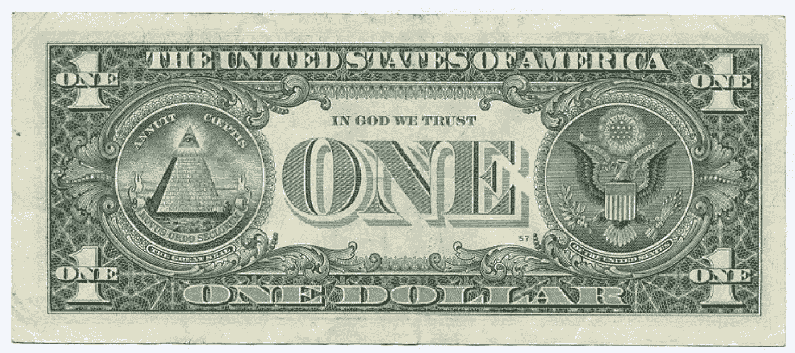
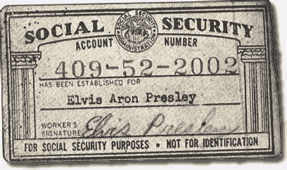
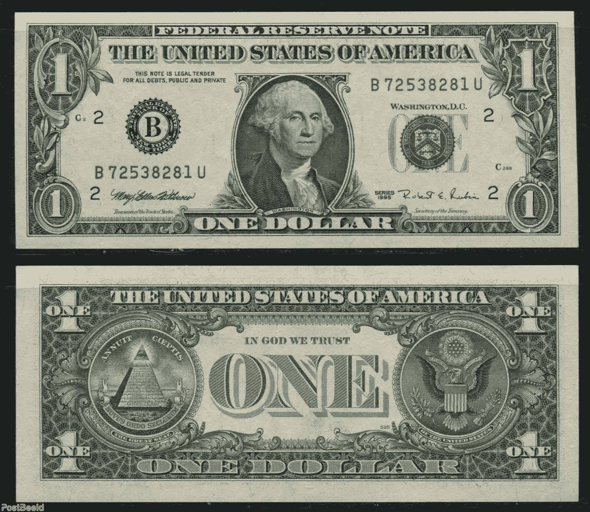
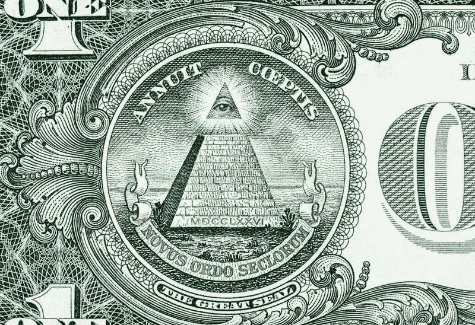
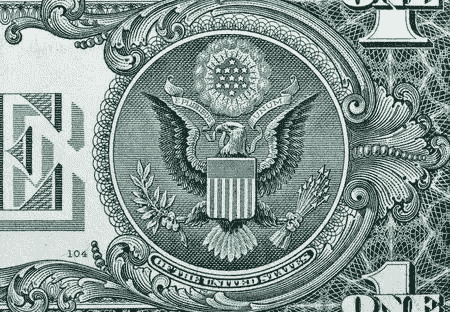

# 美元的秘密

> 原文：<https://medium.datadriveninvestor.com/the-secret-of-the-dollar-a7c019d0b762?source=collection_archive---------1----------------------->

在这篇文章中，我将向你展示美钞上的符号的真正含义，以及它们为什么以及如何被创造出来。通过我对不同货币的兴趣，我遇到了乔丹·麦克斯韦，我代表了他的一些观点。

美钞本身只是一张纸，几乎没有内在价值。然而，美元是特殊的，有价值的，因为美钞是基于我们的身体。一具美国公民的新鲜血肉之躯支撑着这笔钱的权威。

如果你在美钞前面看，你会发现类似美国安全卡背面的序列号。底部的数字通常是红色的。他们在纽约证券交易所代表你的血统。例如，在这张图片中，你可以看到红色数字的猫王安全卡。

如果你将这些数字与美元钞票和安全卡的数字进行比较，它们是相同的。

正如数字显示的那样，每种美元形式的钞票真的有很多 5 美元、10 美元。

此外，我们的签名通常可以是蓝色、红色或黑色。过去，人们说政府把你打得遍体鳞伤，因为黑色和蓝色是银行业使用的颜色。在这个区域，你必须用蓝色或黑色的笔签名。在这个区域，你必须用蓝色或黑色的笔签名。也可以用代表自己血统的红笔签名。

你的身体对一家叫做美国的公司来说非常重要。他们希望你系好安全带，有保险。
保险是因为他们不想在医院付钱给你。国家希望你在外面为他们赚钱。国家或公司不想投资钱来救你进医院。

保险是金钱世界背后最重要的组成部分，因为它与第 14 修正案以及我们如何从一个主权者、男人、女人和孩子变成美国公民有关。它只是告诉你如何成为美国公民。

在 19 世纪 70 年代，该公司诞生于这个国家的政治家的头脑中。他们意识到美利坚合众国不再可行，因为各州有很多东西，但联合不是其中之一。

所以从那时起，你不再是美国公民，而是一个大公司的一小部分。最后，你的身体成为这种合作的保障，因此它需要钱。

所谓国家，就是需要钱的大协会。所以他们才希望我路上安全，开慢点，这样我就可以不浪费时间给他们赚钱了。他们需要你为他们赚钱。

1870 年，美国变成了一个公司。美国是世界上最大的公司。

从 1870 年到第一次和第二次世界大战，美国公司破产。它资助了所有的战争和革命，付钱让其他国家成为他们的朋友等等。

美国人从英国银行借钱来维持公司的生存。有一点是清楚的。如果你必须为 1 亿美国公民提供晚餐，你不会想破产的。

美国人从欧洲和伦敦的银行借了钱，这笔大债还在美国人身上。

当然，欧洲银行问了自己一个问题。如果我们给你钱，你如何偿还我们欠你的钱？

欧洲和英国的银行家有一个绝妙的主意。你想要多少钱，我们就给你多少钱。我们给你一张空白支票，你可以用它做任何你想做的事。作为回报，我们希望美国人民作为抵押品，然后我们会借给你你需要的钱。也就是说你需要多少钱我们都会给你，但是我们想要你的女儿。同意吗？

因此，今天，美国公民是为维持公司生存而借款的抵押品，这可以追溯到 19 世纪 70 年代直到第一次世界大战。美国公司代表着欧洲和英国的银行家。现在我们谈论很多关于国债的话题。公民必须偿还这笔国债。谁来偿还这笔债务？我们欠谁的债？美国是世界上最强大的国家。政客们说我们花了很多钱来建造桥梁和所有那些东西。我们把钱留在乡下。为此，你必须为政府买单。然而，在美国，你不把钱付给政府，而是付给欧洲和英国的银行家。

梵蒂冈是欧洲银行家、战争和暴力幕后所有这些黑暗交易的最终结论。欧洲所有的银行业务都在梵蒂冈进行。在梵蒂冈教会法中。

这是一个关于世界历史的大故事。美国第 33 任总统杜鲁门发表了一个有趣的声明。有人问他:历史上有什么事情是我们没有被告知的？故事中唯一隐藏的是生活中的事实，我们不知道这个国家是如何真正建立的，钱真正来自哪里，是谁的。故事中唯一隐藏的是生活中的事实，我们不知道这个国家是如何真正建立的，钱真正来自哪里，是谁的。这些你想明白的事，没人明白。

没有人知道这个系统是如何工作的。它基于你的血液，基于你的身体。

> 美国是一场演出——世界上最好的剧院

但现在我们真的要更详细地了解美钞了。纸币的左边有一个金字塔。

# 金字塔符号

美元上的金字塔有 13 级台阶。72 块石头和不接触金字塔顶部的全视眼。

上面写着一个 arc 年金 Coe ptis——意思是“我们的项目”。Mhmm 什么项目？下面写着 Novus ordo seclorum——意思是“新的世界秩序”。

综上，可以说以下几点。美元说。我们的第二个项目不会失败。我们正在建立一个新的第二世界。

金字塔是根据埃及政府选择的。为什么？对于当时的负责人来说，埃及人是金融正义的典范，也是全世界理解他们的方式。

有趣的事实，很多人不知道。金字塔由 Pyra 和中心两个词组成。这意味着中间的火。

金字塔周围的圆圈描述了生命的循环。全视之眼描述了埃及太阳神。

# 鹰的符号

右边的鹰描述了埃及的太阳。鹰的一只翅膀上有 32 根羽毛，另一只翅膀上有 33 根。

这 13 颗星星描述了大卫六芒星。此外，还有 13 个箭头，浆果和树叶，以及 13 条胸前的条纹，代表最初的美国航班。

鹰 9 的尾巴很重要。它描述了共济会的一个秘密，来自梵蒂冈。这些是前圣殿骑士。正好有 9 个，它们对圣地非常重要。今天的圣殿骑士是像罗斯柴尔德、洛克菲勒等家族。圣殿骑士团是由 9 个人建立的。九圣殿骑士的实际任务是将宗教人士带到中西部。完全一派胡言，因为当时 9 个骑士就能保护大批朝圣者。现在是真实的故事。是 9 名天主教共济会成员建立了梵蒂冈。他们的目标是建立一个货币中心。那时，他们想要一个新政府来重建欧洲的新秩序。这就是鹰有 9 根尾羽的真正原因。鹰身上的羽毛非常重要，因为它们决定了鹰的去向。

之所以重要，是因为你要不断查阅圣殿骑士的历史。有一些关于所罗门神庙的故事——今天它是哭墙。都在法律上被称为圣殿骑士。如果你查阅百科全书，你会发现它是由九个人创立的。他们在教皇的统治下保护圣地。最初关于九骑士的故事是九个天主教共济会的宗教共济会成员为了梵蒂冈而联合在一起。一个全新的货币、银行和政府的上层建筑。整个行动都在梵蒂冈的控制之下。在这个重建欧洲新秩序的项目中有九个人。这就是鹰有九根尾羽的原因。秘密社团的大多数成员都知道这一点。

我在每月一期的 [**简讯中分享了更多私密的想法，你可以在这里**](https://mailchi.mp/bf8f8e8ed697/keep-in-touch-with-lukas) 查看。请在评论中告诉我，并在各种社交媒体平台上加入我:

[**推特**](https://twitter.com/WiesfleckerL)●[**insta gram**](https://www.instagram.com/lukaswiesflecker/)●[**脸书**](https://www.facebook.com/lukaswiesfleckerr)●[**Snapchat**](https://www.snapchat.com/add/luggooo)**●[**LinkedIn**](https://www.linkedin.com/in/lukas-wiesflecker-1b11251a5/)**

**无论你做什么，都要带着爱和激情去做！**