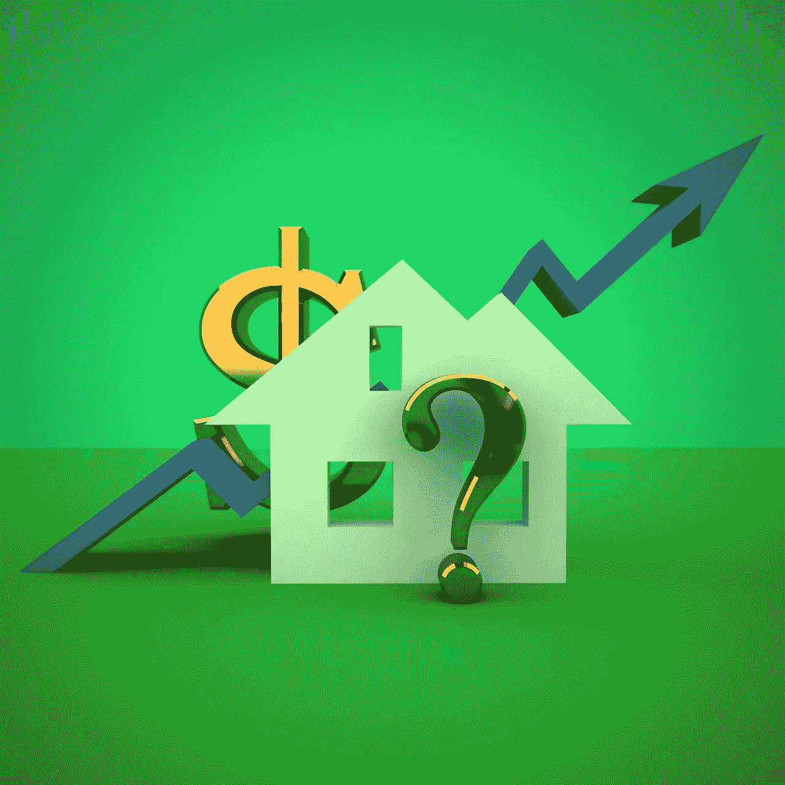
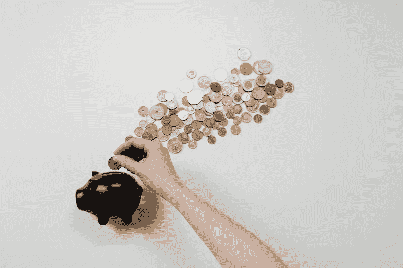

# 积累财富的秘密

> 原文：<https://medium.datadriveninvestor.com/the-secret-to-building-wealth-cab646114422?source=collection_archive---------3----------------------->

## 当我通过寻求价值购买投资性房地产时，我如何产生权益。

Photo by [Svilen Milev](https://www.freeimages.com/photographer/svilen001-32617) from [FreeImages](https://freeimages.com/)

# 投资与投机

人生的一个重要教训是投资和投机是有区别的。 ***大多数人“投资”赔钱，是因为他们实际上是在投机，所以知道其中的区别很关键。***

当你投机时，你希望你买的东西的价格会上涨，因为你相信别人会为你买的东西付更多的钱。你依赖于“更大的傻瓜理论”，即即使你为一项投资多付了钱，一个更大的傻瓜会付更多的钱。 ***媒体喜欢人们通过投机比特币或特斯拉致富的故事，因为这就像赌博***——你下注，希望你赢。

投资则相反。它是仔细分析潜在资产的基本面(无论是房地产还是股票市场)，并确保你只购买你了解的、有高回报率的好交易。

正如沃伦·巴菲特的商业伙伴查理·芒格所说:

> 所有明智的投资都是价值投资——获得比你付出的更多。

看起来很简单，对吧？

在我们的个人生活中，我们直觉地知道这一点——我们货比三家购买衣服或其他打折商品，但当谈到投资时，大多数人会把钱投入到他们在电视上或从朋友那里听到的热门股票提示中，而不会做太多研究来了解这项业务是如何运作和赚钱的。我们花在买车上的时间往往比花在好的投资上的时间还要多。

# 在实践中

那么这在现实世界中是如何工作的呢？我先说一个我个人的故事，关于我最近以低于评估价值 40，000 美元购买的出租房。

像往常一样，我开始在电脑上研究一个我已经知道自己想投资的领域(在这个案例中，我的家乡德克萨斯州奥斯汀郊外的 Pflugerville)——我不会投资我不知道的领域，因为我犯错误和赔钱的可能性更大。如果你不喜欢你的投资领域，那么在投资之前，你必须花一些时间和精力去了解一个新的地方。

Photo by [Pixabay](https://www.pexels.com/@pixabay?utm_content=attributionCopyText&utm_medium=referral&utm_source=pexels) from [Pexels](https://www.pexels.com/photo/white-grey-and-red-wooden-house-164522/?utm_content=attributionCopyText&utm_medium=referral&utm_source=pexels)

我浏览了 Zillow、Redfin、Trulia 和其他网站，了解了过去几年的市场情况，建立了一个可比销售清单，并分析了每平方英尺的价格范围。这有助于我理解其他人在过去两年里为类似的房子支付了多少钱。查看历史数据很重要，因为尽管房价的波动性不如股市，但基于其他人对房价将继续上涨的猜测，房价仍可能上涨。你也可以使用 Zillow 和其他人对房屋价值的估计，但这些可能有很大的范围，应该始终以你的研究为基础。

我花了几个月的时间观察了大约 300 栋房子，进行这种分析，以寻找那些似乎以明显低于其可能估价的价格出售的房产。我使用的一些技巧:

*   寻找那些被忽视的、在市场上待得太久的房子；人们认为他们有问题，但事实并非如此(当然，你必须证实这一点)
*   寻找空置的房子，因为这意味着卖家住在其他地方，更有可能有动力降低价格，以减轻他们为两个地方支付的痛苦

一旦我在一个好地区(好学校、低犯罪率、低失业率等)找到了一份 20 套左右的好房子的清单，我认为这些房子卖得很便宜，是时候看看它们出租会怎么样了。使用来自[房地产工具](https://realestatetools.com)的房产评估应用程序，我输入我对购买价格、评估价值、贷款条款、费用、租金等的保守假设，以确保我每个月都会收到正现金流。

> **请注意，在许多市场中，很难从单户租赁中获得正现金流，因为房价的上涨速度快于租金，因此进行这一分析至关重要，以避免最终成为一只每月都要喂养的鳄鱼。**

只有在我从可比销售额(估计为 250，000 美元，而当时的销售价格为 235，000 美元)和现金流(保守估计至少为 100 美元/月)的分析中确认这是一笔不错的交易后，我才考虑将其用于投资。但是，我并没有马上出价。我把它(和其他几栋房子一起)标为“最受欢迎的”，以便在搬家前观察另一次像样的价格下跌。价格大幅下跌，尤其是在市场上已经有一段时间的空屋，表明有动机的卖家可能正在寻求达成交易。

不出所料，卖家很快将价格降到了 23 万美元，然后我出价。我的报价是新价格的额外折扣，以确保我能谈成更好的交易。我知道，如果卖家有积极性，他们会考虑我的提议并与我合作。如果他们没有动力，那么我可以去其他潜在的房产。永远不要感情用事地投资——只买好的交易，你会做得很好。

最终，我以 210，000 美元的价格买下了这栋房子，后来它的估价为 252，000 美元，因此，在这栋房子关闭的当天，我在它的净值增加了 42，000 美元。我首付了 53，000 美元，因此我的首付的 80%从购买中获得了股权收益，几乎让我的钱瞬间翻了一倍。

这并不是偶然的，而是通过一个深思熟虑的系统，我使用这个系统是为了以很大的折扣购买出租房。我这样做不是为了试图翻转它们并出售它们以获得短期利润，而是为了长期收益而继续增加我不断增长的投资组合。自从我三年前买下这栋房子以来，它一直被出租，并产生了正的现金流，我只是对它进行了再融资，以减少我的付款，并产生更多的现金流。新的评估呢？275，000 美元，这是我投资现金的 120%以上的回报，还不包括我每个月收到的现金流或租户通过租金支付的债务本金。

Photo by [Pixabay](https://www.pexels.com/@pixabay?utm_content=attributionCopyText&utm_medium=referral&utm_source=pexels) from [Pexels](https://www.pexels.com/photo/white-grey-and-red-wooden-house-164522/?utm_content=attributionCopyText&utm_medium=referral&utm_source=pexels)

# 这就是你积累财富的方式

就这一笔交易，我现在在一个很棒的社区拥有了一块很棒的房地产， ***继续产生现金流，并以高回报率增值。请注意，即使房地产市场停止攀升并下跌，通过高价投资，我在亏钱之前会有很多空间(只是纸上谈兵，除非我卖掉)。这就是价值投资，而且奏效了。我买的前几套出租房产是以全市价购买的——还算不错，但一旦我找到了一个以很大折扣购买房产的系统，我的财富就开始飙升。***

我现在在德克萨斯州的大部分地区拥有 7 套出租房，除了前几套都是以很大的折扣购买的， ***与评估值相比，我支付的价格*** ***创造了超过 11 万美元的净值。*** 拥有这个投资组合让我可以获得每月现金流，以高回报率(12%到 20%之间，视具体情况而定)积累财富。****

虽然我不会在这篇文章中详细介绍，但真正的股市投资遵循非常相似的过程。你必须找出你所了解的公司，这些公司的售价比它们的价值有很大的折扣。如果你能做到这一点，你也能在股票市场上创造财富。我将在以后的文章中更详细地探讨这是如何工作的。

## [看看我的电子书《积累财富的内幕指南》](https://buildingarks.gumroad.com/l/mmrro)

image by author

# 建造方舟

在职业生涯早期，我遵循传统的理财建议，努力积累财富，之后我开始学习投资。十多年后，我在经济上有了保障，并通过房地产和股票市场朝着完全财务独立的方向努力。我已经成功地建造了我的金融方舟，帮助我度过任何可能到来的风暴。

我创建了[建筑方舟](https://buildingarks.medium.com/about-building-arks-fa2edcf2f584)来帮助像你这样忙碌的专业人士忽略主流建议，建立真正的财富。

Image by [jeffjacobs1990](https://pixabay.com/users/jeffjacobs1990-7438739/) on pixabay

如果你想在我每次发布新故事时收到邮件通知，你可以在这里加入我的邮件列表[。](https://buildingarks.medium.com/subscribe)

***想开始在介质上写作赚取额外收入？我第一年挣了 6000 多美元。加入这里成为会员，每月只需 5 美元。我将免费为你赚取一部分订阅费，你可以无限制地阅读像我这样的作者的数千篇文章，还可以开始自己的写作事业。***

*本文仅供参考。不应将其视为财务或法律建议。并非所有信息都是准确的。在做任何重大财务决定之前，先咨询财务专家。*