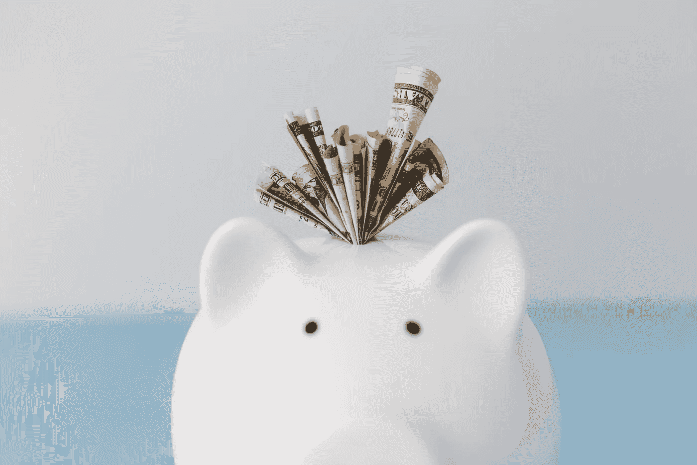
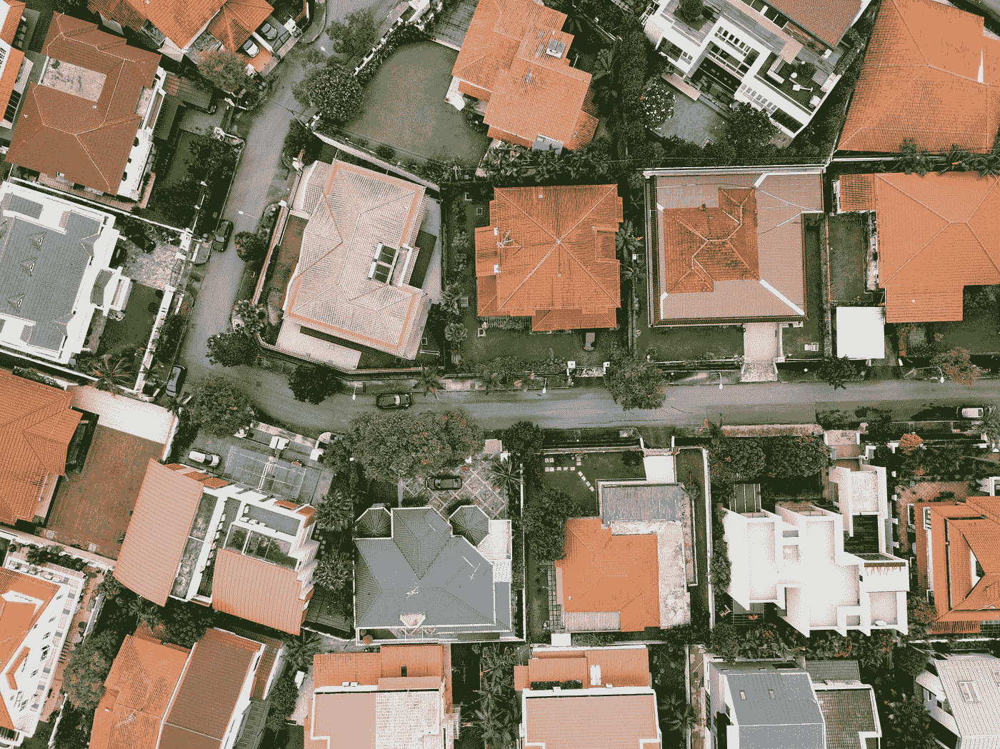

# 确保你未来财务的秘密

> 原文：<https://medium.datadriveninvestor.com/the-secret-to-securing-your-financial-future-ae36b5329708?source=collection_archive---------15----------------------->

## 主流建议的另一个错误是。

Photo by [Matthew Henry](https://burst.shopify.com/@matthew_henry?utm_campaign=photo_credit&utm_content=Free+Piggy+Bank+With+Money+Photo+%E2%80%94+High+Res+Pictures&utm_medium=referral&utm_source=credit) from [Burst](https://burst.shopify.com/piggy-bank?utm_campaign=photo_credit&utm_content=Free+Piggy+Bank+With+Money+Photo+%E2%80%94+High+Res+Pictures&utm_medium=referral&utm_source=credit)

主流金融建议会让你相信投资于指数基金的 401k 是为退休做准备的最佳方式。然后，一旦你到了 65 岁，你可以缩小你的房子，开始每年提取 4%的余额，希望市场不会崩溃，你的钱能比你用得更久。

我不知道你怎么想，但对我来说，这听起来不像是一个安全的财务前景。

> 我不想缩减我的生活，也不想生活在压力下，担心在我离开之前，我的资金可能会用完。

传统的财务建议鼓励你投资资本收益，这要求你在一段时间内卖掉你的投资。这就是导致你不得不寄希望于你的资金比你更长久的不稳定的原因。

## 更好的方法

指数投资和 401k 计划在每个人的财富积累努力中都有一席之地，但如果你每个月都有现金流来支付账单，让你过上相对舒适的生活，而不必出售资产，这不是更好吗？你的资产可以随着时间的推移继续增长，而你不必卖掉它们来吃饭。

这是投资资本收益和投资现金流的主要区别。

> 如果不卖掉你的投资，削弱它们的增长能力，你就无法获得资本收益。

我第一次从 Robert Kiyosaki 那里了解到这个概念，他说:

> 中产阶级投资是为了资本收益。富人投资是为了现金流。

我花了一些时间来理解这个概念以及它在投资中的作用。

我首先关注的是独栋出租屋(SFH ),这种房子有利于通过杠杆增值来积累净值，但不会产生太多现金流。虽然我目前拥有七间出租屋，但每月产生的现金流总计在 1500 美元左右(收入减去所有支出，包括债务还本付息)。我很感激我拥有的现金流，但它肯定不足以让我辞掉日常工作。

通过拥有这些房子，我的净资产以每年 20%的速度飙升，但正如我之前指出的，你不能在不出售资产的情况下吃掉净资产。

Photo by [CHUTTERSNAP](https://unsplash.com/@chuttersnap?utm_source=medium&utm_medium=referral) on [Unsplash](https://unsplash.com?utm_source=medium&utm_medium=referral)

## 怎么办？

那么如何利用自己的净资产产生现金流呢？

有几种方法可以做到这一点，例如:

*   **卖掉一栋房子，靠现金生活，直到现金耗尽**，然后卖掉另一栋房子(类似于传统的财务建议)
*   **用所有房子的现金流提前还清一套房子的债务**，然后用增加的现金流还清下一套房子的债务；重复这个过程，直到所有债务都还清，现金流显著增加(T2 债务滚雪球法的一个变种)
*   **出售部分房屋以偿还其他房屋**，增加无负债房屋的现金流，但减少拥有的房屋总数
*   出售一些房子，并将所得投资于回报更多现金流的投资，比如商业地产

我最初的计划是在很长一段时间内付清所有房子的债务，为我退休后留下可观的现金流。尽管这一计划可行，但它需要很长时间，而且随着债务的偿还，它会牺牲与杠杆相关的良好回报。

随着我对现金流的新关注，我的计划发生了变化。我现在计划慢慢卖掉我的独栋住宅，转而购买商业地产，实质上是以旧换新。

## 为什么选择 CRE？

商业地产比独栋房子更复杂，更难买，但现金流要大得多。 ***同样的投资，一个商业地产可以轻松回报单户住宅 3 到 4 倍甚至更多的现金流。*** 这个现金流是还本付息后的，所以你没有失去用别人钱的好处。

想象一下，投资 100，000 美元购买一处房产，在找到并购买该建筑后，几乎不费吹灰之力就能每月收到 550 美元。这会改变你的生活吗？与标准普尔 500 指数 1.6%的当前收益率相比，这是 6.5%的收益率(称为现金回报或 COC)。标准普尔 500 指数中同样的 10 万美元将每月支付 135 美元的股息(按季度支付)。

大多数商业地产需要复杂的物业管理。你不能指望买下一栋公寓楼，然后让房客自由出入。你需要一个经理(或者你自己管理，如果你有很多时间的话)来督促租户支付租金，安排维修，以及其他成功的关键任务。

然而，有一种商业地产是真正被动拥有的。 叫做[三网(NNN)租赁](https://www.investopedia.com/terms/t/triple-net-lease-nnn.asp)，承租人负责纳税、保险、维修。这可能包括屋顶，管道和暖通空调，所以你只要坐下来，让租客照顾一切，每月给你一张支票。

听起来好得难以置信？嗯，考虑到这种租赁是为房地产投资信托基金开发的，所以他们不需要管理团队。你在美国看到的大多数独立建筑是 NNN，包括快餐店、零售银行、加油站、换油店等。 ***租户可以是星巴克、Sonic、Valero、大通银行等全国性品牌。***

Photo by [Diego Carneiro](https://unsplash.com/@diegocarneiro?utm_source=medium&utm_medium=referral) on [Unsplash](https://unsplash.com?utm_source=medium&utm_medium=referral)

你可以在 [LoopNet](https://www.loopnet.com) 上开始搜索，这就像商业地产的 Zillow。他们什么都有，但你可以用过滤器找到 NNN 的财产，看看我在说什么。

## 风险

投资商业地产不是有风险吗？如果你不知道自己在做什么，那才是。所以第一步是接受教育，向专家学习。我可以推荐以下几本书来帮助你开始学习:

*   孔蒂和哈里斯的《傻瓜的商业房地产投资》——不像听起来那么傻，这将很好地概述这个游戏
*   Ken McElroy 的《房地产投资入门》——主要是关于多户住宅的，但它也提供了很多在商业化时可以考虑的好建议
*   **如何在商业房地产投资中取胜**Coppola——更多关于如何在 CRE 中取得成功的信息
*   Brian Hennessey 的《商业房地产尽职调查手册》—必读；努力确保你的投资会成功，这是业余投资者和专业投资者的区别；这本书将为你提供实现这一目标的工具

我不知道有什么专门针对个人投资者的 NNN 房地产书籍。也许等我有了更多的经验后，我会在某个时候写一篇。在此之前，你可以对大多数商业房地产投资资产类别使用相同的原则。只要意识到 NNN 是一种更简单的投资形式——回报可能并不突出(年总回报的+/- 12%)，但现金流是巨大的，因为不需要任何管理工作。

大多数 NNN 建筑只有一个租户。虽然他们通常有 10 到 20 年的长期租约，但失去一个租户可能会很昂贵，因为需要很长时间才能找到一个新的租户，而且他们可能希望由你出资进行一些改造。

***所以一定要确保租约和租客是稳固的！*** 你在完成购买前的尽职调查过程中这样做。

> 不要忘记做你的尽职调查，以确保你知道你买的是什么！

## 把所有的放在一起

我们大多数人不会有几十万美元来投资这种类型的房地产。这就是为什么我仍然相信投资独栋出租房屋以实现资产增值是一个良好的开端。 这将允许你积累一些股本，然后你可以在未来将其转化为商业建筑的首期付款。

这远不是一个“快速致富”的计划。但是正如[格兰特·卡尔多内](https://grantcardone.com)所说:

> 我不想快速致富。我当然想发财。

投资 SFH 来建立股权，然后卖掉它们来购买商业地产，这肯定是你致富的途径。

Photo by [Jimmy Dean](https://unsplash.com/@jimmydean?utm_source=medium&utm_medium=referral) on [Unsplash](https://unsplash.com?utm_source=medium&utm_medium=referral)

因此，与其有一个在 401k 中积累 100 万美元指数基金的目标，每月只能产生 1350 美元的季度收入， ***为什么不努力将 100 万美元投资于商业房地产，而不是每月产生超过 5400 美元的收入。***

你有可能依靠现金流生活，保留你的资产，并让它们在你退休后增值。当你结束你的黄金岁月时，你会比开始时更富有，而且在你离开后，会有东西留给你的子孙。

> 不管你怎么做，在你的投资中关注现金流而不是资本收益。对你退休生活的影响将是巨大的。

祝你好运，让我知道进展如何！

通过阅读我以前的一些文章，了解更多关于投资房地产的知识:

为什么你的投资组合中需要房地产:

 [## 关于投资的一个惊人事实

### 主流建议忽略了多样化的哪些方面。

medium.com](https://medium.com/datadriveninvestor/a-startling-fact-about-investing-e10a5f4d004a) 

为什么你需要像做生意一样经营你的房地产:

 [## 积累财富的危险真相

### 我是如何学会像做生意一样经营我的房地产的。

medium.com](https://medium.com/the-innovation/the-dangerous-truth-about-building-wealth-a5c019814828) 

我用来购买独栋出租房的资源可以帮助你开始:

 [## 你可以投资房地产，方法如下

### 我用来投资独栋出租的资源。

medium.com](https://medium.com/datadriveninvestor/you-can-invest-in-real-estate-heres-how-fecbd1c2318b) 

我与列出的任何网站都没有关系，也没有从任何合作伙伴或我的文章推荐中赚钱。我不是律师，会计师，或注册理财规划师。所有材料都是基于我的知识和经验，出于提供信息的目的而真诚呈现的。它无意取代专业建议。在做出任何法律、税务或财务决定之前，你都应该向专家咨询。

**访问专家视图—** [**订阅 DDI 英特尔**](https://datadriveninvestor.com/ddi-intel)