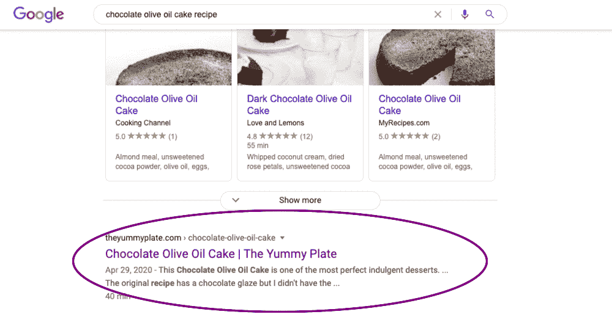
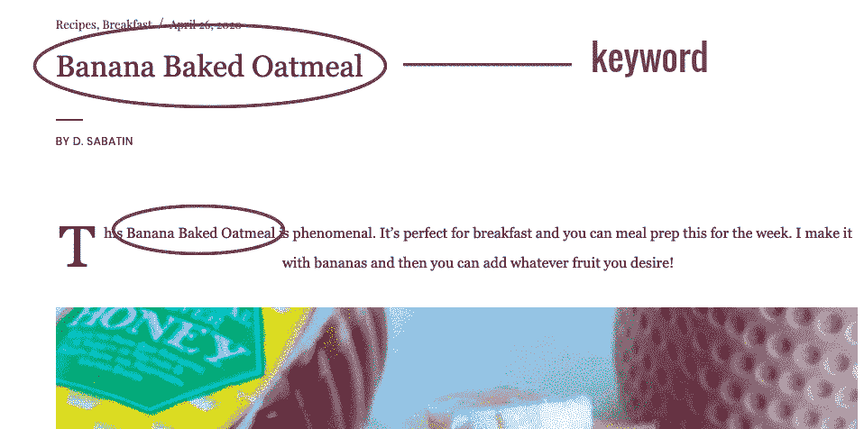
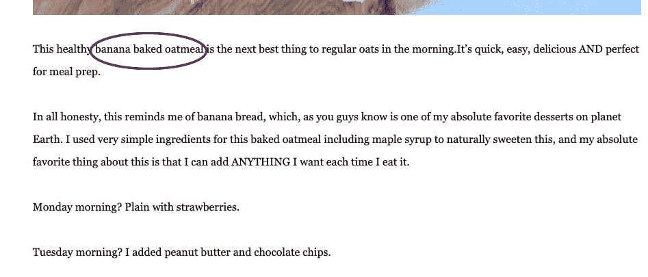

# 你的内容成功的秘密

> 原文：<https://medium.datadriveninvestor.com/the-secret-to-your-content-being-successful-5c3714208076?source=collection_archive---------16----------------------->

## 如何超越其他网站，并建立更大的观众群

Photo by [Stephen Phillips - Hostreviews.co.uk](https://unsplash.com/@hostreviews?utm_source=medium&utm_medium=referral) on [Unsplash](https://unsplash.com?utm_source=medium&utm_medium=referral)

你有没有开了一个流量很少甚至没有流量的博客，你盯着天花板，想知道到底哪里出了问题？

你所有的博文都是一流的。

你已经支付了额外的费用，甚至让一个工程师设计了你博客的布局…然而你查看了你的 Google AdSense 账户…你的浏览仍然停滞不前。

你错过了一些东西。

那东西就是 SEO。

SEO 代表搜索引擎优化。它是你对每篇博客文章所做的事情，以使它受到谷歌的青睐。这将增加你的网站流量，也将你的品牌展示给其他搜索引擎。

目前，值得关注的几个顶级搜索引擎是:

*   谷歌
*   油管（国外视频网站）
*   亚马孙
*   美国 Yahoo 公司(提供互联网的信息检索服务)
*   堆

为了让你的博客文章出现在那些搜索引擎的顶部，你首先需要很好地掌握 SEO，这样你就可以获得高流量，这样你的博客就可以从 0 浏览量上升到数千浏览量。

 [## 影响者在聚光灯下表演|数据驱动的投资者

### 影响者营销是一个脱颖而出的游戏。结果是一个令人难忘的-和可信的-连接到一个产品或…

www.datadriveninvestor.com](https://www.datadriveninvestor.com/2020/01/15/influencers-perform-in-the-spotlight/) 

让我们不要浪费任何时间；让我们直接开始吧。

# 搜索引擎是如何工作的？

搜索引擎的工作原理是拥有创新和复杂的算法，根据页面的质量和相关性做出决策。

这是一个相当复杂的过程，涉及到浏览所有的数据，并找出哪些数据可以以一种消费者易于消化的方式呈现。

搜索引擎有三个主要功能。

1.  **抓取:**搜索互联网内容，查看代码/内容中找到的每个 URL。本质上，这就是发现过程。搜索引擎将派出一组机器人寻找新的和更新的内容。
2.  **索引:**对抓取过程中发现的内容进行存储和组织。一旦一个页面进入索引，它就会显示为相关查询的结果。
3.  **排名:**提供最能回答搜索问题的内容片段，这意味着最相关到最不相关的结果被排序。当有人进行搜索时，搜索引擎搜索他们的索引，寻找高度相关的内容，然后对这些内容进行排序，希望能够解决搜索者的查询。

我将举例说明这是如何工作的，我拥有一个名为[theyummyplate.com](https://theyummyplate.com/)的美食博客，当人们搜索食谱时，我在后台工作，以确保我的食谱出现在提要的第一位。

如果 Karen 正在寻找一个巧克力橄榄油蛋糕的配方，我的工作就是确保我使用了合适的关键字来提高排名，这样她就可以在她的 feed 上首先看到我的配方。

Screenshot

# 关键词——了解你的受众

利用战略关键词是你如何能够锁定你的受众。

您需要做一些研究，以更好地了解您的目标市场如何搜索内容，但您需要问的主要问题是:

人们在寻找什么？

对于你来说，通过 SEO 建立和发展你的业务，你需要后退一步，弄清楚谁是你的客户。人们常常绕过这一关键步骤，因为这个过程需要时间和研究。

你假设仅仅因为你知道你销售/展示的产品是 X，人们就会自动搜索 X。

专注于你的受众在寻找什么，并利用适当的关键词，这将让你创造出比使用随机词更成功的营销活动。

我再以我的美食博客为例。当我刚开始做的时候，我用通用术语来描述我所有的食谱。浏览我的博客，你仍然会发现相当普通的标题；然而，如果你足够注意，你将能够识别整个博客文章中的关键词。

Screenshot

Screenshot

你可能有一种特殊的方式来描述你所提供的东西，但是问问你自己，你的受众如何能搜索到你所提供的产品、服务或信息？

为了获得最佳效果，在你的博客文章中使用关键词对你最有利。不要太在意它；有一个术语叫做“关键词填充”，人们经常使用。

谷歌喜欢在你的网站上寻找关键词的提及，但你需要确保你的内容确实为读者提供了价值。将你的关键词自然地融入到你的文章中，就像你在向朋友解释这个概念一样。

您还可以利用[关键词搜索工具](https://keywordtool.io/)来发现哪些关键词的搜索率很高。

# 外部+内部链接

要建立一个良好的观众和排名高于其他网站，你需要建立权威。你可以从权威网站获取链接，建立自己的品牌，并在那里推广。

可信站点链接到其他可信站点，垃圾站点链接到其他垃圾站点。

内部链接可以用来连接你的网站的内部页面。大量指向你网站上某个特定页面的内部链接会给谷歌提供一个信号，表明这个页面是必不可少的，只要它是有机的，而不是垃圾的。

外部链接可以用来给你的页面添加值得信赖的、内容丰富的高质量网站链接，这将有助于提高你的网站的可信度。

只要你的链接与你的内容相关，这不会影响你的网页排名。如果你的链接来自权威网站，实际上会提高你的搜索引擎优化分数。有价值的外部链接也将有助于提高你的网站的权威性，为消费者提供参考。

# 为成功做好准备

当建立博客和创建内容时，建立具体的最终目标是很重要的。

做到这一点的方法是对网站的目标和你的观众的需求有一个强烈的理解。

创建以下目标:

*   **可衡量:**追踪不到，就无法改善。
*   **专注:**不要含糊。具体点。
*   **把它们写下来:**把你的目标写下来并与他人分享会增加你实现目标的机会。

# 最终提示

为了获得最佳效果，请在您的博客中添加一个 SEO 小部件。我使用排名数学，但是有几个小工具可以帮助你把你的内容和博客排到比你当前状态更高的位置。

利用这些步骤，变得更大更好。

**访问专家视图—** [**订阅 DDI 英特尔**](https://datadriveninvestor.com/ddi-intel)