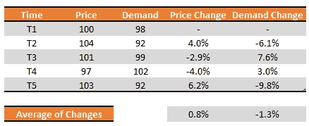

# 需求计划者的秘密武器:价格弹性

> 原文：<https://medium.datadriveninvestor.com/the-secret-weapon-of-demand-planners-price-elasticity-23712eef14b4?source=collection_archive---------10----------------------->

## 如果你提价 1 美元，你的销售额会是多少？

定价被大多数组织视为一种营销工具。然而，当被需求计划者使用时，它就成了打开公司秘密宝藏的钥匙。价格弹性的力量大多被组织低估了。

# 什么是价格弹性？

根据维基百科,(需求的)价格弹性被定义为需求对价格变化的反应。换句话说，我们的目标是，如果我们将客户价格提高或降低 1%,就可以估计预计需求。

想一个例子。你计划买一辆车，你的预算是 10.000 美元。你找到了你最好的车，价格是 10.100 美元，卖家不打任何折扣。你认为不买它吗？

另一个例子可能是，假设你要以 5.5 美元买一瓶洗发水。当你走向货架时，你意识到价格变成了 5.55 美元。你认为不买它吗？

每个市场、公司、国家、企业对这些问题可能有不同类型的答案。从我自己的经验来看，98%的人继续购买前一个问题中的汽车。然而，大约 30%的洗发水消费者更愿意更换其他品牌。因此，我们可以清楚地表明，洗发水行业的价格弹性大于汽车行业。

# 如何计算

当然，我们需要一些数据。如果你的公司从零开始创业，你可能需要一些市场数据，但如果你能先建立自己的市场数据，那就更好了。

 [## 更好的预算，打造更大的|数据驱动型投资者

### 即使是专家也承认它们并不完美。从 1 到 10 的范围内，安东尼·科普曼和德尔…

www.datadriveninvestor.com](https://www.datadriveninvestor.com/2018/11/08/budget-better-to-build-bigger/) 

然后试着将你的数据标准化，这样只有变量成为价格点。找出相同商品、相同促销的例子，最好是在同一个季节。

接下来比较价格点和实际销售额。

假设价格与需求的变化如下:

Results of History

我们可以进行如下计算:

这就解释了，如果我们将价格提高 0.8%，我们可以预期单位需求会下降 1.3%。(或者相当于 1%的价格上涨导致 1.63%的需求下降)

我们可以看到，在我们的模拟中，如果我们降低价格，收入就会增加。情况并不总是这样。但是我们可以说这个 SKU 是有价格弹性的。

这意味着什么？我们应该把价格降到零吗？如果我们把它们减少到零，理论上需求将是无限的。但是我们会损失毛利。

因此，另一个问题变得与企业的利润密切相关。但是不仅仅是公司的利润计划，还有我们的通货膨胀率。如果不考虑通货膨胀，价格弹性的计算将毫无意义。

因此，如果我们在上面的例子中有一个 0.5%的通货膨胀，我们需要把它包括在我们的价格上涨百分比中。这意味着我们应该预计，如果我们将价格提高 1.5%(而不是 1%)，我们可能会预计需求下降 1.63%，或者价格每提高 1%，需求预计下降 1.08%。

但即使在这种情况下，销售总额也一点都不稳定。然而，我们也需要考虑利润部分。因为利润与固定变量无关。

这说明，在特定的 SKU 上，改变价格点不会给我们带来最大的利润。

# 持续改进

这不是结局。每年至少两次重新计算每个 SKU 的价格弹性是非常好的。因为市场状况、通货膨胀、竞争对手和客户行为都在不断变化，我们都需要衡量这些因素，并将其纳入我们的计算中。

# 结论

价格弹性计算是驱动商业动态的关键，尤其是在通货膨胀的经济中。跟踪这一参数的需求计划者肯定会提高他们预测的准确性。这也产生了商业结果的可持续性。