# 向技术统治的长期系统性转变:走向一个新的分析框架

> 原文：<https://medium.datadriveninvestor.com/the-secular-systemic-shift-to-technocracy-towards-a-new-analytical-framework-9025528bebc?source=collection_archive---------3----------------------->

很少有读者会不知道，我们当前的时代被广泛认为是信息时代。以商品的生产、分配和消费为标志的前一个工业革命时代被认为已经被一个日益由信息的创造、收集、储存、整理、加工、分配和消费所主导的世界所取代。1970 年似乎是一个普遍同意的开始日期。

虽然世界动力从工业向信息的转变可能被广泛接受，但这一转变对人类努力的每个领域——经济、金融、社会和政治——的全面影响却远不为人所知。虽然这很容易成为整本书的主题，但我将在这里介绍它的主要特征。

我认为，这个问题触及到了我们在当前金融和经济领域所看到和经历的一切的核心。信息是迅速出现和即将到来的新世界的核心和实质。信息是新的资本。

# 工业革命、资本和资本主义

在工业主义下，通过工业过程产生的附加值创造了剩余价值(超过生产产品所需的原材料、劳动力和能源固有价值的价值)，这些价值作为资本积累起来。积累的剩余价值资本的控制、分配和运用当然被称为资本主义。资本可以被重新应用到生产它的同一个过程，或者它可以被用来加强和改进这样一个过程，或者它可以被引导到另一个过程，甚至一个完全不同的或新的产业。它是一种流动的、可替代的、可转移的和可翻译的物质。这种物质的动态和有机特性使得变革和扩大人类活动的爆发成为可能。随着更多的盈余产生，越来越多的人口可以通过不断增加的生产来养活。越来越多的工业品和消费品的配置产生了买方和卖方市场，以达到一个价格，在这个价格下，商品被交换为以货币单位表示的储值。

然而，这个系统面临的一个问题是，它需要不断地扩展。这不是一个可以保持平衡状态的系统。通过自身的机制，它必须不断成长。当它达到不可能进一步生长的阶段时，就会发生严重的位错。随着资本找到新的途径扩张到新的市场，这些往往会自我纠正，这往往是新技术发展的结果。

随着积累资本的金融市场的发展，资本主义创造了放大和利用资本并对借贷收取费用和利息的机制。这增加了资本的流动性，让资本更快地流向可以产生更大回报的领域，避免了增长停滞的趋势，但也加剧了这种扩张不可避免地会出现的混乱。

随着中央银行和法定货币的出现，金融资本主义越来越寻求通过增加流动性来推迟和防止混乱时期。国家权力和金融资本的最终融合导致了金融主义，这是资本主义的最后阶段。

# 金融主义

2000-2020 年是以资本为基础的旧范式的熄灭阶段，也是以信息为基础的新范式的孕育过渡阶段。在那段时间里，基本的、不可阻挡的力量不断聚集和强化，这种力量绝对要求从资本中进行系统性转移。

金融主义的根本推动力是通货膨胀，我们可以将其解读为扩大资本流动的动力。基本的反对力量是通货紧缩，我们可以把它理解为资本价值加速贬值的趋势。从另一个角度来看，相对于债务——金融主义中资本的基本单位——而言，每一个新的债务单位所产生的价值单位都在逐渐减少。从这个意义上说，通货紧缩与无法从新债务中创造新价值是一回事。

虽然这份清单绝非详尽无遗，但需要系统性转变的一些最重要的核心通缩力量包括:

*   技术
*   商品化
*   减少居民

***技术。*** 人类努力的每一个方面向“技术化”的冲刺都是高度通缩的。越来越少的单位劳动投入(人力或机械化)和越来越少的单位能量投入，才能产生越来越大的单位价值。

***商品化。所有消费品和工业品的商品化普遍加速，这是另一个高度通货紧缩的趋势。只有最新、最先进的技术工艺才能产生足够的附加值，使其成为经济上可行的资本。就连技术创新的核心投入——计算机芯片——也变得完全商品化，其速度几乎与发明的速度一样快。***

***人口减少。*没有不断增长的消费者人口，资本主义就无法成长和延续，一旦非生产者人口超过生产者和消费者，资本主义就会崩溃。**

由于这些因素和其他相关因素的影响，增加值和剩余价值之间的差距变得越来越小，金融体系绝对需要不断增加的流动性，才能支撑哪怕是微不足道的增长。

这些不可阻挡的长期通缩趋势是对已确立的凯恩斯主义、货币主义、债务驱动的金融主义资本主义模式的绝对诅咒。根本没有根本的方法让现有的范式延续下去，系统性的转变是唯一的选择。

# 信息时代

虽然对于经济门外汉来说，理解资本的本质和机制可能是一个挑战，但与理解信息的实质和属性相比，这就相形见绌了。对这一主题获得初步了解的最佳途径之一是詹姆斯·格雷克的“ [**信息:一段历史，一种理论，一场洪水**](https://en.wikipedia.org/wiki/The_Information:_A_History,_a_Theory,_a_Flood) ”。我甚至可以说这是必读书。 [**信息论**](https://en.wikipedia.org/wiki/Information_theory) 的巨大性和对绝对一切事物的绝对适用性，尤其是处于我们当前环境前沿的事物，在序言的这些摘录中得到了很好的总结:

> 人们开始命名铁器时代和蒸汽时代的继承者……我们现在可以看到，信息是我们的世界赖以运转的基础:血液和燃料，这是至关重要的原则。它从上到下渗透到科学中，改变了每一个知识分支。信息论开始是作为从数学到电子工程，再从电子工程到计算的桥梁。说英语的人所说的“计算机科学”欧洲人称为 informatique、informatica 和 Informatik。现在，甚至生物学也变成了一门信息科学，一门信息、指令和代码的学科。基因封装了信息，并启动了读入和写出信息的程序。生活通过网络传播。身体本身就是一个信息处理器。记忆不仅存在于大脑中，也存在于每个细胞中。难怪遗传学和信息论一起蓬勃发展。DNA 是最典型的信息分子，是细胞水平上最先进的信息处理器——一个字母和一个代码，60 亿位组成一个人。进化理论家理查德·道金斯宣称:“每一个生物的核心不是火，不是温暖的呼吸，不是‘生命的火花’”。“它是信息、文字、指令。…如果你想了解生命，不要去想充满活力、跳动的凝胶和渗出物，想想信息技术。”有机体的细胞是一个丰富交织的通信网络中的节点，传输和接收，编码和解码。进化本身体现了有机体和环境之间持续的信息交换……基因也有其文化类似物:模因。在文化进化中，模因是复制者和传播者——一个想法、一种时尚、一封连锁信或一个阴谋论。在糟糕的一天，迷因是一种病毒。经济学正在认识到自己是一门信息科学，因为货币本身正在完成一个从物质到比特的发展过程，存储在计算机内存和磁条中，世界金融在全球神经系统中流动。即使当金钱看起来是物质财富，沉甸甸地放在口袋、船舱和银行金库里，它也始终是信息。硬币和纸币、谢克尔和银币都只是短暂的技术，用来标记谁拥有什么的信息。而原子呢？物质有它自己的造词，而最难的科学，物理学，似乎已经成熟。但是物理学也发现自己被一个新的智力模型擦肩而过…粒子物理学家不需要比特。然后，突然间，他们做到了。物理学家和信息理论家越来越合二为一。比特是一种不同类型的基本粒子:不仅微小，而且抽象——二进制数字、触发器、是或否。它是虚幻的，但随着科学家最终理解信息，他们想知道它是否可能是主要的:比物质本身更基本。他们认为比特是不可约的核心，信息构成了存在的核心。约翰·阿奇博尔德·惠勒是二十世纪和二十一世纪物理学的桥梁，他是爱因斯坦和玻尔最后一位健在的合作者，他用神谕般的单音节词表达了这一宣言:“它来自比特。”信息产生了“每一个它——每一个粒子，每一个力场，甚至时空连续体本身。”…“我们所谓的现实，”惠勒羞怯地写道，“归根结底，产生于提出是非问题。”他补充道:“所有的物理事物都起源于信息论，这是一个参与性的宇宙。”因此，整个宇宙被视为一台计算机——一台宇宙信息处理机器。

现在，有很多东西需要解开，这本书和我读过的任何书一样。但一旦你打开包装，至少吸收了信息论的精髓，你将会更好地理解我们当前世界的一切，以及包括股票、金融和经济在内的所有现象的轨迹。

# 信息是新的资本

一个关键要点是，信息比资本更加重要。**资本**是人类变革努力的积累物质，在大约 300 年的时间里，这是一个质的飞跃，超越了以前主导人类事务的组织原则，这可能最好概括为**权威**。但是，正如你从上面引用的几个段落中所看到的，信息来源于宇宙本身最基础的层次。

相当一段时间以来，科学界普遍认为物质就是能量。但是如果我们对植根于第一原理的理解感兴趣，我们必须进一步探究能量的本质。目前，最先进的科学倾向于断定能量是信息。

人类正处于与现实的核心信息混为一谈的关头。从这里开始，我们做的每件事，我们生产的每件事，我们分发的每件事，我们思考的每件事，我们珍视的每件事，都不可避免地成为信息属性的一个因素。

信息的实质是这个领域的新资本和新货币，所有其他形式都是从它衍生出来的，所有其他财产都是从它获得的。

# 一个新时代的开始

上述内容的含义是，一个完全基于信息的新系统是不可避免的前进方向。

在 [**熊市交易**](http://www.TheBullBear.com) ，自 2011 年新一轮长期牛市开始以来，我们一直在预期市场、经济、政治和社会最终会发生长期的长期范式转变。人们一直期待着一个在性质和意义上与 1929-1949 年期间发生的现象大致相当的现象，标志着一个 70 年的周期，在功能上相当于[施特劳斯和豪所描述的“第四次转折”](https://en.wikipedia.org/wiki/Strauss%E2%80%93Howe_generational_theory)。在 2017-2018 年的时间框架内，我开始预测这一转变将在 2020 年到来。2020 年 1 月和 2 月，我告诉订户，有技术信号表明，持有多头头寸的交易员和投资者需要谨慎。在道琼斯工业平均指数( [DJI](https://seekingalpha.com/symbol/DJI) )低于 2019 年 10 月的低点后，我告诉订户，预期的长期转变即将到来。

上一次转变以 1929 年的崩盘和随后的大萧条为标志，而当前的转变以冠状危机为标志。虽然过去往往可以告知现在，但历史周期往往押韵而不是重复，这也是一个可靠的事实。我们当前的“第四次转向”至少与之前的类似转变一样重要，而且更有可能是更高程度的转变，因为它涉及一种系统性的转变，而不仅仅是同一持续系统中的长期转变。这种系统性转变是从以资本为中心的系统到以信息为中心的系统。

一方面，我们可以说，长期转变已经发生，也就是说，已经达到了一个“临界点”，从这个临界点开始，有一种向前的势头，使得任何回到过去模式的背景都是不可能的。另一方面，我们也可以说，这种转变是一个持续的过程，尚未完全完成和巩固。鉴于技术的加速效应，时间在更短、更压缩的时间间隔内展开，因此可能需要几十年的事情在几个月或几周内就发生了。

虽然 1929-1949 年期间在本质上是过渡性的，在漫长的时间内，在漫长的分娩过程中产生了一个新的世俗秩序，但我们目前新生世界的诞生更加突然，类似于长期怀孕后的剖腹产，婴儿系统从历史的子宫中被暴力撕裂，并因冠状恐慌、经济崩溃和社会不稳定而急剧进入第一次尖叫的呼吸。

# 技术统治

新体系最好被描述为“**”。历史可能会追溯到一个不同的名称来描述这一现象，但在现有的词汇中，技术统治似乎是最合适的。**

**技术官僚是一个起源于 20 世纪 30 年代大萧条时期的术语。这是一场倡导结束资本主义自由市场和技术专家委员会统治的运动。当时，就像今天一样，人们认为资本主义辜负了人民的期望，于是出现了一种与自由市场的有机和无政府机制相对抗的合理资源配置的趋势。**

**有趣的是，如果我们今天看这个运动杂志的封面，这个巨大的机器人对我们来说似乎是威胁和可怕的，一个科幻电影中的庞然大物，但在那个时候，它意味着代表技术打败贪婪的资本家，接管华盛顿特区。技术是人民的英雄。还有一点很有意思，标题提倡普遍基本收入。**

**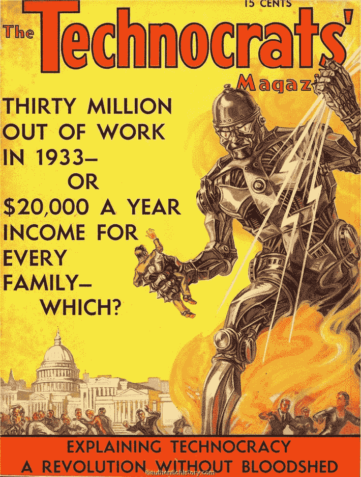**

**20 世纪 30 年代的[技术官僚运动](https://en.wikipedia.org/wiki/Technocracy_movement)的愿景是“一种能源价值理论”。由于所有商品和服务生产的基本衡量标准都是能源，他们推断“货币体系的唯一科学基础也是能源”，通过使用能源指标而不是货币指标(能源证书或“能源核算”)，可以实现更有效的社会设计。如果我们牢记能源是信息，并用后者代替前者，我们就可以在以信息为中心、完全自动化、人工智能管理的社会经济学背景下，获得许多当前观点的惊人近似，如现代货币理论和普遍基本收入。技术官僚的想法并不新鲜，但当时实现这些想法的技术手段实际上并不存在。今天它们确实存在。**

**在当前向以信息为中心的系统转变的背景下，中央银行正在引导从旧范式向新范式的转变，方法是以零利率为私营行业和政府提供大量流动性，以资助向全自动、机器人化、人工智能管理的经济的转变，其人口支持 UBI。新技术将在未来 10 年内迅速发展和部署，其程度将使世界几乎变得面目全非。一系列相互强化的技术正在呈抛物线增长。人工智能和量子计算目前正在成为现实，并将开启从新材料到核聚变反应堆的其他技术。我们对信息的控制呈指数级增长，这使得绝对变革性的技术立即进入实现阶段。**

*   **5G 无线**
*   **物联网**
*   **自动化**
*   **自动化**
*   **人工智能助手**
*   **区块链应用**
*   **人工智能**
*   **量子计算机**
*   **新材料(石墨烯等)**
*   **聚变反应堆**
*   **纳米技术**
*   **基因编辑医学**
*   **脑机接口( [BCI](https://seekingalpha.com/symbol/BCI) )**
*   **超人类扩增**
*   **太空采矿**

**对于外行人来说，这似乎有些夸张，但事实并非如此。来自权威科学和企业来源的大量资源证明，以信息为中心的技术革命正在到来。和 IBM 研究部主任 Dario Gil 一起观看这个视频:**

**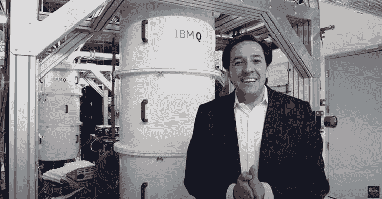**

**[**量子计算的未来与 IBM 的达里奥·吉尔**](https://www.youtube.com/watch?v=zOGNoDO7mcU)**

**这个简短的视频让我们对机器人化、自动化和人工智能管理的惊人速度和惊人范围有了初步的了解。**

**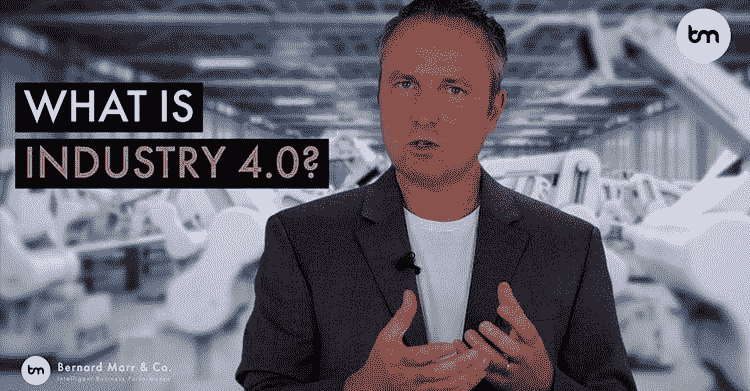**

**[**什么是工业 4.0？**](https://www.youtube.com/watch?v=yKPrJJSv94M)**

**信息的积累、控制、操纵、分配和消费是这个领域的新货币和新资本。越来越明显的是，我们需要将我们的世界、我们的经济和金融体系视为信息流，而不是资金流。如果我们以这种方式改变我们的视角，许多没有意义的事情就会变得清晰起来。**

****全身移位****

**当前长期系统性转变的一些外部表现包括:**

*   **全球宣传引发的恐惧**
*   **全球公共政策恐慌**
*   **公共政策导致经济崩溃**
*   **经济置于中央银行破产管理之下**
*   **事实上的政治内战状态(有可能演变成武装冲突)**
*   **事实上，美国和中国之间存在不对称的第四代战争(有可能在某一天演变成真正的武装冲突)**
*   **发达国家的社会不稳定**
*   **所有消费品和工业产品商品化的加速趋势是必然的**
*   **在线和数字商务、交流、学习和社交的加速趋势是必然的**
*   **劳动力的机器人化和自动化趋势加速的必然性**
*   **社会、政治和经济人工智能管理系统加速实施的确定性**
*   **大多数人口必然过渡到依赖各种形式的普遍基本收入**

**在后古巴导弹危机时代以及整个里根时代，大多数发达国家的公民都生活在一种对全球核毁灭的集体恐惧之中。这是一种合理的恐惧，它产生于这样一个事实，即难以驾驭的对立的超级大国拥有真正能够毁灭我们所有人的武器。然而，这种创伤性的恐怖并没有波及到全球的所有人口，因为“第三世界”的绝大多数人口对全球地缘政治和军事技术知之甚少甚至一无所知。世界上大多数人继续生活在无知之中，仿佛真正的毁灭威胁并不存在。**

**然而，2020 年的冠状恐慌实际上已经蔓延到全世界每个国家的每个公民。武力和宣传强加了不合理的恐惧，导致数十亿人实际上被征服。人类历史上第一次，整个星球被笼罩在一种被封锁的恐怖状态中。**

**媒体、政府、科学界和智囊团的权威人士不断大声宣布，就像他们在 911 之后所做的那样，“一切都不会再一样了”，“再也不会恢复正常了”。重组和改造所有社会经济学的意图是完全明确的。显然，历史分界线已经被跨越。**

**同样明显的是，是时候彻底重新评估对当前金融、经济、政治和社会结构的核心本质的所有先入之见了。我们这些选择在被贴上“市场”标签的结构中保持积极参与者的人，需要经历一个重新定义术语、更新适用词汇、改革分析框架以及更新我们整个观点的过程，以符合对新现实的尽可能接近的理解。**

**金融体系的观察人士和评论人士一直在努力适应通常被称为“脱节”的状况，这种状况似乎变得越来越严重。许多人对一个不符合任何公认的市场、金融和经济学理论的体系感到愤怒、愤慨和辱骂。**

**这里有一段视频，视频中有三位知名且广受关注的市场分析师，他们是美国消费者新闻与商业频道的盖伊·阿达米、丹·内森和斯文·海因里希:**

**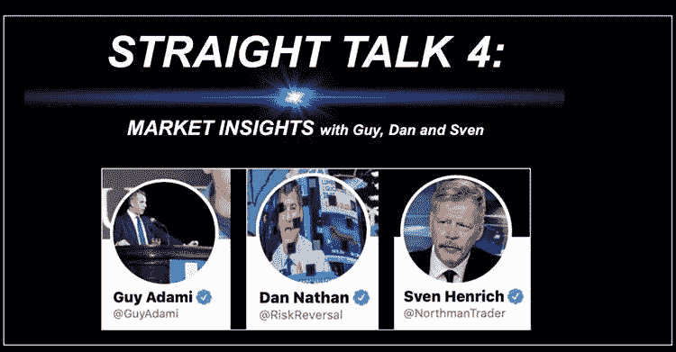**

**[**股市直谈#4**](https://www.youtube.com/watch?v=k9Doqjw-bbM)**

**我喜欢这些家伙。我认为他们真的是好意，他们真诚地试图弄清楚发生了什么，并试图给人们指出正确的方向。但是像大多数当前形势的观察者一样，他们可悲地落后于形势。在这篇文章中，我试图让至少一些读者意识到，适用于资本主义和市场的分析框架不再适用，因为它们根本不再存在。发生了根本性的系统性转变。**

**有一种广泛的“认知失调”状态，其中长期的转变对许多人来说是不可观察的，因为已知和预设的与当前呈现的之间的巨大差距不允许有效的认知。**

**这种认知差距存在于每一次长期转变中。一些人很早就“明白了”(或者是转变的先驱)，而另一些人则抵制它，并主张保留旧的方式。然而，我们确实从马车发展到了汽车，从马到电话，从油灯到电灯泡。每一次变革都在当时遭到了嘲笑。在我们周围，在人类努力的每一个层面上，我们都看到了变革的开始，这使得这些例子看起来像是静止不动的。**

**尽管弥合新旧认知差距的过程是艰难的，甚至是痛苦的，但如果我们要保持金融体系的现状，这是绝对必要的。我在这里提出的实际上是整本书的主题，但我想至少在这份报告中开始概述它的开端。**

**为了有效，我们不能让自己陷入对立政治或阴谋论修辞的陷阱。我们的目标是看清事物，并根据客观观察到的事物采取行动。然而，像“腐败”、“欺骗”和“操纵”这样的对象确实存在，因此它们可以包含在任何分析框架中。关键是要认识到这些因素，因为它们没有情绪反应。事情就是这样，但你不必为此感到不安或生气。那是哲学家、政治家和评论家的工作，而不是分析师的工作。我们的工作是了解现状，以便采取相应的行动。**

**话虽如此，对于任何有良知的人来说，对当前呈现的新现实的许多特征感到不安是完全合理的。财富分配差距越来越大，获得有意义和有报酬的就业越来越困难，政治权力集中在少数人手中，大众思想被技术宣传所操纵，社会政治分歧不断扩大，这些都是我们实际经历中值得合理关注的一些特征。**

****后资本主义，后市场****

**开始建立新范例的特征和特性的一个方法是首先识别它不是什么。**

**首先，让我们面对这样一个事实:当前的危机不是病毒造成的。这是当局对病毒作出反应的结果。封锁和关闭的政策是一个选择。这显然不是唯一的选择，而且已经变得很清楚的是，这种病毒并不是全球医疗和政治当局所宣传的计算机模型所声称的大规模杀手。这种病毒没有从根本上改变金融、经济、政治和社会体系的轨迹。当局的政策决定确实如此。我们已经得到承诺，在秋季和冬季将会有“第二波”冠状动脉危机。随着传统的“流感季节”的临近，我们可以期待在春季加倍做出政策决定。**

**病毒不是系统被破坏和崩溃的原因，而是催化剂。**

**许多人评论说，“自由市场资本主义已经死亡”，因为在政策引发的危机之后，世界各国的中央银行及其政府机构决定采取全面和无限制的干预政策。尽管人们可能会辩称，全面干预是一种短期现象，但我们迄今尚未看到央行或政府权力的扩张被逆转。事实上，政府和央行的干预措施仍在继续扩大。很可能不会缩减，只会延续。**

**当有一个行为者能够并且确实通过在任何时间以任何理由在它选择的任何市场进行任何数量的买卖来进行干预时，我们就不能谈论“自由市场”。这是最近的政策行动坚定不移地确立的原则。**

**毫无疑问，在未来 10-15 年，大量劳动力将被机器人、自动化和人工智能所取代。除了依靠某种形式的普遍基本收入维持生计之外，根本没有任何计划将这些被取代的劳动力转变为其他人。**

**实际上，我们正处于后市场经济时代。资本主义和市场是过去遗留下来的形式主义。**

**过去，国内生产总值(GDP)和失业率等基本经济数据，以及市盈率等市场数据点，或者广度等技术数据，都很重要。他们不再是了，因为我们已经看到了一个根本性的范式转变。我们不再在资本主义和市场体系下运作。“他们没有敲响高层的警钟”，他们也没有宣布美国消费者新闻与商业频道的长期系统性范式转变。他们只是这样做，并迫使你的感知最终赶上现实。**

****分析****

**如果我们想继续在残余的形式主义“资本市场”中玩下去，我们就需要弄清楚新的基本面和新的技术究竟是什么。未来的牛市报告将深入探讨这些领域。**

**现在，让我们注意到图表正在证实向技术统治的转变。科技股 5 月份收盘创下月度收盘新高。**

**纳斯达克综合指数，月线，收盘时:**

**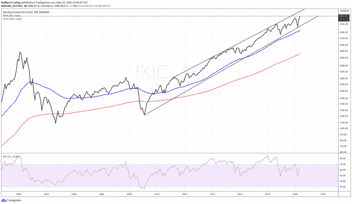**

**从低点开始的反弹是垂直的，比从 2020 年初高点开始的下跌更快。从 2009 年的低点开始，市场仍处于明显的趋势通道中。50 个月均线是从 2011 年低点开始新一轮牛市的位置，甚至没有经过收盘测试。**

**纳斯达克 100 指数是纳斯达克最大的资本化发行，已经远高于 2020 年 1 月的历史月度收盘高点，仍远在 2009 年的趋势通道内，并远高于其 50 个月指数移动平均线(蓝色)的关键牛市支撑。**

**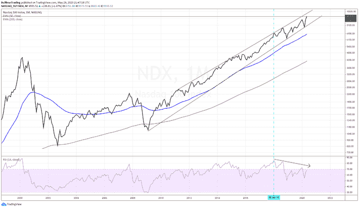**

**很明显，这张图表并没有反映出一个不太可能迅速复苏的萧条经济，一个处于无政府状态的社会，一个正在进行革命的实际尝试，以及一个事实上处于不对称状态的世界，两个最大的强国之间的第四代战争。如果这些客观事实不是等式的一部分，那么 NDX 的价格一定反映了其他东西。它反映了向以信息为基础的社会经济秩序的系统性转变。**

**纳斯达克 100 指数与纳斯达克综合指数的比率在 2020 年突破了 2000 年的高点:**

**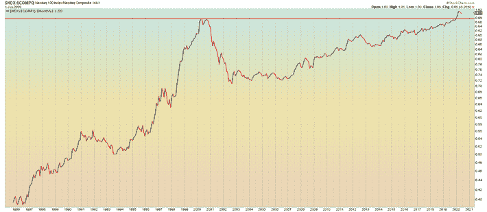**

**半导体指数创下本月收盘新高:**

**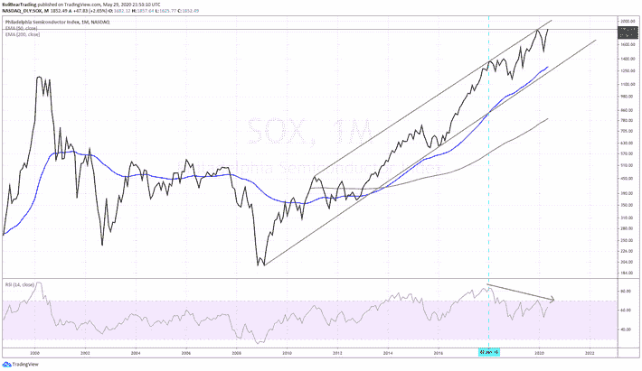**

**生物技术也是如此:**

**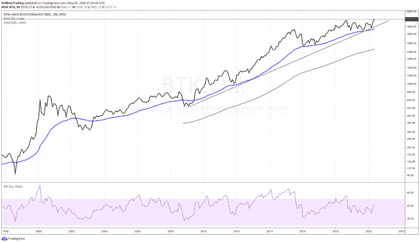**

**互联网、云计算和计算机指数彻底打破了之前的高点:**

**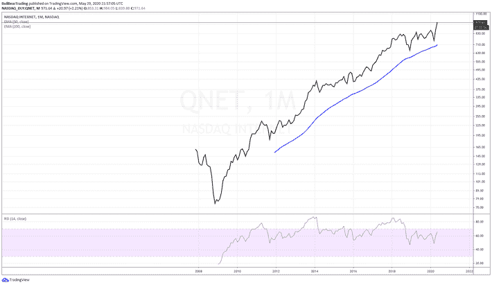****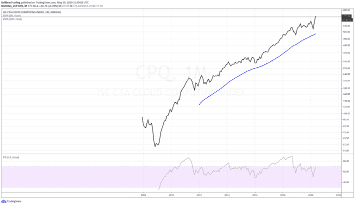****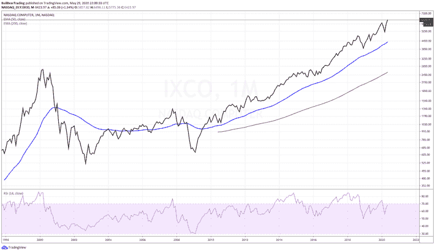**

**人工智能和机器人技术:**

**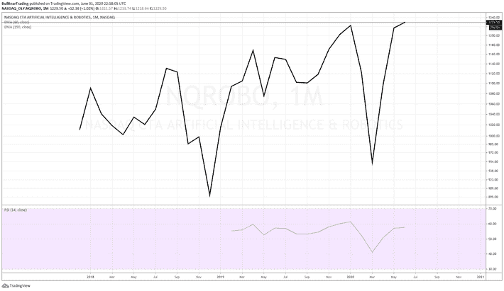****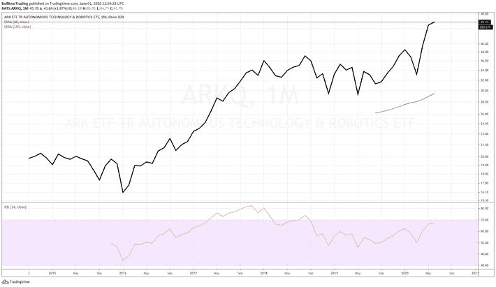**

**截至 4 月 30 日，megatechs 的交易价格已经高于今年，而美国其他股票的交易价格则远低于年初至今的水平。**

**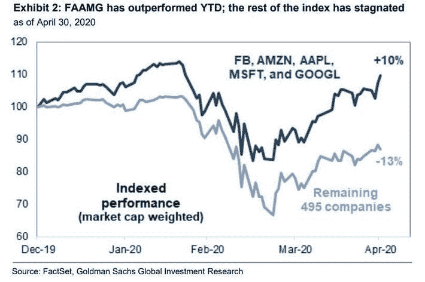**

**科技公司再次回购自己的股票，令所有其他领域相形见绌:**

**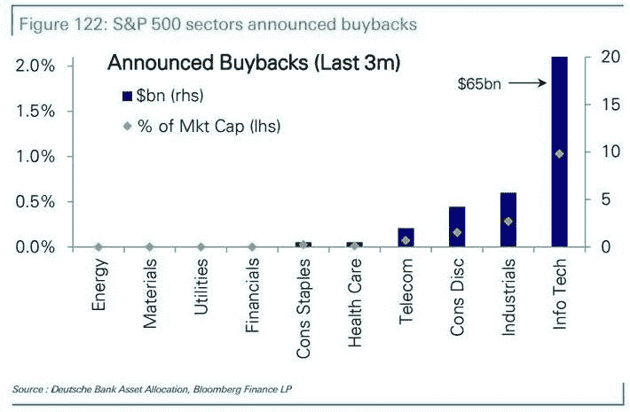**

**兆股现在是历史上最大的指数资本化集中地:**

**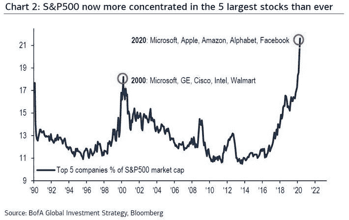**

**纳斯达克指数的市值越来越让世界其他地区(美国除外)的市值相形见绌。**

**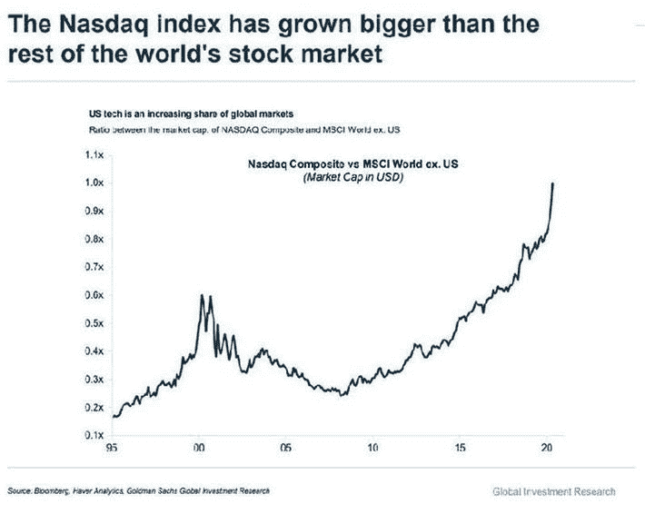**

**全球股市中唯一盈利增长的板块是科技股。**

**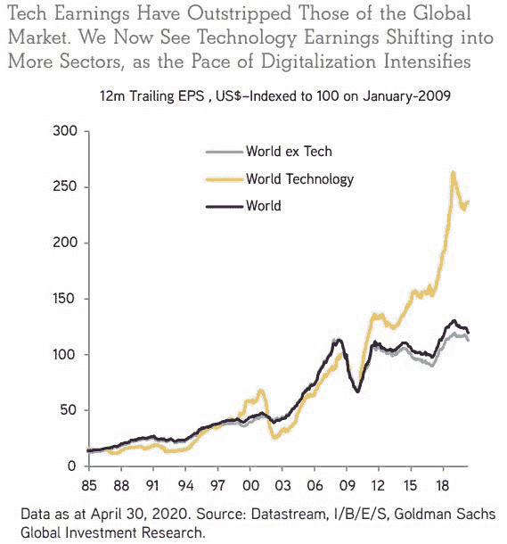**

**显然，大资金在赌技术真的会主宰一切。一旦可以应用各种旧的范式指标和分析，并说上述图表是“错误的”，崩溃“必须”的结果。许多人正在这样做。这相当于像一个任性的孩子一样对着天空挥舞拳头，跺着脚。再多的抱怨或说教也不会产生想要的结果。事情就是这样。**

**我环顾了 SPX 的其余板块和各种专业 ETF，看看还有什么可能加入大型科技股的行列，创造月度收盘新高。**

**成长股:**

**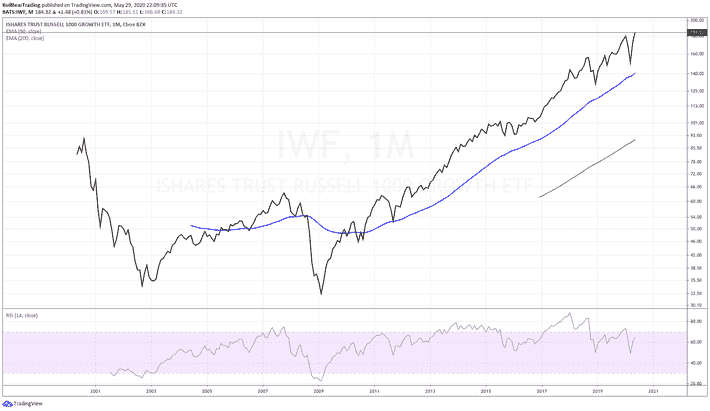**

**由于有无限的有趣的钱来支持任何和所有的增长独角兽，谁知道在多长时间内不会看到实际利润(主要是科技股)，未来成长股将成为下一个 AMZN 的赌注正在燃烧。**

**全球巨型股增长也是如此:**

**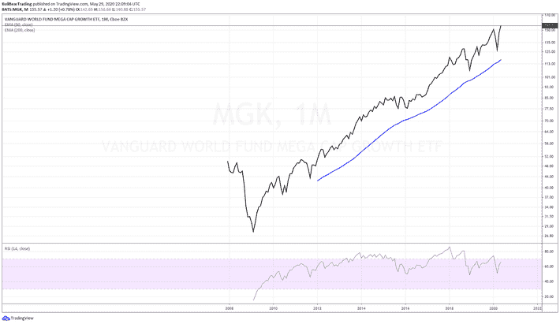**

**医疗保健(真的，疾病管理)股票已经爆炸，因为预计该部门将继续收到一个滑稽的布恩尼，以应对永久的冠状动脉危机。**

**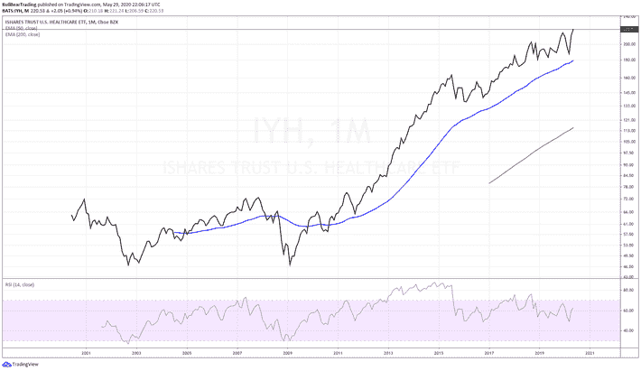**

**非必需消费品价格接近历史新高，因为富人越来越富，将继续以虚高的价格购买没有人真正需要的昂贵商品。**

**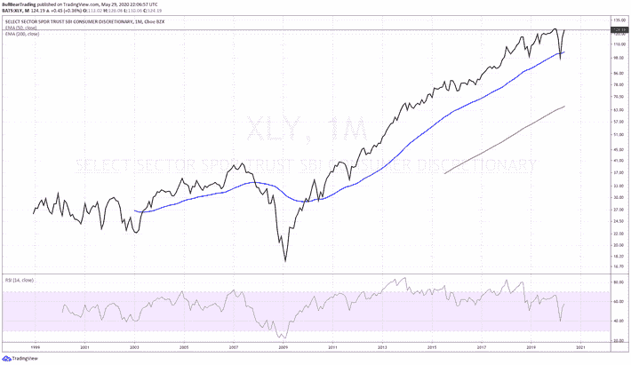**

**鉴于实体零售业的崩溃，看到零售行业 ETF 也创下月度收盘新高，起初有点令人惊讶，直到你意识到 ETF 严重偏重于 AMZN 和沃尔玛等少数大型零售商:**

**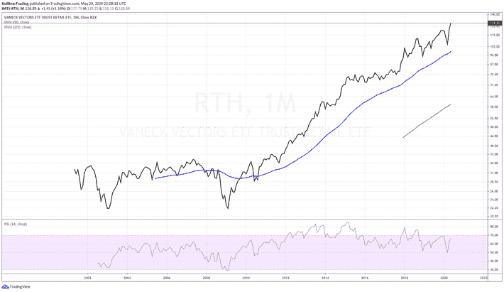**

**Amazon.Com 公司:23.24 %**

**家得宝公司:10.73 %**

**沃尔玛公司:8.82 %**

**劳氏公司:5.13 %**

**Cvs 健康公司:4.63 %**

**Jd.Com T2 公司:4.57 %**

**目标公司:4.52 %**

**好事多批发公司:4.50 %**

**总数:66.14 %**

**毫无疑问，中小型本地零售商的彻底毁灭将永久巩固一小撮在线和大型零售商的绝对优势。**

**与此同时，美国股市的其余部分仍需要反弹 11%以上，才能超过此前的月度收盘高点:**

**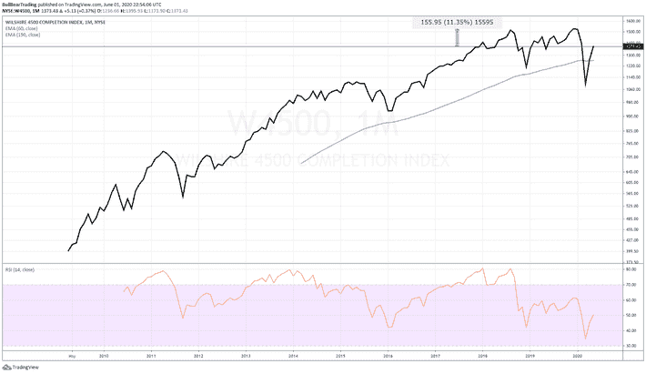**

**威尔希尔 4500 指数与纳斯达克 100 指数之比的 10 周均线在 2020 年跌至历史新低:**

**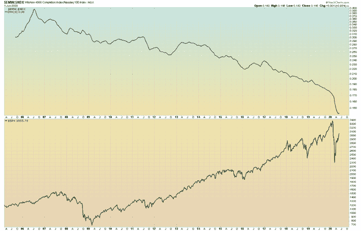**

**如果你愿意，你可以在纳斯达克 100 指数的一些振荡指标上看到熊的月背离，你也可以说其他的一些超买了。我想说，在 RSI 达到或超过之前的历史高点之前，我们不会看到实质性的调整。**

**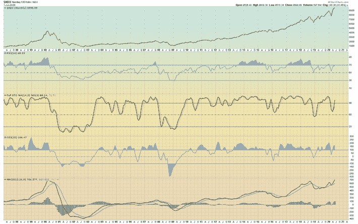**

****结论****

**一个以前是科幻小说的主题的世界正作为科学事实迅速接近。在过去的二十年里，它是通过精英阶层的强制和操纵带给我们的，这些精英阶层已经超越了法老的水平。因此，普通民众将在多大程度上受益还有待观察。毫无疑问，它目前正以大规模、全面监控和精神控制/宣传的显著特征展开。**

**我个人喜欢资本主义和个人自由。但面对推动长期系统性转变的基本历史力量的浪潮，我的个人偏好完全没有意义。不管我们喜不喜欢，资本主义的末日就在眼前。许多人渴望回到他们认为更好或更好的过去。但是没有回头路，没有复辟。某种形式的以技术为中心的社会政治经济从根本上说是不可避免的。唯一的问题是它的具体特征是什么，它将如何被管理，人们将如何与它互动。如果大量的人能够意识到正在发生的简单事实，他们也许能够成功地组织起来影响结果。任何有能力的社会运动、政党或感兴趣的个人需要关心的唯一问题是，就不可避免地即将到来的技术官僚政治的确切政治、社会和经济特征，进行积极、坦率的讨论和务实的谈判。如果这没有发生，那么我们将背负着他们给我们的东西。这可能与我们的选择相去甚远。**

**我没有所有的答案，但我相信有很好的理由认为我至少提出了正确的问题，并且大体上指向了正确的方向。**

**更多:[熊市交易](http://www.TheBullBear.com)**