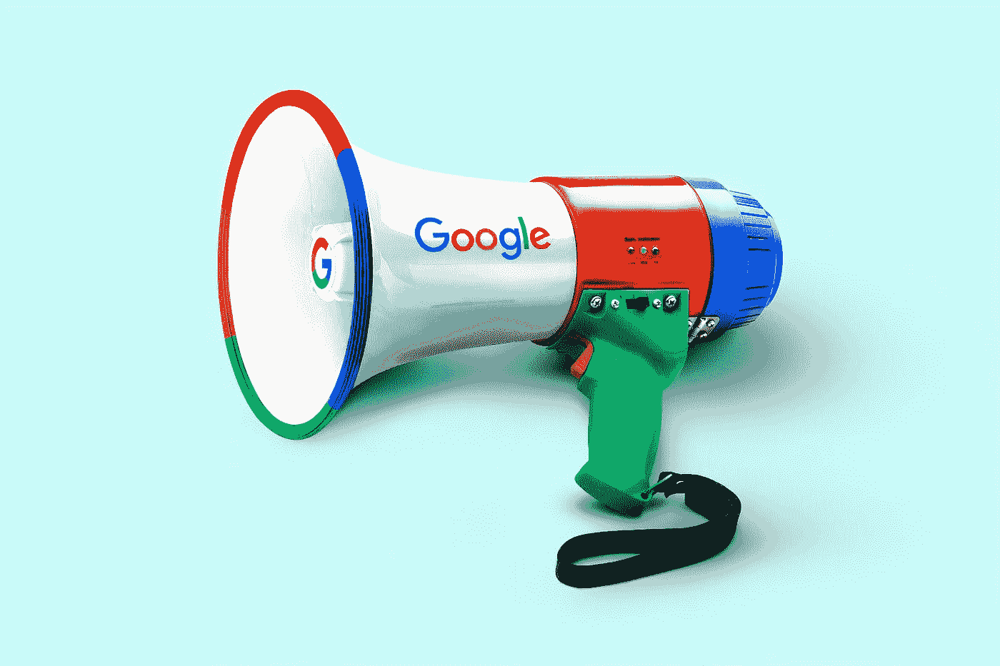
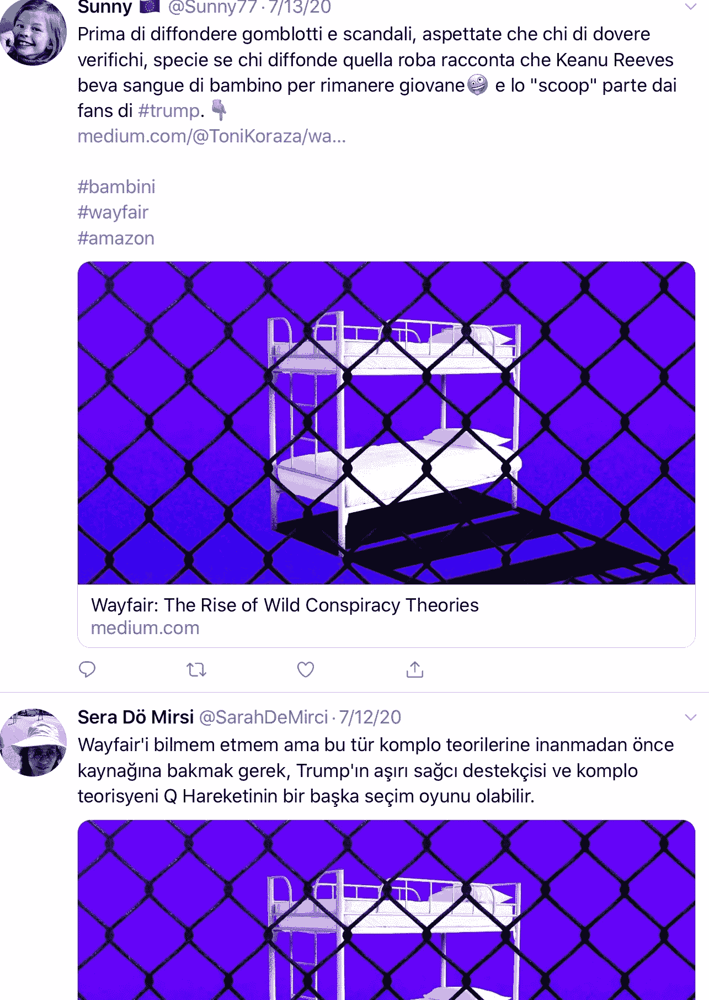
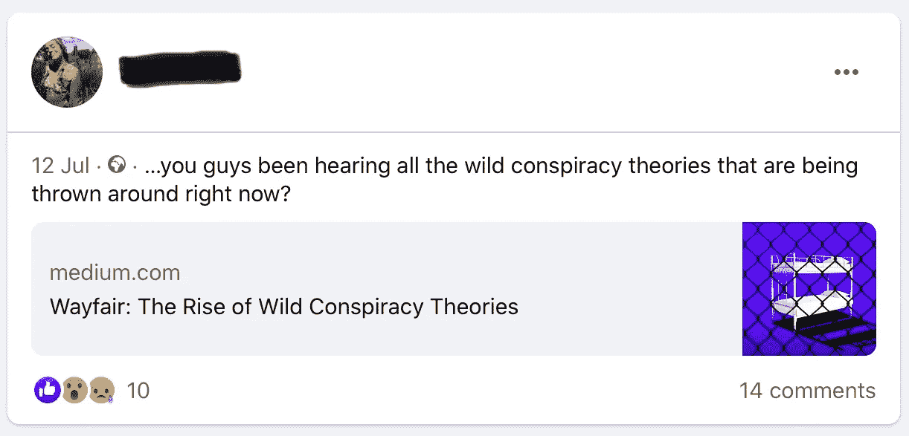
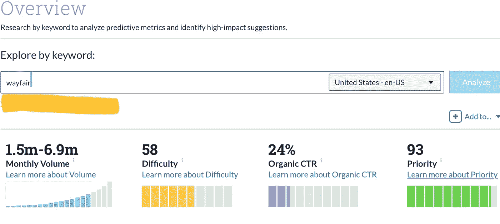
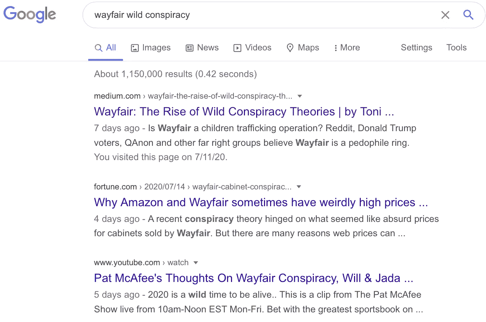
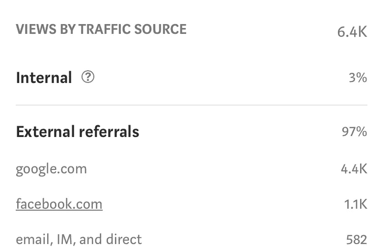

# 搜索引擎优化科学:写出在谷歌上排名靠前的标题

> 原文：<https://medium.datadriveninvestor.com/the-seo-science-write-headlines-that-rank-high-on-google-46d2a7167df?source=collection_archive---------8----------------------->

## Google 是你的朋友，是你的流量伙伴。

Photo by [Morning Brew](https://unsplash.com/@morningbrew?utm_source=medium&utm_medium=referral) on [Unsplash](https://unsplash.com?utm_source=medium&utm_medium=referral)

SEO 是博主工具箱中最棒的工具。媒体作家不断寻找新的方式来改写他们的标题。你整个平台就靠点击率了。

标题负责让你的读者走进门。然后你的开场白和你写作的质量就占了上风。但是如果你没有合适的头衔，你从一开始就被烤熟了。

可悲的是，如果你的博客浏览量少于 17 次，你就可能成为普利策奖得主。一个停止滚动的标题对于任何在线成功都是必不可少的。硬币的另一部分是 SEO、SERPs 和搜索引擎。诱人的标题可能完全无法引起谷歌的注意，这是问题的另一部分。

最伟大的标题是简单的，并且服务于正确的目的。一个简单而有效的策略可以帮助你为下一个故事选择合适的词语。使用 SEO 策略，我看到了 100%更好的参与度。

# 大标题

作家们不再对头条软件着迷了。程序很难预测什么是有趣的。你最好的办法是从不同的来源抓取标题。像《时尚》或《时尚芭莎》这样的杂志是绝佳的头条来源。

别担心，你没有抄袭别人的作品。你的故事是你的故事。你只是在学习流行的技术。

如果你没有杂志和时尚头条，就上[41-病毒头条新闻](https://medium.com/2-minute-madness/41-viral-headlines-to-swipe-at-any-time-8060e187e3d)。随意刷卡。在我的许可下拿走所有东西。你可以改变标题来服务你的主题。你的目标是向你的观众传达你的内容的价值。

Screenshot: [Twitter users](https://twitter.com/search?q=url%3Acfb0c8294b69&source=post_stats_page---------------------------) sharing the story

# SEO 是人

SEO 巨头们并没有关注无尽的计算机代码和神秘的谷歌仪式。搜索引擎正试图创造一种有效的方式来传递有价值和高质量的信息。

SEO 算法变了。谷歌每天都会推出几次新的[更新](https://moz.com/google-algorithm-change#:~:text=In%202018%2C%20they%20reported%20an,search%20results%20in%20significant%20ways.)。代码很重要，但你不必为此伤透脑筋。如果你是一个博客写手，给你的观众和你的人带来焦点。

*   建立关系
*   创建优质内容
*   诱人的标题

在销售产品时，始终以人为本。如果你不了解你的受众，了解谷歌算法中的每一个括号都没有帮助。

Screenshot: A Facebook user sharing SEO optimized story

当你的观众开始分享你的故事时，你就在破解 SEO 矩阵。反向链接是最好的搜索引擎优化提升。越多人链接回你的故事，就越容易在谷歌上排名。

我正在分享一个简单而免费的策略，它帮助我获得了巨大的浏览量和参与度。你不需要超过 3 分钟来设置一个 SEO 标题。

# 初学者的最佳策略

打开谷歌趋势，浏览页面。当你有了标题，你只需要合适的词。我假设你已经熟悉了这个概念。谷歌允许你检查流行的术语。

这里的关键词是 *Wayfair Wild 阴谋。像 Moz 这样的订阅服务可以给你更多关于这个流行词的信息。单词 *Wayfair* 有一个奇妙的优先权，这意味着这个词还没有饱和。150 万到 690 万的月搜索量是疯狂的，挖掘其中 1%的流量意味着每个月有成千上万的浏览量。*

Screenshot: Moz Interface

你可以把你的关键词放在标题、搜索引擎优化框和开篇段落中，以保持谷歌友好。但是你的内容和你的观众的质量是将故事推向高潮的关键。

就在一天前，我写了一篇关于疯狂阴谋论兴起的报道。这个故事已经为*梅菲尔野生阴谋*使用微服搜索*(110 万个结果中的)*排名第一。读者正通过谷歌涌入，我看到了每小时 100+的浏览率。

Screenshot: Wayfair Wild Conspiracy Google search

97%的浏览量是外部的，Medium 没有为这些流量付费，但有些东西比即时现金更重要。

牵引力总是一件好事。越来越多的人了解我的写作，我也有效地在网上分享我的研究。这种双赢的局面有助于创造未来的关系，带来业务。

Screenshot: Wayfair story statistics

我在标题、副标题和首段中使用了短语 *Wayfair Wild 阴谋*。谷歌在发布后一小时内就发现了这个故事。你可以在不到 5 分钟的时间内完成。

搜索引擎优化不是只有古代维京人知道如何掌握的神秘技能。简单的策略通常是最好的。搜索最新的趋势，把你的短语放在标题里。你不用花太多时间来选择标题，好处是巨大的。

# 善后处理

Medium 给了你一个绝佳的机会，让你在出版日期之后很久还能编辑故事。当你的故事在搜索引擎中找到出路时，你可以在底部添加你的时事通讯链接。

找到你的 SEO 故事，为你未来的观众和刚刚发现你作品的新人们添加一个链接。在搜索引擎优化游戏中，你不必在媒体上策划。我的一些最佳表演作品不是策划的。

Photo by [Arnel Hasanovic](https://unsplash.com/@arnelhasanovic?utm_source=medium&utm_medium=referral) on [Unsplash](https://unsplash.com?utm_source=medium&utm_medium=referral)

# 综述

标题负责让你的观众进门。然后你的开场白和你写作的质量就占了上风。

你可以将你的标题调整为 SEO 有效，并在同一天吸引谷歌流量。请记住，SEO 是人。每个人都试图告诉你不同的是没有得到搜索引擎优化的想法。

你可以滑动一个经过测试的标题，并添加你自己的话题流行语。比较你脑海中的单词，选出表现最好的一个。

精心设计你的标题来有效地服务于这个目的。但是，请注意，不要仅仅因为互联网软件说这是个好主意*，就写一个像*让头条好起来、*这样的怪物。*记住，SEO 是人。