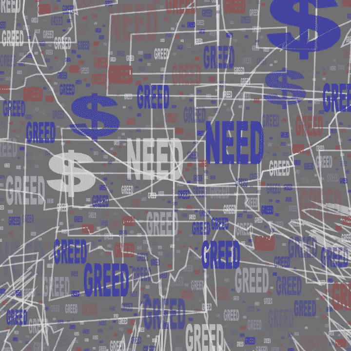

# 当前社会经济系统的严重失败|数据驱动的投资者

> 原文：<https://medium.datadriveninvestor.com/the-serious-failures-of-current-socio-economic-systems-data-driven-investor-28a0441fa452?source=collection_archive---------17----------------------->

我一点也不在乎当前的任何社会经济制度，不管是资本主义、社会主义、共产主义还是别的什么。它们似乎都有些缺陷，没有一个考虑到所有吸引我的东西，而且每一个似乎都更适合一个阶段，而不是一个永久的解决方案。然而，我不得不承认，这三者(以及其他)的某种非刚性的、合乎逻辑的、人性化的混合可能是我个人的设想。我给这种系统起的名字是*lifi sm——一种支持大多数居民高质量生活的系统*。

我一生都在观察各种形式的社会经济组织和政府系统的运作，我自己有一个在现已解体的苏联长大的妻子，在此之后，我得出了这些结论。我看到像中国这样的国家演变成一种共产主义、社会主义和资本主义的混合体。我看到南美国家陷入混乱和腐败，欧洲国家从左到右寻找完美的解决方案，甚至生存。当然，我的大部分观察都是在美国，这里是经济政策和文化的熔炉，为霸权而战，我们自己从左到右再到中间的疯狂摇摆。就我而言，它们都不起作用，所以下面我试着找出每个系统中的缺陷，希望有一天我们能纠正这些缺陷，为我们和地球上的其他居住者创造一个可持续的、舒适的生活系统。

在下面列出的每一个系统中，也总是有好的事情，而且大多数都是从对人们的良好意愿开始的。是的，有相应的成功清单。成功可以比作健康，失败可以比作疾病甚至死亡。有些疾病是暂时的和急性的，但有些是慢性的和不可治愈的。

在社会中，更原始的人性往往会介入，坏事会压倒好事，因此*生命主义*的使命就是识别好事，保护它们，增强它们，尽可能地减轻和抵御坏事，总是以一种全面、长期的方式融入最好的想法。事实可能证明，最好的系统被设计成在给定的时间根据需要*在不同的操作模式下运行。我们已经看到这样的例子，比如紧急法案，以及税收根据社会情绪或政府需求而升降。这些变化中的一些可以提前计划好，根据需要暂时触发，然后在条件变化时恢复到另一种模式，以便所有形式的政府在一个四维象棋的大游戏中无缝连接。真正的危险是认为我们可以创造一个放之四海而皆准的系统，因为熵和混沌理论，这个系统永远不会改变，也不会灵活。*

# 资本主义的失败

当管理良好时，资本主义在某种程度上可以为一些人服务，但就像任何生物系统一样，如果不加控制，就会变成寄生虫和癌症，甚至非理性地捕食自己。但是对贪婪和道德的检查不能仅仅来自我们的政府。这些只是保护措施。真正的检查必须来自人类的行为、心灵、教育和道德标准，尤其是对那些处于领导地位的人。因为自由这个词，自由市场听起来是件好事。它常常被翻译成*狗咬狗*、*人不为己*甚至*贪婪是好事*。实际上，它变成了一个借口，让社会变得更加愤世嫉俗、自私、狭隘，最糟糕的是，变得更加悲惨。

这并不是现代资本主义所有错误的全面列表，但它确实显示了我们思维中的巨大缺陷，正如我们所知，这些缺陷现在正威胁着生命，甚至可能导致灭绝。全球范围内的苦难与日俱增，因为:

1.  **将利润私有化，同时将债务社会化:**换句话说，许多公司攫取了它们的总利润，只减去了它们的[分类账](https://www.datadriveninvestor.com/glossary/ledger/)成本，将净利润分配给少数人，而制造、处理和使用它们产品的外部成本则由社会以气候变化、癌症、各种疾病、垃圾收集和处理、有毒物质清理等形式支付，甚至经常以任何金钱都无法解决的方式支付，如将微毒素引入或“永久”进入环境、大脑损伤、心理等。
2.  **奖励反社会行为:**冷酷无情通常被认为是商业中的一种美德，据说顶级 CEO 往往有反社会倾向。在决策中忽略道德规范而只考虑“底线”的能力确实可以让公司盈利，但这是以社会为代价的。文明因千刀万剐而濒临死亡，因为这些决定往往只是走向道德空虚的一小步。可怕的人的例子成为孩子们的榜样，他们后来延续了迷因。
3.  **不惜任何代价增加利润:**通过使用更便宜或更差的材料来削减成本，剥削廉价劳动力，削减福利，增加工作时间，要求更少的工人做更多的工作，用机器人代替工人，安全捷径，减少环境保护，使用更多的人工成分，最大限度地避税，离岸资金，价格欺诈，多余的增加费用，虚假评论，欺骗性广告，诱饵和开关，欺骗客户，推荐不必要的服务等。所有这些事情都是反消费者的，是从不知情或信任的人那里窃取血汗钱的形式，一次一分一毫。
4.  **超物质主义:**不管你多么富有，你一天只能吃这么多，穿这么多衣服。然而，有些人每天赚数百万美元，并以“投资”、房地产、艺术品、黄金、珠宝和多个银行账户等形式积累了大量现金。远离公众，没有任何好处，但除了创造一个永久的世代财富传递给无尽的后代，然后延续同样的行为外，没有其他真正的目的。比这些可怜的个人目标更糟糕的是，社会倾向于将此提升为生活的理想目标，并从很小的时候就训练孩子关注这个目标，而不是更重要的目标。为什么更重要？因为，无论财富多少，你的目标都应该是快乐、心理健康、没有压力和他人的幸福。
5.  **期待无止境的成长:**看自然。很少有事情会失控。动物和植物都知道什么时候停止生长，只是在给定的适当尺寸下正常生活。事实上，在动物中，不健康的种群或导致死亡的感染或癌症中发现了不受抑制的生长。然而，在现代资本主义中，我们期望公司和利润年复一年地增长，而不是达到稳态，即一种平衡和可持续的状态。各国甚至以 GDP 的增长来衡量他们的成功，而不考虑子孙后代的代价或一路上的损失。这是大自然的诅咒。
6.  过度广告:将不受约束的资本主义与不受约束的言论自由保护结合起来，导致水母般入侵可用媒体空间的每一个角落，试图吸引我们的注意力并让我们买东西。无论是电视、广播、视频中断、广告牌、杂志、报纸、网站、社交媒体、搜索引擎、垃圾邮件、标牌、天空写作、纳斯卡，只要你能想到的，我们每天都会被多达 5000 个广告轰炸。这在心理伤害、丑化和浪费时间方面给人类带来了巨大的损失。可悲的卑躬屈膝变成了一种艺术。
7.  **过度优先考虑和补偿高层人员:**我们都知道一个伟大的经理和一个有远见的老板很难找到，如果不是罕见的话。我们钦佩那些创建公司并雇佣成千上万人的先驱者。这些是金字塔顶端的人。然而，事实仍然是，金字塔的顶端没有比它建立在更大的底部基础上的地方。由于一天只有 24 个小时，而大多数人工作 8-12 个小时，我们可以计算金字塔每一层的“工资”,并发现荒谬的不平衡，即一些低得多的人工作努力许多倍，而一些高得多的人参加一些会议和豪华的午餐，并神奇地赚取比低工人多几千倍的收入，并作为赚钱机器中可互换的齿轮决定他们的命运。
8.  **寻求更多的税收减免:**作为一种进化特征，保护自己的财产和领土是一种自然趋势。然而，这是一种错觉，认为一个人的收益完全属于自己，只是由于一个人的直接行动，而事实上，社会让你成功，保护你的成功，作为消费者和纳税人为你的成功买单，你只是利用了社会给你的机会。换句话说，你总是将收入的很大一部分归功于社会，从长远来看，剥夺社会的份额是对自己的伤害，因为你将生活在一个破败、贫穷、无序、受污染的世界，这个世界将不再支持你的事业或生活方式。
9.  **制造人为的社会失衡:**我们都目睹过人才和技能与某个人的头衔或工作不匹配。无论是一个比他或她的下属受教育程度低、智商低或技能差的老板，还是一个可能比他们的上级经理更聪明、更有资格的工人。很多时候，是你认识的人或者运气把人们带到了公司阶梯的更高位置，而不是技能。然而，这是一种自然的不平衡，因为我们如此重视我们的工作和头衔，这可能会造成怨恨和自尊问题，或者造成不安全的老板受到威胁，并利用他们的权力阻止或以其他方式压制有才华的人的职业生涯，因为他们自己缺乏安全感。
10.  **寻求不当的监管救济:**一般来说，在经历了许多法律案件、错误和试图补救不公平、减少危险等之后，监管会随着时间的推移而演变。在某些情况下，此类法规理所当然地给企业和个人带来了更大的负担，要求他们遵守并避免导致这些法规的负面后果，如向饮用水倾倒毒素或危及生态系统导致癌症发病率上升。寻求持续的去监管化是对自然的诅咒，自然小心翼翼地监管着包括人体在内的所有相关系统。
11.  **货币化政治:**由于法规和税收受立法制约，因此人们和企业支持他们认为会为他们的利益服务的候选人和政党，并制定对他们的财务状况更有利的法律，这是资本主义的自然功能。如果不加以控制，这已经导致了如今一场正常的竞选活动都需要巨额资金来支付广告和各种竞选机制。因此，选民的利益经常被操纵信息和媒体的一小撮富有的捐赠阶层所否决。
12.  **医疗货币化:**每个人都明白一个人的生命不能被赋予金钱价值。此外，每个人都明白利润和待遇之间会产生利益冲突。例如，让一个人服用昂贵的终身药物可能比进行廉价治疗更有利可图。因此，最好是消除这种冲突，同时减少医疗负担和成本。这并不是说医生和护士的工资太高，而是我们引入了许多中间人，他们从每笔医疗交易中提成。
13.  **司法货币化:**司法应该是盲目的，尽可能真实和准确的。监狱系统私有化造成了司法和商业之间的利益冲突，在这种情况下，不管某一特定主体是否有罪或是否值得监禁，填满商业经营的监狱更有利可图。许多虐待案件已经被发现，轻微的犯罪可以导致数年的监禁和商业监狱系统的高额利润。这还包括过度货币化，用越来越多的准军事工具和方法装备和训练警察，在公民和发誓保护他们的人之间造成危险的不平衡。
14.  **将军队货币化:**虽然私营企业为我们的军队开发武器和装备是正常的，但消除人民国防和出于任何与利润相关的目的使用军队之间的所有利益冲突至关重要。换句话说，任何武器的使用或部署都不应基于任何利润动机:耗尽库存、购买不必要的设备、要价过高、绕过法律招标程序、讨好亲信或中饱私囊。

# 社会主义的失败

社会主义通常被认为是一种以人为本的制度，在这种制度下，商业被用来为人民服务，以满足公众对食物、住所、商品、安全和一般福利的需求。通常，在以多种形式和强度出现的社会主义制度下，财政负担会更加公平地分配。虽然这不一定意味着企业是国有的，但这确实意味着它们在更严格的监管和更少的利润驱动的指导方针下运营。即使在一个完全资本主义的社会，某些方面已经是社会主义性质的，因为税收是用来支付公共服务，如国防、警察、消防、道路、公园、人行道等。社会主义实验常常因为各种原因而失败，这些原因也是许多资本主义失败的常见原因，包括:

1.  将利润社会化，但将它们输送给当权者:当一个国家被赋予如此大的权力时，它只能和掌权的人一样好。成为社会主义者并不会自动赋予道德行为。权力欲和贪婪仍在运作。因此，我们看到了如此多的专制社会主义者，他们以社会福利的名义利用军队来统治人民。
2.  **磨平个人:**如果一个社会过于迷恋公共利益，以至于个人被边缘化，那么它就有摧毁动力和灵感的风险，并创造出一个顺从的谄媚者的社会，他们害怕被打倒而不敢走得太远。天赋和努力工作应该得到适当的赞赏和奖励。
3.  **过度军事化:**当你的领导人穿着军装时，你的社会就迷失了，因为它更看重军队的暴力力量，而不是理性和科学的温和力量。本质上，任何穿军装的国家元首都是独裁者。在这些国家，军方通常资金过剩，并从公众那里掠夺宝贵的资源，以支持政府，而且他们被允许掌权的时间越长，就越难撤换这样的领导人。
4.  在一个为所有公民提供舒适的安全网和补偿的保姆式国家，有可能出现一大群失业的吃白食的人，他们依靠国家的慷慨和那些工作来制造他们所得到的东西的人生活。我们已经看到这样的系统在[的重压下](https://www.datadriveninvestor.com/glossary/weight/)崩溃，因为*把自己铺得太薄*并且失去了为自己提供燃料的经济引擎，比如在希腊或委内瑞拉以及一些本来就财力不足的较弱的欧洲国家。
5.  **降低冒险者的积极性:**过度依赖政府监管的改进，削弱风险资本或愿意冒险尝试往往不切实际的想法的投资者的作用，可能会导致进展速度放缓，甚至更糟，好想法因缺乏资源而夭折。虽然一个良好的社会民主社会会允许这一点，然后限制这种冒险的无耻利润，但在真正的财富可以积累的地方可以达成平衡，只是不要达到荒谬的水平。
6.  **创造单一文化:**如果国家在言论自由方面被赋予过多的监管权力，并开始阻止新思想以维持社会一致性，那么它可能会减少模因多样性，从而导致文化停滞。
7.  **过度减少竞争:**通过过度社会化，政府可以让新企业难以与老牌国有企业集团竞争，从而阻碍思想和产品的自然进化。这有点像让侯赛因·博尔特在脚上负重以平衡比赛，这样每个人都在同一时间冲过终点线。

# 共产主义的失败

共产主义通常被认为是下一级的社会主义，那里没有私有财产，国家拥有/经营所有关于食品生产、资源、制造业等的企业。通常，在以各种形式和强度出现的共产主义下，国家拥有绝对权力，个人通过为国家服务来为公共利益服务。每当一个非民主的制度被允许加强时，它对文化、宣传、警察和军队的控制就变得很难被推翻，并且经常落入少数几个有绝对权力的专制领导人的控制之中。即使在小规模的实践中，比如说嬉皮士公社，共产主义通常会转移，因为不是每个人都尽职尽责，怨恨和贪婪开始生根。这并不是说共产主义本质上是一个坏主意或者没有优点，而是说它的实践失败了，原因如下:

1.  绝对的权力导致绝对的腐败:通过将所有的权力交给一个未经选举或橡皮图章式的自我保护的官僚机构，我们扩大了逃避责任和无情地将政府权力凌驾于人民之上的能力。那些在顶端的人倾向于发展一种绝对可靠的，邪教般的权力来控制所有的信息和媒体，并变得不愿意放弃这种权力，最终导致失败，起义和推翻。
2.  **失去个人的灵魂:**强迫每个人都进入一种蚂蚁般的效率，因为“蜂巢”失去了人类最伟大的资源之一——个人超越常规、表达新奇、拓展创造力的意志。创造一个超级安全的社会是很容易的，在这个社会里，每个人都有工作，都有足够的“营养”，但生活在这样一个社会里既无聊又无趣，违背了整个企业的宗旨。
3.  **创建地下社会:**众所周知，在苏联，人们找到了秘密地在国家周围工作的方法，通过成为参与未经国家批准的“非法”活动的帮凶来过上更好的生活的方法——地下组织。当这种情况持续太长时间时，这种文化就会对法律和违反法律的许可产生不信任，即使这些法律是好的，并且毫不奇怪，如今一些最大的海盗、黑客和垃圾邮件发送者来自俄罗斯。
4.  **压制进步人士和知识分子:**对于专制统治来说，最大的威胁莫过于桀骜不驯的思想家和特立独行的人——那些预见大大小小变革的人。因此，我们看到了苏联和中国对学者和知识分子的大清洗，这实际上降低了基因库，这是一个可怕的想法。
5.  除了来自内部的威胁，一个专制的共产主义社会不得不狂热地工作，以防止外国思想渗入公众的良知，并以相反的思想和对其他地方更美好生活的一瞥污染国家宣传。在今天的电子世界里，这变成了一个几乎不可能的任务，也是徒劳的。
6.  **劳动虐待:**当国家拥有绝对权力时，他们制定工作规则和支付的工资。如果国家决定要延长工作时间或加快生产，否则会受到伤害，那么工人必须服从，即使共产主义的通常起源是为了荣耀劳动者。经过一段时间后，为了保持竞争力，国家将滥用这种权力，而劳工将很少有或没有讨价还价的能力。
7.  **关于文化军事化:**每种形式的政府都可以说犯了这种罪，但共产党人是举行人民军队阅兵的人，他们开着坦克和导弹迈着正步走过广场。这是对任何质疑领导人权力的人的一种恐吓形式，而且作为国家预算的一部分，这也是相当昂贵的，因为制造武器也是一种强迫爱国劳动的形式，整个社会变成了军事机器，浪费了宝贵的资源，没有特别的原因或有价值的最终目标。
8.  **缺乏制衡:**当被允许获得足够的权力，一个[集权](https://www.datadriveninvestor.com/glossary/centralized/)，铁板一块的政府将无法制衡它，并将摧毁任何违背它的人和事。由于这样一个政府没有被划分成相互平等的分支，只要被洗脑的群众允许或者一些灾难发生，它就会横行。
9.  **腐败渗透到每一个层面:**不仅公众创造了一种重要的地下、桌子底下的做事方式，而且地方官员和警察等官员也开始接受贿赂和恩惠，以补偿微薄的工资或讨好上级。这导致了一种腐蚀性的、不道德的无法无天的恶性循环，只会加剧人们对各级政府和法律的蔑视和不信任。
10.  **解体后的寡头政治财产分配:**当共产主义制度崩溃时，随着国家财富转化为私人财富，那些掌权的人往往会给自己和他们的亲信带来极大的好处。我们在现代俄罗斯看到了一个完美的例子。

其他由于类似原因而失败的系统(我在这里不做深入讨论)也不能避免许多相同的(和其他的)问题，包括:

*   君主国
*   寡头统治的国家
*   富豪相
*   无政府主义

# 缓解措施

这些只是我们可以减轻美国系统故障的几个概念:

1.  **利润私有化，责任社会化:**制定法律，要求某些产品贴上生命周期数据标签，就像我们给食品贴上营养标签一样。确定由公众承担的成本，并将这些成本纳入征税基础，以便公司为清理自己的混乱买单，或者更好的是，减少混乱，这是我们的目标。
2.  **奖励反社会行为:**这是一个文化问题，只能通过强调道德行为的文化来解决。在企业结构中，我们应该奖励道德行为，并寻找表现出关怀和同情、志愿精神和体贴的领导。提拔好人。
3.  **不惜任何代价增加利润:**定价应该透明，让公众知道产品和服务盈利的原因，以及成本节约来自哪里，例如:效率、劳动力、材料质量和知识产权。至关重要的是要全面了解利润，不允许串通、欺诈、劳动剥削和其他不道德的行为被忽视。
4.  超级物质主义:这个文化问题需要更多地强调智力、创造力和精神成就，而不是强调富人和名人的消费、金钱和生活方式。
5.  **期待无止境的增长:**这需要降低公司作为单纯投资机制的重要性。投资回报是一个被过度使用的指标，我们应该庆祝那些达到可持续动态平衡的公司以及那些经历增长的公司。以自然为向导。学会享受足够的*。*
6.  *过度广告:需要对广告的数量和质量进行更多的限制。禁止面向消费者的商业媒体的药品广告。实施隐私保护，允许消费者选择退出所有的广告跟踪和定位。对公共户外广告有更严格的规定，这样它就不会丑化这个世界。*
7.  ***过度优先考虑和补偿高层人员:**应披露高层管理人员薪酬与普通员工薪酬的比率，并对超过某一乘数的管理人员适用税务影响。考虑实行最高工资。*
8.  ***寻求更多的税收减免:**更好地理解在一个社会中运作的成本和收益是至关重要的，这样税收就不会被理解为一种惩罚，而是一种收益。交税应该算是爱国和人道吧。*
9.  ***制造人为的社会失衡:**这一文化问题要求训练孩子相互支持，不要在别人展示天赋时产生狭隘的嫉妒，同样也不要让那些天赋不太明显的孩子感到不值得。这真的是一个心理健康和自尊的问题。*
10.  ***寻求不当的监管救济:**这需要在公平、生态和效率方面对长期目标进行适当的优先排序。监管不应该过于繁琐，也不应该过于薄弱，以防止严重的损害。*
11.  ***货币化政治:**终结公民联合。要求公开所有政治活动的资金来源。更多地利用公共资金，让更有资格、更不富裕的人能够负担得起竞选公职的费用。减少活动季节的长度，从而降低成本。*
12.  ***医疗货币化:**全民医疗是一种权利，而不是特权。消除医疗保健中的所有利益冲突，使廉价的治疗方法不会被认为比昂贵的慢性管理或症状缓解差。*
13.  *司法货币化:结束私营监狱和非军事化警察，追求警察和社区之间更深层次的社会联系。把监狱变成补习学校，而不是惩罚工具。减少对许多非暴力犯罪的定罪和处罚。*
14.  ***将军事货币化:**这一长期过程需要化干戈为玉帛的心态，将军事工业综合体的才能和知识转化为更多的问题解决者，服务于整个社会，包括国际社会。也许通过提高武器销售税来减少武器经销权。与军事冒险相关的利润披露应该为公众所知。*

# *生命主义的愿景*

*   *Lifism 将通过强有力的检查和平衡、深思熟虑的法规以及全面考虑环境和其他物种的整体方法来尽可能避免这些陷阱。*
*   *生命主义建立在同情、尊重、真理和科学的基础上，理解整个生产周期的真实成本。*
*   *生命主义是可持续的，公平的，平衡了个人主义和社会利益。*
*   *Lifism 是灵活的，可以随着需求的增加而平稳地改变，然后在可行的情况下尽快恢复以减轻负担。*
*   *生命主义旨在最大限度地提高人类、动物和生态系统的生活质量。*
*   *生命主义支持艺术和美化，以滋养居民的灵魂和精神。*
*   *生活主义不以我们的职业或工作来定义我们。*
*   *生活主义意味着为生活而工作，而不是为工作而生活。*
*   *生活主义不允许任何人或小团体拥有绝对的权力。*
*   *生命主义寻求一个开明的、受过教育的公众，能够通过民主的方式引导自己走向未来。*

**原载于 2020 年 12 月 11 日*[*https://www.datadriveninvestor.com*](https://www.datadriveninvestor.com/2020/12/11/the-serious-failures-of-current-socio-economic-systems/)*。**