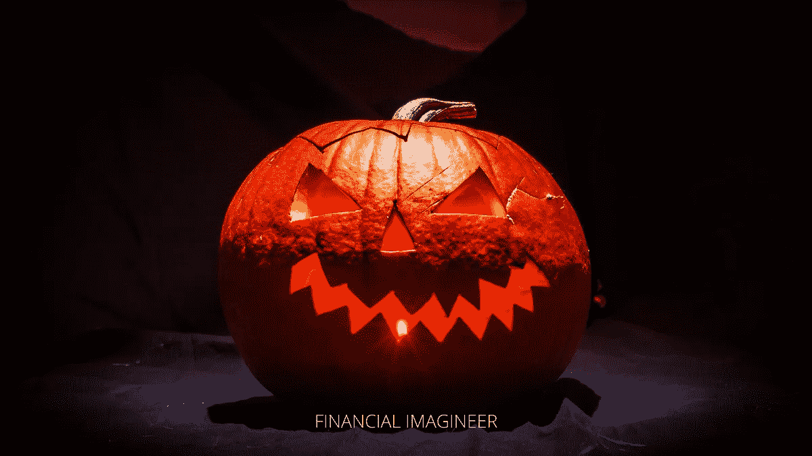
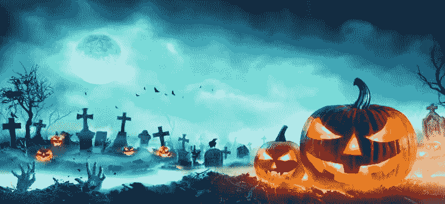
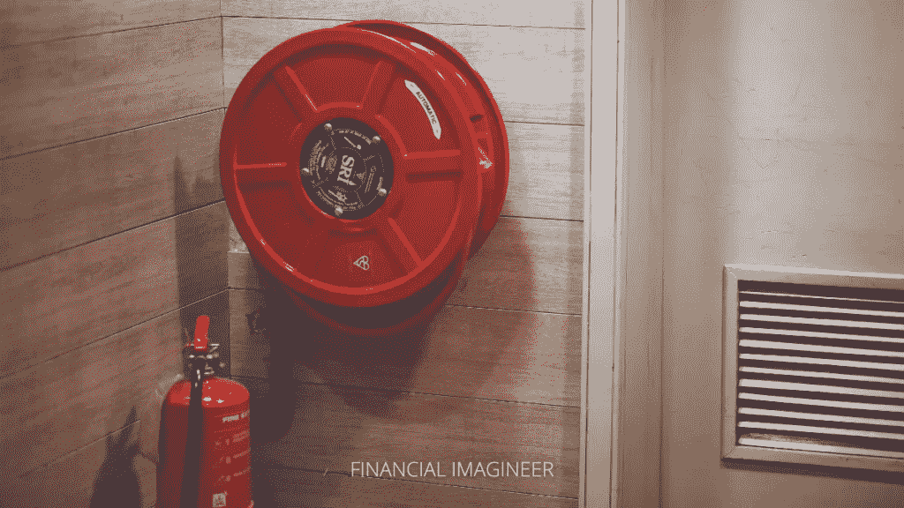
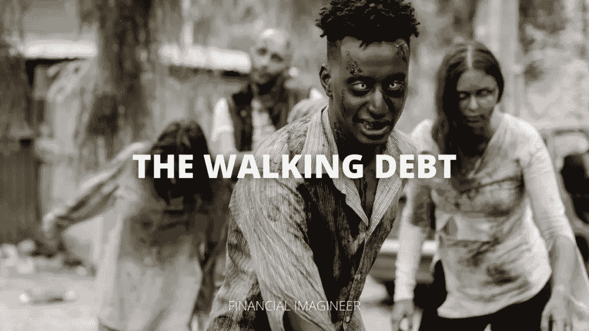
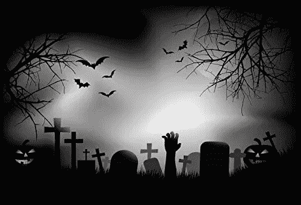
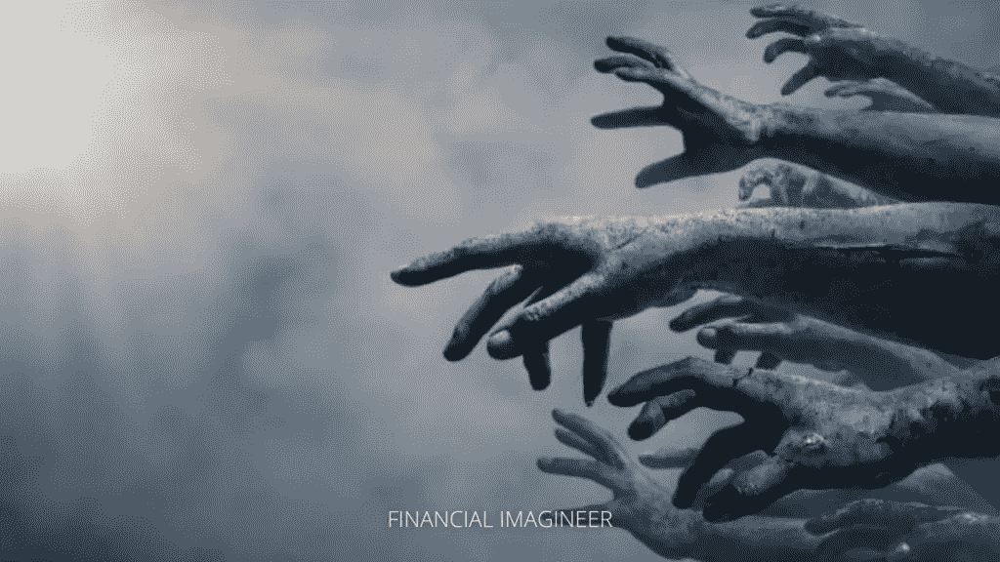
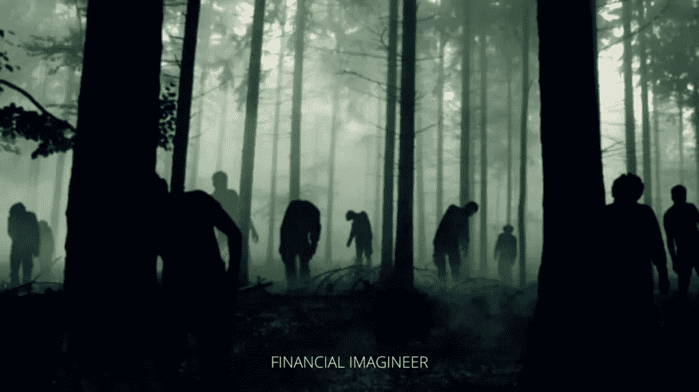
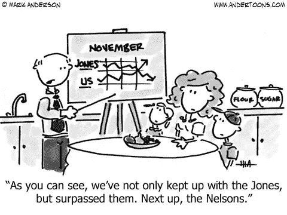

# 七个最可怕的金钱陷阱

> 原文：<https://medium.datadriveninvestor.com/the-seven-most-scary-money-traps-1eb9b4dc56f9?source=collection_archive---------11----------------------->

这周我们和家人一起看了一部万圣节电影，突然我儿子问我:爸爸，你为什么喜欢看恐怖电影？我想了很久，然后回答道:恐惧——如果做得对——会很有趣！

当然，他又问了一遍:怎么做？

# 恐惧的好处

我向他解释说，恐惧可能是一种令人兴奋和健康的情绪，想想我们多么喜欢坐过山车，当你可以在生活中有控制地冒险时，你会感到兴奋，当 Haloween 靠近时，我们会喜欢这种感觉。

此外，如果你不习惯偶尔接触新鲜事物，你的生活会变得无聊，以光速匆匆而过。

但是，说到钱，要非常非常害怕不要为以下七个最吓人的金钱错误担惊受怕！

今天是万圣节，让我们一起来探索七个可能会抓住你的最可怕的金钱陷阱吧！

要非常非常害怕！

# 1.赌博和玩彩票

你知道超过 95%的赌徒经常输钱而不是赢钱吗？如果你是为了好玩而做一次或两次就不一样了，但是，嘿，有些人沉迷于赌博或定期玩彩票。一些人称赌博和彩票为“穷人税”。

如果你经常玩，你肯定是在浪费钱，这些钱本可以用来投资或减少你的债务。你把你自己的退休或者你孩子的未来置于危险之中。

> "赌博是用信用购买希望的一种方式。"

赌徒和彩票购买者定期用他们的钱支付，让他们自己幻想一个更好的未来。[点击这里阅读更多关于这种可怕行为的](https://www.financial-imagineer.com/2019/08/24/why-people-buy-lottery-tickets-instead-of-creating-their-dream-life/)。

# 2.没有应急基金或计划

个人理财中最可怕的事实之一是，有很多人甚至没有足够的现金来支付简单的紧急情况。如果今天你或你的家人发生了什么事，你准备好支付 500 美元了吗？

没有应急基金或计划通常只是更可怕的金钱错误和问题的开始。如果你没有 3-6 个月的现金支出，或者如果你的资产基础上有一个灵活的贷款额度，你可能很快就会被迫延迟支付账单或获得可怕的现金预付贷款，只是为了过你的生活。避免那个！

> “几个月后总会有需要花钱的事情发生。要么做好准备，要么提心吊胆！”

如果你还没有，现在就存钱以备不时之需。你的父母不是你的应急基金。你的孩子不是你的退休基金。大多数人并没有计划失败，而是没有计划。现在就开始，建立你的应急基金或起草一份计划。

# 3.付账单太晚

一旦你开始延迟支付账单，可能会引发一系列令人毛骨悚然的财务状况。首先，你会收到提醒，然后会增加额外的费用，最终不及时付款会影响你的信用评分，而你最终支付的费用会是你当初支付账单的数倍。

不支付账单或延迟支付账单就像让银行账户透支一样。这会让你陷入更大的财务压力，最终失去你的精力、金钱和信用评分。

好好组织你的现金流，做一个预算，必要的话减少开支，努力并格外小心地处理你每月的债务。

我知道这可能很吓人，但是现在请在账单来的时候把它们消灭掉！

…或者你没有未来。

# 4.针对贬值抵押品的债务

有许多事情你可以借钱。最糟糕的债务是以贬值或高度投机的资产为抵押的借款。这里最常见的例子就是车贷。你得到了一辆新车，但也有义务随着时间的推移支付它，而一些中间人会像吸血鬼一样从你的现金流中吸走可怕的高利率。就在你开着你的新车离开车行的那一刻，你立刻就损失了所涉金额的 20%。这 20%或多或少也是汽车贷款的成本，但不是一次性的，不，每年。甚至有一些人不能长期持有这样的贷款，可能会被迫放弃汽车，但继续坐在一些剩余的贷款！

> “不要用你没有的钱去买你买不起的东西，去打动你甚至不认识的人。”

避免因“资产”贬值而负债。相反，如果你需要购买贬值的物品，存钱并用现金支付，将剩余的现金投资于升值的资产。资产贬值债务是“流动债务”！

# 5.无资产负债

是的，更可怕的债务！

尤其是在万圣节:把坏账埋了！

人们习惯于获得即时现金注入，为他们需要支付的任何款项融资。绝大多数实际上近 70%的短期借款人使用此类贷款预先为食品或住房等经常性支出提供资金。

> *这样的贷款可以称为掠夺性的，贷款人是掠夺者，你是猎物！*

虽然抵押贷款是对抵押品的债务，你的家，这个词的起源非常有趣。你知道它来自法语吗？如果直接翻译的话，你可以称一笔抵押贷款为*！*

*你到死都要还。*

*让它深入人心。*

*与其让债务把你压垮，不如埋掉坏账，让它永远不再出现。停止给信用卡债务第二次机会。避免发薪日贷款，就像他们是瘟疫。将学生债务降低到应有的水平。*

*六英尺以下。*

**

# *6.购买“从租赁到拥有”的产品*

*这种最微妙的债务形式是让你消费更多你买不起的东西的最新伎俩。在某些市场，你再也看不到标价 1000 美元(对不起，999 美元)的高档电视了，取而代之的是“每月仅售 99 美元”(可分 24 个月支付)，这听起来更实惠，实际上也没那么吓人。还是没有？*

*等一下！*

*现在想象一下，一些人通过这样的计划获得了他们的床、按摩椅、冰箱、洗衣机、手机等等……他们将不再有任何实际积累财富的能力。一点都不！*

**

*不要让从租赁到拥有的产品优惠抓住你。永远不会。*

*他们是可怕的财富杀手！*

# *7.生活方式的蔓延*

*个人理财中最令人毛骨悚然的一面是陷入生活方式的怪圈…*

*事情通常是这样的:你加薪了，有了更多的钱，相信你需要负担更多的钱，花更多的钱，因为这是你应得的，然后不久又没钱了，这将让你更加努力地工作，以争取下一次加薪或升职，之后整个血腥的循环又开始了。这是仓鼠轮陷阱。这是社会公认的，被认为是“正常的”。如果你想要一个与众不同的生活，你必须避免落入这个超级可怕的陷阱。*

**

*避免攀比甚至攀比。看看他们。漫无目的地走完他们的一生，转着仓鼠轮子。*

*你不需要仅仅因为升职就买辆新车，你也不需要总是出去吃饭，你的衣柜可能已经够好了。*

*表演你的工资！*

*或者更好的是，低于你的工资行事。*

**

# *结论*

*恐惧和贪婪是我们生活的自然组成部分。我们总是争取更多，害怕失去已经拥有的。*

*了解这个世界是如何运作的。*

*如果你想过与众不同的生活，就不要落入俗套。*

*正常的破产了。*

*正常是可怕的。*

*可怕的事实是:你要么学会管理金钱，要么没钱来管理你。但是不要害怕处理你的钱:害怕的钱永远不会赚更多的钱！*

*相信我今天会吓到你，哪怕只是一点点。*

*恐怖万圣节快乐！*

*马特(男子名ˌ等于 Matthew)*

*如果你还没有加入我的收件箱团队，请考虑在下面的框中通过电子邮件订阅 Financial Imagineer，[喜欢我的脸书页面](https://www.facebook.com/financialimagineer)或[在 Twitter 上关注 Financial Imagineer](https://twitter.com/FI_imagineer)。*

**原载于 2020 年 10 月 31 日*[*【http://www.financial-imagineer.com】*](https://www.financial-imagineer.com/2020/10/31/the-seven-most-scary-money-traps/)*。**