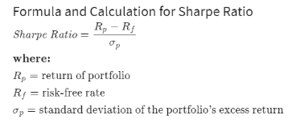
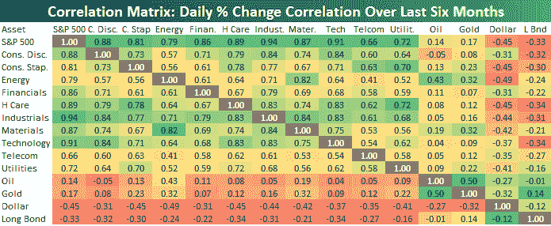
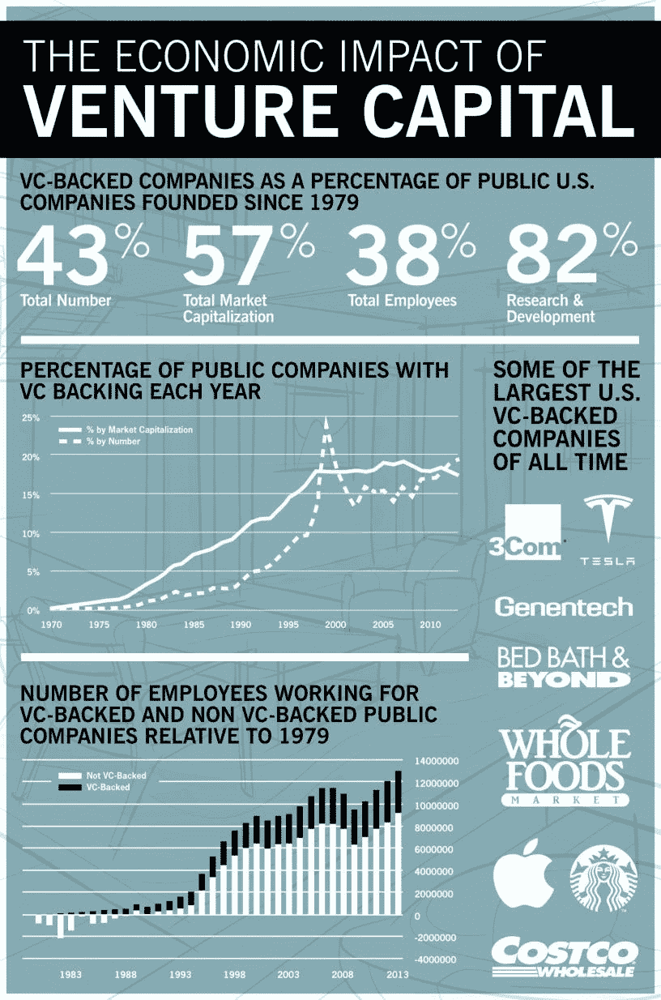

# 夏普比率悖论:为什么还要投资风险资本？

> 原文：<https://medium.datadriveninvestor.com/the-sharpe-ratio-paradox-why-still-invest-in-venture-capital-7fdc71c5c559?source=collection_archive---------15----------------------->

夏普比率是一种基于风险量化回报的方法，具体来说，它是每单位波动率或总风险超过无风险利率的平均回报。

有一些限制，例如，一个投资组合的回报分布稍有不同，就会产生非常不同的夏普比率。但总的来说，这是一个被广泛接受的指标。在过去的 25 年中，标准普尔 500 的年均夏普比率为 1，它经常被用作判断不同资产类别的基线。任何低于 1 的都被认为是糟糕的投资，因为你可以被动地把钱投入标准普尔 500，然后做得更好。

那么 VC 堆栈在哪里呢？简短而广为人知的答案是——不太好。举个例子，这是约翰·金莱的一个例子，他是一个备受尊敬的量化分析师。金莱从剑桥协会(Cambridge Associates)获得了 1981 年至 2014 年 Q2 季度合并端到端净回报的数据，发现夏普比率为 0.68。如果你稍微改变一下界限，你可以得到一个更高的数字，但底线是，VC 作为一个类别基本上低于 1。

 [## 在科技中心外创业？It 的 3 个论据|数据驱动的投资者

### 所以你不在像旧金山、纽约、伦敦、北京、特拉维夫或班加罗尔这样的顶级创业生态系统中？许多…

www.datadriveninvestor.com](https://www.datadriveninvestor.com/2020/03/15/startup-outside-a-tech-hub-3-arguments-for-it/) 

前 10%的风险投资基金表现更好，夏普比率高于 3，但你永远无法在事实发生前确定上十分位数是多少。总体而言，风险投资仍然有意义，主要有三个原因。

首先，它们与其他资产类别相对不相关。在同一时期，VC 和 S&P 的相关性平均只有 0.34。如下图第一栏所示，风险投资介于公用事业和石油之间，可能有更高的回报前景。此外，正如过去几周的事件所表明的那样，在像目前这样的低迷时期，短期内大多数相关性会达到 1(即与股票市场的相关性)。与此同时，风险投资组合的价值变化较慢，流动性收紧给了风险投资更多的杠杆和更好的条款。

当然，还有其他方法来创建一个多元化的投资组合，将风险回报降至最低。但风险投资是一种强有力的方式，这就是为什么有限合伙人通常会将 1-10%的资产投资于这一类别。

第二个原因是风险投资允许超额回报。很少有哪种投资能像风险投资一样在相同的范围内获得 100 倍甚至 10 倍的回报。对于这些交易，精明的普通合伙人(即风险投资)可以通过继续投资获得更高的回报，这意味着有限合伙人(即风险投资的投资者)可以投入更多资金。

第三个原因是各方面的影响，即经济、政治和社会。下图总结了 2015 年两位斯坦福学者的[论文的主要发现。](https://www.gsb.stanford.edu/insights/how-much-does-venture-capital-drive-us-economy)

如果你正在寻求塑造经济，潜在的合作伙伴或收购公司作为你自己的日常工作，学习新的想法，与优秀的人交往，或提供指导——风险投资可以说是最令人兴奋的方式。

*与*[*Eugeniu Plamadeala*](https://www.linkedin.com/in/eugeniuplamadeala/)*合作撰写，原载于“* [*数据驱动投资者*](https://www.datadriveninvestor.com/2020/03/29/the-sharpe-ratio-paradox-why-still-invest-in-venture-capital/) *”我很乐意在其他平台上辛迪加。我是*[*Tau Ventures*](https://www.linkedin.com/pulse/announcing-tau-ventures-amit-garg/)*的管理合伙人和联合创始人，在硅谷工作了 20 年，涉足企业、创业公司和风险投资基金。这些都是专注于实践见解的有目的的短文(我称之为 GL；dr —良好的长度；确实读过)。我的许多文章都在*[*https://www . LinkedIn . com/in/am garg/detail/recent-activity/posts*](https://www.linkedin.com/in/amgarg/detail/recent-activity/posts/)*上，如果它们能让人们对某个话题产生足够的兴趣，从而进行更深入的探讨，我会感到非常兴奋。如果这篇文章有对你有用的见解，请在 Tau Ventures 的 LinkedIn 页面* *上对这篇文章和* [*给予评论和/或赞，感谢你对我们工作的支持。这里表达的所有观点都是我自己的。*](https://www.linkedin.com/company/tauventures)