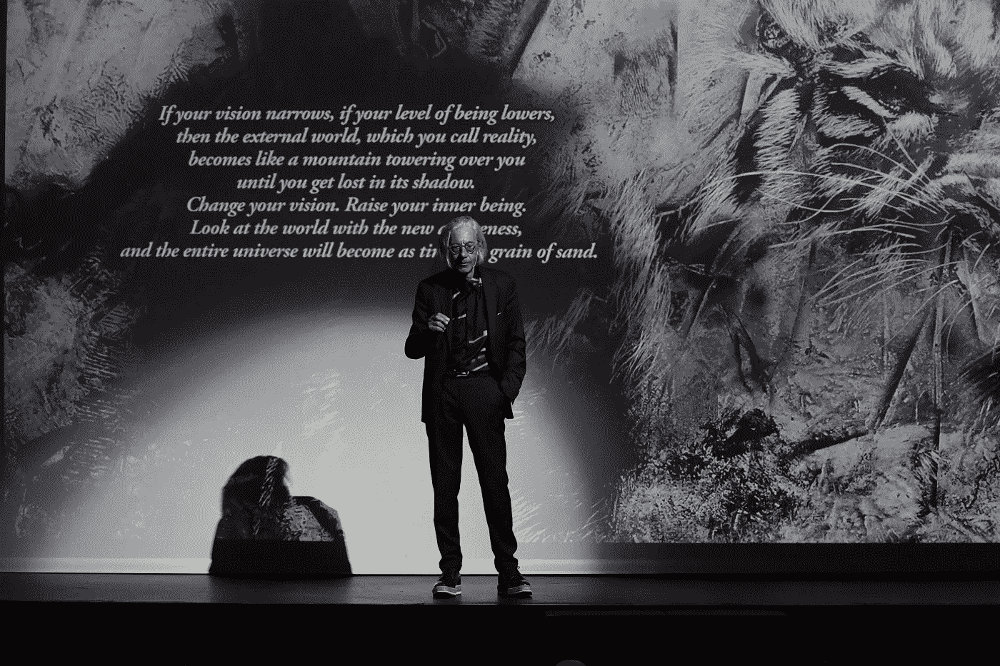

# 捷径还是遭遇的游戏

> 原文：<https://medium.datadriveninvestor.com/the-shortcut-704413a278f8?source=collection_archive---------3----------------------->

Image provided by the author

“捷径或相遇的游戏”是一条垂直的路径，它压缩时间，带我们快速到达我们内心最真实的东西:梦想。

“遭遇战”将允许你压缩时间…你将在游戏中比十辈子更了解自己…

## 对你来说，这个世界太真实了。只有“游戏”能把你从这种僵化、僵硬的描述中解放出来，让你接触到一个更加流动、更加流畅的世界。

显然，男人见面是为了做决定和达成商业协议；但是他们不知道在他们的关系中到底发生了什么。遇见自己是借口。真正的关系发生在另一个层面。在表面之外，当两个男人相遇时，赌注要高得多。

> 世界是一种情感

这些会议将帮助你衡量你的责任水平，他们将教会你完全了解自己，你将认识到你遇到的每个男人或女人都是你不为人知的一部分，是一个看到你的伤口或隐藏的疾病的机会，然后你将能够治愈。

其他的是在事件世界中具体化的存在状态…其他的是时间。

*“而为他人献出自己生命的人呢？谁会见他们是为了帮助和治愈他们？还有传教士？”*

甚至传教士也遇到了他自己，他的怀疑，他的恐惧，他的分裂。他和那些迷信的人混在一起，以克服自己的迷信。他进入痛苦的世界来治愈他的伤口，并回到源头，真正的原因。即使他没有意识到这一点，并认为他是在代表别人做事，但实际上是别人在为他做事，照顾他。

一旦他明白了他自身的哪些状态使他的使命成为可能，他就会痊愈；他不再需要做传教士了。他会让别人取代他的位置并超越他。

**对你来说，重要的是学会“看”如果你“看”，你会把那个男人或女人的历史变成你自己的历史，一瞬间你就会从年复一年的经历、努力、牺牲、成功和失败中获益。**

“看见”它们意味着在你的内心认识到它们，就像待愈合的伤口或待治愈的器官。“看见”意味着内在原谅自己。然后，每一次会面都会成为一个台阶，让你超越自我。

 [## SpaceX vs 维珍银河——太空旅游业务主导地位的竞赛|数据驱动的投资者

### 只有 566 个人去过太空。这些人 85%以上来自三个民族。超过一半的…

www.datadriveninvestor.com](https://www.datadriveninvestor.com/2020/11/25/spacex-vs-virgin-galactic-the-race-to-a-space-tourism-business-dominance/) 

这个世界，包括它的大陆和城市，以及人类活动的无尽的万花筒，就像不断由软粘土重塑的人物；似乎是一场大规模的战斗，数以百万计的无形决斗不断发生。他们的结果将决定谁该领导谁该跟随。

> 无论他们在哪里相遇，几分钟或几年；在沙漠里或在生意中，两个人不可避免地会形成一个金字塔。他们把自己放在一个看不见的梯子的不同梯级上，尊重一个内在的数学秩序，一个由亮度、轨道、质量和离太阳的距离组成的行星等级。

人类，像现在这样，不寻求治愈，也不想要。它被迫机械地前进，在未知力量的压力下……苦难和痛苦是它进化的动力。

即使看起来大多数人用自己的进步换取了表面上的职业保障，或是金钱财富或艺术成功的幻影；即使是最普通的人也无法逃脱一个不由自主的、机械的、难以察觉的愈合过程。组织中的工作，角色的单调乏味，生活不断呈现给他的对抗、痛苦和问题，共同形成了一种必要的训练，使他变得更好，并把他引向最高的自由地带。

这是一个非常缓慢的系统，在生命的垂直性上哪怕前进一毫米都需要花费一生的时间。

另一方面，“游戏”是攀登人类角色金字塔并以闪电般的速度超越它们的最快方法。

你仍然被困在你认为你是什么。在会面中，你看到的不是真实的你，而是你不是什么:那个你曾经相信自己是谁的人。

我会说，对自己的研究，自我观察，是轻的。当光来临时，阴影消失了，你身上所有真实的东西都留下来了，所有你不是的或者你相信自己是的东西都消失了。

在“游戏”中，没有什么需要计划的。你必须立即发明；有目的地表演出你从未经历过的角色和语言。这个时刻会告诉你策略，要用的词，以及所有你必须知道的东西，以便“满足”这次会面。

寻找特殊的男人和女人，他们在自己的环境中是真正的主人。像高度专业化的完美机器一样，他们在自己的世界角色中达到了绝对完美。

开始变得清晰的是，在每一次相遇的背后，在一段关系的表面肤浅之外，存在着一些特殊的东西:遇到众多不同类型的人标志着通往被称为“诚信”的愈合之路

其他人揭示你，衡量你，并完美地反映你的责任水平。

你遇到的每个男人都是一扇门。他可以禁止进入，也可以成为一个可以攀爬的台阶。每一次遭遇都会衡量你，决定你在人类责任阶梯上的位置。记住！其他人是你！…在“游戏”中，除了你自己，你不会遇到任何人…在几秒钟内，你必须了解你面前的是你自己的哪一部分，并立即明白那次相遇的目的是什么，该戴上哪一个面具，以及对方(无论是男人还是女人)希望你扮演的角色。

你们两个在‘游戏’中的区别在于，你知道怎么行动，而对方行动却不知道。这两者之间有一个无限的距离，一个永恒的差异，一个允许你以令人眩晕的速度垂直攀登的差异，人类角色的金字塔，征服在水平世界需要几年甚至几代人才能到达的位置。

## 访问专家视图— [订阅 DDI 英特尔](https://datadriveninvestor.com/ddi-intel)