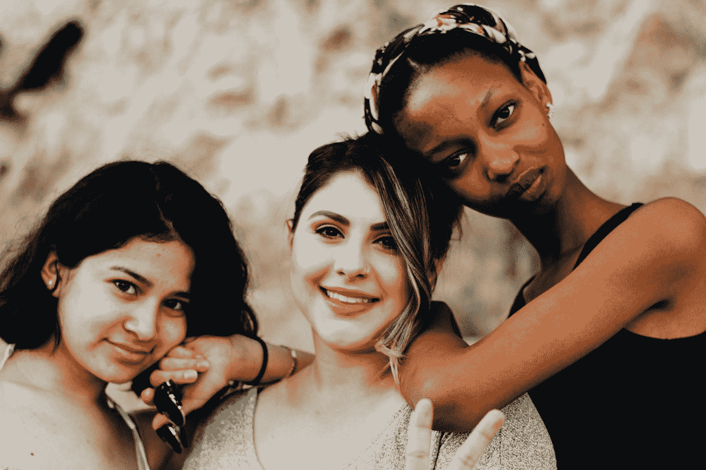

# 比吸烟或肥胖更危险的无声流行病

> 原文：<https://medium.datadriveninvestor.com/the-silent-epidemic-thats-more-dangerous-than-smoking-or-obesity-910386ae3a41?source=collection_archive---------10----------------------->

## 心理健康|自我

## 以及如何在它把你也带走之前抢先一步

Photo by [ActionVance](https://unsplash.com/@actionvance?utm_source=medium&utm_medium=referral) on [Unsplash](https://unsplash.com?utm_source=medium&utm_medium=referral)

香烟对我们有害。暴饮暴食对我们有害。久坐的生活方式对我们有害。

我们可能会死于肺癌。我们可能会死于糖尿病。我们可能会死于心脏病。如果你的牙医和我的一样流氓，他会让你相信我们也会因为不用牙线而死。

这就是所有的“好”消息。

“好”消息只是因为我们已经知道了这一点。当我们知道了，我们就可以准备了。当我们做好准备时，我们可以预防。尽我们所能。

但我也有一些坏消息。坏消息是因为这个更隐蔽，更不为人知。我们看不到的，我们就不治疗。我们不治疗的，会赢。

这就是了。

> 孤独现在是比 T2 吸烟更大的健康风险。孤独现在是比 T4 肥胖更大的健康风险。孤独现在是比癌症更大的健康风险。

请要求重新阅读。

自 80 年代以来，美国的孤独感增加了一倍。

研究表明，大约 60%的美国人有时或总是孤独。从 80 年代的 [30%](https://www.webmd.com/balance/news/20180504/loneliness-rivals-obesity-smoking-as-health-risk) 上升。

但是等等。这是怎么回事？为什么这些孤独数字会暴涨？

各种理论层出不穷。

也许是因为越来越多的人独自生活。在过去的 50 年里，由一个人组成的美国家庭增加了一倍多。

**更大的房子？1980 年，一所房子的平均平方英尺大约是 1700 平方英尺(T21)。到 2015 年，它大约是 2700 平方英尺。**

**更多电视？** 目前，31%的家庭拥有 4 台以上的电视机。

**更科技？** 96%的成年人都有智能手机

我们是否因为拥有更多空间而变得更加孤独？现在我们可以避免亲密——不管我们愿不愿意？还是因为我们有更多的电视。我们可以单独看电视，而没有和你的兄弟姐妹或配偶谈判的烦恼？

或者可能是对智能手机的上瘾？毕竟，没有什么比看到所有真正“快乐”的人在社交媒体上享受所有“真实的乐趣”更孤独的了。

还是以上都有？

我哥哥最近给我讲了一个可怕的故事。他的一位同事有两个孩子，他们都想要一台游戏机。为了不让孩子们为玩什么游戏而争吵，妈妈决定买两个游戏机。每个孩子一个。

现在，每个孩子都可以在各自的房间里独自玩他们想玩的任何游戏。他们不再需要学习如何分享或轮流；争论、不同意、协商和妥协。问题解决了。

解决了还是加剧了？

乐观偏见愚弄了我们，让我们认为我们永远不会孤独。我们认为，这是老年人需要担心事情。至于我，我很好，我们带着一些错觉相信。

> 但不像人类，孤独是不会歧视的。就像老年一样，它悄悄靠近我们，用它致命的双臂抱住我们。

它追求老年人。孤独的老年人(50-80 岁)比不孤独的同龄人更容易生病和过早死亡。

它追求年轻的成年人。整整 42%的新千年女性比癌症诊断更害怕孤独。

它追求男人和女人。富人和穷人。黑色和白色。

J.国际巨星 Lo 公开谈论她与孤独的斗争。“我确实谈过恋爱，有时是因为错误的原因而陷入错误的关系，因为我不喜欢孤独。我从小和姐姐们睡在一张床上。”

据报道，几乎是亿万富翁的 Zappos 前首席执行官 Tony Hseih 在上月的一场意外火灾中不幸遇难。但是一些和托尼最亲近的人报告了他死前的痛苦(T3)——孤独、抑郁和滥用药物。

> 我们上学是为了出人头地。我们工作更长的时间是为了领先。我们买了更大的房子来获得成功。然后孤独出现了，说:“别这么快！”

我们没有成功。孤独做到了。以二比一的比例。

孤独做了它的研究。它知道事实。它利用我们的不安全感、不稳定性和对独立的痴迷来对付我们。

但它不会赢。它不能。作为人类，我们所有人内心的战斗精神都为孤独储备了一些东西。

所以让我们以毒攻毒。孤独已经完成了它的研究。让我们也做我们的。

我们会学习的。我们会反思。我们会调整的。我们会适应的。

> "衡量智力的标准是改变的能力."―阿尔伯特·爱因斯坦

Photo by [Omar Lopez](https://unsplash.com/@omarlopez1?utm_source=medium&utm_medium=referral) on [Unsplash](https://unsplash.com?utm_source=medium&utm_medium=referral)

**在我们对抗孤独的战争中，最重要的是要知道:**

*   亲密关系对幸福的影响最大。
*   仅仅是几个亲密的朋友就能在孤独感上产生巨大的差异。
*   社交应该用[质量来衡量，](https://hartfordhealthcare.org/about-us/news-press/news-detail?articleid=27215&publicId=395)不是数量。

**外卖 1:**
我们可以慢慢来。一次一次有意义的谈话。一次一个家庭成员或朋友。更多不等于更好，质量才是。

**外卖 2:** 物质是非物质的。如果你住在豪宅里，孤独会找到你。如果你住在一辆小车里，它也能陪着你。

如果你一个人生活，孤独会找到你。如果你和 10 个人住在一起，它也能找到你。

这里还有一个孤独不想让你发现的秘密。

战胜孤独——联系。

在你的豪宅里连接；在您的小家里连接。
面对面连接，电话连接。

开心的时候联系，难过的时候联系。
弱则连，强则连。

用语言沟通，用行动沟通。
联系想要的，联系需要的

生病时联系，健康时联系。
穷则通，富则通。

连接到一个新的目标或激情。
重新找到先前存在的目标或激情。

如果所有这些“联系”很难或者不是自然而然的，那就做出改变的决定。这可能是生死攸关的事。

随着 COVID 病例在全国范围内激增，对我们大多数人来说，的确如此。

**那么让我们开始吧。**

*   拿起电话，给你一直在偷偷想念的人打电话
*   与他人分享你从未与他人分享过的脆弱的东西。
*   给你有段时间没见的人写封信，告诉他们他们对你有多重要。
*   给三个人发短信。告诉他们你爱他们，你只是在关心他们。
*   送一瓶酒给好朋友。安排一次约会，一起享受虚拟的快乐时光，品尝你最喜欢的葡萄酒。
*   报名支持一项你非常关心的事业。与 1-2 个支持同一事业的人建立关系。
*   和一个朋友去赴宴。开不同的车。隔着窗户相视而笑。开愚蠢的玩笑。离开前说一声“我爱你”。
*   报名参加远程咨询。试着找一个你觉得有联系的顾问。只要你需要，只要你能负担得起，就经常登记入住。
*   帮助你年迈的父母。帮助他们配药、填写申请表、接通 zoom 电话。
*   如果你不能去拜访他们，坐在他们的门阶上，隔着门和他们说话。你的声音会鼓舞他们。你可以通过你的历史，你的故事联系起来。
*   与你的孩子交流。不要只跟他们聊学校。问问他们到底过得怎么样。放松一点对完美分数的痴迷。
*   帮助他们虚拟地、创造性地与朋友联系。询问他们一天中的亮点和不足，以及第二天你可以尝试做的一件事，以帮助事情变得更好。
*   与你的社区联系。捐赠你的孩子不再穿的冬季夹克。看看是否有人能从你橱柜里那些未使用的罐头食品中获益。
*   这建立了一种精神上的联系，将我们与人类团结在一起。你可能永远也见不到这些善举的接受者——但它仍然有价值。

这张单子上有 11 项。选 1。试试 1。或者尝一半。或者尝试不在这个列表中的不同的东西。

对我们中的一些人来说，我们可能需要做得少一点——对我们中的其他人来说，我们可能需要做得更多。

我们是个体。我们是独特的。不同的事情适合不同的人。

但是，虽然我们在这个世界上是一体的，但我们不必在这个世界上独立。

为了战胜孤独，我们必须拥抱相互依存。我们必须记住，虽然我们可以单独做很多事情，但我们在一起会更好。

没有人是一座孤岛。没有人是孤独的。我们通过在孤独的游戏中击败它来战胜孤独。

我们通过更深入的联系来战胜孤独——在一个似乎在努力扼杀真正联系的世界里，人为地拓宽通往爱的道路。

> “当我们感到孤独时，我们并不缺少爱。我们与爱断开了联系。”――永康禅