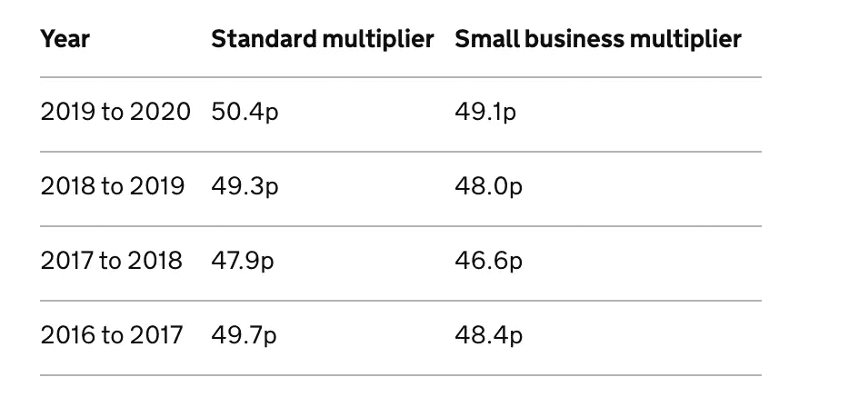
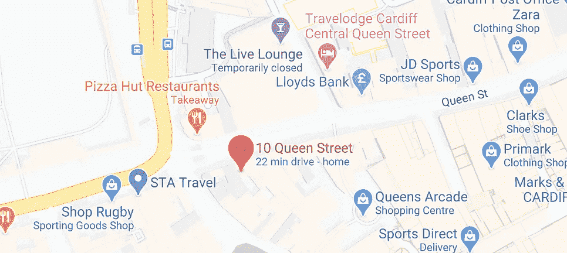
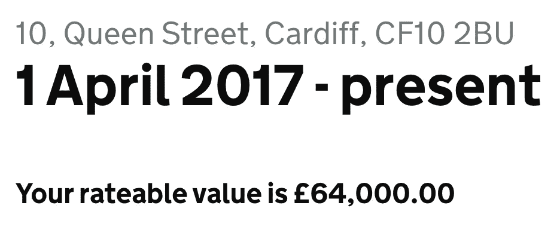

# 英国高街沉默的黑仔

> 原文：<https://medium.datadriveninvestor.com/the-silent-killer-of-the-uk-high-street-90c4a5a7f140?source=collection_archive---------7----------------------->

## 提示:这不是网上购物

Photo by [Gary Butterfield](https://unsplash.com/@garybpt?utm_source=medium&utm_medium=referral) on [Unsplash](https://unsplash.com?utm_source=medium&utm_medium=referral)

有一个无声的杀手正在逍遥法外，这是一笔你无法控制的隐性开支。那笔费用不在乎你的其他创业或成本，它捕食的是盈利的。

我会告诉你它是什么，但是首先我想知道你是否曾经想要在你的当地拥有一家古雅的小店？卖你热爱的东西来谋生。会很有趣的，对吧？

这并不像看起来那么容易或安全。你得考虑高昂的入行成本。

## 你必须支付:

*   租金
*   人员配备(公共就业保险、国家保险、养老金缴款等)
*   库存/货物成本
*   进口税和/或运输成本
*   储存；储备
*   您店面的标牌
*   营销
*   公用事业
*   保险(公共责任和针对您的资产)
*   销售规划
*   税收(个人税、公司税和其他)

我肯定还有很多成本要考虑。经营实体企业的成本一天比一天高。

> 2017 年[《卫报》](https://www.theguardian.com/business/2018/apr/11/tough-year-high-street-internet-shopping-weak-pound)报道称，“随着网络购物的兴起，时尚零售商、鞋店、旅行社和房地产中介已经被赶出了(商业街)。”

**从那以后，情况越来越糟。**

人们喜欢将英国商店的关闭归咎于在线购物，但这是一种关联，而不是因果关系。

 [## 如果资本主义失败了，那么还有什么选择呢？数据驱动的投资者

### 在当前政治领域的修辞之旅中，我们都可以面对面地接触到流行词汇，如…

www.datadriveninvestor.com](https://www.datadriveninvestor.com/2020/03/16/if-capitalism-is-a-failure-then-what-is-the-alternative/) 

然而，在那一年(2017 年)，英国有近 6000 家商店关门，没有一家媒体找到了实体企业的真正杀手——即 [**商业费率**](https://www.gov.uk/introduction-to-business-rates) 。

# 他们向谁申请？

根据英国政府官方网站，大多数非住宅物业都要收取商业税，比如:

*   商店
*   酒吧
*   办公室
*   工厂
*   仓库
*   宾馆和假日出租房屋

如果你将一栋建筑或建筑的一部分用于非住宅用途，你可能需要支付商业费用。

建筑和它的位置越好，你可能支付的就越多。

# 它们多少钱？

商业利率根据你所在的地区和物业的“应课差饷租值”而波动。每个比率由当地政府决定，并与每年变化的乘数相对照。

Screenshot taken by [Geraint Clarke](https://medium.com/u/5467d3aef1ca?source=post_page-----90c4a5a7f140--------------------------------) of [Gov.uk](https://www.gov.uk/calculate-your-business-rates) Business Rates Calculator

我从我所在城市的大街上随机选择了一家商店，并通过 gov.uk 网站找到了它的应课差饷租值。

## 要查找应付业务费率，请执行以下操作:

> 64，000(应课差饷租值)x 0.504(乘数)= 32，256(商业税率)。

Screenshots of [Google Maps](https://www.google.com/maps/place/10+Queen+St,+Cardiff+CF10+2BU/@51.4814937,-3.1805727,17z/data=!3m1!4b1!4m5!3m4!1s0x486e1cb08bf1e2f9:0x895a507878b1d84c!8m2!3d51.4814937!4d-3.178384) and the [rateable value](https://www.tax.service.gov.uk/business-rates-find/valuations/17760940000) taken by [Geraint Clarke](https://medium.com/u/5467d3aef1ca?source=post_page-----90c4a5a7f140--------------------------------)

当你听说 2017 年英国有 6000 家店关门了，你就得开始找原因了。额外的 3.2 万英镑会给企业带来压力吗？那笔费用是他们所有其他费用之外的。

此外，乘数每年都在增加。2017 年到 2019 年相差 5.2%。随着成本上升，税收增加，最低工资增加(人员配备)，商业利率上升 5%可能是盈利与否的区别。

根据[英国政府网站](https://www.gov.uk/introduction-to-business-rates/how-your-rates-are-calculated)、*的消息，“根据 2015 年 4 月 1 日起的应课差饷租值，最近一次商业税率重估于 2017 年 4 月 1 日在英格兰和威尔士生效。”*

2015 年是英国关店数量最低的一年，也是估值最高的一年。当 2017 年商业率上升时，它看到了自 2013 年以来最高水平的店铺关闭。

这些关闭继续滚滚而来，密集而迅速。

> [伦敦最受欢迎的金融和商业报纸 City AM](https://www.cityam.com/high-street-crisis-16000-shops-closed-in-2019/#:~:text=More%20than%2016%2C000%20stores%20have,forecast%20to%20rise%20next%20year.) 报道称，“2019 年总共有 16073 家商店关闭——每个工作日约 61 家——预计明年商店关闭率将上升。”

这些都是 COVID 关闭前，在一个繁忙的经济。*巧合？* **我认为不是。**

# 死亡和税收

> “在这个世界上，没有什么是确定的，除了死亡和税收。”——本杰明·富兰克林

不幸的是，英国高街正在选择死亡。商店、人流和整体美学的死亡。

## 这是一个自我延续的循环。

1.  你在一条安静的大街上开了一家商店。
2.  你的脚步加快了。生意很好。
3.  其他好企业也纷纷效仿。顾客很高兴。
4.  这个地区正在蓬勃发展。财产价值上升，所以商业利率增加。
5.  你关闭你的商店，因为你无法承受上涨的成本。
6.  其他好企业也纷纷效仿。顾客不高兴。
7.  客流量减少。生意对每个人都不好。
8.  大街又变得安静了。

通过某种地方激励、政府支持的商业贷款或降低商业利率，**周期又从 1 开始。**

如果你仍然不相信商业费率是罪魁祸首，那就开车经过英国任何城镇的一条安静的大街。你看到了什么？慈善商店？

当似乎只有数不清的慈善商店时，你会想“他们不可能有巨大的营业额，所以可能其他商店没有盈利或经营不善。”

*直到你学会这个…*

> **"**[**慈善商店接受强制性的 80%**商业税率**减免，并可由当地政府酌情提供剩余的 20%减免**](https://www.civilsociety.co.uk/news/councils-trying-to-charge-charity-shops-full-business-rates.html#:~:text=Charity%20shops%20receive%20mandatory%2080,at%20their%20local%20authority's%20discretion.&text=Many%20charity%20shops%20are%20registered,to%20gain%20other%20tax%20benefits.)**"**

**最后站着的是唯一不受商业利率影响的。**

**在商业侦探(呃)…业务中，我们称之为一击即中。结案了。**

****访问专家视图—** [**订阅 DDI 英特尔**](https://datadriveninvestor.com/ddi-intel)**