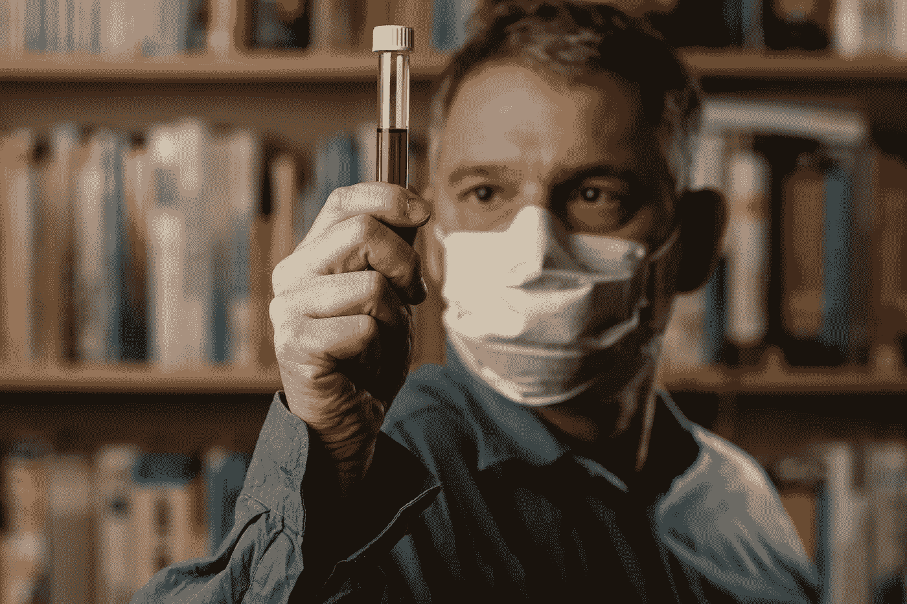
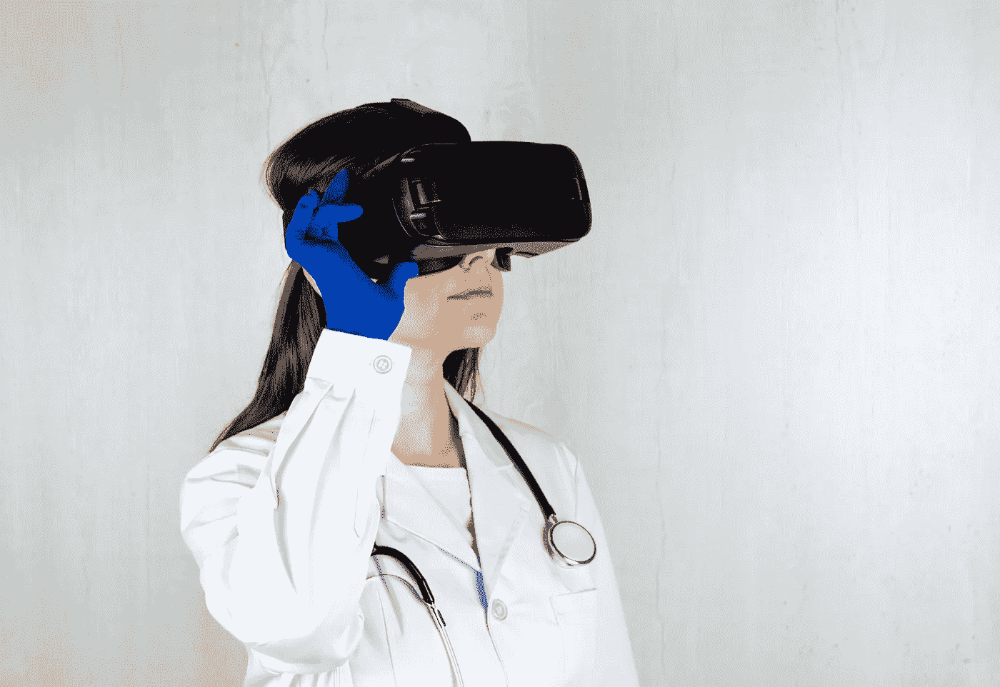

# 疫情期间临床试验的一线希望

> 原文：<https://medium.datadriveninvestor.com/the-silver-lining-for-clinical-trials-during-the-pandemic-45c9a19c4299?source=collection_archive---------29----------------------->

## 位于主要医疗中心的临床试验在疫情期间几乎停止，但一种新的方法已经使试验诞生。

Photo by [Stefan Heesch](https://unsplash.com/@nordfriisk?utm_source=unsplash&utm_medium=referral&utm_content=creditCopyText)

> 没有书而学医的人航行在未知的大海上，但是没有病人而学医的人根本不出海。—威廉·奥斯勒

临床试验对我们理解疾病过程至关重要。新开发的药物和治疗的试验提供了药物如何改善症状、消除疾病或杀死患者的洞察力。

[安排这些试验的通常程序](https://www.fda.gov/drugs/development-approval-process-drugs/conducting-clinical-trials)是，一旦患者被招募，他们每周或按其他时间表返回研究地点进行测试。在某些情况下，测试可能会持续数周、数月甚至数年。

> 虽然“新”可能意味着“更好”，但在该治疗的临床研究完成之前，尚不清楚潜在的医学治疗是否对患者有益。临床试验是新产品发现和开发不可或缺的一部分，食品药品监督管理局要求在新产品上市前进行临床试验。

收集的数据是至关重要的，没有这些数据，研究人员的工作就像人们在黑暗的房间里四处摸索一样。在这一过程中可能会花费数年时间，直到出现突破性进展。

## 变革性的临床试验出现

由于患者不能出行，工作人员不能去实验室，疫情突然停止了一些研究。这对病人来说是可怕的，对从未预见到这种情况的研究人员来说是惊人的。一些试验中唯一的问题是招募那些愿意从远处赶来参加试验的病人。

当我在精神病学研究部门工作时，病人的家属提供了一大笔钱来购买他们进入阿尔茨海默氏症试验的方法。我们拒绝了这些提议，因为科学不是基于你有多少钱或者你是谁。

一个家庭出价 2.5 万美元；另一个告诉我们说出他们母亲参加试验的费用。即使是那些受损太严重而无法参与试验方案的人，也有家人恳求他们成为受试者。*告诉他们他们所爱的人从试验中获益已经太晚了，这从来都不是一件容易的事。*

显然，我们在这个以前强烈的警告中看到了一些断层线。但是医疗界已经开始合作进行变革性的临床试验。现在这开始有回报了，但即使在这里，改变的需要也是显而易见的。

> 在进行了超过 25 个项目并发布了改善临床试验的设计和执行的具体策略的建议后，出现了一些共同的主题和经验教训。经验教训包括让许多利益相关方参与进来的重要性、解决关键问题的高级规划、非增值实践的中止以及技术带来的新机遇。

Photo by [Erik Mclean](https://unsplash.com/@introspectivedsgn?utm_source=unsplash&utm_medium=referral&utm_content=creditCopyText)

## 在 Covid 的约束下改进临床试验

> 新冠肺炎疫情对全世界的临床试验研究造成了巨大的破坏。与生活的其他方面一样，该病毒严重影响了以安全有效的方式进行试验的能力。考虑到试验经常涉及暴露于新冠肺炎病毒风险最大的弱势人群，情况尤其如此。成千上万的试验被暂停或停止，因为在封锁条件下继续进行很困难，尽管这些限制在世界上的一些地方已经开始放松。

[隔离、隔离和社会距离](https://www.healthaffairs.org/do/10.1377/hblog20200702.963588/full/)作为阻止病毒传播的预防措施，增加了进行临床试验的难度。医疗资源和医务人员也出现短缺。虽然试验可能已经暂停或终止，但其他人预计招募和新研究的启动将会延迟。

讨论中的新变化之一将导致中央委员会批准临床试验，而不是机构拥有自己的研究审查委员会( [IRB](https://research.oregonstate.edu/irb/frequently-asked-questions/what-institutional-review-board-irb) )。据信，这将加快审判开始的速度。此外，由于在临床环境中暴露于 covid 病毒，可能需要当前试验中的患者重新同意。

在过去，除非有正当理由让患者退出，否则预计患者会继续参与研究。临床试验现在可以为特别易受病毒感染的个体提供早期终止治疗，这些个体在临床环境中不应该处于危险之中。

 [## 你的 COVID 等级是多少？为疫情安全设计办公空间|数据驱动投资者

### 自从新冠肺炎·疫情席卷美国，迫使工人逃离办公室，走向孤立无援的境地…

www.datadriveninvestor.com](https://www.datadriveninvestor.com/2020/11/23/whats-your-covid-rating-designing-office-spaces-for-pandemic-safety/) 

出于监测目的，特别是对于老年人或癌症方案，建议尽可能在医院或临床环境之外进行监测。此外，需要注意患者无力支付任何试验的费用，尤其是那些没有医疗保险的患者。但是现在 covid 使用了新的方法。

技术的进步促进了重要的[远程医疗](https://www.healthline.com/health/best-telemedicine-companies)的发展，它可以在远离发源地的临床试验中实现某些类型的监测。评估当前数据的新方法也在考虑之中。从被终止的试验中获得的数据仍可能提供重要的进展，并将被审查。与此同时，试验必须尽可能分散进行，以确保试验人群有足够的样本。

Photo by [Bermix Studio](https://unsplash.com/@bermixstudio?utm_source=unsplash&utm_medium=referral&utm_content=creditCopyText)

## 研究必须继续

> [“当我们导航](https://scopeblog.stanford.edu/2020/12/07/running-clinical-trials-in-a-pandemic/)这个新时代时，我们不断评估我们如何适应新冠肺炎的压力和限制的风险和收益，”斯坦福医学院负责研究的高级副院长露丝·奥哈拉博士告诉我。“我们在这方面的想法是优先考虑患者安全，同时认识到亲自出诊和临床试验仍然是临床研究的核心，最终转化为现场患者护理。因此，我们需要想办法在疫情期间完成我们的临床研究任务。”

数字工具，如病人可能佩戴的工具，以及远程医疗，现在都被纳入临床协议。此外，病历、患者同意书，甚至认知能力的远程测试和神经病学检查都可以使用计算机进行。使用这种技术可以消除每周或每月对网站的访问。

> 这使得临床研究人员能够评估多个时区的患者，这在过去是不可能的。

患者不再必须与研究人员在物理环境中，这需要改变对协议的思考。一名研究员，[医学博士 Rajesh Dash 博士，](https://profiles.stanford.edu/rajesh-dash)。已经开始了一个新的项目，这将是一个全数字化的临床试验。他将能够远程监控患者对药物治疗方案的依从性，并评估其他几个问题。

出于需要，疫情带来了创新。临床试验的前景现在已经以一种新的方式被扫清，全虚拟试验被认为是可行的。这些新的虚拟试验将提供更广泛的患者群体，而没有过去的限制。

这种新的形式不仅可以节省时间，还可以让那些因为位置偏远而没有机会参与的患者也能参与进来。由于研究领域的技术变革，医疗保健将真正惠及贫困大众。

## 访问专家视图— [订阅 DDI 英特尔](https://datadriveninvestor.com/ddi-intel)