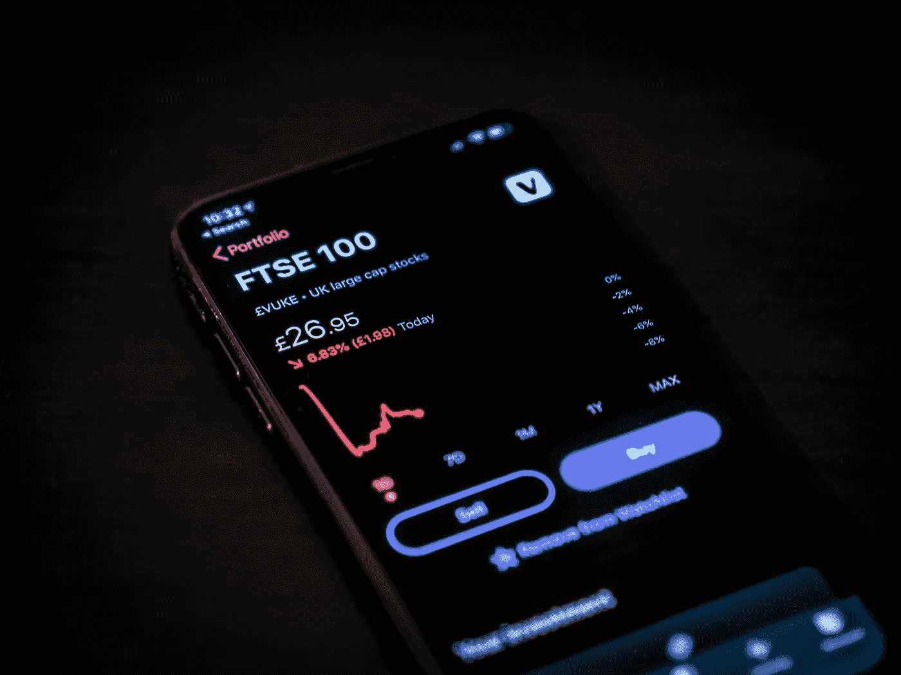

# 股票市场投资的简单事实

> 原文：<https://medium.datadriveninvestor.com/the-simple-truth-about-stock-market-investing-7ce6d1c12bad?source=collection_archive---------3----------------------->

Photo by [Jamie Street](https://unsplash.com/@jamie452?utm_source=unsplash&utm_medium=referral&utm_content=creditCopyText) on [Unsplash](https://unsplash.com/s/photos/invest?utm_source=unsplash&utm_medium=referral&utm_content=creditCopyText)

## 你能做的最好的投资可能是最无聊的投资。

*如果您需要任何帮助，您可以点击* [*这里*](https://www.investopedia.com/financial-term-dictionary-4769738) *找到本文中所有金融术语的定义。*

投资股市是为了赚钱。这就是**唯一的**原因。因此，我觉得具有讽刺意味的是，许多投资者最终在股市中损失的钱比他们实际赚的还要多，原因我们稍后会深入探讨。

他们说后知之明是一件美妙的事情。如果你和任何人谈论长期投资，你可能会听到下面这句话的变体:

*“要是我在(插入公司名称)刚刚起步的时候就把所有的钱都投资进去，我现在已经拥有一座加勒比海岛屿了！”*

Photo by [jcob nasyr](https://unsplash.com/@j_cobnasyr1?utm_source=unsplash&utm_medium=referral&utm_content=creditCopyText) on [Unsplash](https://unsplash.com/s/photos/island?utm_source=unsplash&utm_medium=referral&utm_content=creditCopyText)

我们都想找到下一个亚马逊。毕竟，1997 年对亚马逊的 1 万美元投资，如今价值不到 2200 万美元，增长了 220，000%。不算太寒酸吧？

听到这些财富积累的故事可能会令人陶醉，尤其是对新投资者而言。你可以很容易地花上几个小时查找股票提示或阅读公司财务，不顾一切地寻找一点信息，将你带到下一个行业领先的公司。

但是，对于世界上每一个亚马逊或苹果公司，都有数百家其他公司最终倒闭。在我看来，毫无疑问，在世界的某个地方，有人正在研究一些想法，这些想法有朝一日会成为下一个十亿甚至万亿美元的公司。

 [## 收盘，但没有雪茄-股票市场目标在停滞的 COVID 救济中创新高|数据驱动…

### 专家聊天程序:一个协作市场，在这里人们可以和能够解决他们问题的专家聊天。是……

www.datadriveninvestor.com](https://www.datadriveninvestor.com/2020/08/18/close-but-no-cigar-stock-market-targets-record-highs-amidst-stalled-covid-relief/) 

## 我能告诉你一个秘密吗？

不知道会是哪家公司。

互联网上的陌生人告诉你现在就投资一家公司*还不算太晚，他也不知道。*

*投资专业人士拿着巨额报酬试图弄清楚这些事情，即使他们大多数时候都是错的。没有人知道。*

*自今年早些时候股市崩盘以来，我花了大量时间研究股市。我买过个股。我试过交易细价股。我读了《滚雪球:沃伦·巴菲特和生活中的商业》(伟大的书),作为我努力理解如何成为一个成功的投资者的一部分。所有这些让我对股市得出了两个简单的结论:*

*   *大多数人不具备尝试和挑选个股所需的情绪控制能力*
*   ***随着时间的推移，大多数人战胜市场的努力都会失败。***

# *反对个股的理由*

*我从挑选个股开始了我的投资之旅。我的回报不错，但随着时间的推移，我意识到这开始严重影响我的心理健康。我会发现自己每天多次检查我的投资组合，渴望看到我的股票表现如何。如果我的股票有一天下跌，我会为此失眠，我的大脑会开始质疑我的决定，事后看来，这绝对是荒谬的。*如果市场对苹果的估值比昨天低 10 美元，这是否意味着苹果突然变成了一个糟糕的投资？不要！**

**

*Photo by [Tim Gouw](https://unsplash.com/@punttim?utm_source=unsplash&utm_medium=referral&utm_content=creditCopyText) on [Unsplash](https://unsplash.com/s/photos/stressed?utm_source=unsplash&utm_medium=referral&utm_content=creditCopyText)*

*这听起来可能很傻，但这正是让投资者陷入困境的想法。我们中的许多人无法控制自己的情绪，这意味着我们更有可能根据这些情绪而不是理由做出决定。因此，当市场下跌时，许多投资者最终会恐慌性抛售，急于避免进一步的损失。这就是为什么我认为大多数人应该避免选择个股。*

> *"如果你不能控制你的情绪，你就不能控制你的金钱."—沃伦·巴菲特*

## *但是不要只相信我的话…*

*沃伦·巴菲特被公认为世界上最伟大的投资者。在过去的 50 年里，他积累了价值近 800 亿美元的财富，他的公司伯克希尔哈撒韦公司是一家拥有超过 7000 亿美元资产的跨国企业集团。他是如此受人尊敬，以至于伯克希尔·哈撒韦公司的股东年会经常被称为“资本家的伍德斯托克音乐节”，来自世界各地的人们蜂拥而至，聆听他的智慧之言。*

*但他的终极建议是“照我说的做，不要照我做的做”，他一再建议投资者避免试图从个股中挑选赢家，而是坚持投资于低成本的标准普尔 500 指数基金。*

*他的理由有三点:*

*   *指数基金提供跨公司和行业的即时多样化，如果你选择个股，这需要更多的资金。*
*   *这让你更容易控制自己的情绪。在挑选个股时，你的大脑会进入“买进卖出”的思维模式，你更有可能在错误的时间买进或卖出。通过每月自动投资指数基金，你可以消除决策中的所有情绪，从长远来看，这对你的回报会好得多。*
*   *投资指数基金，而不是单个股票或积极管理的共同基金，将避免消耗你回报的昂贵费用。*

# *我赌 100 万美元，你不会跑赢市场…或者至少沃伦·巴菲特会*

*2008 年，众所周知，沃伦·巴菲特向对冲基金行业发出挑战，押注标准普尔 500 将在 10 年内超越任何基金经理。他押了 100 万美元，赢了。*

*但是可以肯定的是，通过花钱请一位专业人士来**积极管理你的投资，比你的钱只是跟踪股票市场的表现有更高的回报率是合理的。对吗？***

**错了。**

*在过去的 60 年里，标准普尔 500 的平均年回报率约为 8%。2019 年，标准普尔 500 指数全年上涨 28.9%，这是自 2013 年以来的最大一年回报率。但相比之下，主动管理型基金表现如何？*

*来自晨星的研究发现，2019 年，[只有 40%的主动基金](https://www.morningstar.com/articles/962251/howd-active-funds-do-in-2019-so-so)成功超越其基准指数。他们不仅表现不如指数基金，而且高得多的费用意味着积极投资者得到的回报比他们仅仅投资指数基金还要低。因此，如果绝大多数投资专业人士都无法战胜市场，我们其他人还有什么机会呢？*

# *简单地*

*我不是说没人应该选择个股，也不是说没人能战胜市场。我要说的是，绝大多数人应该避免尝试，至少在开始的时候。*

*投资就是做决策。但如果市场暴跌，投资者通常能做出的最佳决定是什么都不做。大多数人做不到这一点，所以他们通常最终会做出错误的决定，这种决定是基于情感而不是理由。但这不是批评。我就是这些人中的一员，这就是为什么在过去一个月左右的时间里，我开始逐步卖出我的一些个股，并用指数基金取而代之。*

*如果你是投资新手，接受我的建议。**设立每月自动投资成低成本指数基金**，然后一二十年算了。总回报会更少，你也不会跑赢市场。但是你知道吗？你晚上会睡得更好，这是我个人比 T21 更愿意付出的代价。*

*乔恩·彼得斯是一名 29 岁的作家，目前正在第二次狂看《T2》。如果你喜欢这个作品，你会喜欢这个****，你可以点击** [**这里**](https://medium.com/@justaguywhowrites) **快速进入我的个人资料。感谢阅读！*****

*****访问专家视图—** [**订阅 DDI 英特尔**](https://datadriveninvestor.com/ddi-intel)***