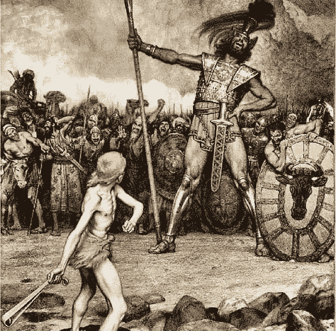

# 狗打架的大小——Ad Otium

> 原文：<https://medium.datadriveninvestor.com/the-size-of-the-fight-in-the-dog-ad-otium-53fa57993892?source=collection_archive---------13----------------------->

前几天，我被在线个人理财领域的 FOMO 和战斗的水平震惊了。每个人似乎都在向上看，一旦他们有了更多的钱，未来肯定会更好。金融界充斥着我们似乎不想错过的投机行为。比特币。黄金。TSLA。

通过关注那些比我们更有钱(有时更没头脑)的人，我们破坏了自己的鉴赏力。对于如何才能专注于做一个好人，关心他人，练习自我控制…同时不断接受外界对你地位的诋毁？

我们需要小心那些宣扬良好财务实践的人，但在大多数情况下，他们试图超越彼此。

# 理解动机

看了一眼 Twitter 的个人理财领域后，我注意到了一个模式。一旦用户的追随者超过了一定的水平，他们就会开始向你推销东西。当然，努力赚点外快并没有错，在某个时候，我可能也会这么做。

但是，如果他们的唯一信息是你应该购买他们的产品，他们是在假设你的精通水平之上。他们在告诉你:你和我一样不知道自己在做什么，所以买我的课程/电子书来教育自己吧。

如果你真的需要学习，这一切都很好，但可能精通个人理财的普通用户会看到这个轰动的产品，并获得 FOMO。毕竟，他们希望边缘能够自己掌握这门学科。在他们意识到这一点之前，买家会后悔，他们意识到自己一直都知道。

比喻性地“购买”这些高成就者的地位信号和数据过载，与购买一辆全新的法拉利有什么区别？两者都能让你自己成为一个状态信号员，除了后者(而不是前者)在 FI/RE 社区中是最受嘲讽的。更容易将目标锁定在不属于这个群体的人身上。

更重要的是——没有人关心你自己的钱，除非他们想拿走一部分。

 [## 我与理财顾问的“丰富”之旅——你应该避免的错误|数据驱动型投资者

### 20 多岁的时候，我从来没有想过退休或者养老。不知不觉中，我相信了每个国家的养老金制度

www.datadriveninvestor.com](https://www.datadriveninvestor.com/2020/12/03/my-rich-journey-with-a-financial-advisor-mistakes-you-should-avoid/) 

# 为正确的理由而战

> *'* ***这不是打架的狗的大小*** *，* ***这是打架的狗的大小*** *—马克·吐温*

我们很多人都很有竞争力。这是让我们成为人类的一部分，也是吸引我们实现财务独立等财务目标的一部分。但是我们可以利用这种精神来回馈世界，而不是煽风点火。

我认为这种能力主要来自于你对自己的感觉有多舒服。没有必要试图在互联网上战胜随机的人，也没有必要为自己没有的东西感到羞愧。最终，我们都会带着我们的思想死去。

相反，我们可以将这种竞争能量用于对抗他人的困境。我们可以为正义而战，用我们的资产去帮助那些需要帮助的人。我们可以放弃多巴胺传送带的“好处”,转而努力为他人的生活增加价值，而不是为我们自己。

有时生活是一场战斗，但作为失败者战斗会更好。在那里你可以看到更大的画面，并意识到通常不值得一开始就去战斗。如果你最终真的怀疑自己的地位，你也没那么多时间去堕落。

# 反对个人金融军备竞赛

如果我们把个人理财视为一场军备竞赛，我们会走得很远，但我们永远不会失去竞争对手。除了少数例外，总有比你拥有更多物质财富的人。这场运动的核心信息不就是不买不必要的物质吗？而花在自己身上的钱到了什么地步就变成物质了？

难道我们不应该认为我们的时间比我们的金钱更有价值吗？当然，金钱可以在未来为你“购买”时间，但如果你的余生都在观察别人的进步，那又有什么好处呢？

如果我们接受一种全新的生活方式，总有一天我们会对自己的命运感到满意，在我们达到一个神奇的数字之前，没有理由不能达到这一点。超出这一范围的无止境的忙碌变成了一种虚荣心。除了嫉妒你的人之外，没有人想知道你有多少钱。

*原载于 2020 年 12 月 19 日*[*【https://adotium.co.uk】*](https://adotium.co.uk/the-size-of-the-fight-in-the-dog/)*。*

## 访问专家视图— [订阅 DDI 英特尔](https://datadriveninvestor.com/ddi-intel)