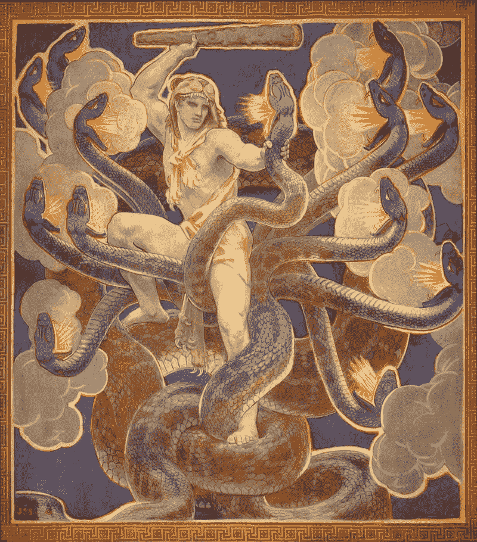
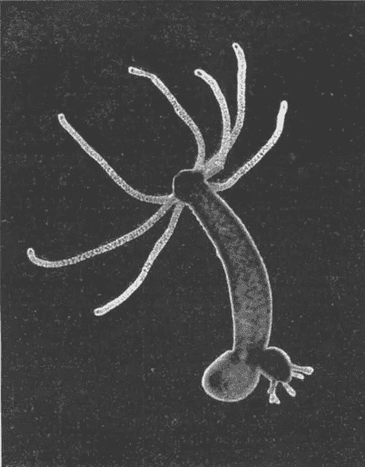

# 九头蛇的睡眠

> 原文：<https://medium.datadriveninvestor.com/the-sleep-of-the-hydra-7246ca4e0248?source=collection_archive---------2----------------------->

## 对一种简单无脑动物的新研究向我们展示了睡眠的深层进化根源

Painting of Hercules fighting a hydra (by John Singer Sargent, 1921, Wikimedia Commons)

# **1。** **睡觉……**

我们中的大多数人都通宵工作，或者睡眠不足。当我们设法“补上睡眠”时，我们感觉到这造成的严重损害，并感到极大的宽慰——科学证实了这些感觉。

《科学》杂志上的一篇新的[论文](https://advances.sciencemag.org/content/advances/6/41/eabb9415.full.pdf)帮助我们理解睡眠及其调节是如何进化的，以及为什么它如此重要。这项研究揭示了水螅的睡眠行为，这是迄今为止确认的最简单的生物，与人类关系非常遥远。然而，作者表明，水螅与我们分享相同的控制睡眠的遗传机制，以及调节睡眠的化合物，如褪黑激素。

我在这里写了关于睡眠及其在动物身上的测试[，并指出科学家们现在知道了一些关于睡眠的重要事情——但仍然对它感到困惑。](https://medium.com/history-of-yesterday/the-sleep-studies-from-hell-2a9468381ab1)

首先。睡眠至关重要。如果我们不睡觉，我们就会死。如果我们睡眠不足，我们的身体会垮掉。

第二。睡眠是一种非常保守的生物特征。也就是说，我们和许多看起来毫无相似之处的物种有着相同的特征，但是在进化的很长时间里，我们有着共同的祖先，这种特征来自于他们。

第三。我们几乎不知道为什么睡眠如此重要。尽管我们对睡眠的遗传学、分子生物学和生物化学了解很多，但它仍然是一个基本的谜。

我们知道哺乳动物、鸟类、爬行动物、两栖动物、鱼类、苍蝇、蠕虫，甚至水母都有我们称之为睡眠的行为。我们知道广泛多样的物种共享相似的睡眠遗传学和生物化学，因此相似的化合物诱导所有的睡眠或觉醒。

随着我们进一步追溯到可能与人类有着共同祖先的最原始的生物，我们希望解开睡眠的原因，就像我们已经破译了睡眠的方式一样。

睡眠的一个重要原因是假设睡眠的最初目的是再生或更新大脑。我的文章强调了更简单和更小大脑的动物的发现，这些动物也显示了睡眠行为和生物化学，最终包括美丽但无脑的仙后座水母——这推翻了这一假设。

九头蛇很好地帮助我们理解睡眠的进化方式和原因。它是睡眠的多细胞动物中最简单和最基本的一种，它对诱导睡眠的化学物质的反应与人类和我们迄今为止测试的各种动物相同。

# **2。** **九头蛇…**

Hydra (Flatters & Co., 1911, Wikimedia Commons)

九头蛇是一种美丽而引人注目的生物，值得研究。上面这张拍摄于 1911 年的微小生物的照片，与约翰·辛格·萨金特十年后创作的神话画有着惊人的相似。就像神话中的野兽，如果你砍掉它的头，它会长出一个新的。谢天谢地，它只有一厘米长。碰到这个就没必要雇大力士了。

从许多方面来看，它都是一种极其简单的有机体。它只有两个细胞层:表皮是像我们皮肤一样的外层，而胃真皮是内衬胃的内层。

水螅的形状像一个袋子，或者是一个在“脚”端封闭的空心管，在“头”端有一个开口，周围有多达 12 个触手——但它从头到尾都是空心的。整个生物就是一个长着触角的胃。

这个开口是它用来吞噬猎物的嘴，但也是排出猎物不消化的残余物的同一开口。它的嘴也是它的肛门。所以，下一次你想叫某人大嘴巴但又不想这么直接的时候，你可以叫他们九头蛇。

触须上有用来麻痹猎物的刺细胞。它有相当复杂的狩猎和进食动作，这可能是由受伤的猎物释放的化学物质引发的。水螅通常是不动的，但有时会移动，尤其是在狩猎时。

对我们的讨论最重要的是，水螅有一个神经网络，而不是更复杂的动物的中枢神经系统，而且它没有大脑。

 [## 新的健康技术如何让我们活过 100 岁？数据驱动的投资者

### 不久前，我们都在看一台黑色电视，不得不带着天线跑遍整个公寓，以确保…

www.datadriveninvestor.com](https://www.datadriveninvestor.com/2020/08/12/how-new-health-technology-makes-us-live-past-100-years/) 

# **3。** **九头蛇之眠……**

这篇科学论文的主要作者 Hiroyuki Kanaya 和高级作者 Taichi Itoh 都在九州大学，他们与来自韩国和法国的国际团队合作。他们一起通过记录水螅在 12 小时人工明暗周期中的运动来检测其睡眠行为。通过分析连续的帧，他们的 [R 编程的](https://en.wikipedia.org/wiki/R_(programming_language))代码可以自动区分静止和活动。通过这种设置，作者探索了九头蛇的行为，并证实了这种无脑动物表现出类似于具有中枢神经系统的动物的睡眠反应。这些睡眠特征包括:

*   扰乱睡眠的能力，或者如作者所说，“可逆的行为静止”
*   对正常刺激没有反应
*   遵循由日光调节的内部睡眠时钟
*   对褪黑激素等催眠药物的敏感性

干扰睡眠的能力是哺乳动物睡眠的基本特征。我们睡着了，对正常刺激没有反应(上面列出的第二个睡眠特征)。而是一个相当大的刺激(一个很大的声音，一个剧烈的震动，等等。)能唤醒我们。研究人员表明，明亮的光线可以“唤醒”沉睡的水螅，并且对于更亮或更长的光脉冲，唤醒的延迟更短。

Kanaya 等人还在各种光照和黑暗条件下测试了水螅。正常条件是 12 小时的明/暗周期。他们还将水螅暴露在持续的光照或黑暗中，以观察这些动物是否有任何内在的昼夜节律。没有找到。与人类等拥有中枢神经系统的动物不同，九头蛇的睡眠似乎与体内时钟无关。

# **4。** **睡眠的化学和遗传学…**

这个研究小组还测试了他们圈养的水螅是否对褪黑激素敏感，褪黑激素是一种被证明可以诱导从水母到人类等多种动物睡眠的激素。他们发现，确实增加褪黑激素剂量增加了他们的睡眠，就像我们一样。

Kanaya 等人随后检查了水螅的基因组，并发现了与具有中枢神经系统的更复杂动物中调节睡眠的神经递质相似的基因。关键基因包括:

*   **酪氨酸羟化酶** —一种催化 L-酪氨酸转化为 L-多巴的酶
*   **3，4-二羟基苯丙氨酸(DOPA)脱羧酶**——从左旋多巴制造多巴胺
*   **多巴胺受体** —与多巴胺结合并传递其睡眠效应的细胞表面受体
*   **谷氨酸脱羧酶** —将谷氨酸转化为γ-氨基丁酸
*   **GABA 转运蛋白** —将 GABA 转运穿过中枢神经系统神经元膜
*   **GABA 受体** —对 GABA 有反应的细胞表面受体
*   **GABA 转氨酶** —一系列合成、传递和降解 GABA 的酶

GABA(γ-氨基丁酸)是复杂动物中一种强大的抑制性神经递质，如具有中枢神经系统的脊椎动物——它可以降低神经元的兴奋性——并诱导睡眠。

hydra 的研究人员发现 GABA 在诱导动物睡眠方面非常有效，这与其对脊椎动物的作用一致。

然而，众所周知，多巴胺会抑制脊椎动物的睡眠，而在水螅中却正好相反。当他们增加多巴胺前体左旋多巴的剂量时，这一令人惊讶的结果得到了证实，否则就会触发多巴胺的产生，并获得与直接添加多巴胺并使水螅睡眠时相同的结果。

这些结果告诉 Kanaya，尽管 GABA 和多巴胺对睡眠的影响相似或不同，但它们都在睡眠调节的早期发展中进化。

在另一个有趣的实验中，这个团队在比较睡眠不足的水螅和对照动物时，确定了哪些基因被上调或下调。他们对产生的基因列表进行了一系列过滤，最终得到了一个水螅基因，它与蠕虫、苍蝇和哺乳动物中的一个促进睡眠的基因非常相似，称为 PRKG1。使用已知的抑制或激活该基因的药物，研究小组表明 PRKG1 也促进水螅的睡眠——并得出结论，PRKG 肯定是调节所有动物睡眠的祖先基因之一。

在这个实验中还发现了其他基因，根据他们对 PRKG1 的研究结果，Kanaya 等人推测这个基因列表可能包含更多与睡眠相关的基因。他们测试了这一点，从基因上敲除了苍蝇的等效基因，发现这些基因确实干扰睡眠。其中一个果蝇基因是一种叫做鸟氨酸氨基转移酶(OAT)的线粒体酶。鸟氨酸是一种已知的睡眠促进剂，饮食中的鸟氨酸被用于包括人类在内的动物以促进睡眠。研究小组惊奇地发现，饮食中的鸟氨酸促进了水螅的觉醒——再次与脊椎动物的效果相反。但结论是鸟氨酸作为睡眠调节剂有着古老的起源。

# **5。** **睡眠的功能……**

这个团队检查的最后一件事是睡眠剥夺对细胞增殖(细胞分裂)的影响。众所周知，睡眠剥夺会阻止哺乳动物和苍蝇的细胞增殖(这是生长和愈合所必需的)。

研究小组发现，当九头蛇缺乏睡眠时，细胞停止分裂。这种细胞增殖的缺乏发生在动物的全身，表明睡眠系统地调节细胞分裂。更重要的是，他们得出结论，睡眠的功能可以追溯到这种没有中枢神经系统的简单生物，追溯到恢复性细胞分裂的调节。

睡眠是所有动物的一个重要的基本功能。缺乏睡眠是有害的，最终是致命的。睡眠的目的仍不完全清楚，但这些在水螅中的实验表明，睡眠的一个古老而原始的目的可能是恢复细胞分裂和生长。

可能随着动物发展出中枢神经系统，然后是大脑，睡眠的功能保留了其恢复功能，但也成为大脑维护的必要条件。这种进化转变究竟是如何发生的还不清楚。但这些对水螅的详细研究揭示了睡眠的重要性，以及睡眠的基因和分子调节有多古老。

## 获得专家观点— [订阅 DDI 英特尔](https://datadriveninvestor.com/ddi-intel)