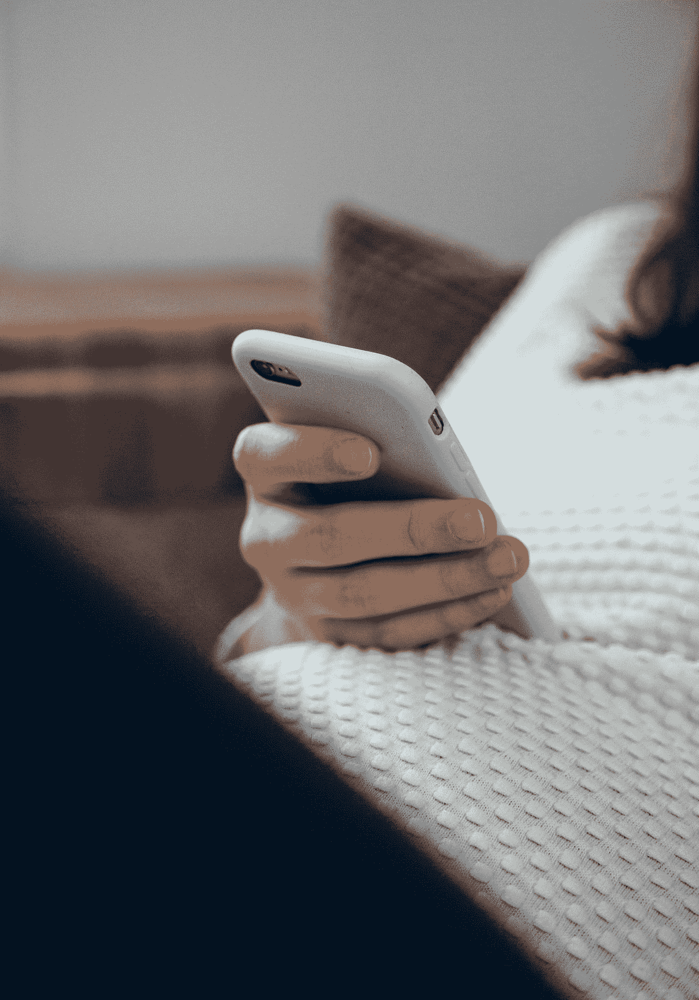
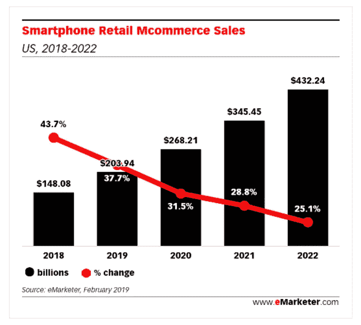

# 智能手机的未来

> 原文：<https://medium.datadriveninvestor.com/the-smartphone-future-e7105eb463e5?source=collection_archive---------13----------------------->

## 各种形式的零售增长实际上都掌握在消费者手中。

Photo by [Daria Nepriakhina](https://unsplash.com/@epicantus?utm_source=medium&utm_medium=referral) on [Unsplash](https://unsplash.com?utm_source=medium&utm_medium=referral)

# 智能手机——是好是坏

你现在在哪里看这篇文章？很可能是在移动设备上，即使你发现自己在家里，在办公室，或者我们敢说，在度假！即使我们周围有多个屏幕，我们的注意力也越来越多地被放在我们手中的设备上。

无论我们身在何处，无论我们可能在做什么，我们的移动设备现在都和我们在一起，而且有了连接，这在十年前是不可想象的。当你在工作或参加会议时，在海滩或泳池边，在公园或看电影时，看看你身边有多少人正盯着他们的智能手机或平板电脑。从餐厅的座位，到通勤列车的座位，再到体育赛事的座位，有一个不变的现象是，许多人(如果不是大多数人的话，也是*)凝视着他们似乎几乎像手术一样绑在身上的智能手机。想想当大学研究人员[最近发现](https://www.telegraph.co.uk/women/sex/1-in-10-of-us-check-our-smartphones-during-sex---seriously/)他们调查的十个大学生中有一个承认在做爱时检查过手机时的头条新闻吧！不用说，可能现代生活中最可怕的事情就是，当你的许多司机同事真的真的需要完全专注于保持他们的汽车在车道线之间时，他们却在同时处理他们的移动电子设备！*

不管我们与智能手机的真正联系是什么，也不管人们把这称为附件*还是*事实上，是一种瘾，这些设备已经成为我们大多数生活的中心——不管是好是坏。我们可能会渴望在一年 365 天、一天 24 小时、一周 7 天、一天 24 小时与任何人保持联系的日子。我们可能想知道我们是如何度过一天的，却不知道我们走了多少步，吃了多少卡路里，是的，我们用了多少屏幕时间。我们可能会开玩笑说，如果杰瑞、乔治、伊莱恩和克莱默在过去拥有一部 iPhone，那么《宋飞正传》一集中描述的几乎所有问题都可以得到解决。

 [## 您的企业今天需要虚拟现实营销的 3 个原因|数据驱动的投资者

### 新冠肺炎是并将继续是一个前所未有的全球性事件，将医疗保健系统和全球经济带到…

www.datadriveninvestor.com](https://www.datadriveninvestor.com/2020/04/09/3-reasons-why-your-business-needs-vr-marketing-today/) 

然而，对于智能手机的所有陷阱，以及使用智能手机可能带来的所有后果- *和*过度使用，没有人可以否认让世界的力量和知识触手可及对我们所有人的生活产生的变革性影响。游戏规则的改变、彻底的重塑和拯救生命都是我们可以*保守地*用来描述这场技术革命的影响的术语，这场技术革命已经停止了(嗯，T4 没有机会停止了，现在是吧！)在我们手心里。

Photo by [Charles Deluvio](https://unsplash.com/@charlesdeluvio?utm_source=medium&utm_medium=referral) on [Unsplash](https://unsplash.com?utm_source=medium&utm_medium=referral)

# 智能购物正迅速成为…购物

当然，智能手机给我们的生活带来的最深刻的变化之一是，商务和花钱的机会现在通过我们的智能手机与我们形影不离。至少十年来，零售分析师和技术专家一直在谈论移动商务革命。今天，这场革命即将来临！

考虑一下分析公司 [eMarketer](https://www.emarketer.com/) 最近发布的报告，该报告的标题中确实有*这个*故事:“[智能手机将占 2019 年电子商务销售额的三分之一以上](https://www.emarketer.com/content/smartphones-will-account-for-more-than-one-third-of-ecommerce-sales-in-2019?ecid=NL1014)”一个令人惊讶的事实是，在 2019 年，我们作为一个消费社会，美国人正在快速刷卡，今年第一次有超过一半的拥有智能手机的人将使用我们手中的设备进行某种类型的在线购买！是的，这包括你的祖母，她只是用她的 iPhone 打电话，你的父亲，他似乎仍然不太明白在脸书上公开发布和私下给你发消息的区别，你的同事相信“深层状态”正在监视他在设备上做的一切，并把它包在铝箔里——只是为了安全！也许更令人惊讶的是——eMarketer 的研究发现——我们知道,“普通”智能手机购物者——在黑色星期五从 HomeDepot.com 购买一次手机的人和你的邻居——每天在她(或他)家门口放着半打或更多的亚马逊盒子——每年在手机上花费 1763 美元之间可能存在巨大差异！是的，革命万岁！

智能手机购物在美国的增长速度有多快？考虑到在线电子商务销售总额目前估计每年超过 6000 亿美元！正如 eMarketer 对美国在线市场现状的分析所示，在 2019 年，个人电脑仍然主导着整个市场——2019 年，超过一半的电子商务销售额(3318.5 亿美元)仍然来自台式电脑(啊，当我们应该“工作”的时候，我们都在做什么呢？(一猜！)).然而，今年，超过三分之一的电子商务购物——高达 2039.4 亿美元——将来自智能手机！

Source: [eMarketer](https://www.emarketer.com/) ([Smartphones Will Account for More than One-Third of Ecommerce Sales in 2019](https://www.emarketer.com/content/smartphones-will-account-for-more-than-one-third-of-ecommerce-sales-in-2019?ecid=NL1014))

也许比智能手机成为进入电子商务世界的入口这一事实更重要的是，消费者正在以多种方式使用他们的手机，是的，花真金白银！考虑到 eMarketer 的研究发现，截至 2019 年初，当只涉及移动设备用户使用应用程序时(不包括使用他们的浏览器直接访问零售商和服务提供商):

*   57%的智能手机/平板电脑用户使用过移动零售应用程序来查找关于产品或服务的更多信息；
*   51%的智能手机/平板电脑用户使用过移动零售应用购买产品或服务；
*   28%的智能手机/平板电脑用户使用过移动钱包应用程序在店内支付(例如， [ApplePay](https://www.apple.com/apple-pay/) ， [Android Pay](https://pay.google.com/about/) ，[星巴克应用程序](https://www.starbucks.com/coffeehouse/mobile-apps)等)。)
*   24%的智能手机/平板电脑用户使用过杂货应用程序(如 [AmazonFresh](https://www.amazon.com/b?node=10329849011) 、 [FreshDirect](https://www.freshdirect.com/) 、[沃尔玛杂货](https://grocery.walmart.com/)等)。);
*   21%的智能手机/平板电脑用户使用过共享经济服务应用程序(如[优步](https://www.uber.com/)、 [Lyft](https://www.lyft.com/) 、 [Airbnb](https://www.airbnb.com/) 等)。);和
*   6%的智能手机/平板电脑用户使用过套餐订阅服务应用程序(如[蓝色围裙](https://www.blueapron.com/)、 [HelloFresh](https://www.hellofresh.com/) 等)。).

也许最重要的是，他们的研究发现，在我们的现代社会，移动应用程序正在成为消费者进入零售商和服务提供商的事实上的入口！事实上，eMarketer 的研究发现，只有 20%的智能手机/平板电脑用户*没有*在他们的设备上使用应用程序进行购物！即使是在他们研究中最老的年龄组(真的，*真的*我很痛苦地说，这个人口统计被归类为“55 岁以上”俱乐部！)，不到三分之一的美国退休人员协会合格类别的人还没有使用电子商务应用程序购买商品或使用服务。当谈到“年轻人群”时，他们不只是使用应用程序来获得商品和服务，他们经常使用它们，而且不是“一次性的”事实上，eMarketer 发现，在过去的一个月里，超过 60%的 18 至 34 岁的美国移动设备用户使用移动零售应用程序购买了产品或服务！

未来几年，电子商务的未来——实际上是整个零售业的未来——将比现在更加以智能手机为中心！考虑到智能手机支出到 2022 年将增加一倍以上的事实！即使智能手机移动商务的增长率预计将放缓(如果只是因为渗透水平将在未来几年变得如此之高)，但 eMarketer 的研究表明，2019 年电子商务的增长率(37.7%)将使桌面电子商务(5%)的增长率相形见绌，而桌面电子商务购物是过去十年所有在线商务增长的驱动力！

Photo by [Isaac Smith](https://unsplash.com/@isaacmsmith?utm_source=medium&utm_medium=referral) on [Unsplash](https://unsplash.com?utm_source=medium&utm_medium=referral)

# 分析

所有这些的底线*真的很简单。希望以消费者为中心的业务增长，甚至在今天的企业对企业(B2B)领域？向智能手机优先购物的转变意味着移动商务应该是你营销工作的第一重点。从应用开发，到店内营销，再到基于位置的定位，以及一系列其他可能性，任何希望将消费者与他们的美元分开的人今天都应该问一个问题:*我们的移动战略是什么？*从最大的消费产品公司到最小的只有一个梦想的单人创业公司，当谈到我们将如何营销、如何做广告，以及我们今天将如何运营我们的业务时，人们需要首先考虑*移动。**

所以，拿起你的手机，开始做点什么吧——或者用你的智能手机，探索那些进步的、积极进取的公司正在利用移动商务的各种方式来接触消费者，无论他们现在在哪里，明天又会在哪里！

# **和我一起在媒体上写作**

想开始自己的写作之旅吗？想通过发布自己创作的文章来更好地建立个人品牌？考虑今天和我一起在媒体上写作，并使用这个链接:【https://davidwyld.medium.com/membership。这样做，你将帮助支持我的写作，因为我收到你的媒介会员费的一部分。

 [## 通过我的推荐链接加入媒体-大卫·怀尔德

### 作为一个媒体会员，你的会员费的一部分会给你阅读的作家，你可以完全接触到每一个故事…

davidwyld.medium.com](https://davidwyld.medium.com/membership) 

# 关于大卫·怀尔德

大卫·c·怀尔德([dwyld@selu.edu](http://dwyld@selu.edu))是路易斯安那州哈蒙德市[东南路易斯安那大学](https://www.southeastern.edu/)的战略管理教授。他是管理顾问、研究员/作家、出版商、执行教育家和经验丰富的专家证人。他是[The IDEA Publishing](http://www.theideapublishing.com/)*The Best in News，Information and Content Marketing*和[Modern Business Press](http://www.modernbusinesspress.com/)*The Best in Academic Journals*的创始人和出版人。

**大卫·怀尔德的社交媒体链接:**

上[脸书](https://www.facebook.com/david.wyld)

上 [LinkedIn](https://www.linkedin.com/in/david-wyld-4923707/)

在[推特上](https://twitter.com/GoodAdvicePub)

*原载于*[*https://vocal.media/01/the-smartphone-future*](https://vocal.media/01/the-smartphone-future)

## 访问专家视图— [订阅 DDI 英特尔](https://datadriveninvestor.com/ddi-intel)