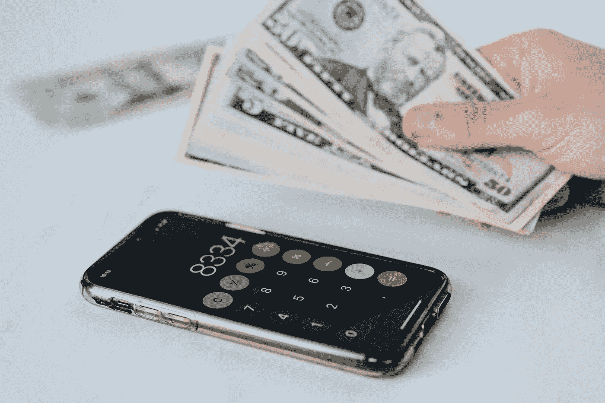

# 雪球效应

> 原文：<https://medium.datadriveninvestor.com/the-snowball-effect-fd0771413a55?source=collection_archive---------5----------------------->

from Pexel

世界上有些人有一个共同点，那就是债务。要么来自信用卡，学生贷款，或抵押贷款。债务会毁了你的生活，让你感到绝望。是的，避免负债总是一个好主意。但是，有时这是不可避免的。阅读这篇文章将告诉你为什么最终还清债务并为你现在和未来的生活积累财富是可能的。

 [## 商务沟通不畅是网络安全问题的 5 个原因|数据驱动型投资者

### 沟通是商业的命脉。没有协作就不会有想法，没有合作就不会有交易

www.datadriveninvestor.com](https://www.datadriveninvestor.com/2020/09/01/5-reasons-why-poor-business-communication-is-a-cybersecurity-issue/) 

先说“滚雪球效应”，以及它带来的还债的好处。遵循以下步骤有效利用“滚雪球效应”:

1.  从最小到最大列出你所有的债务
2.  你想建立一个应急储蓄基金，1000 美元是一个很好的开始
3.  你想继续存钱，但无论如何都不要碰它
4.  你想用你的储蓄账户还清最小的债务，重复这些步骤直到全部还清

现在你可能会问，“但我最大的贷款利息最高，为什么不是那笔？”你还记得我说过“雪球效应”给你希望吗？想象一下，如果你最大的一笔贷款是 20，000 美元，而你一直在往里面放小额贷款。你会感到绝望，认为你永远无法还清债务。这就是为什么选择最小的，例如 2500 美元是最好的主意。你可以一次付清，这给了你还清债务希望。归根结底，“滚雪球效应”是一个很大的智力游戏。

我认为，任何处理债务的人都应该利用“滚雪球效应”，连我也一样。在没有行动计划的情况下试图偿还债务可能会很可怕，而且可能需要数年才能完成。存钱的确需要奉献和自制力，但如果你下定决心，你可以凭借“雪球效应”比你想象的更快还清债务。一旦你还清了，你终于可以开始积累一些财富，过上你一直想要的生活。我希望这篇文章为你提供了一些很好的见解，也许它会帮助你在晚上最舒适地休息。祝你好运，并保持决心。

## 访问专家视图— [订阅 DDI 英特尔](https://datadriveninvestor.com/ddi-intel)