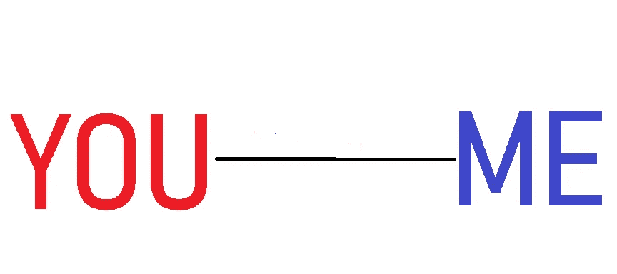

# 社交距离效应

> 原文：<https://medium.datadriveninvestor.com/the-social-distancing-effect-290dfc18ec6e?source=collection_archive---------17----------------------->

Distance matters a lot

我不需要单独解释世界处于什么状态。我们到处都有数据。我们每天都在看电视。在你的国家……在世界上，现在它的第一名实际上是一个游戏玩家。死亡人数的减少、禁闭天数的减少、负面案例的增加、生产率的提高……所有这些都是恢复原状的积极迹象。

一开始是一个人，一个地方。限制这种情况的唯一方法是保持社交距离。除了所有其他术语，我在想这有多大影响

远离感冒患者，因为普通感冒会传播。术语“远离”意味着为了个人安全而保持一段距离。现在控制电晕的唯一方法是社会距离，因为还没有药物被证明是可用的。现在远离普通感冒可能会持续几天以上，但正如我们看到的死因，所有场景中的社会距离已经成为一种控制协议

 [## 冠状病毒；惊慌失措；字里行间的 z |数据驱动的投资者

### 围绕冠状病毒的话题；更准确地说，新冠肺炎几乎占据了整个新闻预报的头条…

www.datadriveninvestor.com](https://www.datadriveninvestor.com/2020/03/23/coronavirus-a-to-panic-z-between-the-lines/) 

**我们松一口气后还能期待什么变化
→** 坦率地说，科罗娜带给世界的恐惧将持续几十年。国家和公司可以回到最初的状态，但恐惧将持续下去，并将成为下一代的一个教训。
→人们将开始比平时更关心健康
→只有在这种情况下，失业的恐惧或即使失去工作也要做好准备的情况才会增加
→人们将开始计算将有多少人参加活动/婚礼/酒店等。
→人们会检查安全性，可能会寻找所有措施都得到考虑的最好的酒店
→一个中年人(像我这样的人)会为他、为他的家庭(包括孩子和老人)考虑很多因素
→感冒和咳嗽的情况虽然很少，但可能是未来的例外。如果我疼痛，我可以工作，但如果我感冒了，我就不能真正工作，因为那会影响我和我周围的环境。单一药物无法在一小时内治愈任何感冒。
→消毒剂、纸巾、手套将成为每个人的日常用品
→注意健康——尤其是以蛋白质为基础的食品将会增加。对人们来说，去度一个小假都不像去制造恐惧那么容易..仍然是我们许多人的噩梦。
→为了健康和安全，基于应用程序的解决方案的使用将会增加。目前我们确实有许多应用程序，但即使对于老年人来说，增长也会很高，因为他们的移动电话仍然仅限于打电话和社交互动

还有更多…以上各点都是基于安全的预防措施

> 我坚信，这是思考我们未来的最佳时机。我们无法逃避任何危险，但我们可以控制它不让它靠近我们。在这个过程中，更重要的是我们如何最好地保护我们的生命。以下是一些想法
> 
> **1。社交距离是一个安全的术语，所以是时候设定我们可以在哪里(即使在完全的电晕效应之后)做好准备了。因此，更重要的是我们的社交能力，并找到保持或控制这种能力的最小范围
> 2。更重要的是我们要知道，我们活着是因为我们的环境变得更好了。你安全到家，因为你的司机是好的和安全的。今天，你的生活依赖于你的邻居/同事。你安全是因为他们也安全。
> 3。为了确保这一切顺利进行……更重要的是训练自己和训练他人——反之亦然。这是我们能够让我们的后代知道什么该做，什么不该做的唯一最佳方式。如何重新安排你从清晨到睡眠时间的思考过程必须改变。
> 5。在我看来，安全地关注你的健康并在你的健康上投资时间是 2020 年的愿景，这可以为我的下一年铺平道路。有句台词——“能利用身边最少可用资源的人，才是真正的专家”。现在有哪些可用的资源——利用最好的技术促进健康，我可以最大限度地减少旅行并提高生产率，从而节省燃料和时间的最佳方式是什么
> 7。最好使用基于应用程序的平台，人们可以在线咨询医生的 wrt 状况，这是一个很好的举措，如果效果是中小型的，就不需要直接咨询
> 8。健康之书的规则将作为每个家庭的指南**

我们还不清楚 corona 会以多快的速度离开这个世界，因为这种病毒还没有死亡，也没有发现新的药物。对我们大多数人来说，这是一个不同的阶段。现在，当一个挑战是新的和不同的——它也会让我们变得更健康。我坚信，这个世界将成为一个在卫生领域投资和实施的创客空间，可以期待许多创新的发生。

最后，日冕是一个隐藏的魔鬼。让我们与数据驱动的预防措施作斗争。相信事实——留下错误。这是给我的一个教训，很多人说……永远不要忽视健康

L OVE 生活
IVE 生活

M adhu
Vadlamani