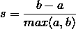

# 高效公共政策的源代码

> 原文：<https://medium.datadriveninvestor.com/the-source-code-of-efficient-public-policy-cb3e7f8dbc17?source=collection_archive---------36----------------------->

Andriy Onufriyenko/Getty Images

巴库——新冠肺炎疫情在短短 12 年内引发了第二次全球经济危机。但是，与 2008 年暴露了 T2 金融系统严重结构性缺陷的危机不同，当前的衰退暴露了政府的弱点，政府一直在努力实施及时有效的应对公共健康危机及其经济后果。一个主要障碍是没有充分利用大数据和可用的[技术](https://www.forbes.com/sites/kweilinellingrud/2018/10/23/the-upside-of-automation-new-jobs-increased-productivity-and-changing-roles-for-workers/#33083ef17df0)，这些技术可以加速和优化公共决策。

轮廓分数是评估聚类算法的度量。侧影分数由两个分数计算得出， *a* 和 *b* 。 *a* 是样本与同一聚类中所有其他点之间的平均距离，而 *b* 是样本与下一个最近聚类中所有其他点之间的平均距离。样本的轮廓分数通过以下公式计算:

一组样本的轮廓分数是每个样本的轮廓分数的平均值。轮廓分数的范围从-1 到+1。轮廓分数-1 表示不正确的聚类，+1 表示正确且高度密集的聚类。轮廓分数为 0 表示聚类重叠。

# 戴维斯-波尔丁指数

DB 索引是评估聚类算法的另一个指标。DB 索引捕获簇之间的间距是否合适，以及簇中的数据点是否足够密集。DB 指数通过以下公式计算:

今天的技术还可以创造一个虚拟的"[数字双胞胎](https://www.govtech.com/smart-cities/Digital-Twin-Technology-Can-Make-Smart-Cities-Even-Smarter.html?fbclid=IwAR0YMHBfTSCqvnmPJrY6m7IRDUdX_YhXRF7IWqk3aSb03uipkEUDf88Gndg)"——一个你的城市或国家(理想情况下，整个地球)的复制品，以[提高速度](https://www.enterpriseai.news/2020/03/25/ai-and-covid-19-digital-twins-of-cities-simulate-coronavirus-public-policy-impacts/)，根据实时数据做出无错误的决策。该应用程序已在企业中广泛使用，并越来越多地被寻求改善城市生活质量的城市所采用。例如，新加坡最近投资[超过 7000 万美元](https://www.govtech.com/smart-cities/Digital-Twin-Technology-Can-Make-Smart-Cities-Even-Smarter.html)用于创建一个城市的三维模型，决策者可以用它作为大型项目的试验场。这样的系统意味着每一个决定，包括那些与新冠肺炎有关的决定，都可以在现实世界中实施之前在数字领域进行测试，从而大大降低误差幅度。

今天，世界与一个新的无形敌人的斗争凸显了我们的脆弱性，也凸显了长期以来一直等待解决的社会经济问题。我们才刚刚开始迈向政府和人工智能协同目标的漫长旅程。这种方法的局限性和可能性会在途中显露出来，但是我们目前的情况使得继续沿着这条路走下去是必要的。

到目前为止，人类仅仅依靠思想家和决策者来解决社会的结构性问题。然而，在当今世界，技术为这些努力提供了一个无价的工具。各国政府有责任为其公民采纳已被证明能提高决策效率和准确性的解决方案。在像新冠肺炎疫情这样的同步危机中——以及未来几年肯定会发生的类似危机中——公民应该要求更少。

乌尔汗·塞伊多夫(Urkhan Seyidov)是阿塞拜疆政治心理学中心的高级研究员，是《创新——实施指南》和《数字时代阿塞拜疆的软实力和公共外交》的作者。

*这篇* [*的专栏文章*](https://www.project-syndicate.org/commentary/big-data-technology-can-optimize-public-policy-by-urkhan-seyidov-2020-09) *最初发表于* [*项目辛迪加*](https://medium.com/u/6a706426be2f?source=post_page-----cb3e7f8dbc17--------------------------------) *，2020 年 9 月*