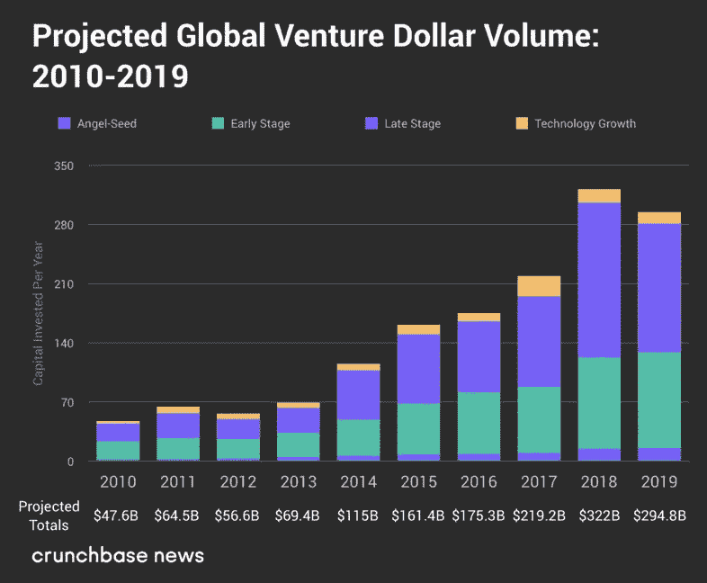
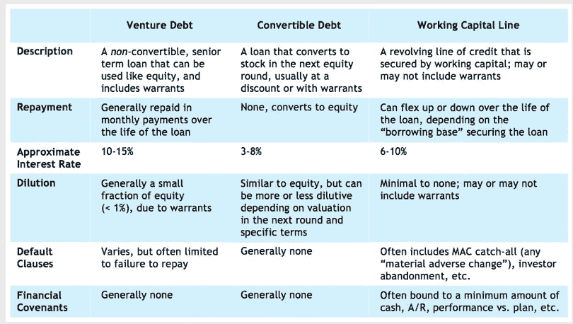
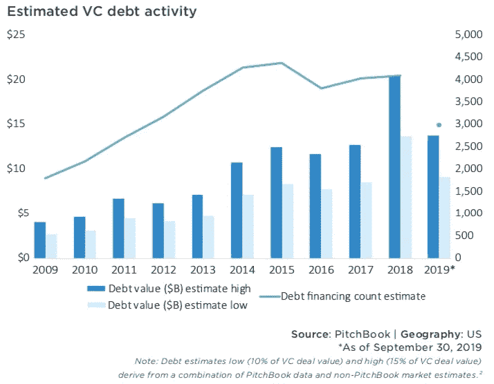

# 创业债务权衡

> 原文：<https://medium.datadriveninvestor.com/the-startup-debt-tradeoff-2a10783a97a6?source=collection_archive---------5----------------------->

## 为什么风险债务即将起飞

Photo by [Fabian Blank](https://unsplash.com/@blankerwahnsinn?utm_source=medium&utm_medium=referral) on [Unsplash](https://unsplash.com?utm_source=medium&utm_medium=referral)

债务是一个四个字母的单词。

债务是某人欠别人的东西。它通常以金钱的形式出现，但也可以以抵押品的形式出现，如财产、服务或其他东西。债务用未来换取现在。

对于除了知识产权、代码行和故事之外抵押品有限的创业公司来说，在过去二十年的大部分时间里，债务是可以避免的。相反，初创公司通过交换股权来寻求资本，脸书、Snap、阿里巴巴、Twitter 和 Dropbox 等公司的成功为这一模式提供了支持。

早期的成功增加了机构资本的兴趣，到 2008 年，全球年度风险资本投资达到 530 亿美元。今天，这个数字接近每年 3000 亿美元。

[https://news.crunchbase.com/news/the-q4-eoy-2019-global-vc-report-a-strong-end-to-a-good-but-not-fantastic-year/](https://news.crunchbase.com/news/the-q4-eoy-2019-global-vc-report-a-strong-end-to-a-good-but-not-fantastic-year/)

资本的涌入并不是没有代价的；对交易的竞争加剧，交易条款变得对创始人更有利，为了提高和展示基金回报以防止有限合伙人跳槽，不惜一切代价实现增长的思维占据了上风。这种环境鼓励投资者和企业积极投资和使用资本。

巨额融资、华丽的办公室扩张和天价估值变得正常化。这段时间被遗忘的是估值和里程碑之间的联系。估值是筹集资金、公司发展和未来预期的函数，当其中一个杠杆降级时，创始人可以预期投资者的兴趣会消失。面对即将到来的衰退，一些风险投资支持的公司很快意识到增长停滞、销售数字下降和投资者兴趣下降的影响。

 [## 使用谷歌搜索趋势预测首次申请失业救济人数|数据驱动的投资者

### 几年来，我的重点一直是使用多种替代数据来预测宏观经济统计数据…

www.datadriveninvestor.com](https://www.datadriveninvestor.com/2020/03/25/using-google-search-trends-to-predict-initial-jobless-claims/) 

这个问题的根源源于一个更大的问题，即风险投资者如何看待[幂律](https://medium.com/@adiezbarroso/power-law-in-venture-capital-why-portfolios-matter-8d3fb2afac5e)和投资组合分配。增长优先的思维模式已经过时，新的投资者思维模式更青睐新的公司融资方式。随着整个行业的估值下降和未知长度的经济衰退，风险投资行业可能会出现一波公司举债以比下行周期更低的成本延长跑道的浪潮。

债务比股权融资更便宜，尤其是在投资者寻求估值折扣的时候。利率处于历史低位，尽管大多数初创企业没有资格获得最低利率，但灵活的还款期限是可以预期的。

风险债务，顾名思义，大多只提供给风险投资支持的公司。贷款由科技银行(硅谷银行等)提供。)和专门的风险债务基金，通常是三年或四年的定期贷款，通常第一年只付利息，然后在剩余的时间里全额摊销。它受到公司资产的保护，包括知识产权或设备。鉴于债务的性质和相关的风险，风险债务贷方要求比其他传统贷款更高的利率。

[https://www.kauffmanfellows.org/journal_posts/venture-debt-a-capital-idea-for-startups](https://www.kauffmanfellows.org/journal_posts/venture-debt-a-capital-idea-for-startups)

还款通常在贷款期间按月分期进行，利率在 10%到 15%之间。风险债务贷款人可以额外获得普通股或优先股的认股权证，以帮助抵御风险。风险债务的贷款人不会在他们融资的公司中占据董事会席位，这些公司也不会用稀释股权来换取现金。

风险债务提供了降低烧钱率而不稀释创始人或其他早期投资者的必要途径。如果你相信风险投资是“开放的”，股权投资仍然是可行的，但需要现金的公司没有经历风险投资尽职调查过程的奢侈。

“创始人友好型”一词既包括股权融资，也包括债务融资。贷款人之间的交易竞争已经表现为利率竞争和契约减少。近零利率、契约轻贷款、甚至契约免费贷款已经变得司空见惯，而这些“对创始人友好”的贷款可能会变得不那么友好。在经济扩张时期，条款有利于企业家，但在经济低迷时期，谈判力量向投资者倾斜。

到目前为止，我已经描绘了一幅风险债务的美好图景，但现在可能是提醒读者债务仍然是一个四个字母的单词的好时机。

风险债务并不适合所有人，企业举债的理想时机是当它们处于讨价还价的地位时。我不会说明什么类型的公司应该考虑风险债务，但我会提到什么类型的公司不应该。

[https://files.pitchbook.com/website/files/pdf/4Q_2019_PitchBook_Analyst_Note_Venture_Debt_Overview.pdf](https://files.pitchbook.com/website/files/pdf/4Q_2019_PitchBook_Analyst_Note_Venture_Debt_Overview.pdf)

现金不足或寻求最后融资的公司可能会收到更糟糕的条款。契约沉重的贷款可能有助于维持正常运转，但它们也可能限制业务向前发展。这排除了大多数尚未筹集外部资金的早期创业公司。

当一家公司有可预测的收入来源时，风险债务也不是一个理想的选择。具有稳定经常性收入和低流失率的订阅公司最好寻找与应收账款相关的信用额度。这消除了大多数具有经常性收入流的后期软件公司。

风险债务也不适合运营费用高的公司。在这种情况下，额外的杠杆用于支持日常运营(工资、租金、公用事业等)。)而不是增加自由现金流。高额的债务支付加上高额的运营支出给公司带来了负担，并向未来的股票投资者发出了警告。

从历史上看，资本结构一直让股票投资者远离以债务形式融资的公司，但很难想象这种思维方式会保持不变。风投们经常引用的建议是减少烧伤和延长跑道。走出这场危机，将会有无数的公司需要资金，我认为债务对这些公司来说是一个更有吸引力的选择。

今年 Q1 快速的经济冲击使得公司的估值高得离谱，却没有预期的增长来证明其合理性。风险债务允许公司生存和发展，同时激励公司维持和偿还，而不是不惜一切代价增长。围绕债务的污名可能正在消失，我预计未来几个季度风险债务活动将出现爆炸式增长。