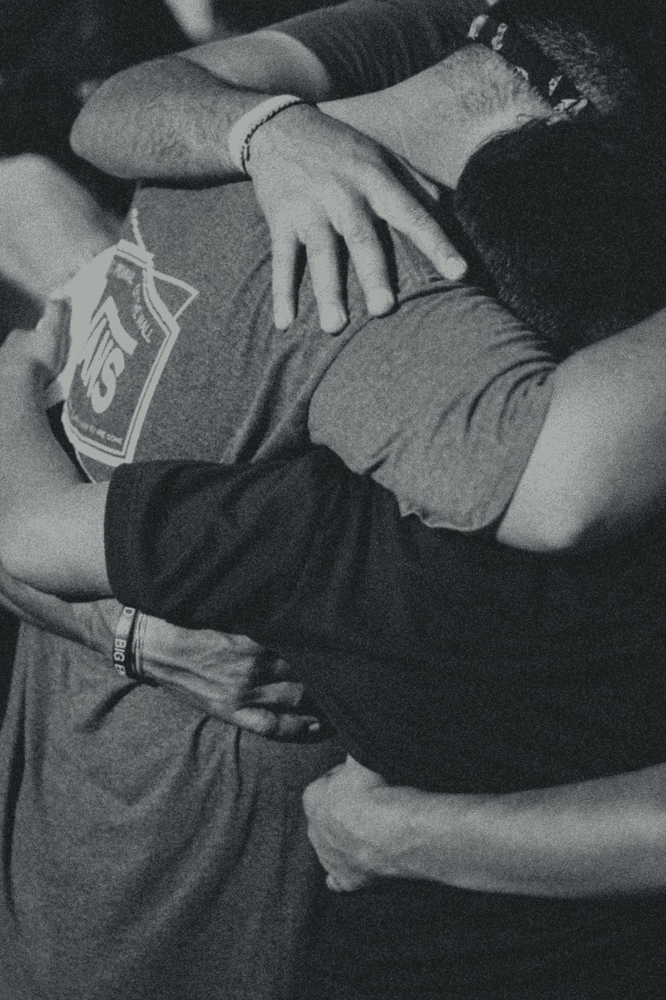

# 饥饿饮食

> 原文：<https://medium.datadriveninvestor.com/the-starvation-diet-fabe1f4ea6a8?source=collection_archive---------16----------------------->

Photo by [Atharva Tulsi](https://unsplash.com/@atharva_tulsi?utm_source=medium&utm_medium=referral) on [Unsplash](https://unsplash.com?utm_source=medium&utm_medium=referral)

## 不是你想的那样

想象一下你在工作中有管理职责。有一位先生为你工作，他来自另一种文化，他不同的生活方式对你来说是个谜。有一天，你正在和这位员工谈论一个项目，突然他站起来，明显很激动，走了出去，就这样。

之后就没了。他拒绝和你说话。你得到了沉默的对待，冷淡的对待，不管你怎么称呼它。你完全被避开了。你不能让他参与进来，不能让他谈论你们之间发生的事情。

 [## 不开玩笑:营销是为了搞笑|数据驱动的投资者

### 当你把幽默和营销结合在一起时，这是一件有趣的事情。当然，马克·安德森希望如此。别叫他雪莉。相反…

www.datadriveninvestor.com](https://www.datadriveninvestor.com/2019/02/25/no-fooling-marketing-goes-for-laughs/) 

工作遭殃。不仅如此，你的其他几个人也注意到了，他们也受到了影响。团队开始动摇，每个人都痛苦地意识到你和这个男人之间发生了什么。但无论如何他都拒绝和你谈这个。

在我的书《WordFood》中，我称之为饥饿减肥法。

最终，你通过另一个认识这位员工的人发现，显然，当你跷二郎腿时，你向他展示了你的鞋底。在他的文化中，这是一种可怕的侮辱。

你不知道。这不仅是无意的，而且让你自己去想。这是非常不正常的。

当有人搞这种恶作剧时，不仅你会挨饿，你的团队也会表现不佳。当涉及到有时非常微妙的文化差异时，这种情况尤其阴险，因为有些时候你和我不可能知道或预料到它们。我们可能参与了其他人认为的微型侵略，我们真的不知道。

人们总是这样做。在我看来，让别人缺乏话语和关注是最糟糕的。

这就是我所说的*饥饿减肥法*。

**言语是食物。它们很有营养(你做得太棒了！我真为你骄傲。你穿那套衣服看起来很帅。我喜欢做你的丈夫)。他们提升、支持、参与、创造联系。**

或者它们可能有毒(你是个白痴。是什么让你觉得自己如此特别？那件衣服让你看起来很胖。到底是什么让我觉得我想要孩子？你是这样的 BRATS)他们破坏，切片，取出内脏，贬低。

毒性有很多种形式，但根据我的经验，沉默是盒子里最锋利的工具。

在好人项目的一篇文章中:

 [## 沉默就是暴力

### 言语可能真的很残酷，但却无法与沉默相提并论。

medium.com](https://medium.com/@GoodMenProject/silence-is-violence-1cb08dd350c7) 

我在他的作品中看到了这种行为的完美例子。

他写到了沉默，被回避的感觉(我的话):

它留下了同样血淋淋的疑惑、内疚、自我憎恨、自我伤害和未解决的问题。

当你我意识到语言是日常饮食的一部分，我们用它来滋养彼此的灵魂，那么缺少语言就是一种野蛮的行为，等同于辱骂。想要对一个他们认为不值得伤害的人造成严重伤害的社会应该避开这些人。他们对待他们就好像他们根本不存在一样。

仇恨是爱情的扭曲孪生姐妹，它表达了我们仍然深深地订婚。你和我对某个我们认为伤害了我们的人感到愤怒，这表明我们对那个人以及他们对我们生活的影响仍然感觉强烈。

我观察过自己对虐待他的前任的行为，我仍然写他和他所做的事情的事实证明，不管喜欢与否，仍然有感觉。我正在从中学习，但我不能否认这种情绪依然存在。我不是中立的。我想达到中立，但我还没到那一步。

沉默又是另一回事。在这个世界上，我们越来越需要被视为和承认有某种价值，孤立、回避和忽视另一个人的行为，尤其是对我们有投资的人，是极其残忍的。

*这是所有剪辑中最残忍的一次*——莎翁、*朱利叶斯·凯撒*

在我为我的书研究的七个单词“节食”中，饥饿节食是最糟糕的。回避消磨人的精神。我看着我的父母这样对待彼此。这也许是为什么我们中的一些人会接受辱骂，因为至少当有人攻击我们时，我们知道我们在他们的心目中存在，如果没有其他目的，只是作为一个出气筒。

这就是我们多么渴望得到我们感兴趣的对象的认可。

也许最糟糕的是，当人们退缩时，尤其是当他们处于长期关系中时，他们会期望伴侣知道发生了什么，从而进一步惩罚他们的伴侣。

“他们应该知道，”这是他们的主张。真的吗？老实说。

这不仅荒谬，而且非常幼稚。没人知道你在想什么，即使你已经结婚 70 年了。在你我能够发展出精准的读心术之前，我们所能做的就是猜测，而与此同时，我们会被冰冷的沉默所伤害，这种沉默就像一堵墙一样降临在你们之间。

*“他生气是因为我把卫生纸装反了吗？”*

“他生气是因为他的煎蛋太嫩了吗？”

*“他是不是因为我昨晚要起来好几次尿尿而恼火？”*

“她生气是因为我在结婚纪念日忘了送花吗？”

“她生气是因为我忘了倒垃圾吗？”

“她生气是因为我昨晚对性不感兴趣吗？”

当你拒绝交流时，有几种可能的情况(看，我也不能读懂你的想法，但这里有一些正在发生的典型问题):

1.  **你想要或需要施加控制**
2.  **你想要或需要惩罚那个人，因为他被认为违反了规定或侮辱了员工，见上图**
3.  **你无法处理冲突，回避是你的首选方法**
4.  你真的害怕在这个问题上爆发一场大战
5.  你只是个乳臭未干的孩子
6.  **发生了文化侮辱，你被激怒了。**

我们保持沉默有很多原因。例如，其中之一是我们可能天生消极好斗，这就是我们处理冲突的方式。或者，我们理所当然地害怕争论或反对，我们僵在原地。原因和我们一样多种多样。

然而，当它是出于恶意而做的时候，它会对我们的灵魂进行谴责。

如果你曾经问你的爱人或员工是否一切都好，他们几乎会朝你吐口水

# 我很好。

这种方式清楚地传达了事情肯定不好的信息，你很可能已经开始节食了。前方道路崎岖。

沟通需要勇气。我们通过反复试验来发展这些技能，在这个过程中我们会遇到挫折。有时我们会造成伤害。然而，做出真诚努力的行为对治愈考虑不周的话语可能造成的创伤大有帮助。

冷漠的沉默不是英雄。也不勇敢。也没有男子气概，或者强壮。

# 简而言之，所谓的“坚强、沉默的类型”往往实际上是一个虐待狂、幼稚的混蛋。

事实上，它很弱。因为它的核心是一种伤害的欲望，这种欲望往往基于一种根深蒂固的恐惧。压抑自己的情绪并封闭自己并没有什么大不了的。

在我自己的生活中，我曾经使用过这种方法，因为在我的成长过程中，冲突是一种可怕的前景。我把内心的焦虑发泄在自己身上。我花了几年时间来培养自信，泰然自若地表达自己，并让人们知道这是一个问题。

# 我不好的时候不会说我好。

这不仅不诚实，而且人们也没那么愚蠢或盲目。

作为成年人，如果有问题，我们有责任向他人表达我们的伤害、不快或冒犯。在任何情况下，指望别人自己发现都是不成熟的，尤其是当他们很可能不知道自己可能做了什么的时候。

看啊。如果他们不在乎自己造成的损害，那完全是另一回事。这是不同的，你知道这种不同。

大多数时候，你和我都不太关心冲突(尽管有些人以冲突为乐，但这完全是另一个话题)。虽然这可以理解，但冲突会增强信心。所有健康的关系都有。这就是我们如何以尊重、相互关心和保持彼此完整的承诺来应对冲突，从而决定安全通道。通过沉默来孤立、回避、惩罚人，是不负责任的，也是幼稚的。然而，这是一种由来已久的避免弥合我们之间差距的真正工作的方法。

如果你想给你声称关心的人一个冰冷的肩膀，请不要。勇于尝试潜在的冲突。要有真诚的勇气去理解他人，尊重他人，让他们知道自己的过错。当你知道事情的真相时，你可能会感到惊讶和高兴。

真的没有什么可以代替把事情说出来。致力于联系的好人会听到你的声音，即使这很痛苦，并探索他们自己在问题中的角色。他们会想办法回到正常状态，回到更亲密和信任的状态，这是我们深入探索时的礼物。

不，这不容易。它充满了危险。但是真正勇敢的人会说话。真正勇敢的女人会交谈。他们坦诚地表达自己的感情，而不需要互相拆台。

文字是食物，就像一顿丰盛的早餐一样，对我们的生活至关重要。沉默是有毒的，像炭疽一样有毒。如果你想让你们的关系正常运转，那就投入你的语言和你的心。

Photo by [Josue Escoto](https://unsplash.com/@joshescoto?utm_source=medium&utm_medium=referral) on [Unsplash](https://unsplash.com?utm_source=medium&utm_medium=referral)