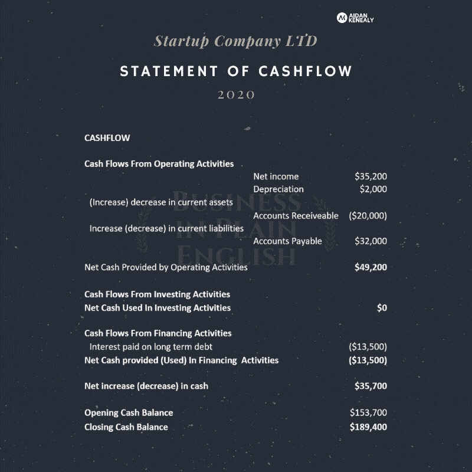
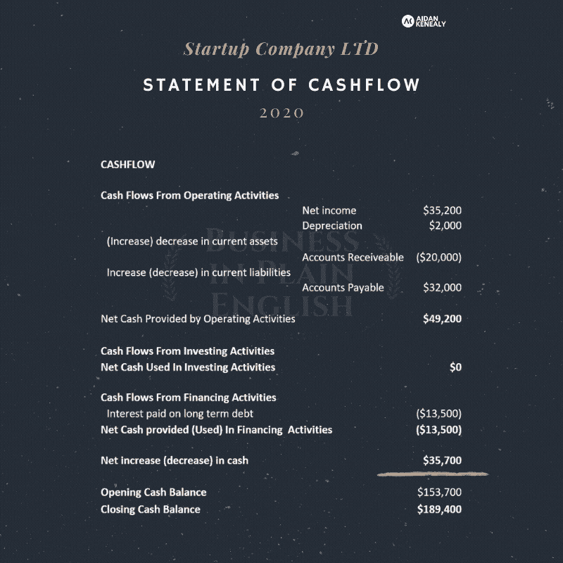

# 现金流量表:五分钟解释

> 原文：<https://medium.datadriveninvestor.com/the-statement-of-cashflow-explained-in-five-mins-4c42b43b912a?source=collection_archive---------14----------------------->

## 五分钟基础

## 你需要了解现金流量表的所有内容。让我们开始吧！

**那么现金流的说法是什么呢？**

好问题！

简而言之，**现金流量表**帮助企业**解释**是什么导致了一段时期内银行余额的变化。

现金流**报表**是**工具**公司用来**跟踪进出其公司账户的现金**。它**不衡量盈利能力**；顾名思义，它向我们展示了我们的现金是如何“流动”的。

它通过**对一个公司在一段时间内的所有现金交易**进行合计和排序。为了使**更加细化**，这些现金交易被分为**三类**，与**经营**活动相关的，与**投资**活动相关的，与**融资**活动相关的。

The three cash transaction sections are highlighted. Operating, investing and financing activities.

现金流量表由一个简单的等式控制。

***经营现金流量净额+投资现金流量净额+筹资现金流量净额=现金净变动。***

换句话说，在我们**将所有的现金交易**排序到它们相关的子类别中，并且**将它们相加**之后，我们得到的是每个部分的正或负的**净现金数。我们**将这三个总数加起来**，它给我们一个**净现金数字**。**

$49,000+$0+($13,500) =$35,000 net increase in cash

如果**净现金**数字为正**，**这意味着公司在期末比期初有更多的现金**。如果**净现金**数字为**负**，这意味着公司在期末的现金**比期初少**。**

**了解**一家公司有多少**现金**以及现金余额是增加了还是减少了**意味着公司可以做出更好的**预算和计划决策。这就是现金流量表的主要用途。挺有用的吧！****

**与利润表不同的是，**现金流量表**处理的是**一段时间**内的现金交易，而不是开票和应计交易。**

*****这意味着它处理的是进出企业的现金，而不是收入被确认为“挣得”或费用被确认为“发生”的时间。*****

**正是这种差异使得**损益表和现金流量表的组合对企业主来说是一套强大的工具**。公司可以使用这些工具评估盈利能力和现金状况。我们将在本节中进一步讨论这一点，但在讨论过程中要记住这一点。**

**作为创始人和企业主**,我们需要了解现金流量表**,这样我们就可以与我们的会计师、董事会和股东讨论**企业内部的资金流向和使用方式。**我们还可以用它来监控我们在一段时间内赚取或损失的现金金额的任何变化。**

**然后，这些信息帮助我们计划如何将现金投资于业务增长，如何为公司融资，并确保我们始终有足够的现金来运营公司。**

**所有这些都有助于为维持和发展企业所需的必要决策提供信息。**

**这样，我们的 tl:dr 就完成了。现金流量表全部在 5 分钟内完成！**