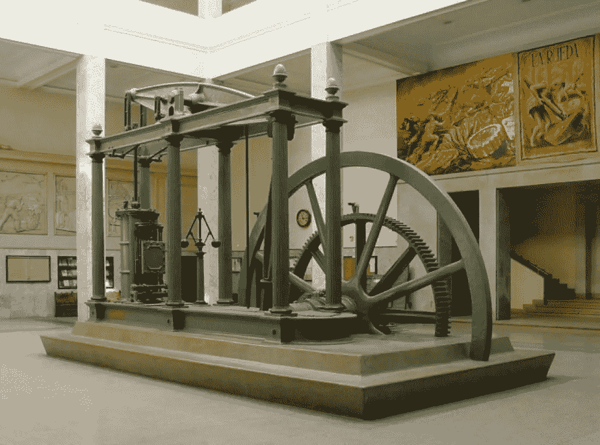

# 21 世纪的蒸汽机

> 原文：<https://medium.datadriveninvestor.com/the-steam-engine-of-the-21st-century-6b8668ab684e?source=collection_archive---------22----------------------->

恭喜你！如果你正在阅读这篇文章，这意味着你已经走到了 2020 年，到了一个新的十年。在过去的 20 到 30 年里，我们经历了世界上许多领域的巨大变化，某些技术的发展速度比过去 300 年加起来还要快。

如果你回顾历史，你会注意到重大发明或发现发生的频率有某种一致性，然后你会注意到它们在几十年甚至几个世纪的不同应用中的开发或使用的快速加速。我们现在不仅有更快的技术加速，还有更快的变化，这是创新的萌芽。我的意思是，我们看到了更多可供选择的选项，替代我们已经做了或已经做了一段时间的东西。

事实上，我们现在生活在一个技术飞速发展的时代，这并不是这篇博客争论的焦点。我要强调的是对过去几个世纪的重大发明和发现的观察，这些发现使每个时代都取得了各种进步。让我们在这里设定一个具体的时间框架，以过去的 300-400 年为例。

 [## 理解物联网|数据驱动的投资者

### 一个系统越开放，它就越有利于创新和产生信任。然而，当谈到开放系统时…

www.datadriveninvestor.com](https://www.datadriveninvestor.com/2019/09/28/making-sense-of-iot/) 

工厂并不是什么新鲜事物，至少对我来说，关于人类何时开始制造产品(或物品)是有争议的，例如，铁器时代大约开始于公元前 1200-1000 年。但是，让我们不要走得太远，相对更仔细地看看 17 世纪的制造业。

当时，工厂依靠自然资源产生的机械能[来生产机械能](https://en.wikipedia.org/wiki/Mechanical_energy)，比如河流驱动水轮。事实上，不仅在 17 世纪，而且在公元前，人和动物也被用来产生机械能。这是某种技术或方法，在当时确实产生了影响，但该技术达到了顶峰，并限制了工厂的扩张，以及一般的制造业务，因为相对高效的工厂在物理上需要靠近自然资源(即河流)，这使得整体模式不经济(在一定程度上)，缓慢，并阻碍了大规模生产和创新。

## 工业革命

在 17 世纪，已经有了开发一种发动机的早期实验，一种[蒸汽机](https://en.wikipedia.org/wiki/Steam_engine)，其目标是找到一种更有效的方式来产生机械能。不打扰你细节，让我们快进到 1778 年完善蒸汽机的爱尔兰发明家[詹姆斯·瓦特](https://en.wikipedia.org/wiki/James_Watt)。蒸汽机的发明，或者说完善，催生了*第一次* [工业革命](https://en.wikipedia.org/wiki/Industrial_Revolution)，从而给了人类在许多领域发展和进步的手段，甚至催生了新的产业，无论是实际的制造、运输、卫生还是其他。

我应该像其他人一样大胆地说蒸汽机是 18 世纪最好的发明吗？是的，我会的。因为没有它，我们就不会有今天。但是，还有其他伟大的发明吗？我就再大胆一次，说好。然而，我不会称之为发明，而是一种发展。“发展”这个词很有意思，当我停下来开始思考历史上所有的“发明”时，我几乎可以把它们中的大多数归为“发展”一类，就像我们过去拥有的某种形式的东西，但以某种方式进行了优化。

## 第二好的发明

那么，继蒸汽机之后，第二好的发明或发现是什么呢？我认为电力的利用，特别是稳定的电流，在 19 世纪晚期变得实用。就像所有其他的发明或发现一样，它经历了一系列的发展，从 1800 年的 Alessandro Volta 开始，然后是 Michael Faraday，他发明了发电机，解决了以持续和实用的方式产生电流的问题，最后是尼古拉·特斯拉在 19 世纪晚期创造了商业电力。

就像蒸汽机启动了工业革命一样，电能的使用加速了那场革命(也可以被称为第二次工业革命)并为我们的创新打开了大门。在 20 世纪，科学取得了无数的进步，如果没有一种实用的方法来产生和使用电力作为一种能源，我们今天所拥有的许多东西都是不可能的。从那时起，能源领域取得了许多进步(如核能、可再生能源等)..)，这不是我在这里讨论的内容，因为那会脱离上下文。结果还是一样的:电和我们如何使用它。

## 第二个机器时代

如果你想知道 20 世纪最重要的发明是什么，我会说是发明了[晶体管](https://en.wikipedia.org/wiki/Transistor)和[微芯片](https://en.wikipedia.org/wiki/Microchip_(disambiguation))(集成电路)。电脑、手机、平板电脑和我们今天拥有的许多智能设备的基本组件——大脑。上个世纪是迄今为止，也许是有史以来人类见证的最快增长和创新的支柱和基础。我们可以用电脑和智能设备做的事情超过了人类有史以来做的任何事情的总和。但我们都知道，不是吗？

我们都知道，微芯片和计算机(及其所有组件)加速了生活中许多领域的创新，如健康、交通和其他领域。它使我们能够比大脑更快地进行计算，快得多。它让我们能够更高效、更大规模地存储数据。但是就像每一项发明一样，这一项也没有什么不同。它让人类有了进一步的发展:如果没有它，我们将无法飞向月球并返回(有趣的事实:美国宇航局首次发射的火箭的计算能力比你的 iPhone 还要低。少了很多)，我们就无法拥有实用的自动驾驶飞机、自动驾驶汽车、智能手表，或者更好地理解疾病，甚至治疗它们。

## 三大发明之间有什么共同点

如果你喜欢回忆过去几个世纪中一些最重要的发明和发现，并想知道浏览它们有什么意义，请注意:每个世纪都有其创新和繁荣的惊人加速器。蒸汽机，然后是电力的实际应用，然后是微芯片。这些发明或发现中的每一个都有两个主要组成部分(过度简化):

1)*原始*能量的来源

2)将原始能量转化为机械能(或价值)的手段(机器/设备)。

能量的来源是各种各样的东西，如河流、蒸汽、原油和电。转化为机械能的手段是实际的设备(蒸汽机、发电机等)..).有趣的是，这些发明是相互依赖的。也就是说，为了发电，我们需要某种原始的引擎。为了操作电脑，我们需要电力。每一项技术都在产生另一种形式的价值/能量，这种形式不仅更高效，还能为下一件大事或后续发明提供动力。

但问题是，计算机和智能设备生产什么？它们使用“电”从根本上进行操作，并能够基于[逻辑门](https://en.wikipedia.org/wiki/Logic_gate)运行(再次过度简化)。但是，它们能像我之前提到的所有其他发明一样，产生某种可用的能量吗？

## 21 世纪的原始能源

这就是我的论点的结论。比喻来说，对*约会*来说，最有价值的能量是数据。数据是河流、蒸汽和原油，计算机是发电机和发动机。

> ***我们现在拥有的计算能力和海量数据加在一起，就是 21 世纪的蒸汽机***

我不是在说或重复你以前可能听过的话:“数据是新的石油”或“数据是新的太阳”。只有数据是不够的，就像没有引擎的石油，但有了可以执行大规模数学方程和处理大量数据的计算能力，我们可以开始(或实际上已经开始)下一场革命，我们这个时代的革命，这场革命将在 22 世纪被视为历史。

这是数据，它不会变小，不会缩小，也不会变得更容易处理。它呈指数增长。物联网、社交媒体、电子商务、移动设备、智能手表、智能设备(家电等..)，智能汽车等等。它是巨大的！

我们已经看到这种新的原始能源在生活中的所有应用的好处。数据使我们能够更快地“开发”，提出新产品、解决方案、发明和发现。将存储大量数据的能力与我们拥有的非凡计算能力相结合，我们能够利用 70 多年前就存在的科学，但没有适当或实用的技术可以利用。如果没有可扩展的计算能力和足够的数据，像[机器学习](https://en.wikipedia.org/wiki/Machine_learning)和[人工智能](https://en.wikipedia.org/wiki/Artificial_intelligence)这样的事情是不可行的。数据让我们理解模式，理解问题，预测未来。

现在世界上一些最大的公司是数据驱动的，你可能以前听说过:优步，Airbnb，脸书，谷歌，亚马逊，等等。他们最大的资产不是有形的材料，而是原始数据。听到特斯拉创始人埃隆·马斯克(Elon Musk)声称特斯拉汽车的价值会随着时间的推移而升值，而不是像其他汽车一样贬值，这很有趣。他的说法来自于这样一个事实，即随着时间的推移，特斯拉汽车将变得更加智能，其实现方式很简单:这些汽车产生的数据越多(当它们的主人使用和驾驶它们时)，特斯拉可以用人工智能和人工智能处理的数据就越多，这将导致自动驾驶汽车等更好、更准确的应用。

这是我的信念，可能也是许多其他人的信念。数据是本世纪最大的资产，也是将人类推向新高度的资产。机器人技术很酷，也很复杂，不要误会我的意思，但是由于数据和 AI/ML 应用程序的实际使用，它基本上是可能拥有的。Siri 和 Alexa 很棒，但如果没有数据，它们就不会存在，也不会这么聪明。在不同的科学领域还有很多其他的很酷的发明和进步，但是如果没有计算机+数据的使用，大多数都是不可能的。

## 成为它的一部分

好吧，那你应该做点什么吗？绝对的。

让我问你一个问题:如果你在 18 世纪有一家制造厂，当每个人都开始使用蒸汽机，变得更有效率、更具成本效益并生产出更高质量的产品时，你会继续依靠马匹或河流吗？你能跟上规模和质量吗？如果你生活在 20 世纪和 21 世纪初，我们中的许多人显然都生活在 20 世纪和 21 世纪初，你会不用电吗？你会不会开始使用电脑或上网？或者有邮件？携带智能手机？

研究表明，自 2000 年以来，财富 500 强中有 52%的公司要么破产，要么被收购，要么由于数字革命而不复存在。现在是你更换或升级你的“蒸汽机”的时候了，那是你旧的做事方式，开始使用我们这个时代的引擎，数据驱动的引擎。这个引擎将允许你创新，扩大规模，最重要的是留在游戏中。忽视这一点的代价会相当昂贵。

你还认为现在还为时过早还是没有乘风破浪重要？

新年快乐！

*最初发表于*[T5【https://www.linkedin.com】](https://www.linkedin.com/pulse/steam-engine-21st-century-issam-hijazi/)*。*