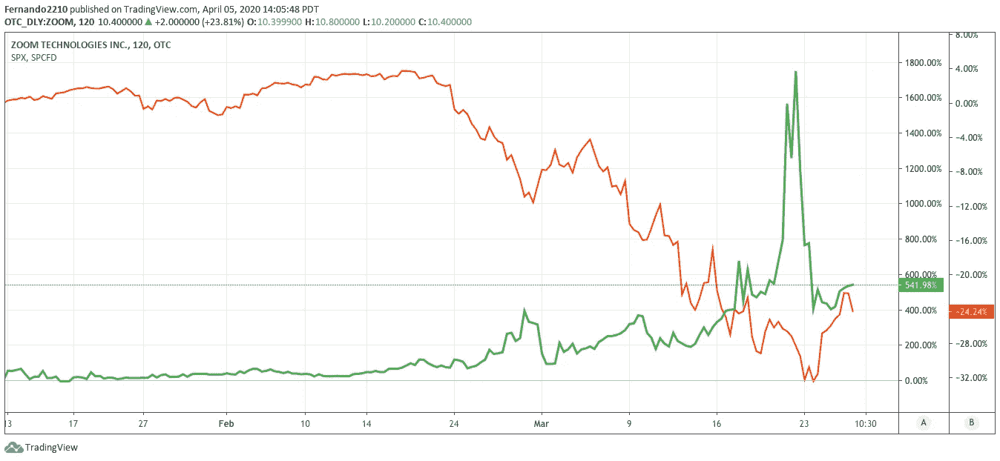

# 股市是九头蛇，一条有几个头的大蛇。

> 原文：<https://medium.datadriveninvestor.com/the-stock-market-is-hydra-a-serpent-with-several-heads-d60d72e708c?source=collection_archive---------9----------------------->

If you cut off one hydra head, two more would grow back in its place.

我们正处于历史转折的中间，新冠肺炎已经为几个巨大的新闻周负责。

在这紧张的几周里，我一直在思考疫情的技术分支。

许多企业立即感受到了冲击，一些企业在最初的冲击后仍在努力维持运营。

其他人很快成倍增长。让我们来看看变焦股票:

American remote conferencing services company Zoom (green) versus SPX during the March sell-off

观察 Zoom 是如何在收益后不久被清算的。

当收益发生时，媒体吹捧这是社会认为在大多数企业无法实际运营的危机期间必不可少的服务的反映。

这是否意味着 Zoom 是抗脆弱的？

Nassim Nicholas Taleb

> 不像易碎物品在压力下会破碎，抗碎物品实际上受益于波动和冲击。

值得注意的是，在新冠肺炎病毒爆发之前，技术通货紧缩就已经对经济产生了影响。

作为用户，我们已经习惯了少花钱多办事，我们将继续这样做，直到达到零边际成本社会。

 [## 使用谷歌搜索趋势预测首次申请失业救济人数|数据驱动的投资者

### 几年来，我的重点一直是使用多种替代数据来预测宏观经济统计数据…

www.datadriveninvestor.com](https://www.datadriveninvestor.com/2020/03/25/using-google-search-trends-to-predict-initial-jobless-claims/) 

因此，在 3 月份的大规模抛售期间，*几乎所有商品的价格都不得不下跌。对吗？*

如果自然力在起作用。

# 技术与市场:我们时代的九头蛇。

[Gustave Moreau](https://en.wikipedia.org/wiki/Gustave_Moreau)’s 19th-century depiction of the Hydra, influenced by [the Beast](https://en.wikipedia.org/wiki/The_Beast_(Revelation)) from the [Book of Revelation](https://en.wikipedia.org/wiki/Book_of_Revelation)

自然力从未发生的原因是市场是九头蛇，一种像蛇一样的怪物，如果你砍掉一个头，两个还会在原来的地方长出来。

阅读:注入大量永远无法偿还的债务。

最近 20 年新增 185 万亿实现 46 万亿 GDP 增长如何？

这造成了一个如此巨大的问题，以至于政府“被迫”救助现有系统。

这并不是因为他们想这么做，而是因为在一系列糟糕的选择中，让系统破产并经历无序的放松(正如奥地利经济学的基本面所要求的)可能是一个更糟糕的选择。

# 我们看到了拯救金融体系的副产品，否则这个体系将会失败。

Heracles (Hercules) battling the Lernaean Hydra

更多的钱回购股票只会非自然地支撑资产价格/股价，就像 Zoom 的情况一样。

但具有讽刺意味的是，正如 Zoom 的情况一样，新冠肺炎实际上加快了技术的采用，推动了这一趋势的发展，并导致了更多对现有经济模式的不当投资。

Zoom 在一个月内从 1000 万用户增长到 2 亿。真正的受益者。

公司*可能只是*决定在家工作是高效的，并影响商业房地产价格和这些资产的贷款。

零售业在 Covid19 之前就已经承受了巨大的压力。这只会加速一直存在的向电子商务的过渡。

但在我们真正自然地到达那里之前，这个节目会尽可能地继续下去。巨额资金将会被浪费，无论如何它都会失败。

俗话说:千万不要浪费一个好的危机。

关键是找机会把制度做得更好。