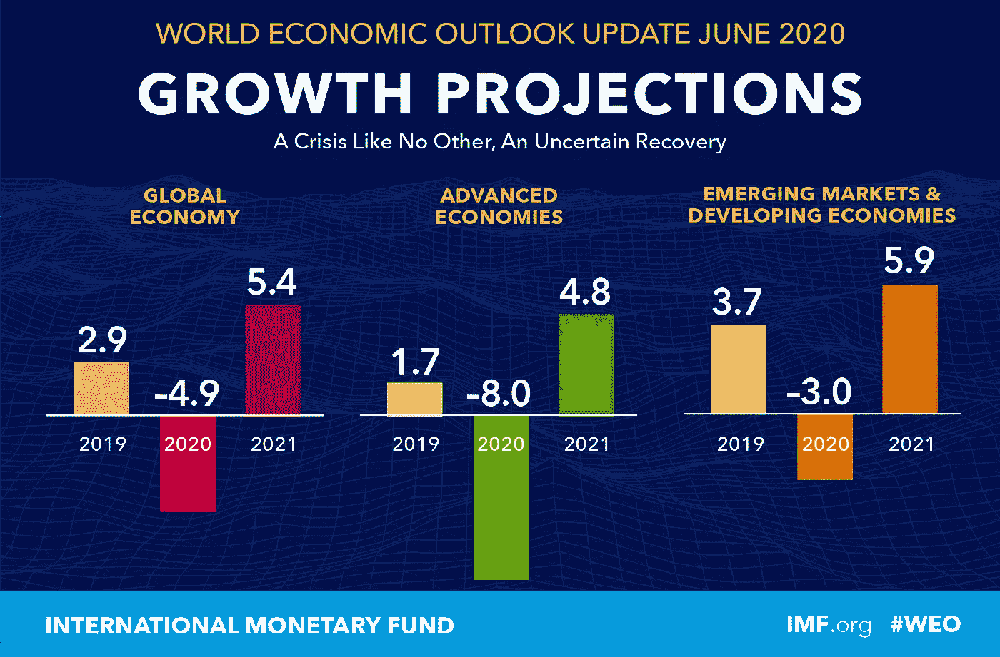

# 风暴和龙

> 原文：<https://medium.datadriveninvestor.com/the-storms-and-the-dragon-d29f1fd29465?source=collection_archive---------11----------------------->

## 石油工业和清洁能源部门将如何应对这些巨大的风暴和即将到来的风暴？

Photo by [haik ourfal](https://unsplash.com/@doctorhulk?utm_source=unsplash&utm_medium=referral&utm_content=creditCopyText) on [Unsplash](/@doctorhulk?utm_source=unsplash&utm_medium=referral&utm_content=creditCopyText)

世界正面临着动摇我们经济基础的巨大风暴。不仅是我去年 11 月预见的风暴(几乎是在另一个时代……)，还有“疫情”大小的新风暴！

 [## 暴风雨不会等我们的！

### 领导力、人工智能和集成系统可以帮助我们在能源基础设施继续崩溃之前做好准备…

medium.com](https://medium.com/@smbilodeau/the-storms-will-not-wait-for-us-e1219b8f2614) 

国际货币基金组织(IMF)本周刚刚发布了其世界经济展望(WEO)[#全球经济](https://www.linkedin.com/feed/hashtag/?keywords=globaleconomy&highlightedUpdateUrns=urn%3Ali%3Aactivity%3A6681543974634721280)预测。公布的数据显示，几个经济体的衰退程度甚至比此前预测的还要深(4 月份的上一次 WEO)。新冠肺炎疫情对 2020 年上半年经济活动的负面影响超过预期，预计复苏将比之前的预测更加缓慢。2021 年，全球经济增长率预计为 5.4%。总体而言，这将使 2021 年的 GDP 比 2020 年 1 月新冠肺炎之前的预测低约 6 个百分点。

 [## 从大封锁中重新开放:不均衡和不确定的复苏

### By Gita Gopinath عربي, 中文, Español, Français, 日本語, Português, Русский The COVID-19 pandemic pushed economies into a…

哎哟哟](http://ow.ly/cLAT50AfV1p) 

简言之，2020 年全球增长预计将下降 4.9%，比 2020 年 4 月 WEO 预测低 1.9 个百分点。疫情在许多国家恶化，在其他国家趋于平稳。一些新兴市场和发展中经济体的疫情迅速加剧，迫使政府实施严格的封锁，导致经济活动受到比预期更大的干扰。在其他国家，记录的人均感染和死亡率反而较低，尽管有限的检测意味着疫情的路径相当不确定。在许多发达经济体，由于数周的封锁和自愿隔离，新增感染和医院重症监护入住率都有所下降。

我们对来自国际货币基金组织的原始数据进行了一些数据分析。我们做了 4 年多的比较(从 2017 年到 2021 年)。截至 2020 年 5 月的时期使用实际数据，而从 2020 年 6 月到 2021 年底的时期基于国际货币基金组织的预测(及其假设)。对于石油价格，对英国布伦特、迪拜法塔赫和西德克萨斯中质原油的价格进行了简单平均。2019 年，以美元计算的每桶石油平均价格为 61.39 美元；根据期货市场(截至 2020 年 5 月 19 日)的假设价格，2020 年为 36.18 美元，2021 年为 37.54 美元。

事实上，这是在预测 2020 年更深的衰退和 2021 年更慢的复苏，而这一预测存在高度的不确定性。然而，我们清楚地看到了对油价的影响:进一步波动和大幅下跌(见图表中的橙色条)。同步的深度衰退肯定会导致经济动荡。我们已经看到，第一季度 GDP 普遍低于预期(少数例外，包括新兴市场中的智利、中国、印度、马来西亚和泰国，以及发达经济体中的澳大利亚、德国和日本)。高频指标显示，第二季度经济收缩更加严重，但中国除外，该国大部分地区在 4 月初已经重新开放。

 [## 如果资本主义失败了，那么还有什么选择呢？数据驱动的投资者

### 在当前政治领域的修辞之旅中，我们都可以面对面地接触到流行词汇，如…

www.datadriveninvestor.com](https://www.datadriveninvestor.com/2020/03/16/if-capitalism-is-a-failure-then-what-is-the-alternative/) 

在大多数衰退中，消费受到的影响相对小于投资。但这一次，消费和服务产出也明显下降。能源行业，尤其是石油行业，受到了重创。当面临需求急剧下降、供应中断和不确定的未来收益前景时，企业也减少了投资。因此，存在广泛的总需求冲击，加剧了因停工导致的短期供应中断。石油期货曲线显示，此后价格有望上涨至 46 美元。但仍比 2018-2019 年的平均水平低约 25%，而“非燃料”大宗商品价格预计将小幅上涨，但仍快于国际货币基金组织 4 月份的假设。

综上所述(和计算…)，石油行业未来两年的预测是什么？或者，清洁能源行业将如何应对石油价格的潜在大幅下滑？

有人会说，我关注的是对石油投资的影响，因为最大的问题是经济下滑如何损害了预期的可再生能源投资。有人会认为，一旦我们稳定下来，这将更接近于一场零和游戏，一旦投资资金回归，该行业的一些部分将成为赢家，而其他部分将成为输家，但现在看到这种情况还为时过早。

我从另一个角度来看。类似于《福布斯》的沃尔·范·里罗普(Wal van lier op)的说法:“在化石燃料行业，正常不再是可取或安全的。”

 [## 新冠肺炎事件后，石油行业不会恢复“正常”

### 冠状病毒疫情已经关闭了世界经济，使医疗系统不堪重负，并夺走了亲人的生命…

www.forbes.com](https://www.forbes.com/sites/walvanlierop/2020/04/05/after-covid-19-the-oil-industry-will-not-return-to-normal/#2577dad3281e) 

我认为，石油生产方面的动荡(始于新冠肺炎之前),加上石油输出国组织和俄国已经开始相互挑战，将对该行业产生更为结构性和深远的影响。对与石油工业相关的长期项目的投资可能会受到损害、延误、限制等。《金融邮报》本周报道称:

> 需求疲软导致的数千亿桶石油滞留可能会加速企业转向更清洁的能源，或者威胁到它们的长期生存。

Edward D. Jones & Co .的分析师詹妮弗·罗兰(Jennifer Rowland)对《金融时报》表示:“这确实开始对其中一些公司的投资决策产生重大影响。一些公司现在开始做出投资决策，要么转向页岩等周期较短的项目，要么转向可再生能源。”

 [## Covid 保持更多的石油在地下，迫使钻井者改变

### (彭博)-因需求疲软而搁浅的数千亿桶石油可能会加速公司转向…

business.financialpost.com](https://business.financialpost.com/pmn/business-pmn/covid-to-keep-more-oil-underground-forcing-drillers-to-change) 

正如国际货币基金组织和罗兰女士所言，我倾向于认为，其他大宗商品将在一两年内恢复元气。但对石油行业来说，情况可能会大不相同。对清洁能源的需求和投资将同时增长。

因此，对于可再生能源、清洁技术和绿色经济来说，这可能只是一个短期的“背景性”衰退，但对于石油行业来说，这可能是一个更长期的“结构性”变化。但这只是可能的未来之一。

就连石油行业也开始明白，我们不应该滥用所谓的“恢复期”来重建一个能够在新冠肺炎战争中幸存下来，然后屈服于气候变化的经济。相反，我们需要创造一个拥有可持续就业、公司和社会的未来经济。没有恢复正常的道路。如果我们拒绝浪费这次危机，我们可以做得比平常好得多。这是“龙”在暴风雨中永远前进。

事实上，我们需要勇于面对挑战的领导人。但这是为了我们所有人重建得更好。让我们鼓起勇气，让世界变得更加美好！

Photo by [Martin Woortman](https://unsplash.com/@martfoto1?utm_source=unsplash&utm_medium=referral&utm_content=creditCopyText) on [Unsplash](/s/photos/dragon?utm_source=unsplash&utm_medium=referral&utm_content=creditCopyText)

附:不要犹豫，分享你的想法。我们面前有很多可能的未来。一些物理学博士会说，我们面前有许多平行宇宙……我会说，我们需要为不久的将来各种潜在的结果做好准备。

本文是由荷兰国际集团[夏羽·比洛多](https://www.linkedin.com/in/stephane-bilodeau/?locale=en_US)撰写的关于**能源、人工智能、加密货币、颠覆性技术、能源转型和更多**的系列文章的延伸。工程博士，对外经济合作中心。创始人&首席技术官、Smart Phases ( [Novacab](http://www.novacab.us/) )、加拿大[工程师协会会员](https://engineerscanada.ca/about/committees/operational/public-affairs-advisory)以及[能源中心](https://www.energycentral.com/member/profile/217621/activity)和[媒体](https://medium.com/@smbilodeau)的专家撰稿人。

**访问专家视图—** [**订阅 DDI 英特尔**](https://datadriveninvestor.com/ddi-intel)