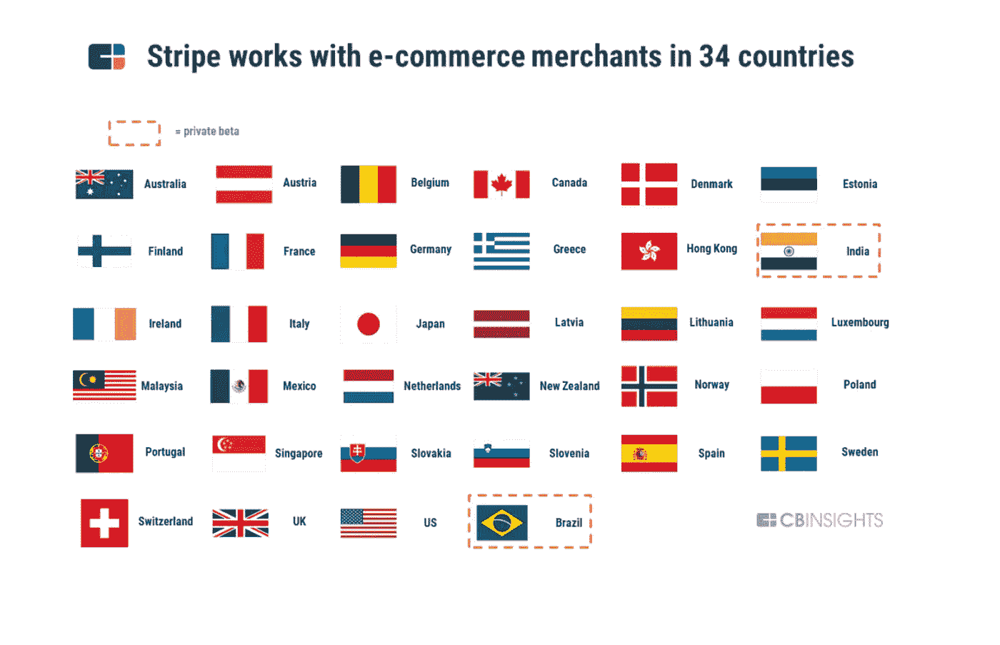

# Stripe 创新堆栈及其 600 万 Github 承诺

> 原文：<https://medium.datadriveninvestor.com/the-stripe-innovation-stack-and-its-6-million-github-commits-2779de4a382b?source=collection_archive---------7----------------------->

Stripe 诞生于一个经典的美国辍学故事。2010 年，爱尔兰裔科利森兄弟帕特里克和约翰从麻省理工学院和哈佛大学退学，创办了 Stripe。2008 年，当他们只有 19 岁和 17 岁的时候，他们已经以 500 万美元的价格卖掉了他们的第一家 Y-combinator 创业公司[au automatic，](https://www.ycombinator.com/companies/349)。

Stripe 是资金最充足的私人金融科技公司之一。在一个处于增长模式的行业中，独角兽的估值达到 360 亿美元，这似乎是不可阻挡的。全球电子商务目前估计是一个 4 万亿美元的行业，具有巨大的上升潜力，因为它目前仅占总商务的 8%(CB insights 报告的 eMarketer 统计数据)。

当然，不可忽视的还有现任和 Fintech 的激烈竞争。想想 Paypal，Square，Brex，Marqeta，Google 等等。

Stripe(很像 Square)继续构建一个更完整的堆栈，以创建一个保持可持续生态系统的神奇胶水。更全面的堆栈超越了核心服务，核心服务的重点是让希望在线交易的小企业更容易支付。例如，Stripe Connect 简化了市场中更复杂的交易，从订阅到虚拟卡和贷款。Stripe Atlas 使在美国设立美国公司实体变得快速而廉价，并取得了巨大成功，尤其是对外国实体而言。Stripe 实际上已经非常国际化，并计划利用其最近的资金(6 亿美元，2020 年 4 月)向东南亚和拉丁美洲扩张。

Stripe 的筹码在不断增加，CB insights 在 8 月份的报告中用事实和数据详细概述了这家私营公司。

Stripe 应用于支付、电子商务以及面向小型和大型企业的银行服务。

 [## 金融科技的全球趋势|数据驱动的投资者

### 各国可能已经封锁了边境，以减轻新冠肺炎疫情，但当地和国际贸易必须去…

www.datadriveninvestor.com](https://www.datadriveninvestor.com/2020/04/28/global-trends-in-fintech-technology/) 

Stripe 的客户包括亚马逊和 Salesforce、Grab 和 Booking.com、Zillow 和 Zoom，以及像我这样的创业者。

Stripe 专注于在可能对 Stripe 造成定价压力的大客户和小企业之间保持平衡，同时也是建立新企业的首选之地。

提供简单和复杂的支付处理、虚拟卡、贷款、处理业务操作、账单等服务。，你可能会认为他们的机构销售人员会专注于选择供应商来满足公司财务需求的首席财务官。然而，Stripe 与 Paypal 或谷歌 Checkout 和微软 Passport 有很大不同，它不需要庞大的销售队伍和客户支持。最重要的是，Stripe 整合不会像谷歌和贝宝那样将公司的网站流量转移到 Stripe 生态系统中。

Stripe 的创新方法和秘方是基于他们从第一天起就关注开发者社区。 人们的想法是，支付就是代码，因此，让我们为开发人员构建工具，使任何类型的集成变得简单和无缝。

这一选择改变了供应商的选择过程，从 CFO(典型的)转向了开发者社区。换句话说，Stripe 是开发者钟爱的 DIY 服务。它是自托管的，似乎风投也喜欢 Stripe，因为他们会继续投资。

我查看了 Paypal、Square 和 Stripe 的 Github 活动。 **Stripe 在 Github 上的提交量是 Square 的 3 倍，是 Paypal 的 16 倍以上。Stripe 有 600 万笔交易，Square 有 200 万笔，而 Paypal 只有 3.6 亿笔。差距很大，这显示了在纯数字世界中自托管系统的力量。[口碑效应](https://growthhackers.com/growth-studies/how-stripe-marketed-to-developers-so-effectively)也很强的偏向条纹。唯一的问题是 Stripe(作为一家私营公司)在收入和利润率方面缺乏透明度。CB insights 报告了估计的支付处理量，这只是整体情况的一部分。从客户端来看，Stripe 已经成功削减了 24%的运营成本(平均)。它声称从支付处理中获得了大约 50-100 个基点的利润。**

**Stripe 是美国最有价值的私有金融科技公司，市值 360 亿美元。Ripple 和比特币基地的估值分别为 250 亿美元和 80 亿美元。它最近改变了网站和口号，从“在线支付的新标准”改为“互联网支付基础设施”。这意味着 Stripe 希望在支持在线业务方面发挥重要作用。**

*图像来源:*

[https://www.cbinsights.com/research/report/stripe-teardown/](https://www.cbinsights.com/research/report/stripe-teardown/)

 [## Stripe:互联网最被低估的公司

### 不无聊:Stripe:互联网最被低估的公司 Stripe (STRIP)是一家支付公司，描述了…

www.nasdaq.com](https://www.nasdaq.com/articles/stripe%3A-the-internets-most-undervalued-company-2020-09-01) 

## 访问专家视图— [订阅 DDI 英特尔](https://datadriveninvestor.com/ddi-intel)