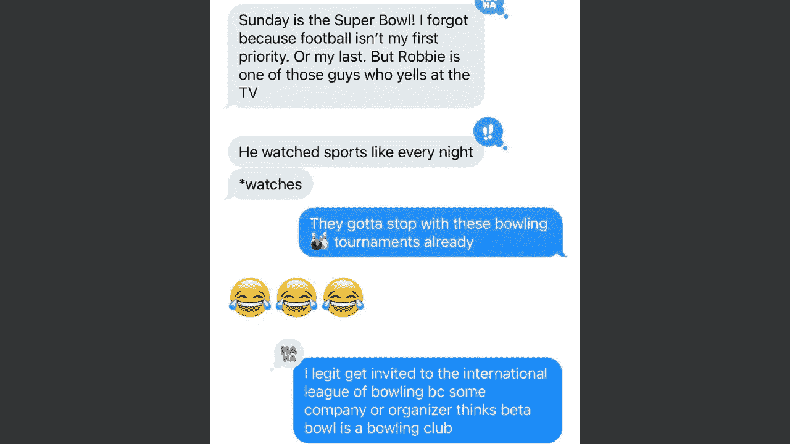

# 超级碗是星期天。为什么保龄球对我的生意很危险。

> 原文：<https://medium.datadriveninvestor.com/the-super-bowl-is-sunday-why-bowling-is-dangerous-for-my-business-1afb2954a503?source=collection_archive---------25----------------------->

## 现在有很多不同的“碗”,以及更多的假设。它们可能并不都有利于商业。

Screenshot from the author’s (my) personal text messages, with permission from the conversation participant.

我必须以三个主要的自白作为开场白:

1.  我拥有一家名为“ [Beta Bowl](https://www.linkedin.com/company/beta-bowl) 的公司。
2.  我不太喜欢足球。
3.  我不是职业保龄球手。

## 既然那三只大象已经离开了房间，让我们来谈谈保龄球、保龄球和生意吧。

我不时会被邀请在各种商学院、营销和创业相关的活动上发表演讲，因此通过电子邮件邀请我参加这些活动的情况并不少见。

知道还有什么变得越来越罕见的*(这意味着显著增加)*事件吗？

要求我注册、出席和参加各种保龄球活动的电子邮件。其中一些是业余活动，其他的与全国保龄球锦标赛等相关(或为其做准备)。

事实上，根据[雷德蒙记者](https://www.redmond-reporter.com/sports/why-bowling-is-a-sport/)的报道，保龄球是世界上参与人数最多的运动，超过 5300 万美国人每年至少去打一次保龄球。现在，我想指出一个事实，这是 2008 年的统计数据，所以有点过时，如果[保龄球继续受欢迎(或者甚至跟上我们人口的增长)](https://www.sportsdestinations.com/sports/bowling/bowling-popular-and-growing-all-levels-14390)，它现在可能有更大的参与者池。事实上，我甚至发现了一个博客，上面写着[全球保龄球参与者超过 1 亿人，来自 80 多个不同的国家](https://bowlinguide.com/is-bowling-becoming-more-popular/)。

说到泳池…

暂时忘掉保龄球吧。比方说，我的生意是销售台球桌和相关设备。现在想象一下，如果我被加入游泳队的请求、关于即将到来的游泳比赛的问题以及父母问我为什么他们的孩子在上周的游泳比赛中没有获得参与奖所淹没。那会很奇怪，对吧？奇怪的，不相关的，对我来说太熟悉了。

你看，我不仅仅是被邀请参加保龄球比赛和会议。我还收到了大量潜在客户对营销沟通的询问和回复(？让我知道他们的孩子不再打保龄球了。或者他们的孩子要等到明年才能加入保龄球联盟。或者他们从未表示对保龄球感兴趣，也不知道我们为什么要推广这项运动。(最后一个听起来像是一个痛苦的前保龄球手，他无法完成一个“好球”，并以一个太多次的流水球而告终……)

## 好吧…让我们仔细分析一下:

这意味着(一些)人很少注意阅读电子邮件、广告或网站的一小部分，以至于他们根据一个词得出结论。

就一个词，各位。

但我确定这不仅仅发生在我身上。我的意思是，你们没有看到[的 PSA *另一位罗宾汉首席执行官*不得不在 LinkedIn](https://www.linkedin.com/posts/iamwesmoore_its-been-an-interesting-day-to-anyone-frustrated-activity-6760673928269701121-iLQi) ( [韦斯·摩尔](https://medium.com/u/733e0deb1d20?source=post_page-----1afb2954a503--------------------------------))上澄清他的名字，在上周混乱的 GameStop 交易情况和随后的[对罗宾汉交易应用程序的反弹之后，他们对这一切的处理](https://finance.yahoo.com/news/controversial-trading-app-robinhood-takes-225601250.html)？

他的公司[RobinHood.org](https://www.robinhood.org/)是美国最大的反贫困非营利组织之一，在推特和评论中被那些无视[罗宾汉](https://medium.com/u/9f22ff7c06b9?source=post_page-----1afb2954a503--------------------------------)和[罗宾汉](https://medium.com/u/2a8b62298952?source=post_page-----1afb2954a503--------------------------------)之间区别的人摧毁，这是他的错吗？非营利组织 RobinHood 与股票交易、促进金融投资或最近的[华尔街赌注](https://www.reddit.com/r/wallstreetbets/) [情况](https://www.bloomberg.com/news/articles/2021-01-27/in-11-hours-of-pure-mania-100-stock-gains-popped-up-everywhere)几乎没有任何关系。尽管如此，在没有做错任何事情之后，他还是觉得有必要走上街头，公开捍卫自己的名字、品牌和公司。这似乎是合理的，因为他这样做是为了回应数百条愤怒的信息和威胁(根据他在 LinkedIn 上的帖子)。

## 说真的，各位——这是我们能做的最好的了吗？

作为人、消费者和注意力不集中的人，我们真的没有发现吗？在我们开口提出观点或更糟地诋毁他人之前，我们能不能对这些(不那么小的)差异多花一毫秒的注意力，以至少确保我们是对话中消息灵通的成员？*(在很多情况下，我们可能不应该这样做……)*

听着，关于我和保龄球的谣言可能不是真的(抱歉，我不是专业人士，不能给你上保龄球课…我的公司也不能，因为我们也不做那种事)。然而，如果你有一个想建立一个以保龄球为中心的企业的创业青年，把他们送到我们这里来；我们会让他们上钩的！我们甚至可以传递一些我们有价值的保龄球人脉，这些人脉在那个青少年的收件箱里可能比我们的更有用。

幸运的是，我还没有开始收到大量混淆的“超级碗”和“Beta Bowl”的电子邮件，但我确信它们只有 24 到 72 小时之遥。但是在你给我发邮件问我对周日比赛的看法之前，也许要记住一件事:

碗、保龄球和保龄球是三个非常不同的东西，就像台球*(在台球桌上用一根长棍子和那些五颜六色的球玩的游戏……看起来隐约有点像迷你保龄球……)*和游泳是不一样的。这个故事的寓意？或许我们都可以从更多的关注中受益。

## 那么，作为企业主，我们到底是如何看待整个保龄球运动的失败和误解的呢？

好的宣传就是好的宣传(显然)。但另一方面，并非所有有问题或被误导的宣传都是不好的…

不正确或错误的宣传仍可能给公司带来可喜的增长(无论多么偶然)。企业是以结果为导向的实体，误导性的(但积极的)宣传在企业主眼中可能会很受欢迎，只要它能提高他们的声誉。

简单地说，如果这种困惑对你的公司有利，cha-ching，你会接受它(我也一样——如果你给我足够的钱，我会很乐意尝试教你打保龄球，甚至参加你的保龄球会议)。

如果没有呢？你最终可能会像善良的罗宾汉先生一样。无辜地捍卫自己脆弱的声誉，而世界上的其他人则抓住机会指责你。

## 对我们所有人的最后想法？

还是多关注一下吧。慢一点假设。在你决定加入保龄球联盟或观看超级碗之前，也许可以考虑围绕保龄球或保龄球建立一个业务…这是我可以帮助你的一件事。

享受[超级碗](https://sports.nbcsports.com/2021/02/04/when-is-super-bowl-2021/)，伙计们。祝即将到来的[保龄球锦标赛](https://www.bowl.com/tournaments/)好运；你可能会在那里抓住我*(可能不会)*。