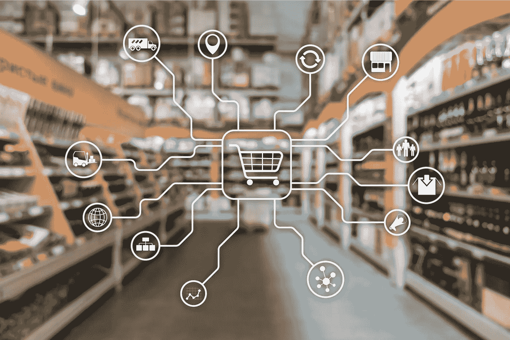

# 供应链的裂痕开始显现

> 原文：<https://medium.datadriveninvestor.com/the-supply-chain-cracks-are-starting-to-show-e3fa45141b99?source=collection_archive---------23----------------------->

电子商务一直是一个高度竞争的领域，这甚至发生在新冠肺炎疫情袭击我们的经济之前。[研究估计](https://internetretailing.net/industry/industry/90-of-e-commerce-start-ups-end-in-failure-within-the-first-120-days-19930)由于各种因素，90%的电子商务初创公司在前四个月以失败告终。即使产品引起了观众的共鸣，无法扩大规模和保持可持续性也会妨碍盈利。

让我们看看新冠肺炎疫情，这场危机导致某些产品类别的需求激增，而其他地方的需求却直线下降。

因此，电子商务公司发现自己在努力适应，与众多全球政策和法规保持同步。让我快速总结一下这些公司今天面临的一些最紧迫的问题。

# 电子商务的艰难时刻即将到来

当前的消费市场有两种截然不同的趋势。

一方面，我们现在转向数字平台购买*几乎所有的东西*。这给现有供应带来了巨大压力，传统上，这种供应是由在线零售商和实体零售商共享的。想想基本必需品，如家庭清洁液、婴儿护理产品、意大利面或干豆类食品等——在新冠肺炎的气候下，我们不仅在储备，而且还在用更多的家庭消费取代外出就餐等非必要活动。

其结果是对这些昔日实体产品类别的需求急剧上升。

另一方面，书籍(小说)或奢侈生活方式等非必需品的供应正在减少。亚马逊(Amazon)和 Flipkart(由沃尔玛(Walmart)所有)等大型公司也是履行合作伙伴，它们会有装满闲置库存的大型仓库。

[来源](https://unsplash.com/photos/EDztlsQAEIY)

供应链需要应对这两种趋势，根据电子商务公司的需要扩大和缩小规模，以维持生存。为此，公司必须有一个数字供应链，通过某种“数字粘合剂”连接在一起。

# 今天的供应链是在模仿实体供应链吗？

看看今天的供应链状况，很明显，我们距离实现数字化愿景还有几英里远。就像实体店的产品卖完了，必须等待几天甚至几周才能补货一样，面对需求的不断变化，电子商务货架正在枯竭——即使有数字连接承诺的敏捷性，也无法适应。

在实际执行层面，我们可以看到传统实体零售的低效率正在数字世界中上演。特别是对于超本地电子商务玩家来说，这是一个重大问题。尽管技术普及，顾客仍然通过电话联系送货人员，跟进更新，甚至用现金支付。

人们可以很容易地将应用内跟踪和地图分析融入购物体验，将你期望从亚马逊等巨头那里获得的便利带到每个电子商务机构。为了实现这一目标，企业需要在后端进行更深入的整合，将 ERP 系统、投标办公室/物流和客户门户的关键节点连接在一个*单一平面上*。

[来源](https://unsplash.com/photos/W1B2LpQOBxA)

# 关于可伸缩性和弹性的 4 点箴言

很多时候，电子商务公司未能实现可持续发展，不是因为他们*缺乏*可扩展的技术框架，而是因为他们难以发挥其全部潜力。例如，近三分之一(29%)的电子商务初创公司因为没有获得正确的定价而破产，尽管 ERP 系统中有先进的定价工具。这就是为什么技术、转型必须在其他三个方面与真正的可伸缩性携手并进:可伸缩的流程、业务和体验。

电子商务行业的数字化本质并没有使其免受新冠肺炎相关供应链波动的压力。在许多方面，他们的斗争比单纯的实体企业更复杂，后者只需要过渡到数字化。事实上，任何处理大量采购和分销任务的企业(即使它们不在电子商务的保护伞下)都面临着类似的挑战。

因此，毫不奇怪，超过 42%的公司计划将他们的供应链战略转向新冠肺炎之后；超过三分之一(34.7%)的人表示，他们根本没有为这种程度的中断做好准备。因此，未来的战略将包括以下四点:

**扩展技术、扩展流程、扩展体验，从而扩展您的业务。**

一些老牌企业已经成功做到了这一点，例如支持智能集成的 Shopify，它拥有零售商发展在线业务所需的所有技术工具。很快，这将成为新的常态，因为电子商务公司在危机期间很快意识到敏捷供应链的价值——由强大的技术*和*战略基础支持。

[来源](https://unsplash.com/photos/49E1OTngM5s)

由于冠状病毒的需求，亚马逊已经断货了家庭必需品，取消了其快速送货服务。让我们确保为下一次这种前所未有的市场力量做好更充分的准备。让我们拥抱一个紧密集成的数字基础，作为 e-comm 的先决条件，推动整体可扩展性。

如需了解更多信息，或分享您的反馈，请发电子邮件至:arvind@AM-PMAssociates.com