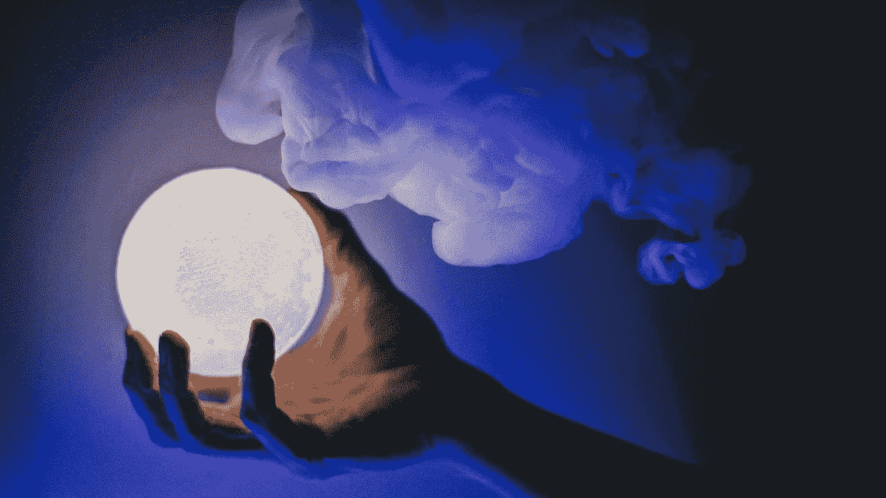

# 我们感到需要预测的令人惊讶的原因是

> 原文：<https://medium.datadriveninvestor.com/the-surprising-reason-why-we-feel-the-need-to-predict-d129e5b4bd50?source=collection_archive---------14----------------------->

## 如何通过意识到确定性的幻觉来做出好的决定

Stock image from Piqsels

一位穿着优雅的绅士向《纽约时报》宣布了他基于自己发明的科学愿景:

> “人们只需要携带一种不比手表大的廉价仪器，这种仪器能使持有者听到数千英里以外的海上或陆地上的任何地方的声音。一个人可以听到或传送讲话或歌曲到世界的最遥远的地方。同样，任何种类的图画、图画或印刷品都可以从一个地方转移到另一个地方。从一个工作站操作数百万台这样的仪器将成为可能。”
> 
> — *摘自 1909 年《纽约时报》*

这个人就是尼古拉·特斯拉，有史以来最伟大的科学家之一，在手机和无线技术进入家庭的 100 多年前，他就预言了它们的到来。

特斯拉可能是一个预见未来的天才。但大多数凡人都不是。尽管如此，这并没有阻止我们去尝试。

我们一直试图预测。你和我都知道。无意中。无论是个人还是团体。这就是为什么战略和规划领域具有巨大的吸引力。如果大多数策略都是成功的，那么我们一定很擅长预测，对吗？

> 我们计划，上帝笑了
> 
> *—意第绪语谚语*

自从人类存在以来，我们的最终目标一直是预测。这可能是因为我们好奇的天性，以及我们想知道更多的渴望。

是的，我们通过观察周围的事件来了解更多。满足我们的好奇心。但最重要的是，建立一个理解，一个关于将会发生什么的模型。

每一种文化现象、科学和宗教都源于我们对未来的渴望。

我们观察，建立一个模型，并试图看看这个模型是否符合我们所看到的结果。如果结果与我们的模型一致，那么它就是成功的，我们知道模型是好的。

它预测。

然后我们把这个模型称为规则。直到一个新的观察挑战这个规则，并威胁要完全颠覆它。

我们对预测的渴望使我们今天看到的世界不可避免吗？为什么我们一开始会有这种欲望？这是让我们成为独一无二的物种的原因吗？

答案可能就在我们的进化中。

# 我们可能天生会模拟场景

研究人员长期以来一直在研究恐惧和不确定性之间的相关性。一项关于风险认知的研究认为不确定性是恐惧的强大影响因素。

恐惧是一种基于数百万年进化的固有情感。猎人每天都不得不面对不确定性。会不会有食肉动物潜伏在看不见的灌木丛里？

拥有这种进化特征意味着我们的生存。

我们不再生活在洞穴狩猎的社会里。但是对不确定性的恐惧一直延续到现代世界，即使我们周围的环境比我们作为一个物种进化得更快。

是的，你和我仍然害怕冒险进入一片漆黑。

我们的原始大脑开始运作，进入一种疯狂状态，伴随着高度敏感和肾上腺素激增。战斗或逃跑反应。这与我们的想象力相结合，创造了一系列潜伏在黑暗中的潜在危险的场景。

*尽管如此，即使在现代社会，这也是一种有益的回应。*

当我们在现代以知识为基础的世界中自动延伸这种反应来做决定时，问题就出现了。知识的缺乏让我们感到威胁。不了解关键信息可能会导致生死攸关的局面。这可能只在某些情况下是真的，比如飞机驾驶员或将军。

但是我们的大脑不知道。

这使得我们的大脑出于恐惧自然地模拟场景，这是我们进化过程中与生俱来的能力。

由此会产生一系列的影响。

对不确定性的恐惧的一个重要后果是:任何可以预测的东西都被认为是无价的。

长久以来，宗教一直试图预测。世界上没有一种宗教没有占星术的分支，这种分支总是受到皇帝和国王的高度重视。

所有形式的科学也都源于这种根深蒂固的渴望。科学本身的核心就是基于预测。

每一个数学方程式都试图预测一个结果。有些可能是决定性的，有些是概率性的。数学和物理学试图预测宇宙的本质。我们想知道，根据重力方程，如果我们把球从一定高度扔出去，球会在什么时间点落地。我们就是这样把卫星发射到轨道上的。很明显，我们已经建立了一个基于牛顿和爱因斯坦发展的方程的伟大模型。这种能力让我们到达了太阳系最远的角落。

现代技术也非常偏向于预测。

预测分析和数据科学有印象吗？毫不奇怪，数据科学家被认为是 21 世纪最受欢迎的专业人士！

那我们是天生的千里眼吗？

也许我们是，在科学控制的环境中。但总体来说，肯定不是！

> 爱因斯坦的方程式可以让我们计算太空发射。但即使是他也无法预测运载卫星的火箭是否真的会在计划的日期发射。

随着影响事件结果的参数数量的增加，其不可预测性也随之增加。

没有人能够预测到一种叫做晶体管的不起眼的电子设备的发明会引领我们进入现代人类历史上前所未有的电子和计算革命。

即使有了基于数据的计算的奇迹，也没有算法能预测出一种起源于世界某个角落的一个城镇的病毒会造成几代人都没有见过的全球性大破坏(新冠肺炎)。

但我们仍在努力。我们预测的倾向把我们带到了人性本身根深蒂固的谬误中。

# 确定性的幻觉

底线是，不可预测性让我们紧张，让我们感到无能为力。

花几秒钟想象一下:

*你坐在一辆刚刚被告知要驾驶的汽车的驾驶座上。但是有一个条件。汽车的前挡风玻璃和侧窗都被涂黑了，这样你在开车时就看不到前面或侧面的任何东西。唯一的可能是通过后视镜透过后挡风玻璃观察。你慢慢地开始，试图根据你身后看到的东西来判断你的道路。*

花点时间真实地想象一下这个场景。这让你感觉如何？

不安？吓人？你打赌！

Wikimedia Commons Image

如果思想实验真的是在物理世界中创造的(当然是在受控的环境中)，有一种方法可以证明这一点。

在这个场景中，你可以完全控制汽车。你试着根据你身后看到的东西来猜测，或许也根据驾驶的感觉。直到现在，你看到你身后有一条相当直的路，小心翼翼地加快速度。你感觉到一些颠簸，你放慢速度。有时候，你头脑中有一个基本的模型，让你在这种不确定性中前进。只要这种情况持续足够长的时间，你就会忘记你无法控制前方的情况。

*这是一种确定性的错觉。*

如果道路现在有一个急转弯呢？你根据后视镜“预测”的能力会在几秒钟内突然消失(或者消失在路边的水沟里)。

历史数据库并不总是未来的好预测。

这正是你在现实生活中所做的。只要事情按照目前的方式运行，你就开始假设它们会一直运行下去。这不是你的错。我们作为一个物种，都在同一条船上(或者在这种情况下是同一辆车)。

这让我们很难理解作者纳西姆·尼古拉斯·塔勒布所说的“黑天鹅事件”。令人惊讶的事件，有很大的影响，然后往往被试图合理化的后果。2008 年的经济危机就是一个很好的例子。以下是其他类似事件的有趣解读:

 [## 改变金融界的 9 起黑天鹅事件|数据驱动的投资者

### 我们所有的交易者都希望我们有一个魔法球，在里面我们可以看到金融市场的未来走势。唉，那个…

www.datadriveninvestor.com](https://www.datadriveninvestor.com/2019/01/18/9-black-swan-events-that-changed-the-financial-world/) 

这里的要点是，确定性的幻觉干扰了我们的决策过程。那么问题是，如果这种谬误在人性中如此根深蒂固，我们真的能做出好的决定吗？

# 不确定性决策的本质

据估计，我们每天做出大约 [35，000 个有意识的决定](http://science.unctv.org/content/reportersblog/choices#:~:text=It's%20estimated%20that%20the%20average,are%20both%20good%20and%20bad.)。许多可能与日常琐事有关，比如吃什么，是否要出去，或者在网飞翻来翻去决定看哪部电影(*最有可能以无法决定而告终*)。

但还有一些重要的问题:职业选择，是否搬到另一个城市，以及选择生活伴侣。正是在这些重要的问题上，你最有可能挣扎。**正是这些决定让我们的大脑超速运转，我们最有可能陷入确定性的幻觉。**

意识到这个谬误有帮助吗？肯定是的。

意识到这一点会给你一个新的视角。理解永恒的确定性是一种幻觉这一事实已经减轻了决策过程中的巨大负担。一方面，在做出决定后，它减少了我们对可能不会如我们所愿的事情的压力和担忧。

您可以将决策分为以下类型:

1.  低风险，低收益
2.  低风险，高收益
3.  高风险，低收益
4.  高风险，高收益

您可以看到，这里最重要的一点是第 4 点，因为这是我们最关注的地方。如果结果是已知的概率，我们仍然可以进行相当精确的风险分析并做出决定。

但是我们生活在一个不确定的世界里。这就是我们关于确定性幻觉的意识发挥作用的地方。第四点更有可能是这样的:高风险，高收益，不确定。

在这里，重要的是要明白，您可能会基于您拥有的所有历史和当前数据创建最稳健的风险分析计算，但仍然会得到您不想要的决策结果(还记得驾驶实验中的突然转弯吗？)

这里的诀窍是要把握这样一个事实，即由于事件的本质和涉及的大量参数，很少有外部因素总是超出你的控制。

那么，关于确定性幻觉的意识对你有什么帮助呢？

利用你固有的天性和倾向进行预测，以便创造和模拟对你最有利的情景，并在你到达曲线时建立一个更好的心理模型。从容应对不确定性，并在后台意识到它，同时尽你最大的分析和直觉做出决定。

最后，我认为下面的引用将在很长一段时间内保持有效(至少，直到我们成为一个完全掌握时间的真正先进的文明)。

> “科学尚未掌握预言。我们对明年的预测太多，但对未来十年的预测太少。”
> 
> *—尼尔·阿姆斯特朗*