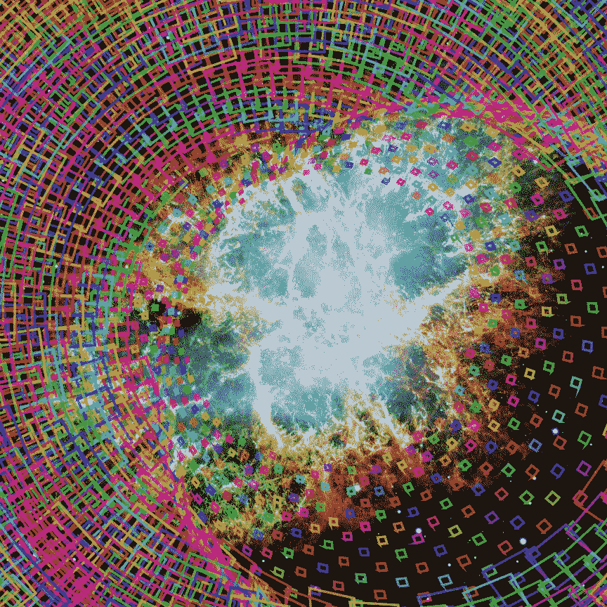

# 货币无关论

> 原文：<https://medium.datadriveninvestor.com/the-theory-of-monetary-irrelevance-7d5fba50b1bb?source=collection_archive---------14----------------------->

The Cosmos created everything we see, for free.

# 介绍

这一理论意在证明金钱的主观性。也就是说，它不能追溯到它的实际价值被证明的起源，也许除了在物物交换的情况下，一件东西被交换为一件东西，即使在那里，那些东西可能是不相称的，因此交换有一个主观的，同意的成分。有人可能会问，那又怎样，为什么只要我们都同意，货币价值就必须是客观的呢？我之所以这么说，是因为它控制了我们的生活，耗尽了我们的生命，去追求一个*想象中的*事物，这也将在下面得到证明，*完全没有必要*，因此*不相关*，在*不太遥远的*未来。

诚然，货币是一种便捷的交换手段，而且它与我们当前的世界极其相关。但是当你没有钱或者你必须努力工作才能得到一点钱时，这也是非常不方便的。即使你真的有很多钱，管理这些钱也会消耗你大量的时间，担心这些钱会降低你的生活质量。它消耗了太多人。从消极的一面来看，金钱让少数人能够主宰多数人，并阻止许多其他人过上充实的生活，即使对那些有钱人来说也是如此。

最后，这不是一个政府系统的理论，我非常支持自由和追求幸福。不是共产主义，资本主义，社会主义等等。这是关于科学、理性和可能性的领域。这也不是一个反金钱的理论，也不是从人们那里拿走钱或者让他们因为拥有钱而感到羞耻。都不是。它是我们世界的一部分，经常以重要和良好的方式使用，并帮助我们达到这一点，就像过去许多其他工具一样。它是关于重新想象我们自己，作为更高的存在，超越这些麻烦、混乱的时代。这是关于在未来的时代，我们真正的潜力获得清晰的理解，在这个时代，金钱的必要性越来越少，从而控制我们的时间和我们的生活，因为我相信我们注定要这样做。这也是通过充分认识到大自然赋予我们的东西来拯救我们自己。

# **定义**

客观不言而喻的事物，可以被证明为事实的、真实的、可知的和普遍认同的

一个科学上可测量的量，例如一公斤的质量，或者在三天内喝下这个量的水，否则你将无法生存

来自想象、意见、观点或信仰的事物，不可证明，也不总是一致的

**主观价值**任意设定的未定义价值，例如一种*贵重*金属，一件*高价值*艺术品

**未定义的值**一个没有参考点的值，可以是零或无穷大

内在价值事物本身的价值，例如维持生物生命所需的水、食物或热量

**免费**没有成本或价格

# 假定

1.  地球上或其他地方的所有宇宙(原始)资源最初都是不收费的，包括:矿物、太阳能、时间等。，也就是说，我们免费得到它们。
2.  机器人是聪明的设备，可以执行各种任务(劳动和服务)，并随着时间的推移变得更有能力。
3.  机器人可以在没有人类同时干预的情况下工作。
4.  机器人可以利用自由能源将原材料转化为产品。
5.  如果所有的物质和服务都是免费的，那么金钱就没有任何意义。

# 定理 1:任何宇宙物质或资源都不可能有客观的货币价值。

在地球或太空中发现的未经加工的、原始的、未经人类处理的任何物质，如土地、泥土、岩石、矿石、黄金、钻石、水晶、水、元素、树木、生物等。不要附上价格标签，也不要附上任何价格信息。(通过假设 1)

事实上，对于人类发现或发现的任何原材料的价格或成本，没有向比人类更高级或更低级的生物支付任何费用，也没有为此开账单、开发票或以其他方式明确告知。换句话说，没有动物或宇宙店主以任何价格向我们出售商品。

归因于原材料的任何成本或价格或价值都完全是由人类制造的，因为动物不能支付，它们也不能对东西收费，宇宙店主也不能。

由于原始价格没有确定，也没有支付可核实的金额，任何人为的价格都是完全任意的、主观的和人为的想象价值。

**推论:**宇宙资源(如原子)的任何一部分都不能被认为是*客观*值，因为除以零或无穷大会产生零或未定义的值。

所以，既然一个完全主观的东西不可能是客观的，那就证明了。

神盾局。

# 定理 2:由劳动转化为商品的原材料，只有劳动的价值，没有材料的价值。

任何应用于劳动的价值，无论是时间、努力、汗水、智慧、工资或其他被认为是原材料的附加值，都是唯一可能是客观的价值，因为根据定理 1，材料本身没有客观价值，只有想象价值。

因此，任何由转化的原材料构成的商品，包括:金属、硬币、化学品、物质事物等。只是客观上和创造它们的劳动一样有价值。

神盾局。

# 定理 3:时间没有可计算的客观价值。

由于时间是一种基本的资源，为所有的生命、地点和事物所共有，根据公设 1，无论它是零还是无穷大，都不能赋予它客观可定义的值。

**推论:**时间的任何部分都不能被归结为*客观*值，因为除以零或无穷大会产生一个未定义的量或零。

因此，任何时间的价值都是完全主观和不客观的。

神盾局。

 [## 人工智能帮助你聪明理财|数据驱动的投资者

### 自动化和人工智能为创新平台提供动力，简化双方的财务流程…

www.datadriveninvestor.com](https://www.datadriveninvestor.com/2020/09/02/artificial-intelligence-helps-you-be-smart-with-money/) 

# 定理 4:人的寿命没有可计算的客观价值。

事实上，我们并没有购买进入生活的方式，因此我们可以出示收据或证明这样的付款，并且根据定理 3，没有客观价值可以放在一个人的生命或生命所消耗的时间上，无论它是零还是无限。

**推论:**人生的任何部分都不能被归结为一个*目标*值，因为除以零或无穷大会产生一个未定义的量或零。

如果一个价值可以被分配，那么它将以一种完全主观的方式和非客观的方式被分配，因此，没有客观的价值可以被给出。

神盾局。

# 定理 5:劳动没有客观价值，只有主观和任意做作。

当为人类活动设定工资时，它不是基于根据定理 4 可计算的客观价值来设定的。

例如，如果说一个人的生命是无价的，那么它的任何一部分也是无价的。或者，另一方面，如果生命被说成是无价值的，那么它的任何细分也将是无价值的。

**推论:**由机器人进行的任何劳动也将具有主观或想象的价值，因为即使创造和维护所述机器人涉及人类劳动，也不会增加客观价值。

如果说它有一个有限值，那么它将与定理 4 相矛盾，这将是荒谬的。由此证明。

神盾局。

# 定理 6:客观价值的东西不能从主观价值的东西继承或派生。

如果一个东西被任何人赋予了主观价值，比如一块金子，那么由它制成的任何东西都将具有主观价值，因为根据定理 5，劳动不能增加客观价值，而制造或改造某物需要劳动。

同样，如果某样东西在这种情况下被称为代表黄金的占位符，即纸币或 I.O.U .，那么它对原始主观价值没有影响，这种情况下的纸币继承或代表主观价值。

**推论:**主观价值的任何导数本身就是主观价值。

如果派生的东西具有客观价值，那么原始的东西也必须具有客观价值，这是荒谬的，因为它被赋予了主观价值。

神盾局。

# 定理 7:从主观价值的事物衍生出来的事物谱系，不可能有客观价值。

如果一系列派生事物中的任何一个事物，不管其谱系有多长，也不管有多少派生，都具有主观价值，那么所有后来的事物都必须具有主观价值。

根据定理 6，如果客观价值来自主观事物，这将是一个荒谬的矛盾，因此客观价值不可能被断言，任何这样的谱系的最终结果必然是主观价值。

神盾局。

# 定理 8:货币没有客观价值

因为货币是基于主观价值的谱系，根据定理 7，它必须具有主观价值。

无论货币体系是法定的还是金本位的，如果一个人可以根据定理 1 追溯到客观价值的最初拥有者，比如大量黄金的拥有者，那么这些黄金必然具有主观的或者不确定的价值。如果索赔者说它通过法令或法令具有价值，那么它就更加纯粹是主观的和人为的，尽管它可能会得到一些人的同意。这种虚假的客观性将是妄想和无法证明的。

货币谱系的任何部分都不能被证明是客观价值，因此它必须被认为完全是主观价值。

神盾局。

# 定理 9:因为货币没有客观价值，这个主观价值会随着时间而波动。

由于根据定理 8，金钱具有主观价值，而主观事物和价值依赖于观点、信念和试验性协议，而不是锚定于客观现实，这样的观点和信念很容易被环境改变，并且不能保持稳定。

货币市场和商品交易所、货币兑换、通货膨胀、通货紧缩、崩溃、政策变化等的不断波动和干扰每天都证明了这一点。

时间带来变化，变化带来熵。熵成为反对主观货币价值不变的不可抗拒的力量，因此，没有一种货币能随着时间的推移保持在一个单一的一致认可的价值上。

神盾局。

# 定理 10:每一个已知的货币体系最终都必须崩溃或者灭绝，或者被另一个货币体系取代，或者变得无用。

给定足够的时间或深度的价值观念的变化，最终，根据定理 9，价值的波动将变得如此剧烈，以至于接近零，在这一点上，货币不被接受为有效货币或价值如此之小，以至于需要荒谬的数量来购买简单的东西(恶性通货膨胀)。

虽然这种贬值的情况并不总是可以预测的，但鉴于熵因素对世界的影响，甚至包括灾难、战争和其他大规模事件，它们是不可避免的。这种贬值往往会在人们对支撑货币的主观性的信心急剧下降的过程中迅速发生。然而，导致这种衰减螺旋的事件可能会延长。

因此，几个世纪以来，我们看到许多这样的货币灭绝的例子，我们不再用两个世纪前使用过的同样的钱买东西。没有一种货币能够存活。即使这种铸造材料是由像黄金这样的半永久元素制成的(最终消失在黑洞中)，它也会被视为有价值的东西而被拒绝，因为在可怕的生存时期人们不能吃它。或者，一颗巨大的金色小行星可能被发现，这将降低黄金作为商品的价值。或者地球内部的黄金可以被提取出来，成为一种普通的材料。根据公设 1，黄金和白银具有主观价值，因为光亮和重量而被武断地认为有价值。

推论:任何不需要的、失去效用的或不被任何人接受作为支付手段的货币都被认为是消亡了。

因为，找不到永久货币体系的例子，而且因为混沌理论和熵表明，社会波动最终将过于剧烈，无法生存，所以没有已知的货币体系可以说或显示是永久的。由此证明。

神盾局。

# 定理 11:自动化和人工智能将加速货币体系的灭亡。

就货币被用来支付被认为具有相称价值的商品和服务而言，随着相称价值趋近于零，货币的效用同样趋近于零。换句话说，一个人不需要钱来买免费的东西。

在这样一个时代，没有任何东西是有成本的，每一种可能的商品或服务都是免费的，货币和所有的货币工具都将变得无用，任何与货币管理相关的服务也是如此，如税务准备、会计、银行等。

自动化正以几何速度增长，机器学习和人工智能的能力也是如此。在某种程度上，这必然会对价格产生下行压力，以便让人们买得起东西，因为自动化将取代对人力的需求，而有偿就业的想法将对大众失去意义。

从逻辑上来说，这种自动化最终将包含生产和服务的所有阶段，从开采到货物交付以及所有运输。在这样一个时代，生产和交付的整个链条都被人类自由的自动化和免费的太阳能或聚变能源所包含，成为奴隶将是荒谬的，因此商品的价格将接近零。

因此，根据定理 10，货币没有效用，这一点得到了证明。

神盾局。

# 定理 12:金钱对于拥有令人愉悦的生活水平的现代社会的运转并不是必须的。

根据定理 11，如果一个自由社会的运作所需要的所有商品和服务，以及足够好的生活水平，都可以免费提供，那么根据公设 5，货币就会变得多余和不必要。

通过智慧、聪明和独创性，可以创建一个永久的系统，不断地转换和回收材料和信息，为地球上的所有居民，包括动物和植物，提供无与伦比的可持续、绿色、健康和愉快的生活。

**推论:**免费的东西只是延长了地球(和太阳)及其所有资源的原始“自由”，所以它在物理意义上并没有什么不同寻常。

如果它不可能实现，那么它的任何部分都不可能实现，我们可以清楚地看到真正的自动化已经在执行复杂的任务，所以我们必须得出结论，它是可能的，如果不是不可避免的。

神盾局。

请访问:[财富和金钱的终结](http://www.wealthandtheendofmoney.com/)，了解更多关于我们所有人的全部含义和潜力。

## 获得专家观点— [订阅 DDI 英特尔](https://datadriveninvestor.com/ddi-intel)