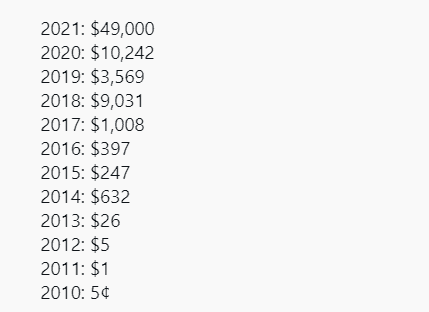
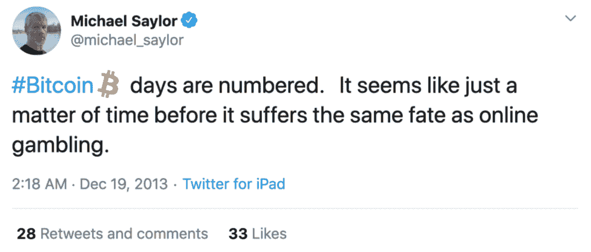
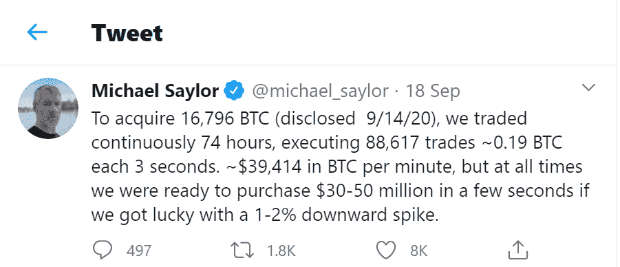
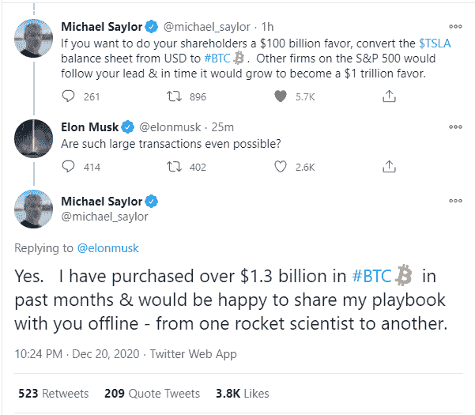
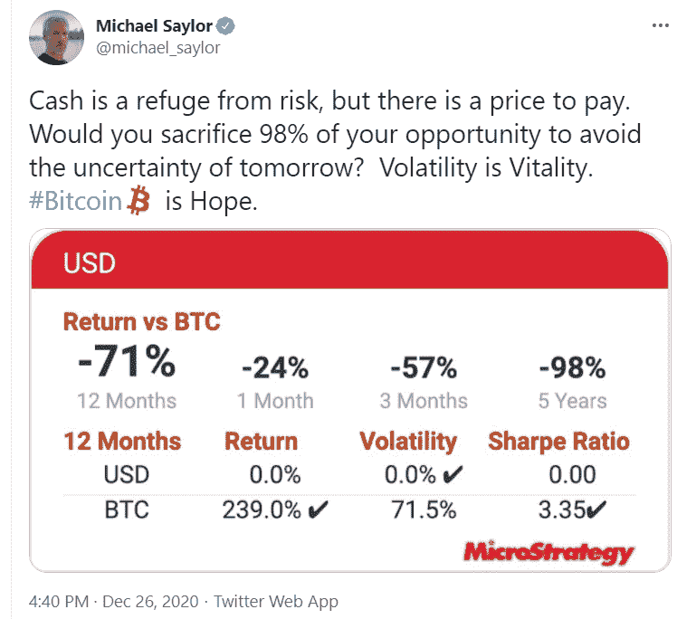

# 华尔街将心态从美元转向比特币的时候到了

> 原文：<https://medium.datadriveninvestor.com/the-time-has-come-for-wall-street-to-shift-its-mindset-from-usd-to-bitcoin-19cb4be6723a?source=collection_archive---------33----------------------->

Source: Depositphotos

比特币终于在 2 月 16 日首次突破 50000 美元关口，将 2021 年的涨幅推至目前的 74%左右。美国汽车巨头特斯拉公开承认其在 1 月份购买了价值 15 亿美元的比特币，并打算开始接受加密货币作为消费者的一种支付形式，这推动了这场疯狂的反弹(没有双关语)。

另一条有趣的消息浮出水面，有传言称，摩根士丹利(Morgan Stanley)旗下一家价值 1500 亿美元的投资机构计划将一部分投资用于比特币。即使是 5%的分配也意味着有 75 亿美元的新资金可用于推动比特币的上涨。

另一个巨头是贝莱德(管理着 8.7 万亿美元的资产)，根据[1 月提交给证券交易委员会的文件](https://cointelegraph.com/news/blackrock-s-new-sec-filings-list-bitcoin-derivatives-as-possible-investment)，贝莱德授权其两家大型基金投资比特币期货。

# 华尔街做多 BTC 的动机

你可能想知道为什么华尔街重量级人物的兴趣突然激增。答案很简单——投资回报率

让我们暂时忘记比特币的强项，如去中心化、安全性等。让我们说华尔街交易员比任何人都懂的语言，也就是‘利润’。

以下是过去 10 年比特币对美元的表现记录

比特币的投资回报率迄今为止已经超过了人类历史上的任何资产类别。

让我们回到 2020 年 3 月，当时比特币暴跌至 3500 美元以下的水平。大多数所谓的专家称比特币的末日到了。不到一年，比特币攀升 1200%。难怪鲨鱼开始闻到水中的血腥味。

# 微观战略是华尔街的 BTC 先驱

当我们谈到最近的比特币反弹时，我们还必须提到 MicroStrategy 的首席执行官迈克尔·塞勒(Michael Saylor)。在发现比特币的时候，他并不热衷于它，事实上，他是一个直言不讳的批评家，认为比特币的日子屈指可数了。

在过去的 8 年里，他的观点发生了转变，将比特币视为一种价值储存手段和抵御不断贬值的美元的安全避险工具。2020 年，他透露他的公司投资了超过 4.25 亿美元购买数千枚比特币。尽管他从未提及平均购买价格，但据推测价格在 10，500-11，500 美元之间。

Saylor 在一份新闻稿中说:“这些因素和其他因素一起，很可能对法定货币和许多其他传统资产类别的长期实际价值产生重大贬值影响，包括传统上作为公司财务运作一部分持有的资产的公平份额。”。

这项收购之所以如此重要，是因为 MicroStrategy 是第一家投入如此大量资金的传统上市公司。这笔 4.25 亿美元的支出约占当时资产负债表上 5 亿美元备用现金的 85%。

塞勒的下一步是向其他标准普尔 500 首席执行官和行业重量级人物推销他的投资策略，比如埃隆·马斯克。

# 比特币的未来展望

领先的加密衍生品交易所 Bybit 的首席执行官周(Ben Zhou)解释了他对比特币的强烈看涨前景，称比特币可以突破 10 万美元大关。周认为，比特币是下一代黄金，投资者正在寻找更强有力的替代品来应对通货膨胀和法定货币贬值。

除此之外，机构投资者的浓厚兴趣可能会继续推高价格。他还引用了交易所面临的[比特币流动性危机](https://blog.bybit.com/insights/the-weekly-recap-the-elon-effect/)(实体之间收到和支出的 BTC 数量正在减少，这意味着流动性正在下降，推高了价格)证明了他的观点，即大多数投资者现在都在考虑长期投资，并在冷钱包中持有他们的 BTC。

对于所有新进入市场的人，迈克尔·塞勒有一条重要的建议。

换句话说，他希望来自传统股市氛围的新投资者能够根据 BTC 而非美元来判断他们所持股票的价值。俗话说“现金就是垃圾”。根据简单的通用计算，法定货币每年贬值 8%，十年内贬值 80%，而比特币则相反，随着时间的推移，其价值和稀缺性都在增加。

***免责声明:本文无意作为投资建议。你应该总是做自己的研究。***