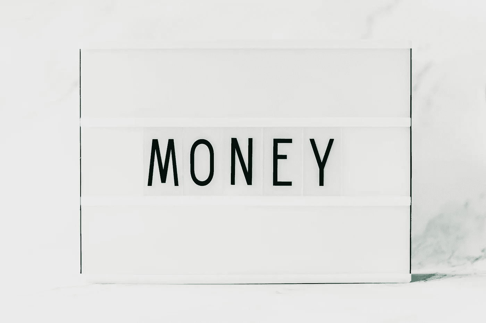
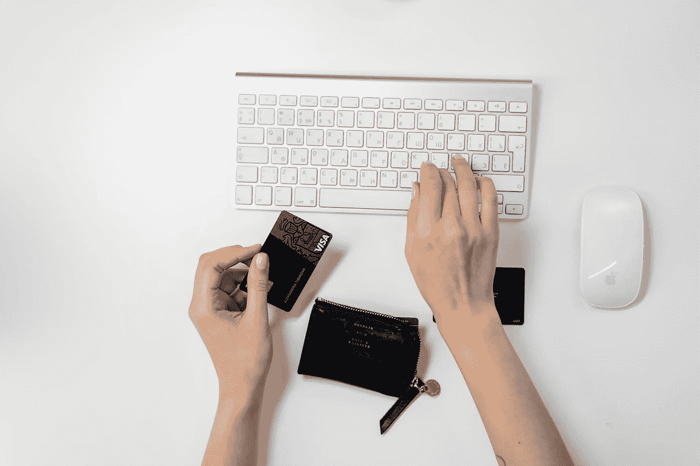
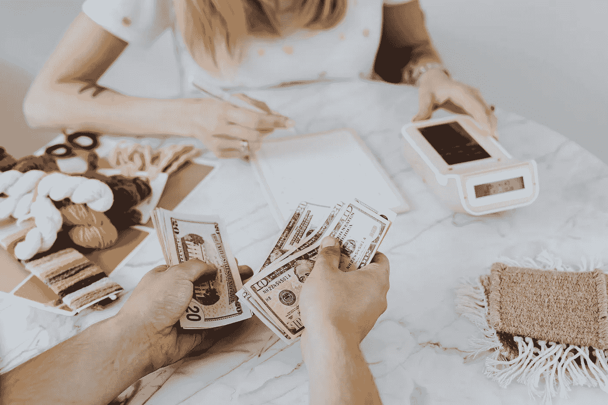
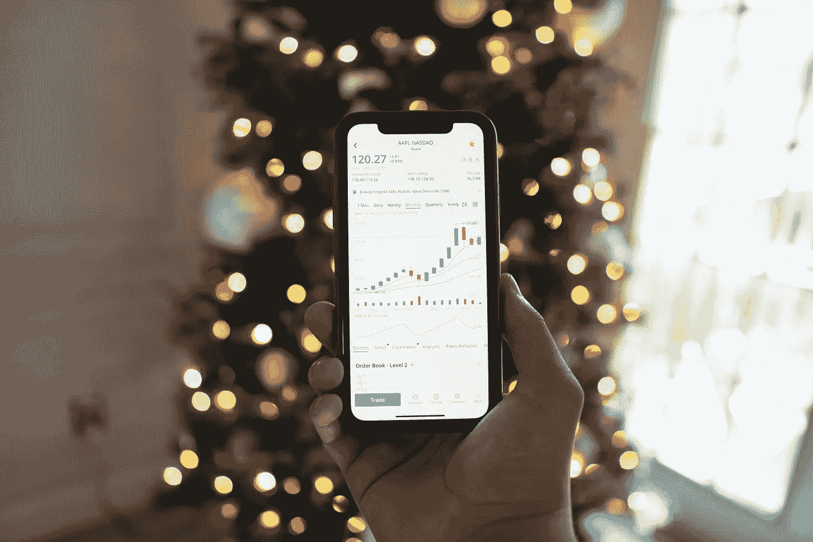
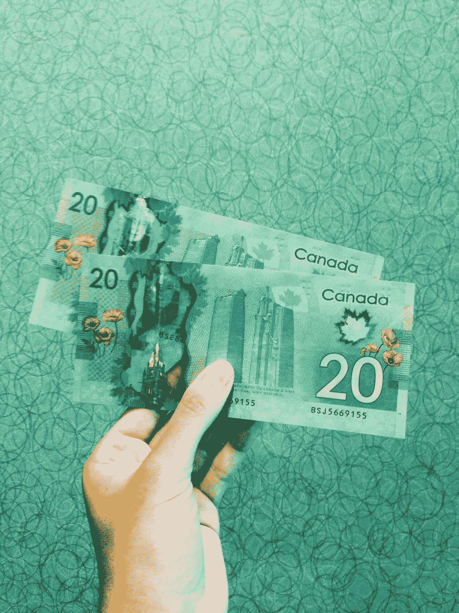

# 2021 年十大必备金融应用

> 原文：<https://medium.datadriveninvestor.com/the-top-10-finance-app-must-haves-for-2021-7bb4b7d2cce7?source=collection_archive---------15----------------------->

以下是我对 2021 年你必须拥有的 10 大金融产品/应用的分类。如果没有这些金融产品，我肯定不会有今天的成就。他们帮助我做预算、储蓄和/或投资，我希望这些建议能成为你的一个转折点！

*   这些产品是加拿大的，但是你可以在你自己居住的国家找到类似的产品。

1.  **您的主银行卡**

你的主要检查是当你拿到工资时，你所有的钱是从哪里来的。我个人使用加拿大丰业银行的信用卡已经很多年了，也曾经有一张信用卡(已经注销了)。我最近扩展到使用 BMO 卡做生意，但对于我的个人事务，大部分的钱都进入了我的丰业银行支票账户。

我一直很享受他们的津贴和福利。例如他们的场景积分，在达到一定的积分后，你就有资格观看免费电影。这绝对是我少年和大学时代的银行。

**2。KOHO 卡**

下一张卡，我总是谈论和不能得到足够的是我的 [KOHO 预付费 VISA 卡。请注意，这不仅仅是一张预付签证。它有一个返现奖励系统，预算系统和一个综合功能包括在内。](https://www.koho.ca/)

我最初得到它是为了做预算，但后来意识到我还能从中获得多少其他好处。我用它作为我的消费卡，所以一旦钱被送到我的主要支票账户，我支付我的费用，把钱送到我的储蓄，然后剩下的钱被送到我的 KOHO。这是我用来消费的卡，它帮助我通过预算功能来记录我的支出。我可以观察消费模式，决定在哪些地方削减开支，甚至增加储蓄。

**获得额外 1%的现金返还，开始使用 KOHO——更明智的消费账户。下载 app*[*https://web.koho.ca/referral/7083SQ6D*](https://web.koho.ca/referral/7083SQ6D)*或使用此代码注册:7083SQ6D。*

Photo by [cottonbro](https://www.pexels.com/@cottonbro?utm_content=attributionCopyText&utm_medium=referral&utm_source=pexels) from [Pexels](https://www.pexels.com/photo/person-shopping-online-3944405/?utm_content=attributionCopyText&utm_medium=referral&utm_source=pexels)

**3。综合应用程序(美国的 Acorns)**

[陆丹蓝](https://moka.ai/en/)是一款四舍五入的应用程序，可以将你购买的东西四舍五入到最接近的美元，这样你就可以将多余的钱再投资到储蓄基金中，然后进行投资。这种类型的投资被称为小额投资。如果你还没有钱、知识或信心来开始长期投资，这是一个很好的起点。这是一个开始投资少量资金并让它为你工作的简单方法。

如果你用它来为你的退休储蓄，你不会看到很好的结果，但请记住，这更多的是一种短期投资策略，也是一种赚更多钱的简单方法。

使用此链接 [*此处*](https://go.moka.ai/MRBGNP3sg8) *在注册陆丹蓝账户时获得 5 美元优惠！*

**4。高息储蓄账户**

EQ 银行是我存放任何储蓄账户的地方，因为这是一个高息储蓄账户。我不在乎你有什么样的储蓄，是应急基金、偿债基金还是你的未雨绸缪。任何种类的储蓄都应该存在高息储蓄账户中。你会问为什么？因为你想让你的储蓄跟上通货膨胀率。EQ bank 过去的利率是 2%，现在在 COVID 期间有所下降。

做你的研究，因为有几个其他的 HISA 选项可供选择。其目的是找到一个利率尽可能高的 HISA，但要寻找漏洞和误导性的特征，这些特征并不能描绘出全貌。

Photo by [Karolina Grabowska](https://www.pexels.com/@karolina-grabowska?utm_content=attributionCopyText&utm_medium=referral&utm_source=pexels) from [Pexels](https://www.pexels.com/photo/counting-dollar-bills-4968631/?utm_content=attributionCopyText&utm_medium=referral&utm_source=pexels)

**5。Wealthsimple + Wealthsimple Trade(在加拿大、美国和英国经营)**

最好用的投资应用程序是 [Wealthsimple](https://www.wealthsimple.com/en-ca/) ，我用它来更被动地投资。与我所知的其他机器人导航者相比，费用非常低(大约。0.5%)，在获得财务顾问的帮助方面，这是非常容易的。我不使用它的姐妹公司“Wealthsimple Trade”来交易我的股票，因为我有一个我更喜欢使用的特定投资经纪公司。有了 Wealthimple，投资就像自动驾驶一样，因为该软件会为您创建一个定制的投资组合，您只需在很长一段时间内根据需要进行投资。有了 Wealthsimple Trade，这款应用可以让你更积极地投资，挑选自己的股票。

*这里有一个* [*折扣代码*](https://my.wealthsimple.com/app/public/invite?jurisdiction=CA&referral_token=wpy6cc3RzWChV3JSj1dG&utm_campaign=referrer-user-gctr2c8so9m&utm_medium=client_referral&utm_source=general) *你可以用它来免除加入 WealthSimple 的第一笔 10，000 美元的 0.5%的费用。*

**6。品质等级**

这是我目前的投资经纪公司，我用它来交易和挑选我的投资产品。投资经纪公司和机器人管理员之间的区别在于，投资经纪公司提供更广泛的投资产品。有了 QTrade，我不仅可以交易股票和 ETF，还可以购买共同基金、政府债券和更多 Wealthsimple 不提供的产品。

在报名参加任何活动之前，最好的办法就是货比三家！虽然我用的是 Qtrade，其实我更推荐 [QuestTrade](https://www.questrade.com/home) 。我目前正在转到这家经纪公司，因为他们的费用更低，而且他们提供免费的 ETF。

Photo by [MayoFinance](https://www.pexels.com/@mayofinance-5077277?utm_content=attributionCopyText&utm_medium=referral&utm_source=pexels) from [Pexels](https://www.pexels.com/photo/light-vacation-people-woman-5972442/?utm_content=attributionCopyText&utm_medium=referral&utm_source=pexels)

**7。信用卡**

我目前使用我的美国运通信用卡，虽然我不愿意承认我有信用卡，但拥有债务实际上可以帮助你建立信用，并在你购买第一套住房时提供证明。我讨厌使用信用卡，但今年我意识到，当我和一个抵押贷款代理人一起工作以获得一个家时，我没有足够的信用。我只有一张卡，银行希望看到你至少有两张以上的卡

因此，对于信用卡，我不希望你跑去买更多的东西，让自己陷入更深的债务，但要确保你是一个能够很好地管理自己债务的人。我选择了美国运通，因为那时我的生活就是旅行，我希望我的积分能用于我的旅行。具有讽刺意味的是，我不再那么喜欢我的美国运通了，因为我意识到要用太多的积分才能为我的航空旅行获得任何真正有价值的东西。所以我仍然使用它，但我已经转换成兑换现金里程，我可以用它来获得免费的杂货或汽油。

实际上，我的朋友们还喜欢谈论另一种信用卡，那就是 PC Optimum MasterCard。这张卡可以在购物者、药品市场和廉价店之类的地方使用。如果这些地方是你经常购物的地方，我会建议你选择 PC Optimum MasterCard。

**8。信用评分报告(美国的 credit karma)**

博罗韦尔是手下来我去检查我的信用评分。这份报告通常每周更新一次，所以你可以真正了解你的信用利用和消费模式。它是免费的，使用简单，只需创建一个帐户，回答一些特定的问题，你就可以开始了。您甚至可以选择在您的分数有任何更新时接收通知。他们还提供了一个很好的教育平台，教你如何提高你的信用评分，以及信用系统是如何运作的。

**9。比特币**

当然，我还没有过多地谈论 Cyrptocurrency，因为它仍然是我正在涉足的一个领域，(而且远远不是专家)，但我确实认为这是一个很好的市场，可以在世界其他地区醒来之前进行测试并迈出第一步。我真的很喜欢 MOGO 严格购买比特币。它非常规避风险，并自动为你投资，所以你所要做的就是随着时间的推移继续投资，并希望看到良好的回报。

如果你还没有准备好深入研究加密货币，这是一个很好的起点。

**10。加密货币**

[比特币基地](https://www.coinbase.com/dashboard)允许我购买除比特币之外的多种流行加密货币。所以这是我用来投资其他加密货币，如蝙蝠令牌，链环，Ethreum 等。如果你积极想要开始投资加密货币市场，比特币基地是个不错的地方。我认为它相当于 Wealthsimple 的股票交易应用程序。

**所以说清楚一点:**

如果你想交易股票= [财富简单交易](https://www.wealthsimple.com/en-ca/)。

如果你想交易加密货币= [比特币基地](https://www.coinbase.com/dashboard)。

让我知道这些是否引起了你的共鸣。当然，这是加拿大的版本，但也有美国的相似之处，如在美国进行小额投资的 Acorn。你可以使用这个综述应用程序来帮助你节省开支，无论你从这些综述购买中获得什么钱，都可以进入一个投资基金，自动为你投资。

如果你喜欢这篇文章，请在 www.holisticbucks.com 了解更多。你也可以加入我的[邮件列表](https://view.flodesk.com/pages/5f90a6f2bdb7252fa740b358)来接收我的每周电子通讯，并获取一些关于所有绿色事物的独家和即将发布的免费内容。