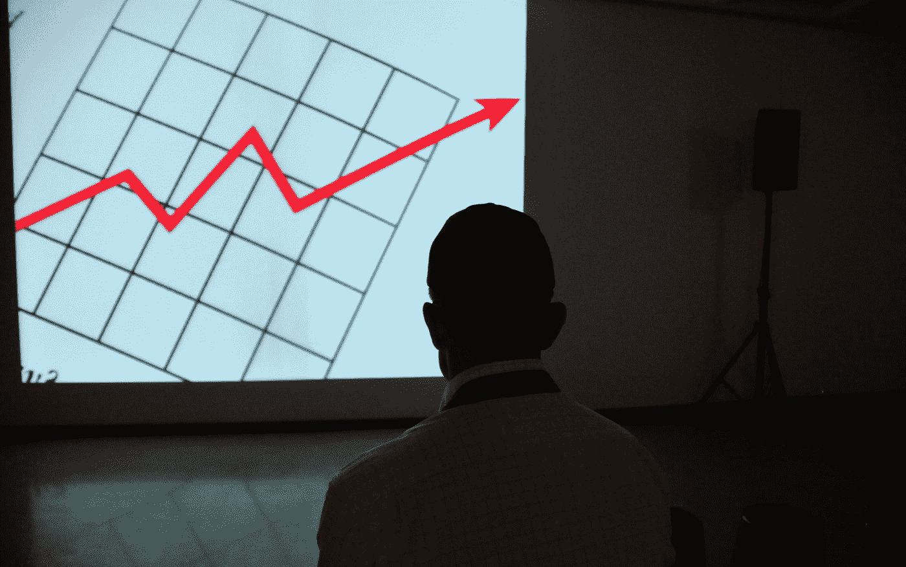

# 牙医犯的三大税务错误

> 原文：<https://medium.datadriveninvestor.com/the-top-3-tax-mistakes-dentists-make-7027c63826b0?source=collection_archive---------26----------------------->

以及如何修复它们…从今天开始。

Photo by [The New York Public Library](https://unsplash.com/@nypl?utm_source=medium&utm_medium=referral) on [Unsplash](https://unsplash.com?utm_source=medium&utm_medium=referral)

如果你是一名牙医，并且在过去的 3 年里你没有彻底改变你的税收策略，那么我几乎可以保证你每年多付数万美元。

我知道这是一个大胆的声明。但我承诺告诉你你需要听到的，有时真相并不美好。

所以这里是你需要知道的…

**在过去几年里，税法已经发生了几次变化(2015 年的 PATH 法案和 2017 年的 TCJA[减税和就业法案])，这两次变化都立即对牙医产生了重大影响。**

所以，如果你没有做出改变来配合这两个主要的更新，它已经让你付出了代价。句号。

那么你能做些什么呢？

我将分享我见过的牙医犯的 3 个最大的税务错误，这样你就可以保留每个月赚的更多的钱！

> 注意:我不是注册会计师，这不是税务建议。我和一个注册会计师团队一起工作，这是基于我们从我们的牙科客户那里看到的，所以请和你的税务专家核实一下，以确定什么是适合你的。如果你需要第二种意见，我们的团队很乐意帮助你。 [**你可以在这里找到我们！**](http://meetme.so/DerickVanNess)

# 第一个错误:你没有申请研发贷款。

这对牙医来说很重要，在你驳回之前，听我说完。

2015 年之前，R&D 学分不是牙医的选项。所以，如果你的税务专家告诉你他们不适用于你，那已经改变了。PATH 法案，加上近年来的一些立法，向 2015 年前不能申请的企业开放了 R&D 信贷。

**牙医属于现在可以获得积分&退款的群体。**

在 2015 年之前，你的税务专家申请 R&D(和其他)税收抵免并不划算，因为成本太高，而且规则每年都在变。不再是了。2015 年，R&D 抵免成为税法的一个永久部分，使专业税务公司能够开始以具有成本效益的方式进行申报。

这对你来说意味着 R&D 税收抵免已经摆在桌面上，每年价值数万美元。

> **平均而言，我们见过牙医获得 5 万到 7.5 万美元的退款**

我的公司已经帮助几十名牙医申请了文件，当我们回顾 3 年时，平均我们已经看到 50-75，000 美元的退款(大约每年 20，000 美元)。此外，每位牙医的费用是 5 万到 7.5 万美元，所以如果你的公司有多个合作伙伴，总额会高得多。

关于这一点，最后要注意的是…

你的普通税务人员或注册会计师不能为你提交这份文件。R&D 和其他税收抵免是一个专业领域，所以 95%的税务公司不会申请。你肯定会想使用专业公司，这样做容易和正确的。

底线是，如果你不做这篇文章中的其他事情，把这个搞清楚。我从未见过牙医因为这些积分而被拒绝，所以几乎可以肯定有“免费的钱”等着被索取。

Photo by [Kelly Sikkema](https://unsplash.com/@kellysikkema?utm_source=medium&utm_medium=referral) on [Unsplash](https://unsplash.com?utm_source=medium&utm_medium=referral)

# 错误 2:你不理解 IRS 第 199A 节或 QBI(合格的商业收入)

第 199A 条是 2017 年特朗普税收重写的一部分，所以它是新的，很多税务专业人士都没有注意到它。对于许多企业来说，这可能无关紧要，但这通常适用于牙医。

如果你的应税收入接近 157，500 美元(作为个人)或 315，000 美元(作为夫妇)，你*需要*注意这一条。

如果您的收入低于该数额，您可以扣除 20%的合格业务收入(QBI)加上 20%的合格房地产投资信托基金(REIT)股息和合格公开交易合伙企业(PTP)收入。

这对你来说意味着什么？

如果你接近 157，500 美元或 315，000 美元的基准收入，那么你会想尽一切办法低于这个数字，并获得 20%的扣除。

这显然需要与你的其他税务策略相适应，但是如果你的税务专家不谈论这个，那么你需要与理解并能为你优化它的人交谈！

*奖励:如果你的应税收入明显高于基准水平(40 万美元以上)，那么还有其他专业工具和替代投资可以有力地创造节税和效率。****如果你想了解更多关于那些…***

****

**Photo by [Frank Busch](https://unsplash.com/@frankbusch?utm_source=medium&utm_medium=referral) on [Unsplash](https://unsplash.com?utm_source=medium&utm_medium=referral)**

# **错误 3:你把所有的收入都当成了薪水。**

**这并不是什么新鲜事，但是我看到很多牙医犯了这样的错误，而且代价很高。**

**作为一名企业主，只要你没有积极参与创造收入，你就有权将你的部分收入作为股息/分配。这种收入的好处是，你可以避免对这些美元征收 7.5%的自雇税。**

**显然，你不能把所有的收入都作为股息，但你只需要支付给自己一份薪水，相当于有人取代你成为企业“牙医”的成本。股息实际上是你作为“企业主”所获得的。**

**举个简单的例子，如果你每年给自己支付 250，000 美元，拿 150，000 美元作为工资，拿 100，000 美元作为股息，那么这一年的股息可以为你节省 7，500 美元的税款。如果你挣得比这多，那么你支付自己的方式的小小改变可能会多得多！**

# **总结:对此你能做些什么？**

**这些建议中的任何一条每年都可能价值数万美元，所以它们值得理解。事实上，光是这些建议就可以支付你孩子的教育费用，或者极大地增加你的退休储蓄。**

**更重要的是，这些只是我们看到的牙医在税收(和财务)上犯的一些错误。事实上，平均而言，我们看到我们的牙科客户每 10 万美元的收入多付了 11，300 美元。因此，如果你的收入是 20 万美元或 30 万美元，那么你很可能多付了两倍或三倍的钱。**

**一句话:确保你的合作对象不仅仅是一名注册会计师，你需要一名 ***积极主动的税务专家*** 。如果你的税务人员没有积极地给你如何节省更多税款的想法，那么可能是时候升级了，一个好的税务专家是值得的，所以值得花时间！**

***如果你有兴趣了解更多易于实施并能为你节省大笔开支的税收策略，我们很乐意为你提供帮助。* ***我们每一两个月举办一次(免费的)小企业税务大师班*** *，我希望您能加入我们的下一期课程，看看您错过了什么。***

## **[在此注册税务大师课> > >](https://derickf9771b.clickfunnels.com/optin1601311320696)**

***或者，您也可以直接联系我们，然后* [***安排一次免费咨询***](http://meetme.so/DerickVanNess)**以确保您保留属于您的钱！****