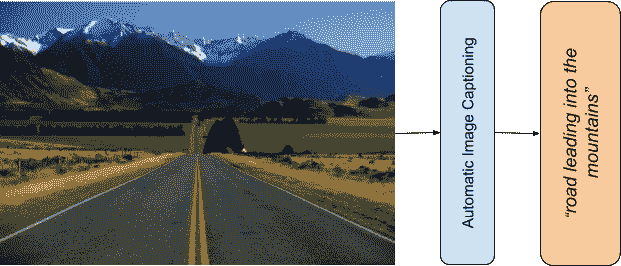
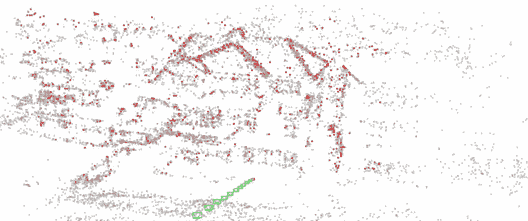
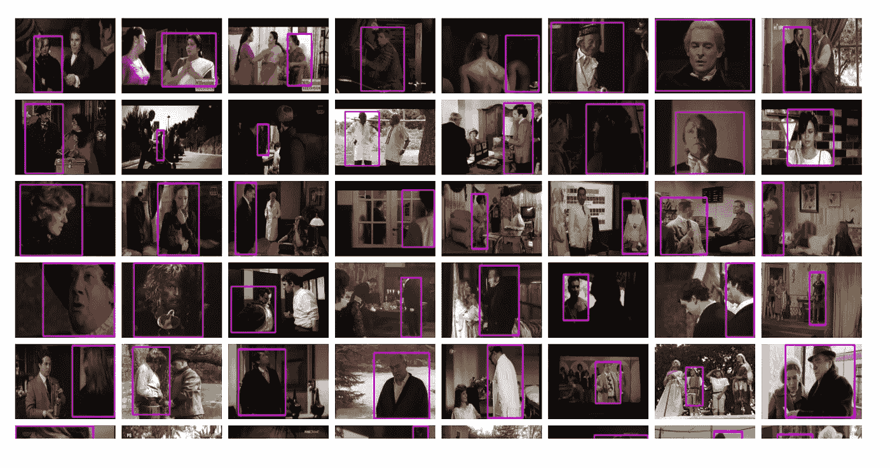

# 谷歌发布的五大数据集

> 原文：<https://medium.datadriveninvestor.com/the-top-5-datasets-released-by-google-257eb8a94109?source=collection_archive---------3----------------------->

## 黄金标准…

Pic by Pixabay from Pexels.com

> 数据是新的货币

数据收集是建立伟大的机器学习模型的第一步。决定模型精确度的因素之一是数据的数量和质量。

# 其他一些最好的系列—

> [**三十天的机器学习 Ops**](https://medium.com/coders-mojo/day-1-of-30-days-of-machine-learning-ops-7c299e4b09be?sk=4ab48350a5c359fc157109e48b1d738f)
> 
> [**30 天自然语言处理(NLP)系列**](https://medium.com/coders-mojo/quick-recap-30-days-of-natural-language-processing-nlp-with-projects-series-ceb674e3c09b?sk=ca09b27b3d5867f23ab4dc367b6c0c32)
> 
> [**30 天数据工程与项目系列**](https://medium.com/coders-mojo/day-1-of-30-days-of-data-engineering-894822fcb128?sk=76ba558bfe2d9f85cbe741e505295531)
> 
> [**数据科学与机器学习研究(论文)简体**](https://medium.com/coders-mojo/day-1-data-science-and-ml-research-papers-simplified-a68b00a3b1c4?sk=56136229ff738bd734f19d2b6953f78c) ******
> 
> [**60 天数据科学与 ML 系列带项目**](https://medium.com/coders-mojo/day-1-day-60-quick-recap-of-60-days-of-data-science-and-ml-6fc021643d1?sk=4e75e043b7630a9f963562ebac94e129)
> 
> [**100 天:你的数据科学与机器学习学位系列与项目**](https://medium.com/coders-mojo/100-days-your-data-science-and-ml-degree-part-3-c621ecfdf711?sk=1a8c7b0c204d73432d56b7d1a3a26474)
> 
> [**你应该知道的 23 个数据科学技巧**](https://ai.plainenglish.io/23-data-science-techniques-you-should-know-61bc2c9d1b3a?sk=1680c36193eb22198974c9008d62a33c)
> 
> [**技术面试系列—编码问题精选清单**](https://medium.com/coders-mojo/mega-post-tech-interview-the-only-list-of-questions-you-need-to-practice-ee349ea197bb?sk=fac3614684daff4b50a70c0a71e4d528)
> 
> [**用最热门的问题系列**](https://medium.com/coders-mojo/system-design-made-easy-quick-recap-of-complete-system-design-34af7e3aedfb?sk=bdd6a19edc1f3ce4a5064923f5b68721) 完成系统设计
> 
> [**完成数据可视化及预处理系列与项目**](https://medium.com/coders-mojo/complete-data-preprocessing-and-data-visualization-with-projects-mega-compilation-part-2-41584ef0920e?sk=842390da51689b8d43148c3980570db0)
> 
> [**完成 Python 系列与项目**](https://medium.com/coders-mojo/complete-python-and-projects-mega-compilation-7ec8f7adfe71?sk=ee0ecf43f23c6dd44dd35d984b3e5df4)
> 
> [**完成高级 Python 系列与项目**](https://medium.com/coders-mojo/complete-advanced-python-with-projects-mega-compilation-part-6-729c1826032b?sk=7faffe20f8039fa57099f7a372b6d665)
> 
> [**Kaggle 最会教你的笔记本**](https://medium.com/coders-mojo/my-list-of-kaggle-best-notebooks-topic-wise-data-science-and-machine-learning-part-2-84772863e9ae?sk=5ed02e419854a6c11add3ddc1e52947f)
> 
> [**Git 开发人员完整指南**](/the-complete-developers-guide-to-git-6a23125996e1?sk=e30479bbe713930ea93018e1a46d9185)
> 
> [**打赏 Github Repos**](https://medium.com/coders-mojo/6-exceptional-github-repos-for-all-developers-part-1-21e8fa04e150?sk=9140b249af6fe73d45717185fad48962)**—Part 1**
> 
> [**打赏 Github Repos**](https://medium.com/coders-mojo/6-exceptional-github-repos-for-all-developers-part-2-3eec9a68c31c?sk=8e31d0eb7eb1d2d0bbbcecaa66bd4e7e) **—第二部**
> 
> [**所有数据科学和机器学习资源**](/best-resources-for-data-science-and-machine-learning-full-list-5ceb9a2791bf?sk=cf85b2cef95560c58509877a794577ff)
> 
> [**210 机器学习项目**](/210-machine-learning-projects-with-source-code-that-you-can-build-today-721b035649e0?sk=da5f593572a0261a6314afad99a0356c)

## 科技时事通讯—

> 如果你感兴趣，你可以加入我的时事通讯，通过它我向超过 30，000 名读者发送技术面试技巧，技术，模式，黑客——软件开发，ML，数据科学，创业公司和技术项目。可以订阅 **Tech Brew :**

 [## 点火器

### 数据科学，人工智能，人工智能和更多…点击阅读由 Naina Chaturvedi 撰写的 Ignito，子堆栈出版物。推出 7 个月…

naina0405.substack.com](https://naina0405.substack.com/) 

## Github —

 [## 编码器-world 04-概述

### 此时您不能执行该操作。您已使用另一个标签页或窗口登录。您已在另一个选项卡中注销，或者…

github.com](https://github.com/Coder-World04) 

虽然筛选数十个数据集以找到最完美的一个可能是一项有趣的工作，但有时也会令人沮丧。

> “真实世界的数据是杂乱的”

谈到科学研究，科技巨头谷歌一直走在前列。最近，谷歌发布了[数据集搜索](https://datasetsearch.research.google.com/)，这是一个搜索 2500 万公开可用数据集的免费工具。在这篇文章中，我将涵盖你可以使用的 10 大数据集—

# 谷歌的概念说明

Conceptual Captions (Image source and credits: Google AI)

这个数据集由大约 330 万张带有说明的图片组成。自动图像字幕是自动产生图像的自然语言描述的任务，通过使用文本到语音系统解释图像，这非常有助于帮助那些有视觉障碍的人。与其他图像标题注释的策划风格不同，概念标题图像及其原始描述是从网络上获取的，因此代表了更广泛的风格。

 [## 什么是数据目录，它如何使机器学习取得成功？数据驱动的投资者

### 数据目录是机器学习和数据分析的燃料。没有它，你将不得不花费很多…

www.datadriveninvestor.com](https://www.datadriveninvestor.com/2020/08/27/what-is-a-data-catalog-and-how-does-it-enable-machine-learning-success/) 

***哪里找数据集:***

 [## 概念标题

### 编辑描述

ai.google.com](https://ai.google.com/research/ConceptualCaptions) 

# HDR+连拍摄影数据集

Photography Dataset (Image source and credits: Google AI)

数据集托管在谷歌云上，由 3640 个连拍组成，总共由 28461 个图像组成，组织到子文件夹中，加上图像处理管道的结果。每个脉冲串由 DNG 格式的原始脉冲串输入组成。对于结果，提供了对齐和合并 DNG 格式的帧的中间结果和作为 JPGs 的管道的最终结果。

***到哪里找数据集:***

 [## HDR+连拍摄影数据集-详细信息

### 本文附带的数据集:移动相机上高动态范围和低光成像的连拍摄影

hdrplusdata.org](http://hdrplusdata.org/dataset.html) 

# Youtube-8M 片段数据集

Youtube-8M Segments Dataset (Image source and Credits: Google AI)

该数据集是 YouTube-8M 数据集的扩展，具有人工验证的片段注释。来自 YouTube-8M 数据集的验证集的 1，000 个类别的约 2，37，000 个片段上的人工验证标签的集合，其中每个视频将再次带有时间本地化的帧级特征，以便可以在片段级粒度上进行分类器预测。除了注释全视频的主题实体之外，目标是发现实体何时出现在视频中。

他们还将此贴为 Kaggle 挑战赛:

 [## 第三届 YouTube-8M 视频理解挑战赛

### 视频中主题的时间定位

www.kaggle.com](https://www.kaggle.com/c/youtube8m-2019) 

***到哪里找数据集:***

 [## YouTube-8M:一个用于视频理解研究的大型多样化视频数据集

### YouTube-8M 片段数据集是 YouTube-8M 数据集的扩展，带有经过人工验证的片段注释。在…

research.google.com](https://research.google.com/youtube8m/) 

# 房地产 10K

*Visualization of a trajectory from a camera flying above a house, derived from a CC-BY video from YouTube user SonaVisual (Credits: Google.github.io)*

这是一个庞大的相机姿态数据集，对应于从大约 10，000 个 YouTube 视频中收集的大约 80，000 个视频剪辑中获得的 1000 万帧。对于每个剪辑，姿态形成一个轨迹，其中每个姿态指定摄像机沿着轨迹的位置和方向。这些姿态是通过在大量视频上运行 SLAM 和束调整算法而得到的。

***去哪里找数据集:***

 [## RealEstate10K:来自视频剪辑的摄像机轨迹的大型数据集

### 从 YouTube 用户的 CC-BY 视频中获得的一个在房子上方飞行的摄像机轨迹的可视化…

google.github.io](https://google.github.io/realestate10k/) 

# AVA 数据集

AVA Dataset ( Image source and credits: Research.Google.com)

这是一个由 162 万个动作标签组成的集合，每个人有多个频繁出现的标签，这是一个时空本地化原子视觉动作(AVA)的视频数据集，它提供了视频的视听注释，以改善和理解人类活动。该数据集注释了 430 个 15 分钟的电影剪辑中的 80 个原子视觉动作，其中动作被定位在空间和时间中。

***哪里找数据集:***

 [## AVA:原子视觉动作的视频数据集

### AVA 是一个项目，提供视频的视听注释，以提高我们对人类活动的理解。每个…

research.google.com](https://research.google.com/ava/) 

# 想看程序员幽默？

 [## 编程幽默第 2 部分

### 继续笑，因为太搞笑了…

medium.com](https://medium.com/datadriveninvestor/programming-humor-part-2-f92cf5a26f2b)  [## 史上最搞笑的代码注释

### 程序员幽默:是的，实际上是程序员写的！

medium.com](https://medium.com/datadriveninvestor/the-most-hilarious-code-comments-ever-bae3cb1030b5)  [## 编码原罪:令人捧腹的开发者自白

### “白板”是如何被嘲笑的

medium.com](https://medium.com/datadriveninvestor/coding-sins-hilarious-developer-confessions-f55eb342454e)  [## 10 个让你着迷的诙谐编程笑话

### 这些太搞笑了…

medium.com](https://medium.com/datadriveninvestor/10-witty-programming-jokes-that-will-make-you-go-rofl-a53fbfb91943) 

# 推荐文章-

 [## Python 迭代器、生成器和装饰器变得简单

### 快速实施指南

medium.com](https://medium.com/python-in-plain-english/python-iterators-generators-and-decorators-made-easy-659cae26054f)  [## 你应该知道的 23 种数据科学技术！

### 使用这些技巧来节省你的宝贵时间

medium.com](https://medium.com/ai-in-plain-english/23-data-science-techniques-you-should-know-61bc2c9d1b3a)  [## 编码原罪:令人捧腹的开发者自白

### “白板”是如何被嘲笑的

medium.com](https://medium.com/datadriveninvestor/coding-sins-hilarious-developer-confessions-f55eb342454e)  [## 面向数据科学家的 5 项酷炫先进熊猫技术

### 使用这些技巧…

medium.com](https://medium.com/datadriveninvestor/5-cool-advanced-pandas-techniques-for-data-scientists-c5a59ae0625d)  [## Stack Overflow 分析了来自 60，000 多名软件开发人员的数据，包括他们的工作时间、语言…

### 以下是他们的发现…

medium.com](https://medium.com/datadriveninvestor/stack-overflow-analyzed-data-from-60-000-software-developers-hours-they-work-languages-they-476ac6ca0197)  [## 高级 Python 变得简单—第 4 部分

### 使用这些技巧和技术…

medium.com](https://medium.com/datadriveninvestor/advanced-python-made-easy-part-4-a4996ba9fe19)  [## 高级 Python 变得简单—第 1 部分

### 使用这些技巧和技术…

medium.com](https://medium.com/datadriveninvestor/advanced-python-made-easy-part-1-ce1e2f17431e)