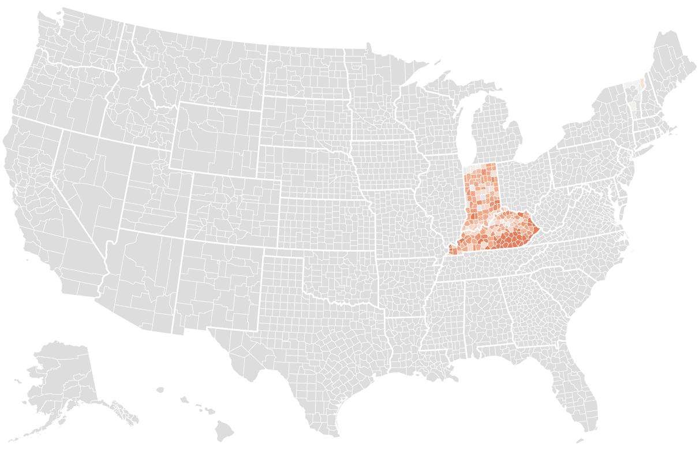

# 2020 年前 6 大数据可视化工具

> 原文：<https://medium.datadriveninvestor.com/the-top-6-data-visualization-tools-in-2020-ed6f4c4cc39c?source=collection_archive---------6----------------------->

Photo by Luke Chesser ( Source: Unsplash.com)

> 你想创建交互式的、有意义的、有创意的(漂亮的)仪表盘吗？

原始数据很难解释或交流。数据可视化工具可帮助您阐述您的想法、可视化您的数据、进行交流、与客户、顾客和全球社区分享您的重要分析。不仅您或您的业务伙伴或同事可以更快地理解数据，而且它还可以让您观察有趣的模式，构建漂亮的仪表板和数据故事。

Data Visualization Example (Image source and credits : Pinterest)

以下是精选的顶级数据可视化工具列表，您应该使用这些工具来更好地了解您的数据。

Image by [Franki Chamaki](https://unsplash.com/@franki), credits, and source: Unsplash

# 1.Plotly

Plotly 是一个基于 javascript 的数据可视化工具，它为用户提供了一个最具交互性的界面，并帮助您构建分析性的 web 应用程序。

Plotly demo [Image source and credits: plotly.com]

## 最适合:

它有两个商业产品——Dash Enterprise 和 Chart Studio Enterprise，这使它更适合需要大规模数据科学和人工智能的专业企业。这个应用程序使您能够在报告中导出 HTML 文件和图像。

## 特点:

*   您可以交付运行高级分析的仪表板:ML、NLP、预测、计算机视觉等。
*   它提供多种部署选项，并简化您的工作流程
*   它提供了广泛的图表和模板，还支持拖放功能。您可以开发自定义风格的主题。
*   Plotly 可以与您公司的现有工作流程集成，通过提供选项来添加多个团队成员进行团队协作
*   它让数据科学家可以用他们喜欢的语言工作:Python、R 和 Julia，以及自主部署和更新应用程序。
*   借助基于 Kubernetes 的平台，您可以轻松扩展您的分析应用。

## 在哪里可以找到:

 [## plot ly:ML 和数据科学模型的前端

### Python、R 和 Julia 中 ML 和数据科学模型的领先前端。作为 ML 和数据的领先 UI 层…

plotly.com](https://plotly.com/) 

# 2.高图表

Highcharts 是一个现代的基于 SVG 的多平台图表库，它允许您向 web 和移动项目添加交互式图表。Highcharts 调试器通过在图表上方提供即时警告和错误报告来帮助您加快开发速度。通过提供高度的可定制性，它使得数据可视化变得非常容易。

HighCharts [Image source and credits: Highcharts.com]

## 最适合:

适用于中小型项目。它完全免费用于非商业用途，包括学生、非营利组织和学校网站。

## 特点:

*   Highcharts 使用 HTML 5 构建，兼容并优化了移动设备、平板电脑等。
*   它提供了许多不同类型的图表，支持折线图、样条线、面积图、柱形图等等。它让你只需几行代码就能在你的 CMS 或 web 应用程序中嵌入一个全功能的图表编辑器。它允许您修改图表中的轴，以及添加、删除或修改系列和点。
*   它支持第三方集成，并为视障用户和仅使用键盘导航的用户提供辅助功能支持。
*   它允许对 Highcharts 选项/函数进行类型检查，包括自动完成代码功能。

## 在哪里可以找到:

 [## 用于网页的交互式 JavaScript 图表|高图表

### “我非常喜欢 Highcharts & maps，非常酷！我们将它用于 web 指标仪表板，该仪表板与内部共享…

www.highcharts.com](https://www.highcharts.com/) 

# 3.数据包装器

Datawrapper 是一个开源的免费在线数据可视化工具，用于制作完全响应手机、平板电脑等的交互式图表。许多组织使用 Datawrapper 将实时图表嵌入到他们的文章中。

Datawrapper Demo [Image source and credits : Datawrapper.com]

## 最适合:

它是开源和免费的，最适合学生、小型组织等。

## 特点:

*   Datawrapper 使每个人都能够创建数字优化的图表、地图或表格。
*   Datawrappers 设计默认值/模板基于多年的数据可视化经验，这确保了图表易于理解。
*   它提供实时实时更新的图形功能，非常适合选举和体育赛事数据预测。
*   Datawrapper 提供 API 来自动化创建过程、更新和发布图表，并且可以完全嵌入到内容管理系统中。

## 在哪里可以找到:

 [## 数据包装器

### 这是免费的&不需要注册。使用我们的 19 种交互式和响应性图表类型中的一种，从简单的条形图到…

www.datawrapper.de](https://www.datawrapper.de/) 

# 4.FusionCharts

FusionCharts 是一个极其有用的基于 JavaScript 的数据可视化软件，它提供了 2000 多张地图和 100 多张图表，可以帮助您从众多数据库中提取原始数据，并将其转化为有意义的报告。它通过提供现成的图表示例、特定于行业的仪表板，甚至数据故事(带有源代码)让您快速起步。

Fusioncharts Demo [Image source and credits : fusioncharts.com]

## 最适合:

它适用于涉及仪表板和讲故事开发的中型到大型项目。

## 特点:

*   Fusioncharts 提供了独特的功能，包括关系显示、可视化发现、一致的 API、跨浏览器支持，并使您能够与 JavaScript 框架集成。
*   它为不同的图表提供了一致的外观、感觉和 API，使构建复杂的图表或仪表板变得简单。您可以构建您的主题，它允许您批量导出结果。
*   它为每种库或编程语言提供了全面的文档，并附有大量实例。

## 在哪里可以找到:

 [## 最简单的网络和移动 JavaScript 图表库

### 网络和移动应用的 JavaScript 图表。95 种以上的图表类型、1400 种以上的地图和 20 种以上的业务仪表盘，带有预构建的…

www.fusioncharts.com](https://www.fusioncharts.com/) 

# 5.检查员

这是我最喜欢的数据可视化工具之一，它提供了数据的实时仪表板，可以进行更深入的分析，帮助您做出即时的业务决策。它使您能够高效地探索、可视化、分析和共享分析。

Looker Demo [Image source and credits : looker.com]

## 最适合:

大型项目和组织。

## 特点:

*   Looker 的仪表板非常高效、实时、互动和动态，让您能够超越表面，更深入地挖掘您的数据。
*   它可以让你钻过图表，更深入地了解你的业务。
*   Looker 还提供了与红移、雪花、BigQuery 等的连接。

## 在哪里可以找到:

 [## 商业智能(BI)和数据分析平台

### 我们对数据的体验已经今非昔比。一个有效的仪表板是很好的，但它不是所有问题的解决方案…

looker.com](https://looker.com/) 

# 6.（舞台上由人扮的）静态画面

Tableau 帮助您创建图表、地图和其他各种类型的专业仪表板、讲故事图表或图形。有了 Tableau，你可以连接任何数据库来创建任何可视化或图表。它允许用户准备、清理和格式化数据，然后创建交互式、可共享的数据可视化，以获得可操作的见解，从而轻松做出高效的业务决策。

Tableau Demo [Image source and credits: tableau.com]

## 最适合:

寻求不复杂或基于云的数据可视化解决方案的学生和企业。

## 特点:

*   它允许用户创建仪表板，提供可操作的见解并推动业务向前发展。
*   它有不同的版本，如 Tableau 服务器、云和桌面。用户可以对他们的数据进行实时分析
*   它提供 JS 扩展和 API 来生成定制报告。
*   它提供了强大的分析增强功能，并推动了企业分析。
*   Tableau 云允许用户从任何地方访问他们的数据和分析，并灵活地将 Tableau 部署到他们想要的地方。

## 在哪里可以找到:

 [## Tableau:商业智能和分析软件

### Tableau 可以帮助任何人看到和理解他们的数据。连接到几乎任何数据库，拖放创建…

www.tableau.com](https://www.tableau.com/)