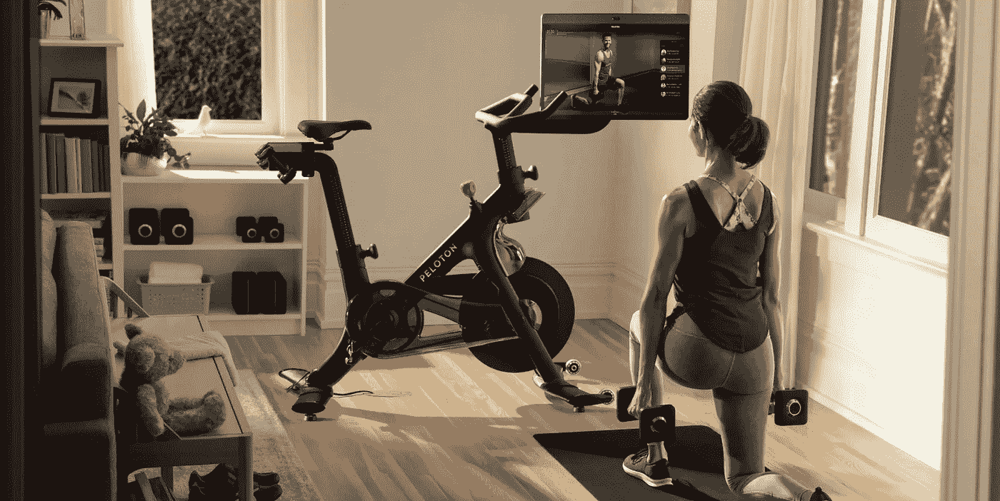
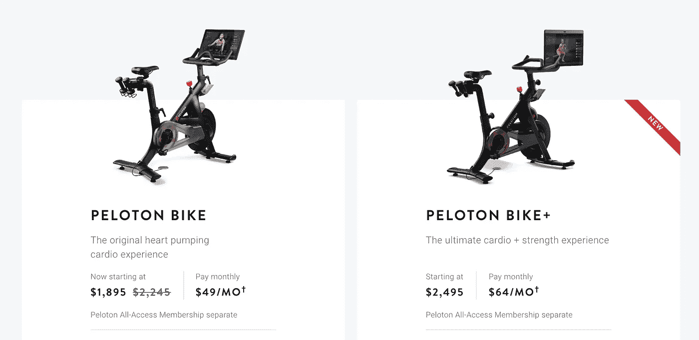
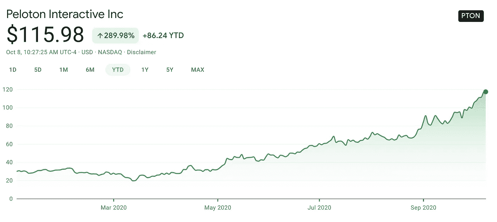

# 现在最热门的潮流

> 原文：<https://medium.datadriveninvestor.com/the-top-stock-in-2020-e5549f3cd01c?source=collection_archive---------9----------------------->

## Peloton 是目前最好的投资理念

Image: Peloton Investor Relations

在新冠肺炎之前，家庭健身市场是一个大行业，但是“呆在家里”的命令和社会距离政策正导致更多的人跳过健身房。他们正在投资他们的家庭健身房，购买更多的瑜伽垫、重物和健身球。他们也在购买更多的 Pelotons。

家用健身设备的全球市场正在增长，预计 2019 年约为[120 亿美元](https://www.gminsights.com/industry-analysis/fitness-equipment-market-report)。Peloton 现在占据了很大一部分市场，因为消费者急于购买最热门的新趋势之一——内置大型电视显示器的家用健身自行车。

# 珀洛东

Peloton 于 2013 年在 Kickstarter 上创立，自那以来一直以两位数和三位数的增长速度受到欢迎。该公司总部位于纽约，大约有 2000 名员工。Peloton 以其高端健身自行车而闻名，这种自行车的价格约为 2300 美元。他们还生产高端跑步机，现在生产大约 1800 美元的低价自行车。客户还需要支付 40 美元的会员费，才能访问全球健身巨星和 Instagram 健身名人的在线课程。他们还有一个新的每月 10 美元的健身课程应用选项。60%的消费者可能买不起高端自行车，但需求很大，一款受欢迎的 Peloton 自行车现在缺货 8-12 周。你可能想知道谁会在疫情花 2000 多美元买一辆自行车，但许多美国人正在寻找一种方法。

请注册我的[高级简讯](https://jamescarter.substack.com/)，每月 10 美元！

# Peloton 收入增长(财年)

# * 2016 年:6000 万美元

# * 2017 年:2.18 亿美元

# * 2018 年:4.35 亿美元

# * 2019 年:9.15 亿美元

# * 2020 年:18 亿美元

从 2016 年到 2020 年，Peloton 正在经历极端的收入增长，使其成为世界上增长最快的公司之一。对任何公司来说，年增长率超过 100%都是非常罕见的。Peloton 在短短 4 年内从 6000 万美元增长到 18 亿美元。这种增长是不真实的，投资者必须注意。

# 高端、小众产品？

多年来，我不知道谁有 Peloton。我记得在购物中心见过几次 Peloton 商店。它看起来确实不错，但价格不菲，一般人肯定买不起。但该公司自早期以来已经发生了变化——它们不再只是一辆昂贵的健身自行车，而是一个每年都推出新产品的巨大消费品牌。

 [## 利用股市相关性的最佳方式|数据驱动的投资者

### 当阿尔弗雷德·温斯洛·琼斯开创了世界上第一个“对冲”基金(后来“d”被去掉了)时，他让其他投资者大吃一惊…

www.datadriveninvestor.com](https://www.datadriveninvestor.com/2020/02/02/the-best-way-to-use-stock-market-correlations/) 

Peloton 现在有一个每月 10 美元的应用程序，上面有他们最好的教练提供的顶级健身课程。对于那些不想花 2000 美元购买这款流行而昂贵的自行车的人来说，这款应用程序非常棒。他们也有每月付费计划，使得高端自行车的价格更加合理。根据自行车型号的不同，月费从 49 美元到 64 美元不等。Peloton 不再是小众或高端产品，现在几乎任何人都可以购买他们的产品或 10 美元的应用程序订阅。

# 呆在家里的命令

当居家订单开始时，我记得我跳到亚马逊上为自己购买居家健身产品。绝大多数的家用健身产品已经销售一空；我甚至查看了 Walmart.com(一个我从未使用过的网站)。健身用品严重缺货长达数周或数月。我不是一个人，数百万人都在争相建立一个家庭健身房——至少有几个重量或什么的。在此期间，Peloton 推出了他们新的健身应用程序，消费者争相抢购新的 Peloton 自行车。他们很快在美国许多城市延期交货 8-12 周。自从“呆在家里”法令生效以来，对 Peloton 和其他家用健身产品的需求一直很大。

# 310 万会员！

Peloton 拥有忠诚而热情的用户群，现在已经超过 300 万人。这包括硬件选项和 10 美元的订阅应用程序。也就是说，有 300 万人每月花费 10-100 美元订阅 Peloton 这种经常性收入会让任何公司嫉妒。这推动了极端的收入增长，收益预期一再提高。对于 2021 财年，他们估计其投资者关系页面的总收入为 35 亿至 36.5 亿美元。

Image: Peloton Website

# Peloton 股票(PTON)

回到今年五月，我写了我的第一篇关于 Peloton 的文章。在文章发表时(5 月 28 日)，我是 Peloton 股票的投资者，股价为每股 42 美元。自那以后，它继续上升，创下历史新高。现在每股超过 115 美元。我仍然拥有 2021 年的股票和看涨期权。根据收入和客户增长情况，我计划再持有该股 12-18 个月。

Image: Google Finance

# 只是一时流行？

我经常和 Twitter 社区讨论 Peloton。一些人认为这“只是一种时尚”，人们很快就会回到健身房。我只是不这么看。美国各地的健身房纷纷关闭并申请破产，包括 DC 华盛顿州的几家。许多公司的运营水平只有 Covid 之前的 30–40%。几乎无法生存。转向家庭健身并投资 Peloton 等产品的人将使用它们多年。许多人将继续向 Peloton 支付每月 40 美元的订阅费。据 Peloton 称，他们的流失率仅为 0.52%。Peloton 不仅仅是一种时尚，它是一个新的强大的消费品牌，将在未来几年取悦投资者。

# 支持我的工作

请访问我在 Substack 上的页面，在那里您可以[订阅我的高级电子邮件](https://jamescarter.substack.com/)。谢谢大家！

【https://jamescarter.substack.com/ 号

# 关于我

詹姆斯·卡特是居住在 DC 华盛顿州的科技业内人士、投资者和作家。他曾在早期、高增长和大型科技公司担任销售和营销职务。闲暇时，他会去北卡罗来纳州旅游和消磨时光。你可以在推特上找到他:@ [James_Carter89](https://twitter.com/james_carter89)

子栈简讯:[https://jamescarter.substack.com/](https://jamescarter.substack.com/)

*披露:我拥有 Peloton 股票的股份，我还拥有 2021 年的看涨期权。本文不是理财建议。*

## 访问专家视图— [订阅 DDI 英特尔](https://datadriveninvestor.com/ddi-intel)